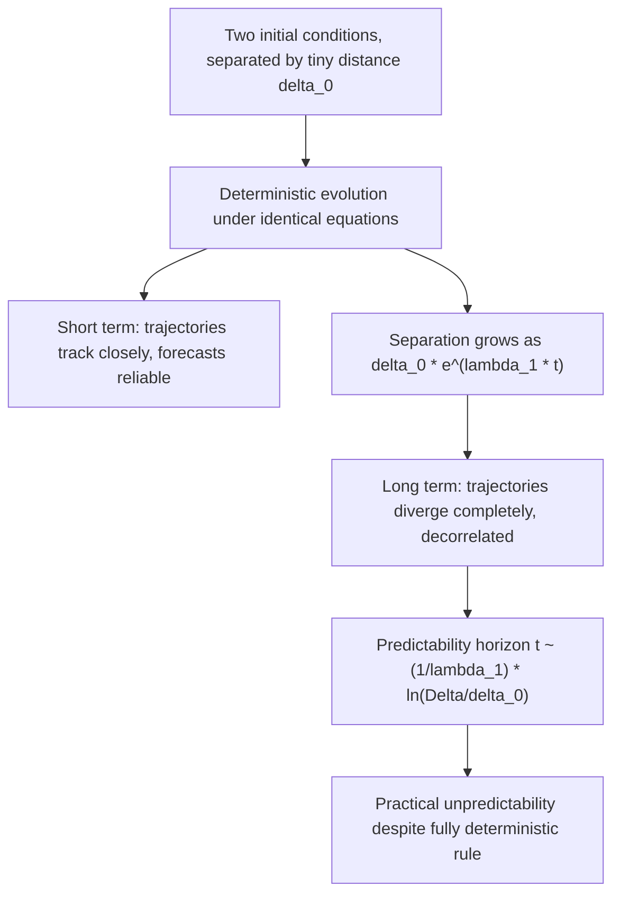

## Deterministic Chaos and Sensitivity to Initial Conditions

### Definition and Core Concept

**Deterministic chaos** describes behavior in a nonlinear dynamical system that is fully governed by deterministic equations (no randomness in the evolution rule) yet appears irregular, aperiodic, and practically unpredictable over long timescales. The defining hallmark is **sensitive dependence on initial conditions (SDIC)**: infinitesimally close initial states diverge exponentially over time.

**Key Points**

- Chaos requires **determinism**: given the exact initial state, the future is uniquely determined by the governing equations — there is no inherent randomness in the dynamics itself.
- Unpredictability arises not from the equations but from the **practical impossibility of specifying initial conditions with infinite precision**, combined with exponential error growth.
- Chaos is only possible in **nonlinear** systems; for continuous-time flows, at least 3 dimensions are required (Poincaré–Bendixson theorem restricts 2D continuous flows to fixed points and limit cycles), while discrete-time maps can exhibit chaos in as few as 1 dimension.

### Formal Definition (Devaney's Criteria)

A commonly cited formal characterization (Devaney, 1989) states a map $f$ on a set $S$ is chaotic if it satisfies three conditions:

1. **Sensitive dependence on initial conditions:** there exists $\delta>0$ such that for any $x\in S$ and any neighborhood of $x$, there exists $y$ in that neighborhood and $n\ge0$ with $|f^n(x)-f^n(y)|>\delta$.
2. **Topological transitivity:** for any two open sets $U,V\subset S$, there exists $n$ such that $f^n(U)\cap V\neq\emptyset$ — trajectories eventually move from any region to any other region (the system cannot be decomposed into non-interacting subsystems).
3. **Dense periodic orbits:** periodic points are dense in $S$.

[Unverified] Some formulations show that topological transitivity plus dense periodic orbits on an infinite set together imply sensitive dependence, making condition (1) technically redundant in certain settings — this is a point of ongoing pedagogical debate rather than universal consensus on the minimal defining set.

### Lyapunov Exponents: Quantifying Sensitivity

The **Lyapunov exponent** $\lambda$ quantifies the average exponential rate of divergence (or convergence) of infinitesimally close trajectories:

$$|\delta\mathbf{x}(t)|\approx|\delta\mathbf{x}(0)|\,e^{\lambda t}$$

For an $n$-dimensional system, there are $n$ Lyapunov exponents $\lambda_1\ge\lambda_2\ge\dots\ge\lambda_n$ (the **Lyapunov spectrum**), corresponding to expansion/contraction rates along different directions in phase space.

**Key Points**

- $\lambda_1>0$ (positive largest Lyapunov exponent) is the standard diagnostic signature of chaos.
- The sum of all Lyapunov exponents equals the average phase-space volume contraction rate: $\sum_i\lambda_i=\langle\nabla\cdot\mathbf{F}\rangle$ for a flow.
- For a chaotic dissipative attractor, at least one exponent is positive, the sum is negative (net volume contraction), and typically one exponent is exactly zero (corresponding to the direction along the flow itself, for continuous-time systems).

**Numerical Estimation (Two-Trajectory Method)**

$$\lambda_1\approx\frac{1}{t}\ln\frac{|\delta\mathbf{x}(t)|}{|\delta\mathbf{x}(0)|}$$

In practice, this requires periodic renormalization of the separation vector (to avoid numerical overflow) and averaging over many renormalization intervals to obtain a converged estimate. More rigorous approaches use the **Gram-Schmidt/QR decomposition method** (Benettin algorithm) on the linearized (tangent) flow to compute the full Lyapunov spectrum simultaneously.

### Example: The Lorenz System

$$\dot x=\sigma(y-x),\quad\dot y=x(\rho-z)-y,\quad\dot z=xy-\beta z$$

With $\sigma=10$, $\rho=28$, $\beta=8/3$, the Lorenz system's Lyapunov spectrum is approximately $(\lambda_1,\lambda_2,\lambda_3)\approx(0.906,\,0,\,-14.57)$ [Unverified — precise values depend on numerical method and integration parameters]. The positive $\lambda_1$ confirms chaotic behavior, and $\sum\lambda_i<0$ confirms the dissipative volume contraction consistent with trajectories collapsing onto the fractal Lorenz attractor.

**Predictability horizon:** since trajectory separation grows as $e^{\lambda_1 t}$, the time for an initial error $\delta_0$ to grow to an unacceptable size $\Delta$ scales as:

$$t_{\text{horizon}}\approx\frac{1}{\lambda_1}\ln\frac{\Delta}{\delta_0}$$

This logarithmic dependence means that even drastically improving initial-condition precision (e.g., by many orders of magnitude) only linearly extends the predictability horizon — a foundational reason why long-range weather forecasting has a hard practical limit, famously popularized as the "butterfly effect."

### The Butterfly Effect: Origin and Meaning

The term originates from Edward Lorenz's 1963 work on atmospheric convection models and his subsequent 1972 talk titled "Does the Flap of a Butterfly's Wings in Brazil Set Off a Tornado in Texas?" It illustrates that in a chaotic system, an arbitrarily small perturbation can lead to drastically different macroscopic outcomes after sufficient time — not because the system is random, but because of exponential sensitivity combined with the impossibility of infinite-precision measurement.

**Key Points**

- The butterfly effect does not imply causation in a simplistic sense (the butterfly doesn't "cause" the tornado in isolation) — rather, it illustrates that the system's evolution is so sensitive that the presence or absence of the perturbation changes which future unfolds.
- This has profound implications for long-term forecasting in any chaotic system: weather, certain celestial mechanics problems (e.g., long-term planetary orbit stability), population dynamics, and some biological/physiological systems.

### Chaos vs. Randomness: A Critical Distinction

| Property | Deterministic Chaos | True Randomness (Stochastic) |
| --- | --- | --- |
| Governing rule | Fixed, deterministic equations | Probabilistic/stochastic rule |
| Reproducibility | Identical initial conditions → identical trajectory | Not reproducible even with identical setup |
| Source of unpredictability | Exponential error amplification + finite measurement precision | Intrinsic randomness in the process |
| Short-term predictability | High (near-term forecasts accurate) | Low, depends on the process |
| Long-term predictability | Low (bounded by Lyapunov time) | Governed by underlying probability distributions |
| Power spectrum | Broadband, can resemble noise | Broadband |
| Underlying structure | Fractal attractor in phase space | No deterministic geometric structure |

[Inference] Distinguishing chaos from noise in an experimental time series (rather than a known model) is a nontrivial inverse problem — techniques like phase-space reconstruction (Takens' embedding theorem), correlation dimension estimation, and surrogate data testing are typically needed, since a purely time-domain signal can look similarly irregular in both cases.

### Sensitive Dependence: Illustrative Diagram

### Reconstructing Chaos from Data: Phase-Space Embedding

Since real experimental measurements often provide only a single scalar time series $x(t)$ rather than the full phase-space vector, **Takens' embedding theorem** provides a rigorous basis for reconstructing an equivalent phase-space geometry using **time-delay embedding**:

$$\mathbf{y}(t)=\big(x(t),\,x(t+\tau),\,x(t+2\tau),\,\dots,\,x(t+(m-1)\tau)\big)$$

For a sufficiently large embedding dimension $m$ (generically $m\ge2d+1$, where $d$ is the attractor's box-counting dimension) and appropriately chosen delay $\tau$, the reconstructed attractor in $\mathbb{R}^m$ is diffeomorphic to the original attractor, preserving key invariants like Lyapunov exponents and fractal dimension.

**Key Points**

- Choosing $\tau$: commonly via first minimum of the mutual information function or first zero-crossing of the autocorrelation function.
- Choosing $m$: commonly via the false nearest neighbors (FNN) method, increasing $m$ until spurious neighbor overlaps vanish.

### Requirements for Chaos to Occur

- **Nonlinearity:** linear systems cannot exhibit chaos — their solutions are superpositions of exponentials/oscillations that cannot produce the stretch-and-fold mechanism.
- **Sufficient dimensionality:** ≥3 for autonomous continuous flows; ≥1 for discrete maps (e.g., the logistic map); ≥2 for non-autonomous (explicitly time-dependent, i.e., forced) continuous systems, since explicit time dependence effectively adds a dimension.
- **Boundedness:** trajectories must remain confined (no blow-up to infinity) for a strange attractor to form — this requires a folding mechanism to counteract the stretching from sensitive dependence.

### Practical and Physical Examples

- **Double pendulum:** a mechanical system with only two degrees of freedom (4D phase space) that exhibits robustly chaotic motion for sufficiently large initial displacement/energy.
- **Weather and atmospheric convection:** the original Lorenz system was a drastically simplified model of Rayleigh-Bénard convection, yet it captures the qualitative chaotic unpredictability seen in full atmospheric models.
- **Chemical reactions:** the Belousov-Zhabotinsky reaction exhibits chaotic concentration oscillations under certain flow-reactor conditions.
- **Celestial mechanics:** the three-body problem and long-term solar system dynamics exhibit chaotic sensitivity, limiting reliable orbital predictions beyond tens of millions of years for some solar system configurations [Unverified — exact predictability horizons vary by specific study and which bodies/resonances are considered].

### Conclusion

Deterministic chaos reconciles a seeming paradox: a system can be entirely governed by fixed, non-random equations and yet be practically unpredictable in the long run. This arises from the combination of nonlinearity-driven exponential divergence of nearby trajectories (quantified by positive Lyapunov exponents) and the physical impossibility of infinite-precision initial measurements. Chaos is rigorously distinguished from randomness by its deterministic rule and reproducibility, and from ordinary complex-but-regular behavior by its measurable sensitivity signatures — positive Lyapunov exponents, broadband power spectra, and fractal attractor geometry.

**Related Topics**

- Phase Space and Attractors
- Bifurcations
- The Logistic Map and Feigenbaum Universality
- Fractal Dimension and Box-Counting Methods
- Takens' Embedding Theorem and Time-Delay Reconstruction
- The Three-Body Problem and Orbital Chaos
- Ergodic Theory and Invariant Measures