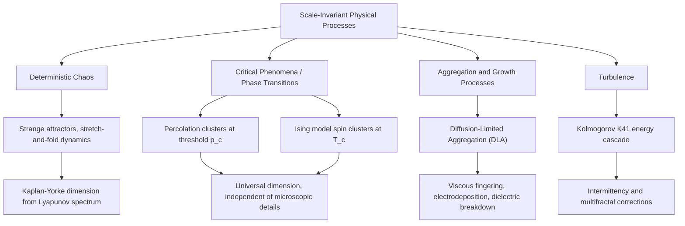

## Fractals in Physical Systems

### Definition and Core Properties

A **fractal** is a geometric structure exhibiting **self-similarity** across scales — its structure looks statistically or exactly similar when magnified — and possessing a **fractal (non-integer) dimension** that exceeds its topological dimension. Fractals arise pervasively in physical systems as the geometric signature of scale-invariant processes: chaotic dynamics, critical phenomena, aggregation processes, and turbulent flows.

**Key Points**

- **Self-similarity:** a subset of the structure, when scaled, resembles the whole. This can be **exact** (mathematical constructions), **statistical** (natural fractals, where scaling holds in a distributional sense), or **approximate self-affinity** (different scaling factors along different axes).
- **Non-integer dimension:** unlike a smooth curve (dimension 1) or surface (dimension 2), fractals have a dimension that is generally fractional, reflecting how densely they fill space.
- **Scale invariance:** fractal structures typically lack a characteristic length scale over some range, often bounded by a physical upper cutoff (system size) and lower cutoff (atomic/molecular scale).

### Types of Fractal Dimension

**Similarity (Self-Similarity) Dimension**

For an exactly self-similar object built from $N$ copies of itself scaled by factor $r$:

$$D_s=\frac{\ln N}{\ln(1/r)}$$

**Example:** the Koch snowflake curve is built from 4 copies at scale $1/3$, giving $D_s=\ln4/\ln3\approx1.2619$.

**Box-Counting Dimension**

The most common practically computable dimension. Cover the object with a grid of boxes of side length $\epsilon$, count the number of occupied boxes $N(\epsilon)$, and:

$$D_{box}=\lim_{\epsilon\to0}\frac{\ln N(\epsilon)}{\ln(1/\epsilon)}$$

In practice, $D_{box}$ is estimated as the slope of $\ln N(\epsilon)$ vs. $\ln(1/\epsilon)$ over the scale range exhibiting linear (power-law) behavior.

**Correlation Dimension**

Used for attractors reconstructed from time-series data (Grassberger-Procaccia algorithm). Defined via the correlation sum:

$$C(\epsilon)=\lim_{M\to\infty}\frac{1}{M^2}\sum_{i\neq j}\Theta(\epsilon-|\mathbf{x}_i-\mathbf{x}_j|)$$

where $\Theta$ is the Heaviside step function. The correlation dimension is:

$$D_{corr}=\lim_{\epsilon\to0}\frac{\ln C(\epsilon)}{\ln\epsilon}$$

$D_{corr}$ is generally easier to compute reliably from finite, noisy data than $D_{box}$ and satisfies $D_{corr}\le D_{box}$.

**Table: Common Reference Fractal Dimensions**

| Structure | Dimension | Type |
| --- | --- | --- |
| Smooth line | 1 (exactly) | Topological |
| Koch snowflake curve | ≈1.2619 | Exact self-similar |
| Sierpiński triangle | ≈1.5850 | Exact self-similar |
| Coastlines (typical) | 1.1–1.3 | Statistical |
| Lorenz attractor | ≈2.06 | Strange attractor |
| DLA cluster (2D) | ≈1.71 | Aggregation |
| Percolation cluster (2D, critical) | 91/48 ≈ 1.896 | Critical phenomena |
| Brownian motion trace (2D) | 2 | Random walk |

[Unverified] Precise fractal dimension values for natural and simulated physical systems (coastlines, DLA clusters) vary somewhat by measurement method, resolution range, and specific system realization; the values above represent commonly cited reference estimates rather than universal exact constants (with the notable exception of exactly self-similar mathematical constructions).

### Fractals from Strange Attractors (Deterministic Chaos)

As established in the study of phase space and attractors, the stretch-and-fold mechanism of chaotic dynamical systems produces strange attractors with fractal geometry. The **Kaplan-Yorke (Lyapunov) dimension** provides an estimate of the attractor's fractal dimension directly from the Lyapunov spectrum:

$$D_{KY}=j+\frac{\sum_{i=1}^{j}\lambda_i}{|\lambda_{j+1}|}$$

where $j$ is the largest integer such that $\sum_{i=1}^{j}\lambda_i\ge0$. For the Lorenz system, this yields $D_{KY}\approx2.06$, consistent with the attractor being "slightly more than a 2D surface" — a signature of the thin, sheet-like folding structure visible in Lorenz attractor visualizations.

### Fractals in Critical Phenomena and Phase Transitions

Near a continuous (second-order) phase transition, physical systems exhibit **scale invariance** at the critical point, producing fractal structure in physical observables:

- **Percolation theory:** at the percolation threshold $p_c$, the spanning cluster is a fractal with a universal dimension depending only on the spatial dimension (e.g., $D\approx91/48$ in 2D), independent of microscopic lattice details — an example of **universality**.
- **Ising model at criticality:** spin clusters at the critical temperature $T_c$ exhibit fractal boundaries, and correlation length diverges, eliminating any characteristic length scale.
- **Critical exponents** and fractal dimensions are related through **scaling relations**, connecting geometric (fractal) properties to thermodynamic critical exponents (e.g., $D=d-\beta/\nu$ in $d$ spatial dimensions, where $\beta$ and $\nu$ are standard critical exponents).

### Fractals in Aggregation and Growth Processes

**Diffusion-Limited Aggregation (DLA)**

Particles undergo random walks and irreversibly stick upon contact with a growing cluster, seeded from a single point. This produces highly branched, fractal dendritic structures with $D\approx1.71$ in 2D [Unverified — value depends on lattice type, off-lattice vs. on-lattice implementation, and finite-size effects].

**Physical Realizations of DLA-like Growth**

- Electrodeposition patterns (metal ion deposition in electrochemical cells)
- Viscous fingering (Saffman-Taylor instability) in Hele-Shaw cells
- Dielectric breakdown patterns (Lichtenberg figures)
- Certain bacterial colony growth patterns under nutrient-limited conditions

**Key Points**

- DLA fractals arise from the interplay between random diffusive transport and a growth rule sensitive to local field/concentration gradients — regions that protrude further into the diffusive field grow preferentially (a positive feedback loop), producing branching rather than compact growth.
- The **Laplacian growth** framework (where growth velocity is proportional to the gradient of a harmonic field satisfying $\nabla^2\phi=0$) provides the continuum-level description underlying DLA, viscous fingering, and dielectric breakdown as related phenomena in the same universality class.

### Fractals in Turbulence

Turbulent fluid flows exhibit fractal and multifractal structure across the **inertial range** of scales, between the large-scale energy injection scale and the small-scale (Kolmogorov) dissipation scale.

- **Kolmogorov's 1941 (K41) theory** predicts energy transfer through a self-similar cascade across scales, with velocity structure functions scaling as $\langle|\delta v(\ell)|^p\rangle\sim\ell^{p/3}$.
- Real turbulent flows show deviations from this simple self-similar scaling — **intermittency** — better captured by **multifractal models**, where different regions of the flow are characterized by a continuous spectrum of local scaling (Hölder) exponents rather than a single fractal dimension.
- Vorticity isosurfaces and dissipation-rate fields in turbulent flows exhibit fractal geometry, with dimension estimates historically cited around $D\approx2.6$–$2.7$ for dissipation structures in 3D turbulence [Speculation/Unverified — multifractal formalism suggests this single-dimension picture is itself a simplification, and reported values vary across experimental/numerical studies].

### Diagram: Fractal Dimension via Box-Counting (svg_diagram)

<svg xmlns="http://www.w3.org/2000/svg" viewBox="0 0 640 300">
<text x="320" y="24" font-size="16" font-weight="bold" text-anchor="middle">Box-Counting Dimension Estimation (svg_diagram)</text>

<text x="140" y="55" font-size="13" text-anchor="middle">Fractal curve covered at scale ε</text>

<rect x="60" y="70" width="160" height="160" fill="none" stroke="`#cbd5e0`" stroke-width="1" />

<g stroke="`#e2e8f0`" stroke-width="0.5">

<line x1="100" y1="70" x2="100" y2="230" /><line x1="140" y1="70" x2="140" y2="230" /><line x1="180" y1="70" x2="180" y2="230" />

<line x1="60" y1="110" x2="220" y2="110" /><line x1="60" y1="150" x2="220" y2="150" /><line x1="60" y1="190" x2="220" y2="190" />

</g>

<path d="M 65 200 Q 90 100, 120 160 T 180 90 T 215 140" stroke="`#c05621`" stroke-width="2.5" fill="none" />

<text x="400" y="70" font-size="13">ln N(ε) vs ln(1/ε)</text>

<line x1="380" y1="230" x2="580" y2="230" stroke="black" stroke-width="1.5" />

<line x1="380" y1="230" x2="380" y2="80" stroke="black" stroke-width="1.5" />

<text x="480" y="250" font-size="11" text-anchor="middle">ln(1/ε)</text>

<text x="360" y="150" font-size="11" text-anchor="middle" transform="rotate(-90 360 150)">ln N(ε)</text>

<line x1="390" y1="215" x2="560" y2="100" stroke="`#2b6cb0`" stroke-width="2" />

<text x="475" y="145" font-size="11" fill="`#2b6cb0`">slope = D_box</text>

</svg>

### Diagram: Fractal Origins Across Physical Domains

### Measuring Fractal Dimension: Practical Considerations

1. **Finite scaling range:** real physical fractals only exhibit self-similarity between an upper cutoff (system size, correlation length) and lower cutoff (microscopic/lattice scale) — the power-law regime must be identified from a log-log plot before fitting.
2. **Statistical vs. exact self-similarity:** natural fractals require averaging over many realizations or spatial samples to obtain reliable dimension estimates, since individual realizations show scatter.
3. **Method sensitivity:** box-counting, correlation dimension, and mass-radius methods can yield different numerical estimates for the same finite, noisy dataset — cross-validation with multiple methods improves reliability.
4. **Multifractal spectra:** for systems exhibiting non-uniform scaling (turbulence, some strange attractors), a single dimension is insufficient; the full multifractal spectrum $f(\alpha)$, characterizing the distribution of local scaling (Hölder) exponents $\alpha$, provides a more complete description.

### Conclusion

Fractal geometry provides a unifying quantitative language for describing the irregular, scale-invariant structures that emerge across strikingly diverse physical contexts — from the strange attractors of chaotic dynamical systems, to critical clusters at continuous phase transitions, to the branching patterns of diffusion-limited growth, to the intermittent cascade structure of turbulent flows. The common thread is the absence of a single characteristic length scale, replaced instead by power-law scaling relations and a well-defined, generally non-integer, fractal dimension that can be estimated through box-counting, correlation-sum, or spectral methods.

**Related Topics**

- Phase Space and Attractors
- Deterministic Chaos and Sensitivity to Initial Conditions
- Percolation Theory and Critical Exponents
- The Ising Model and Universality Classes
- Kolmogorov Turbulence Theory and the Energy Cascade
- Multifractal Analysis and the $f(\alpha)$ Spectrum
- Renormalization Group Methods in Statistical Physics