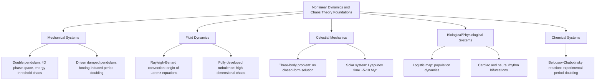

## Chaos in Physical and Natural Systems

### Overview

This chapter closes the nonlinear dynamics unit by surveying how deterministic chaos, established mathematically in the preceding topics (phase space, bifurcations, sensitive dependence, fractal attractors), manifests concretely across mechanical, fluid, celestial, biological, and chemical systems. The unifying theme: nonlinear coupling of a small number of degrees of freedom is sufficient to produce chaotic dynamics, and this occurs pervasively once systems are examined closely enough.

### Mechanical Systems

**The Double Pendulum**

A pendulum with a second pendulum attached to its end. With generalized coordinates $(\theta_1,\theta_2)$ and their conjugate momenta, the system has a 4-dimensional phase space — sufficient for chaos per the Poincaré–Bendixson restriction on continuous flows. The Lagrangian is:

$$\mathcal{L}=\frac{1}{2}(m_1+m_2)L_1^2\dot\theta_1^2+\frac{1}{2}m_2L_2^2\dot\theta_2^2+m_2L_1L_2\dot\theta_1\dot\theta_2\cos(\theta_1-\theta_2)-(m_1+m_2)gL_1(1-\cos\theta_1)-m_2gL_2(1-\cos\theta_2)$$

**Key Points**

- For small displacements, the motion is quasi-periodic (two coupled normal modes).
- Beyond a critical energy threshold, motion becomes chaotic: trajectories exhibit positive largest Lyapunov exponent, and the pendulum's flips become effectively unpredictable beyond a short horizon.
- Widely used as a canonical experimental and pedagogical chaos demonstration due to its mechanical simplicity and visually obvious unpredictability.

**Driven, Damped Pendulum**

Adding periodic forcing to a damped pendulum:

$$\ddot\theta+\gamma\dot\theta+\frac{g}{L}\sin\theta=F\cos(\omega t)$$

The explicit time dependence adds an effective phase-space dimension (treating $\omega t$ as a variable on a circle), permitting chaos in this originally 2D system for sufficiently large forcing amplitude $F$. This system exhibits period-doubling cascades to chaos as $F$ increases, directly analogous to the logistic map's route to chaos.

### Fluid Dynamics and Turbulence

**Rayleigh-Bénard Convection**

A fluid layer heated from below and cooled from above develops convection rolls once the temperature gradient exceeds a critical threshold (quantified by the Rayleigh number $Ra$ exceeding a critical value $Ra_c$). The Lorenz system was derived as a drastic (three-mode) truncation of the full Navier-Stokes/Boussinesq equations describing this exact setup.

**Key Points**

- As $Ra$ increases further beyond onset, the regular convection rolls undergo their own bifurcation cascade — oscillatory instabilities, period-doubling, and eventual chaotic (turbulent) convection.
- This provides a direct physical bridge between the abstract Lorenz equations and an experimentally realizable fluid system, though the full Navier-Stokes dynamics has infinite-dimensional phase space, of which the Lorenz model captures only the lowest-order behavior. [Inference] The three-mode truncation is a significant simplification; the qualitative chaotic behavior it reproduces does not imply the full PDE system's chaos is governed by the same three effective degrees of freedom at all parameter regimes.

**Fully Developed Turbulence**

As covered in fractal structure, turbulence exhibits chaotic, multi-scale dynamics governed by the (still not fully solved, in a rigorous existence/uniqueness sense) Navier-Stokes equations. Key chaos-relevant properties:

- Extremely high-dimensional effective phase space (many active degrees of freedom/modes), unlike the low-dimensional Lorenz-type chaos.
- Still exhibits sensitive dependence on initial conditions, though characterizing it via a single Lyapunov exponent is complicated by the continuum of active scales.

### Celestial Mechanics

**The Three-Body Problem**

Unlike the exactly solvable two-body (Kepler) problem, the general gravitational three-body problem has no closed-form analytical solution and generically exhibits chaotic dynamics for a broad range of initial conditions and mass ratios.

**Key Points**

- Poincaré's investigation of the restricted three-body problem in the 1890s (motivated by a prize competition on solar system stability) is historically regarded as the first substantial mathematical encounter with deterministic chaos, predating the term itself by over half a century.
- Specific mass/geometry configurations (e.g., Lagrange points, certain resonant periodic orbits) admit stable or regular solutions as special cases, but generic initial conditions lead to complex, often chaotic, trajectories.

**Solar System Stability**

Long-term numerical integrations of the full solar system's planetary orbits reveal chaotic behavior, with a Lyapunov time (e-folding time for orbital divergence) estimated on the order of 5–10 million years [Unverified — estimates vary by study, integration method, and which bodies/resonances are included]. This means precise, deterministic orbital prediction becomes practically impossible beyond roughly tens of millions of years, even though the system remains bound and does not appear to eject planets over the age of the solar system (based on current numerical evidence).

**Key Points**

- Chaos here does not necessarily imply catastrophic instability (planets flying out of the solar system) — it primarily limits the precision of long-term trajectory prediction while the system can remain bounded and structurally similar over very long timescales.
- Asteroid belt gaps (Kirkwood gaps) arise from chaotic orbital resonances with Jupiter, providing an observable astronomical signature of orbital chaos.

### Biological and Physiological Systems

**Population Dynamics**

The discrete logistic map, $x_{n+1}=rx_n(1-x_n)$, was originally introduced (by Robert May, 1976) as a model of population growth with limited resources (carrying capacity), directly connecting the period-doubling route to chaos with ecological population fluctuations observed in some insect and animal populations with non-overlapping generations.

**Cardiac Dynamics**

Certain cardiac arrhythmias have been studied through the lens of nonlinear dynamics and bifurcation theory — period-doubling-like transitions in interbeat interval patterns have been proposed as precursors to certain arrhythmic events. [Speculation] The degree to which cardiac arrhythmias are best described as low-dimensional deterministic chaos, versus high-dimensional stochastic or noise-driven processes, remains an active and somewhat contested area of research; this application should be treated as an illustrative motivating example rather than settled clinical consensus.

**Neural Dynamics**

Individual neuron models (e.g., the Hodgkin-Huxley equations and simplified reductions like the FitzHugh-Nagumo model) exhibit rich bifurcation structure (Hopf bifurcations governing the onset of spiking, period-doubling under periodic forcing), and networks of coupled neurons can exhibit chaotic collective dynamics under certain parameter regimes.

### Chemical Systems

**Belousov-Zhabotinsky (BZ) Reaction**

An oscillating chemical reaction (based on cerium or ferroin-catalyzed bromate oxidation) that, in a continuously stirred tank reactor (CSTR) with controlled inflow, exhibits a full bifurcation cascade — from a stable fixed point, through Hopf bifurcation to periodic oscillation, through period-doubling, to chaotic concentration fluctuations — as the flow rate control parameter is varied. This is one of the most direct and thoroughly experimentally verified physical realizations of the abstract period-doubling route to chaos.

**Key Points**

- The reaction also produces spatial pattern formation (target patterns, spiral waves) when not well-stirred, connecting nonlinear chemical dynamics to reaction-diffusion pattern formation more broadly.
- Experimental BZ reaction bifurcation diagrams closely match the qualitative (and to reasonable approximation quantitative) predictions of low-dimensional chaos theory, making it a benchmark system for validating chaos-theoretic concepts against physical data.

### Diagnostic Signatures Used to Identify Chaos in Physical Data

| Signature | Method | Interpretation |
| --- | --- | --- |
| Positive largest Lyapunov exponent | Two-trajectory divergence or Benettin/QR algorithm | Confirms sensitive dependence |
| Broadband power spectrum | Fourier analysis of time series | Distinguishes from purely periodic/quasi-periodic signals |
| Fractal (non-integer) attractor dimension | Correlation dimension (Grassberger-Procaccia) | Confirms bounded, strange-attractor geometry |
| Period-doubling cascade under parameter variation | Bifurcation diagram construction | Identifies a specific, well-studied route to chaos |
| Recurrence without exact repetition | Poincaré section / recurrence plots | Qualitative visual signature of chaotic (vs. periodic) motion |

[Inference] In practice, robustly distinguishing low-dimensional deterministic chaos from high-dimensional stochastic noise in a real physical or biological time series generally requires multiple converging diagnostics (e.g., both a positive Lyapunov exponent estimate and a finite, converged correlation dimension under surrogate-data testing), since any single test applied to short or noisy data can give misleading results.

### Diagram: Chaos Across Physical Domains

### Practical Implications of Chaos in Physical Modeling

1. **Finite predictability horizons:** weather forecasting, precise long-term orbital mechanics, and detailed population forecasts are all fundamentally bounded by Lyapunov-time-scale limits, not merely limited by computational power.
2. **Ensemble forecasting:** rather than a single deterministic prediction, operational forecasting (e.g., numerical weather prediction) runs ensembles of slightly perturbed initial conditions to characterize the spread of likely outcomes as chaotic divergence sets in.
3. **Control of chaos:** techniques such as the OGY (Ott-Grebogi-Yorke) method exploit the dense set of unstable periodic orbits embedded within a strange attractor, applying small, carefully timed perturbations to stabilize a system onto one of these orbits — used experimentally in contexts ranging from mechanical oscillators to (proposed) cardiac arrhythmia control.
4. **System identification:** in experimental physics, recognizing that irregular data may reflect low-dimensional deterministic chaos (rather than pure noise) motivates model-based analysis (phase-space reconstruction, dimension estimation) rather than purely statistical/stochastic treatment.

### Conclusion

Deterministic chaos is not a mathematical curiosity confined to abstract toy models — it is a pervasive feature of nonlinear physical and natural systems whenever sufficient degrees of freedom and nonlinear coupling are present. From the mechanical double pendulum, to convective fluid flow, to gravitational many-body dynamics, to oscillating chemical reactions and population cycles, the same underlying mathematical signatures — positive Lyapunov exponents, fractal attractor geometry, and characteristic bifurcation routes (period-doubling, quasi-periodic, intermittent) — recur across vastly different physical substrates, reflecting deep universality in how nonlinear systems transition from order to chaos.

**Related Topics**

- Phase Space and Attractors
- Bifurcations
- Deterministic Chaos and Sensitivity to Initial Conditions
- Fractals in Physical Systems
- Ensemble Forecasting and Predictability in Numerical Weather Prediction
- Control of Chaos (OGY Method and Chaos Synchronization)
- Reaction-Diffusion Systems and Spatiotemporal Pattern Formation