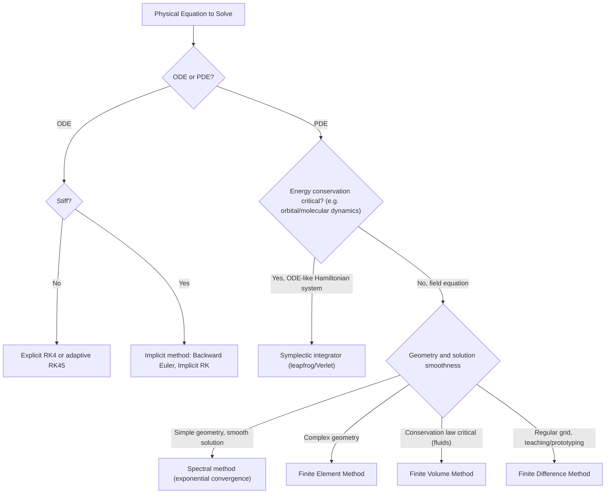

## Numerical Methods for Physical Equations

### Overview and Motivation

Most physical equations of interest — Newton's equations of motion, Maxwell's equations, the Schrödinger equation, the Navier-Stokes equations — have no closed-form analytical solution except in highly idealized cases. Numerical methods discretize continuous physical equations (ODEs, PDEs, integrals) into finite-precision, computable algorithms, trading exactness for tractable approximate solutions whose error can be controlled and quantified.

**Key Points**

- Numerical methods are essential whenever a physical system is nonlinear, has complex geometry/boundary conditions, or involves many coupled degrees of freedom.
- Every numerical method introduces **discretization error** (from approximating continuous quantities with finite steps) and is subject to **round-off error** (from finite floating-point precision) — total error is generally a competition between these two, often with an optimal step size minimizing combined error.
- Method selection depends on the equation type (ODE vs. PDE), desired accuracy order, stability requirements, and computational cost constraints.

### Numerical Solution of Ordinary Differential Equations (ODEs)

Physical systems governed by $\dot{\mathbf{x}}=\mathbf{F}(\mathbf{x},t)$ (equations of motion, chemical kinetics, circuit equations) are solved via **time-stepping (integration) schemes**.

**Euler's Method (Forward Euler)**

$$\mathbf{x}_{n+1}=\mathbf{x}_n+h\,\mathbf{F}(\mathbf{x}_n,t_n)$$

- Simplest possible scheme: linear extrapolation using the local derivative.
- **Local truncation error:** $O(h^2)$ per step; **global error:** $O(h)$ — a first-order method.
- Poor stability and accuracy for stiff or oscillatory systems; rarely used in production physics codes, but pedagogically foundational.

**Runge-Kutta Methods**

The classical fourth-order Runge-Kutta method (RK4), a standard workhorse for non-stiff ODEs:

$$k_1=\mathbf{F}(\mathbf{x}_n,t_n)$$

$$k_2=\mathbf{F}\left(\mathbf{x}_n+\frac{h}{2}k_1,\,t_n+\frac{h}{2}\right)$$

$$k_3=\mathbf{F}\left(\mathbf{x}_n+\frac{h}{2}k_2,\,t_n+\frac{h}{2}\right)$$

$$k_4=\mathbf{F}(\mathbf{x}_n+hk_3,\,t_n+h)$$

$$\mathbf{x}_{n+1}=\mathbf{x}_n+\frac{h}{6}(k_1+2k_2+2k_3+k_4)$$

- Global error: $O(h^4)$ — fourth-order accurate, achieved by sampling the derivative at multiple intermediate points within each step and combining them in a weighted average.
- **Adaptive step-size** variants (e.g., Runge-Kutta-Fehlberg, Dormand-Prince/RK45) estimate local error by comparing two embedded formulas of different order, automatically shrinking or growing $h$ to meet a specified tolerance.

**Symplectic Integrators**

For Hamiltonian (energy-conserving) systems such as orbital mechanics or molecular dynamics, standard methods like RK4 exhibit slow but systematic energy drift over long integration times. **Symplectic integrators** (e.g., the leapfrog/Störmer-Verlet method) are constructed to exactly preserve the discrete phase-space volume (a symplectic structure), yielding bounded, oscillatory energy error rather than secular drift:

$$\mathbf{v}_{n+1/2}=\mathbf{v}_{n-1/2}+h\,\mathbf{a}(\mathbf{x}_n)$$

$$\mathbf{x}_{n+1}=\mathbf{x}_n+h\,\mathbf{v}_{n+1/2}$$

**Key Points**

- Symplectic methods are strongly preferred for long-time simulations where energy conservation matters (planetary dynamics, molecular dynamics), even though they may have lower formal accuracy order than RK4.
- [Inference] The choice between a high-order non-symplectic method (like RK4) and a lower-order symplectic method often comes down to simulation duration: for short integrations, RK4's higher per-step accuracy can dominate, but for very long integrations, symplectic methods' bounded energy error typically wins out in practice.

**Stiff ODEs and Implicit Methods**

Systems with widely separated timescales (e.g., chemical kinetics with fast and slow reactions) are termed **stiff**, and explicit methods (Euler, RK4) require impractically small step sizes for numerical stability. **Implicit methods** (e.g., backward Euler, implicit Runge-Kutta) solve an implicit equation at each step:

$$\mathbf{x}_{n+1}=\mathbf{x}_n+h\,\mathbf{F}(\mathbf{x}_{n+1},t_{n+1})$$

requiring a root-finding solve (e.g., Newton's method) at each timestep, but offering unconditional or much improved stability, permitting far larger step sizes for stiff problems.

### Numerical Solution of Partial Differential Equations (PDEs)

Physical field equations (heat equation, wave equation, Schrödinger equation, Maxwell's equations, Navier-Stokes) require discretizing both space and time.

**Finite Difference Method (FDM)**

Approximates derivatives using discrete differences on a grid. For the 1D heat equation $\partial_t u=\alpha\partial_x^2u$, a standard explicit (forward-time, centered-space, FTCS) scheme:

$$\frac{u_i^{n+1}-u_i^n}{\Delta t}=\alpha\frac{u_{i+1}^n-2u_i^n+u_{i-1}^n}{\Delta x^2}$$

**Key Points**

- Simple to implement, directly maps the differential operator to a finite-difference stencil.
- **Stability constraint (CFL condition):** for the explicit FTCS heat-equation scheme, stability requires $\alpha\Delta t/\Delta x^2\le1/2$ — a restrictive limit tying time-step size to the square of the spatial resolution, often making implicit schemes (Crank-Nicolson) preferable for fine spatial grids.
- The **Courant-Friedrichs-Lewy (CFL) condition** more generally requires that information cannot propagate more than one grid cell per timestep, i.e., $\Delta t\lesssim\Delta x/c$ for wave-type equations with propagation speed $c$.

**Finite Element Method (FEM)**

Rather than a regular grid, FEM discretizes the domain into an unstructured mesh of elements (triangles, tetrahedra) and represents the solution as a combination of piecewise polynomial **basis functions** defined over each element. The PDE is converted to its **weak (variational) form**, and the resulting linear system is assembled from element-wise contributions.

**Key Points**

- Naturally accommodates complex, irregular geometries and boundary conditions (critical in structural mechanics, complex-geometry electromagnetics) where a regular finite-difference grid is impractical.
- Widely used in engineering physics: structural stress analysis, electromagnetic field simulation, and some computational fluid dynamics applications.

**Finite Volume Method (FVM)**

Divides the domain into control volumes and enforces conservation laws (mass, momentum, energy) in **integral form** over each volume, using the divergence theorem to convert volume integrals of fluxes into surface integrals. This structurally guarantees **local conservation** at the discrete level, making FVM the dominant method in computational fluid dynamics, where exact conservation of mass/momentum/energy across cells is physically essential.

**Spectral Methods**

Represent the solution as a sum of global basis functions (Fourier modes, Chebyshev polynomials) rather than local, piecewise ones:

$$u(x,t)\approx\sum_{k}a_k(t)\,\phi_k(x)$$

**Key Points**

- For smooth solutions, spectral methods achieve **exponential (spectral) convergence** — error decreases faster than any power of the grid resolution, dramatically outperforming finite-difference/finite-element methods (which converge only polynomially) for the same computational cost.
- Less suited to problems with discontinuities, shocks, or complex irregular geometry, where local methods (FEM, FVM) are generally more robust.
- Fourier spectral methods are efficiently implemented using the Fast Fourier Transform (FFT), giving $O(N\log N)$ cost for transforming between physical and spectral representations.

### Comparison Table: PDE Discretization Methods

| Method | Domain Handling | Convergence | Best Suited For |
| --- | --- | --- | --- |
| Finite Difference (FDM) | Regular grid | Polynomial (order depends on stencil) | Simple geometries, teaching, prototyping |
| Finite Element (FEM) | Unstructured mesh | Polynomial (order depends on basis) | Complex geometry, structural/EM engineering |
| Finite Volume (FVM) | Control volumes | Polynomial | Fluid dynamics, conservation-law-critical problems |
| Spectral | Global basis functions | Exponential (for smooth solutions) | High-accuracy needs, smooth periodic domains |

### Root-Finding, Linear Algebra, and Optimization as Supporting Tools

Many physics numerical methods rely on foundational numerical linear algebra and root-finding routines:

- **Newton's method** for root-finding: $x_{n+1}=x_n-f(x_n)/f'(x_n)$, quadratically convergent near a simple root; used within implicit ODE solvers and nonlinear PDE solvers.
- **Direct linear solvers** (LU decomposition, Cholesky for symmetric positive-definite systems) for dense or moderately sized systems arising from implicit discretizations.
- **Iterative linear solvers** (Conjugate Gradient for symmetric positive-definite systems, GMRES for general systems) for the large, sparse linear systems typically produced by FEM/FDM/FVM discretizations of 3D problems, where direct solvers become computationally prohibitive.
- **Eigenvalue solvers** (power iteration, Lanczos algorithm) for physical problems requiring normal modes, quantum energy eigenstates, or stability analysis (linearized Jacobian eigenvalues, as in bifurcation analysis).

### Monte Carlo Methods

For high-dimensional integrals or systems dominated by statistical/probabilistic behavior (statistical mechanics, quantum many-body systems, radiative transport), **Monte Carlo methods** use random sampling rather than deterministic discretization:

$$I=\int f(\mathbf{x})\,d\mathbf{x}\approx\frac{V}{N}\sum_{i=1}^{N}f(\mathbf{x}_i),\quad\mathbf{x}_i\sim\text{Uniform}$$

- **Convergence rate:** error scales as $O(1/\sqrt{N})$, **independent of dimensionality** — a decisive advantage over grid-based quadrature (whose cost grows exponentially with dimension, the "curse of dimensionality").
- **Markov Chain Monte Carlo (MCMC)**, particularly the **Metropolis-Hastings algorithm**, is the standard tool for sampling from complex probability distributions (e.g., the Boltzmann distribution in statistical mechanics), generating a sequence of correlated samples that converge to the target distribution.

### Numerical Stability, Consistency, and Convergence

**Key Points**

- **Consistency:** the discretized equation approaches the true differential equation as step size $\to0$ (local truncation error $\to0$).
- **Stability:** numerical errors do not grow unboundedly as the computation proceeds (bounded error propagation over many steps).
- **Convergence:** the numerical solution approaches the true solution as step size $\to0$.
- The **Lax equivalence theorem** (for well-posed linear initial value problems) states that consistency + stability together are necessary and sufficient for convergence — a foundational justification for why stability analysis (e.g., via CFL conditions or von Neumann stability analysis) is a required step before trusting a numerical scheme's output, not merely a formality.

### Diagram: Numerical Method Selection Workflow

### Practical Workflow for Building a Physics Numerical Solver

1. **Formulate** the governing equation(s) and identify type (ODE/PDE, linear/nonlinear, stiff/non-stiff).
2. **Choose a discretization scheme** appropriate to accuracy, stability, and geometry requirements (see comparison table and decision flow above).
3. **Verify stability conditions** analytically (CFL condition, von Neumann stability analysis) before large-scale runs.
4. **Implement and validate** against a known analytical solution or conserved quantity (energy, mass) as a sanity check.
5. **Perform convergence testing:** systematically refine step size/grid resolution and confirm the solution converges at the theoretically expected order.
6. **Optimize** using appropriate linear algebra backends (sparse solvers, FFT-based methods) once correctness is established.

[Inference] Step 4 (validation against a known solution or conserved quantity) is frequently the most diagnostic step in practice — many implementation bugs that pass basic sanity checks reveal themselves only when a quantity that should be exactly or approximately conserved (energy, probability, mass) is tracked over a long simulation run.

### Conclusion

Numerical methods form the essential computational bridge between the continuous differential equations of physics and tractable, approximate solutions on real hardware. ODE integration (from simple Euler stepping to adaptive Runge-Kutta and specialized symplectic integrators) handles time-evolution problems, while PDE discretization methods (finite difference, finite element, finite volume, spectral) address spatially extended field equations, each suited to different geometric and accuracy requirements. Underlying both are foundational numerical linear algebra, root-finding, and — for high-dimensional or statistical problems — Monte Carlo methods, all bound together by the consistency-stability-convergence framework formalized in the Lax equivalence theorem.

**Related Topics**

- Numerical Solution of Ordinary Differential Equations: Advanced Adaptive and Implicit Schemes
- Finite Element Method: Mesh Generation and Weak Formulations
- Monte Carlo Methods in Statistical and Quantum Physics
- Numerical Linear Algebra: Iterative Solvers for Large Sparse Systems
- Stability Analysis: CFL Conditions and Von Neumann Method
- Computational Fluid Dynamics: Navier-Stokes Discretization Strategies
- Symplectic Integrators and Long-Term Hamiltonian System Simulation