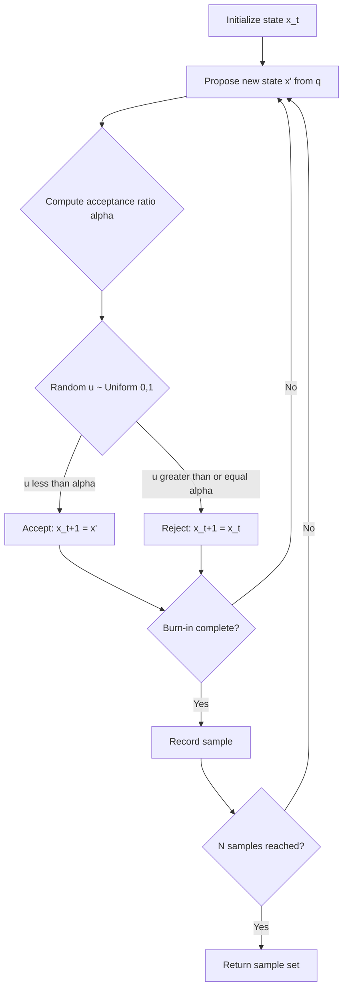

## Monte Carlo Methods


### Overview

Monte Carlo methods are a class of computational algorithms that use repeated random sampling to obtain numerical results for problems that may be deterministic in principle but are analytically intractable or too high-dimensional for direct methods. In physics, they are used to evaluate integrals, simulate stochastic processes, sample from complex probability distributions, and model systems with many interacting degrees of freedom.

The defining feature of a Monte Carlo method is the substitution of a deterministic computation with a statistical estimate whose accuracy improves as the number of samples $N$ increases, typically with error scaling as $1/\sqrt{N}$, independent of the dimensionality of the problem. This dimension-independence is what makes Monte Carlo methods indispensable for high-dimensional integrals and many-body systems where deterministic quadrature becomes computationally infeasible.

### Key Points

- **Law of Large Numbers**: The foundation of Monte Carlo estimation. For i.i.d. samples $X_1, \dots, X_N$ drawn from distribution $p(x)$, the sample mean converges to the true expectation:


  $$\frac{1}{N}\sum_{i=1}^{N} f(X_i) \to \mathbb{E}[f(X)] \quad \text{as } N \to \infty$$
- **Central Limit Theorem and Error Scaling**: The estimator's variance decreases as $1/N$, so the standard error decreases as $1/\sqrt{N}$:


  $$\sigma_{\hat{\mu}} \approx \frac{\sigma_f}{\sqrt{N}}$$

  This is independent of the number of dimensions $d$, unlike deterministic grid-based quadrature, whose error scales as $O(N^{-1/d})$ for smooth integrands under standard product-rule quadrature.
- **Pseudo-random number generation**: Most implementations rely on deterministic pseudo-random number generators (PRNGs) such as the Mersenne Twister or PCG family, seeded to produce reproducible sequences that statistically approximate true randomness.
- **Variance reduction is central to practical efficiency.** Because convergence is only $O(N^{-1/2})$, naive sampling is often too slow; techniques like importance sampling, stratified sampling, control variates, and antithetic variates are used to reduce $\sigma_f$ without increasing $N$.
- **Markov Chain Monte Carlo (MCMC)** extends the basic idea to sampling from distributions that cannot be sampled directly, by constructing a Markov chain whose stationary distribution is the target distribution.

### Core Techniques

#### 1. Direct (Naive) Monte Carlo Integration

To estimate an integral $I = \int_a^b f(x)\,dx$, sample $x_i \sim \text{Uniform}(a,b)$ and compute:

$$I \approx (b-a) \cdot \frac{1}{N}\sum_{i=1}^{N} f(x_i)$$

This generalizes directly to $d$-dimensional integrals over a volume $V$:

$$I \approx V \cdot \frac{1}{N}\sum_{i=1}^{N} f(\mathbf{x}_i)$$

**Example** — Estimating $\pi$ via random sampling in a unit square:

Sample points $(x_i, y_i)$ uniformly in $[-1,1]^2$ and count the fraction landing inside the unit circle ($x^2+y^2 \le 1$). Since the circle's area is $\pi$ and the square's area is $4$:

$$\pi \approx 4 \cdot \frac{N_{\text{inside}}}{N_{\text{total}}}$$

```python
import numpy as np

def estimate_pi(n_samples):
    x = np.random.uniform(-1, 1, n_samples)
    y = np.random.uniform(-1, 1, n_samples)
    inside = (x**2 + y**2) <= 1.0
    return 4 * np.mean(inside)

# Convergence check
for n in [10**2, 10**4, 10**6]:
    print(f"N={n}: pi_estimate={estimate_pi(n):.5f}")
```

With $N=10^6$ samples, the estimate typically lands within $\pm 0.002$ of $\pi$, consistent with the expected $1/\sqrt{N}$ error scaling.

#### 2. Importance Sampling

When $f(x)$ is sharply peaked or the integration domain is unbounded, uniform sampling wastes evaluations in low-contribution regions. Importance sampling draws samples from a proposal distribution $q(x)$ that approximates the shape of $f(x)$, then reweights:

$$I = \int f(x)\,dx = \int \frac{f(x)}{q(x)} q(x)\,dx \approx \frac{1}{N}\sum_{i=1}^{N} \frac{f(x_i)}{q(x_i)}, \quad x_i \sim q(x)$$

The optimal $q(x)$ minimizing variance is proportional to $|f(x)|$ itself; in practice, an approximation (e.g., a Gaussian matching the peak of $f$) suffices to substantially reduce variance.

#### 3. Markov Chain Monte Carlo (MCMC)

MCMC methods are used when direct sampling from a target distribution $p(x)$ — such as a Boltzmann distribution $p(x) \propto e^{-\beta E(x)}$ — is infeasible because the normalization constant (partition function) is unknown or uncomputable.

**Metropolis-Hastings Algorithm**:

1. Start at state $x_0$.
2. Propose a new state $x'$ from a proposal distribution $q(x' \mid x_t)$.
3. Compute the acceptance ratio:


   $$\alpha = \min\left(1, \frac{p(x')\,q(x_t \mid x')}{p(x_t)\,q(x' \mid x_t)}\right)$$
4. Accept $x' $ with probability $\alpha$ (set $x_{t+1} = x'$); otherwise $x_{t+1} = x_t$.
5. Repeat, discarding an initial "burn-in" period before collecting samples.

For symmetric proposals ($q(x'\mid x_t) = q(x_t \mid x')$), this simplifies to the original **Metropolis algorithm**:

$$\alpha = \min\left(1, \frac{p(x')}{p(x_t)}\right)$$

**Example** — 1D Ising-like Metropolis sampling of a Boltzmann distribution $p(x) \propto e^{-\beta x^2/2}$:

```python
import numpy as np

def metropolis_gaussian(beta, n_steps, step_size=1.0):
    x = 0.0
    samples = np.empty(n_steps)
    for i in range(n_steps):
        x_proposed = x + np.random.uniform(-step_size, step_size)
        dE = 0.5 * beta * (x_proposed**2 - x**2)
        if dE < 0 or np.random.rand() < np.exp(-dE):
            x = x_proposed
        samples[i] = x
    return samples

samples = metropolis_gaussian(beta=1.0, n_steps=100000)
print(f"Sample mean: {samples.mean():.4f}, Sample std: {samples.std():.4f}")
# Expected: mean ~ 0, std ~ 1/sqrt(beta) = 1.0
```

#### 4. Simulated Annealing

A variant of Metropolis MCMC used for global optimization, where $\beta$ (inverse "temperature") is gradually increased over the course of the simulation. Early high-temperature steps allow the system to escape local minima; as $\beta \to \infty$, the system freezes into a low-energy (often global minimum) configuration.

### Applications in Physics

- **Statistical mechanics**: Computing thermodynamic averages (energy, magnetization, specific heat) for lattice models like the Ising model, XY model, and Potts model via Metropolis or Wolff cluster algorithms.
- **Quantum Monte Carlo (QMC)**: Variational Monte Carlo (VMC) and Diffusion Monte Carlo (DMC) estimate ground-state energies of many-body quantum systems by sampling configurations weighted by $|\Psi(\mathbf{x})|^2$.
- **Lattice QCD**: Path integrals over gauge field configurations are evaluated using Hybrid Monte Carlo (HMC), which combines molecular dynamics trajectories with Metropolis acceptance to efficiently sample high-dimensional field configurations.
- **Radiation transport**: Simulating photon/neutron transport through matter (e.g., the MCNP and Geant4 toolkits) by stochastically sampling interaction events (scattering, absorption) along particle trajectories.
- **Cosmology**: Bayesian parameter estimation for cosmological models (e.g., constraining $\Omega_m$, $H_0$ from CMB or supernova data) using MCMC posterior sampling (e.g., `emcee`, CosmoMC).
- **Renormalization group studies**: Estimating critical exponents near phase transitions by simulating systems at varying sizes and temperatures.

### Diagram: Metropolis-Hastings Sampling Flow



### Convergence Diagnostics and Pitfalls

- **Autocorrelation**: Successive MCMC samples are correlated, reducing the *effective* sample size below $N$. The integrated autocorrelation time $\tau$ quantifies this:


  $$N_{\text{eff}} = \frac{N}{2\tau + 1}$$

  Error estimates must use $N_{\text{eff}}$, not raw $N$, or uncertainties will be understated. [Inference: exact autocorrelation structure is algorithm- and problem-dependent and generally requires empirical estimation rather than closed-form calculation.]
- **Burn-in / equilibration**: Initial samples reflect the (often arbitrary) starting configuration rather than the target distribution and are conventionally discarded.
- **Detailed balance**: The Metropolis-Hastings acceptance criterion is constructed to satisfy detailed balance,


  $$p(x)\,T(x \to x') = p(x')\,T(x' \to x)$$

  which is a sufficient (not necessary) condition guaranteeing $p(x)$ is the stationary distribution of the chain.
- **Critical slowing down**: Near phase transitions, local-update algorithms (single-spin-flip Metropolis) suffer from diverging autocorrelation times. Cluster algorithms (Wolff, Swendsen-Wang) mitigate this by flipping correlated clusters of spins simultaneously.
- **Ergodicity**: The Markov chain must be able to reach any state in the support of $p(x)$ from any starting point; poorly chosen proposal distributions (e.g., step sizes too small or too large) can break effective ergodicity in practice even when it holds in principle.

### Related Topics

- Variational Monte Carlo and Diffusion Monte Carlo for quantum many-body systems
- Hybrid/Hamiltonian Monte Carlo and its use in Lattice QCD
- Cluster algorithms: Wolff and Swendsen-Wang for spin systems
- Markov chain convergence theory and detailed balance proofs
- Quasi-Monte Carlo methods (low-discrepancy sequences, e.g., Sobol, Halton)
- Bayesian inference and posterior sampling (Gibbs sampling, Hamiltonian Monte Carlo in cosmological parameter estimation)
- Finite-size scaling analysis near critical points
- Random number generator quality and its impact on simulation validity