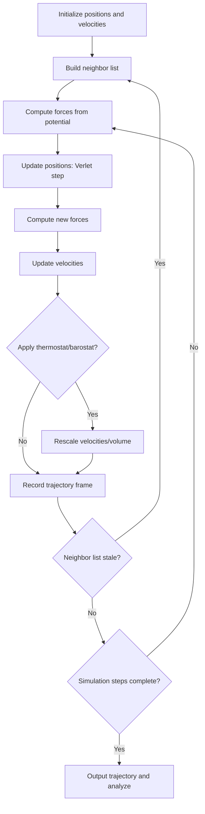

## Molecular Dynamics Simulations


### Overview

Molecular dynamics (MD) simulation is a deterministic computational method that models the time evolution of a system of interacting particles by numerically integrating Newton's equations of motion. Given a set of atoms or molecules with positions $\mathbf{r}_i$ and an interaction potential $U(\mathbf{r}_1, \dots, \mathbf{r}_N)$, MD computes forces from the potential and advances the system through discrete time steps, producing a trajectory in phase space from which thermodynamic, structural, and dynamic properties can be extracted.

Unlike Monte Carlo methods, which sample configuration space stochastically without reference to real time, MD produces physically meaningful time-ordered trajectories, making it the method of choice whenever transport properties, reaction kinetics, or dynamical correlations are of interest.

### Key Points

- **Governing equations**: For each particle $i$ with mass $m_i$, Newton's second law gives:


  $$m_i \frac{d^2\mathbf{r}_i}{dt^2} = \mathbf{F}_i = -\nabla_{\mathbf{r}_i} U(\mathbf{r}_1, \dots, \mathbf{r}_N)$$
- **Potential energy functions (force fields)** define interactions. Common forms include:
  - Lennard-Jones potential for van der Waals interactions:


    $$U_{LJ}(r) = 4\varepsilon \left[\left(\frac{\sigma}{r}\right)^{12} - \left(\frac{\sigma}{r}\right)^{6}\right]$$
  - Coulomb potential for electrostatics:


    $$U_{C}(r) = \frac{q_i q_j}{4\pi\varepsilon_0 r}$$
  - Bonded terms (harmonic bonds, angles, dihedrals) for molecular force fields such as AMBER, CHARMM, and OPLS.
- **Time integration** must conserve energy over long trajectories and be time-reversible; the **Velocity Verlet algorithm** is the standard choice due to its simplicity, symplectic structure, and good long-term energy conservation.
- **Ensembles**: MD can sample the microcanonical ($NVE$), canonical ($NVT$), or isothermal-isobaric ($NPT$) ensembles depending on whether thermostats and barostats are coupled to the system.
- **Time step selection** is constrained by the fastest motion in the system — typically bond vibrations (femtosecond timescale) — requiring $\Delta t \sim 1$–2 fs for atomistic simulations with explicit hydrogens.

### Core Algorithm: Velocity Verlet Integration

The velocity Verlet scheme advances positions and velocities as follows:

$$\mathbf{r}(t+\Delta t) = \mathbf{r}(t) + \mathbf{v}(t)\Delta t + \frac{1}{2}\mathbf{a}(t)\Delta t^2$$


$$\mathbf{v}(t+\Delta t) = \mathbf{v}(t) + \frac{1}{2}\left[\mathbf{a}(t) + \mathbf{a}(t+\Delta t)\right]\Delta t$$

where $\mathbf{a}(t) = \mathbf{F}(t)/m$. This requires computing forces at $\mathbf{r}(t)$, updating positions, computing new forces at $\mathbf{r}(t+\Delta t)$, then updating velocities — one force evaluation per step, which is the dominant computational cost.

**Example** — Minimal velocity Verlet integrator for a 2-particle Lennard-Jones system:

```python
import numpy as np

def lj_force(r_vec, epsilon=1.0, sigma=1.0):
    r = np.linalg.norm(r_vec)
    r_hat = r_vec / r
    f_mag = 24 * epsilon * (2 * (sigma/r)**12 - (sigma/r)**6) / r
    return f_mag * r_hat

def velocity_verlet_step(r, v, m, dt, force_func):
    a = force_func(r) / m
    r_new = r + v * dt + 0.5 * a * dt**2
    a_new = force_func(r_new) / m
    v_new = v + 0.5 * (a + a_new) * dt
    return r_new, v_new

# Two particles, relative coordinate
r_rel = np.array([1.5, 0.0])
v_rel = np.array([0.0, 0.1])
m_reduced = 1.0
dt = 0.005

trajectory = [r_rel.copy()]
for step in range(2000):
    r_rel, v_rel = velocity_verlet_step(r_rel, v_rel, m_reduced, dt, lj_force)
    trajectory.append(r_rel.copy())

trajectory = np.array(trajectory)
print(f"Final separation: {np.linalg.norm(trajectory[-1]):.4f}")
```

Energy conservation in this trajectory (kinetic + potential) should remain constant to within numerical precision over the simulated interval, serving as a basic correctness check on the integrator and force implementation.

### Thermostats and Barostats

To sample the $NVT$ or $NPT$ ensemble rather than $NVE$, the system must exchange energy (and volume) with a reservoir:

- **Berendsen thermostat**: Rescales velocities to relax the instantaneous temperature toward a target $T_0$ with time constant $\tau$. Simple and stable but does not generate a rigorous canonical ensemble (suppresses energy fluctuations).
- **Nosé-Hoover thermostat**: Introduces an additional dynamical variable representing a heat bath, extending the Lagrangian so that the resulting dynamics rigorously samples the canonical ensemble.
- **Langevin dynamics**: Adds stochastic and dissipative forces directly to the equations of motion:


  $$m_i\ddot{\mathbf{r}}_i = \mathbf{F}_i - \gamma m_i \dot{\mathbf{r}}_i + \sqrt{2\gamma m_i k_B T}\,\boldsymbol{\eta}_i(t)$$

  where $\boldsymbol{\eta}_i(t)$ is Gaussian white noise, $\gamma$ is a friction coefficient, and the fluctuation-dissipation theorem relates the noise amplitude to $\gamma$ and $T$.
- **Parrinello-Rahman barostat**: Extends the simulation cell dynamics to allow volume and shape fluctuations for $NPT$ sampling.

### Neighbor Lists and Computational Scaling

Direct pairwise force evaluation scales as $O(N^2)$, which becomes prohibitive for large $N$. Standard optimizations:

- **Cutoff radius**: Short-range potentials (e.g., Lennard-Jones) are truncated beyond $r_c$, since contributions decay rapidly.
- **Cell lists**: Partition the simulation box into cells of size $\ge r_c$; only neighboring cells need be checked, reducing scaling to $O(N)$.
- **Verlet neighbor lists**: Maintain a list of neighbors within $r_c + r_{\text{skin}}$, updated only periodically (not every step), amortizing the list-construction cost.
- **Ewald summation / Particle Mesh Ewald (PME)**: For long-range Coulomb interactions, which cannot simply be truncated without introducing artifacts, PME splits the sum into a rapidly converging real-space part and a reciprocal-space part evaluated via FFT, achieving $O(N \log N)$ scaling.

### Diagram: MD Simulation Loop



### Applications in Physics

- **Statistical mechanics**: Computing equations of state, radial distribution functions $g(r)$, and transport coefficients (diffusion constants via the Einstein relation, viscosity via Green-Kubo relations).
- **Condensed matter physics**: Simulating phase transitions, defect dynamics, and phonon spectra in crystalline and amorphous solids.
- **Biophysics**: Protein folding, ligand-receptor binding, and membrane dynamics using atomistic or coarse-grained force fields (e.g., GROMACS, NAMD, AMBER).
- **Materials science**: Studying mechanical properties (elastic moduli, fracture), thermal conductivity, and radiation damage cascades.
- **Plasma and astrophysics**: $N$-body gravitational dynamics (a long-range analog of MD) for galaxy formation and cluster simulations, often using tree codes (Barnes-Hut) or particle-mesh methods for scaling.
- **Ab initio MD (AIMD)**: Forces computed on-the-fly from electronic structure calculations (e.g., Car-Parrinello or Born-Oppenheimer MD) rather than empirical force fields, enabling study of chemical reactions and bond breaking/forming at higher computational cost.

### Validation and Common Pitfalls

- **Energy drift**: Poor time step choice or integrator error causes total energy to drift over long simulations; monitoring $NVE$ energy conservation is a standard sanity check even when running thermostatted ensembles.
- **Equilibration**: Systems must be relaxed from initial (often artificial) configurations before production data is collected, analogous to MCMC burn-in.
- **Finite-size effects**: Periodic boundary conditions introduce artificial correlations at length scales approaching the box size; system size must be chosen to avoid self-interaction through periodic images.
- **Ergodicity and sampling time**: MD trajectories must be long enough to adequately sample relevant phase space regions, particularly for systems with slow conformational transitions (e.g., protein folding), where enhanced sampling techniques (replica exchange, metadynamics, umbrella sampling) are often required. [Inference: required trajectory length is strongly system-dependent and typically established empirically rather than from a general formula.]
- **Force field transferability**: Empirical potentials are fit to reproduce specific reference data (experimental or ab initio) and may not generalize reliably outside their parameterization domain.

### Related Topics

- Ewald summation and Particle Mesh Ewald for long-range electrostatics
- Enhanced sampling: umbrella sampling, metadynamics, replica exchange MD
- Ab initio / Car-Parrinello molecular dynamics
- Green-Kubo relations for transport coefficients
- Coarse-grained force fields and multiscale modeling
- $N$-body gravitational simulation and tree codes (Barnes-Hut, Fast Multipole Method)
- Langevin and Brownian dynamics as reduced-degree-of-freedom alternatives to full MD
- Symplectic integrators and Hamiltonian mechanics in numerical schemes