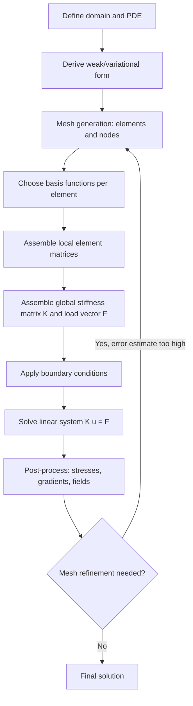

## Finite Difference and Finite Element Methods


### Overview

Finite difference (FDM) and finite element (FEM) methods are numerical techniques for solving differential equations — particularly partial differential equations (PDEs) — that lack closed-form analytical solutions. Both discretize a continuous domain into a finite set of points or elements, transforming the differential equation into a system of algebraic equations solvable by computer. FDM approximates derivatives directly using local Taylor-series expansions on a grid, while FEM subdivides the domain into elements and approximates the solution as a combination of piecewise basis functions, derived from a weak (variational) formulation of the governing equation. In physics, these methods underlie simulations of heat transfer, electromagnetics, fluid dynamics, elasticity, and quantum mechanics wherever geometry or boundary conditions preclude analytic solutions.

### Key Points

- **FDM approximates derivatives via Taylor expansion** on a structured grid, replacing continuous differential operators with discrete difference operators.
- **FEM is built on a variational (weak) formulation**: rather than requiring the PDE to hold pointwise, it requires an integral (weighted residual) form to hold, allowing lower-order continuity requirements and irregular geometries.
- **FDM is simplest and most efficient on regular, structured grids**; FEM's use of unstructured meshes makes it far better suited to complex or irregular geometries.
- **Both methods convert a continuous problem into a linear (or nonlinear) system** $A\mathbf{u} = \mathbf{b}$, solved via direct or iterative linear algebra techniques.
- **Stability and convergence** are governed by different but related theoretical frameworks: the Courant-Friedrichs-Lewy (CFL) condition for explicit time-stepping schemes, and consistency/stability (via the Lax equivalence theorem) for convergence guarantees.

### Finite Difference Methods

#### Derivative Approximations

Using Taylor expansion, the first derivative can be approximated multiple ways:

- Forward difference: $\displaystyle f'(x) \approx \frac{f(x+h) - f(x)}{h}$, error $O(h)$
- Backward difference: $\displaystyle f'(x) \approx \frac{f(x) - f(x-h)}{h}$, error $O(h)$
- Central difference: $\displaystyle f'(x) \approx \frac{f(x+h) - f(x-h)}{2h}$, error $O(h^2)$

The second derivative (central difference):

$$f''(x) \approx \frac{f(x+h) - 2f(x) + f(x-h)}{h^2}$$

#### Example: 1D Heat Equation via Explicit FDM

The heat equation $\dfrac{\partial u}{\partial t} = \alpha \dfrac{\partial^2 u}{\partial x^2}$ discretized with forward-time, central-space (FTCS) differencing:

$$\frac{u_i^{n+1} - u_i^n}{\Delta t} = \alpha \frac{u_{i+1}^n - 2u_i^n + u_{i-1}^n}{\Delta x^2}$$

giving the explicit update:

$$u_i^{n+1} = u_i^n + r\left(u_{i+1}^n - 2u_i^n + u_{i-1}^n\right), \quad r = \frac{\alpha \Delta t}{\Delta x^2}$$

Stability of this explicit scheme requires the CFL-type condition $r \le 1/2$; violating it causes the numerical solution to blow up.

```python
import numpy as np

def heat_fdm_explicit(L=1.0, T=0.1, nx=50, alpha=0.01):
    dx = L / (nx - 1)
    dt = 0.4 * dx**2 / alpha  # satisfies r = alpha*dt/dx^2 <= 0.5
    r = alpha * dt / dx**2
    nt = int(T / dt)

    u = np.zeros(nx)
    u[nx//2] = 1.0 / dx  # initial delta-like pulse

    for n in range(nt):
        u_new = u.copy()
        u_new[1:-1] = u[1:-1] + r * (u[2:] - 2*u[1:-1] + u[:-2])
        u_new[0] = u_new[-1] = 0.0  # Dirichlet BCs
        u = u_new

    return u

result = heat_fdm_explicit()
print(f"Max temperature after diffusion: {result.max():.4f}")
```

#### Implicit and Crank-Nicolson Schemes

Explicit FDM schemes are conditionally stable and can require prohibitively small time steps. Implicit schemes evaluate the spatial derivative at the new time level:

$$\frac{u_i^{n+1} - u_i^n}{\Delta t} = \alpha \frac{u_{i+1}^{n+1} - 2u_i^{n+1} + u_{i-1}^{n+1}}{\Delta x^2}$$

This requires solving a tridiagonal linear system each step but is unconditionally stable. The **Crank-Nicolson method** averages the explicit and implicit spatial terms, achieving second-order accuracy in both time and space while remaining unconditionally stable:

$$\frac{u_i^{n+1} - u_i^n}{\Delta t} = \frac{\alpha}{2}\left[\frac{u_{i+1}^{n+1} - 2u_i^{n+1} + u_{i-1}^{n+1}}{\Delta x^2} + \frac{u_{i+1}^{n} - 2u_i^{n} + u_{i-1}^{n}}{\Delta x^2}\right]$$

### Finite Element Methods

#### Weak Formulation

Consider the 1D Poisson equation $-\dfrac{d^2u}{dx^2} = f(x)$ with $u(0) = u(L) = 0$. Multiplying by a test function $v(x)$ (vanishing at boundaries) and integrating by parts:

$$\int_0^L \frac{du}{dx}\frac{dv}{dx}\,dx = \int_0^L f(x)v(x)\,dx \quad \forall v$$

This weak form only requires $u$ to be once-differentiable (in a suitable Sobolev-space sense), relaxing the twice-differentiability required by the strong (classical) form — allowing FEM to handle discontinuous material properties and complex boundary conditions naturally.

#### Discretization: Basis Functions and the Stiffness Matrix

The domain is divided into elements (e.g., line segments in 1D, triangles/quadrilaterals in 2D, tetrahedra/hexahedra in 3D). The solution is approximated as:

$$u(x) \approx \sum_{j=1}^{n} u_j \phi_j(x)$$

where $\phi_j(x)$ are piecewise basis functions (commonly piecewise-linear "hat functions" for linear elements), nonzero only over elements adjacent to node $j$. Substituting into the weak form and choosing $v = \phi_i$ for each node yields a linear system:

$$K\mathbf{u} = \mathbf{F}, \quad K_{ij} = \int_0^L \phi_i'(x)\phi_j'(x)\,dx, \quad F_i = \int_0^L f(x)\phi_i(x)\,dx$$

$K$ is the **stiffness matrix** — sparse and banded because each basis function has local (compact) support, overlapping only with its immediate neighbors.

**Example** — Assembling a 1D FEM stiffness matrix for linear elements of uniform length $h$:

```python
import numpy as np

def fem_1d_poisson(n_elements=10, L=1.0, f_func=lambda x: 1.0):
    n_nodes = n_elements + 1
    h = L / n_elements
    K = np.zeros((n_nodes, n_nodes))
    F = np.zeros(n_nodes)

    # Element stiffness matrix for linear elements: [[1,-1],[-1,1]] / h
    k_local = np.array([[1, -1], [-1, 1]]) / h

    for e in range(n_elements):
        nodes = [e, e+1]
        for a in range(2):
            for b in range(2):
                K[nodes[a], nodes[b]] += k_local[a, b]
        x_mid = (e + 0.5) * h
        F[nodes[0]] += f_func(x_mid) * h / 2
        F[nodes[1]] += f_func(x_mid) * h / 2

    # Apply Dirichlet BCs: u(0) = u(L) = 0
    K[0, :] = 0; K[0, 0] = 1; F[0] = 0
    K[-1, :] = 0; K[-1, -1] = 1; F[-1] = 0

    u = np.linalg.solve(K, F)
    return u

solution = fem_1d_poisson()
print(f"Max displacement: {solution.max():.5f}")
```

For $f(x) = 1$, this converges to the exact solution $u(x) = \tfrac{1}{2}x(L-x)$ as the mesh is refined.

### Diagram: FEM Workflow



### Comparison: FDM vs. FEM

| Aspect | Finite Difference (FDM) | Finite Element (FEM) |
| --- | --- | --- |
| Domain discretization | Structured grid | Unstructured mesh (arbitrary geometry) |
| Mathematical basis | Taylor series (strong form) | Variational/weak form |
| Geometric flexibility | Limited (regular domains) | High (complex boundaries) |
| Implementation complexity | Lower | Higher (mesh generation, assembly) |
| Common use cases | Simple PDEs, regular grids, fluid dynamics (with extensions like FVM) | Structural mechanics, complex geometries, multiphysics |
| Boundary condition handling | Can be awkward on curved boundaries | Naturally incorporated via weak form |

### Applications in Physics

- **Electromagnetics**: Solving Maxwell's equations for waveguides, antennas, and scattering problems (finite-difference time-domain, FDTD, is a dominant FDM variant here).
- **Quantum mechanics**: Discretizing the time-independent Schrödinger equation to find bound-state energies and wavefunctions in arbitrary potentials.
- **Solid mechanics**: FEM is the standard tool for stress-strain analysis, structural deformation, and fracture mechanics under complex loading and geometry.
- **Fluid dynamics**: FDM and its close relative the finite volume method (FVM) are widely used for computational fluid dynamics (CFD), solving the Navier-Stokes equations.
- **General relativity**: Numerical relativity simulations (e.g., binary black hole mergers) rely on finite-difference discretizations of the Einstein field equations on adaptive meshes.
- **Thermal and diffusion problems**: Heat conduction, reaction-diffusion systems, and semiconductor device modeling.

### Stability, Accuracy, and Pitfalls

- **CFL condition**: For explicit time-stepping of hyperbolic/parabolic PDEs, numerical stability requires the time step to satisfy a bound relating $\Delta t$, $\Delta x$, and the characteristic wave/diffusion speed; violating it produces unbounded numerical growth.
- **Consistency and the Lax equivalence theorem**: For well-posed linear initial value problems, a consistent finite-difference scheme converges to the true solution if and only if it is stable — making stability analysis (e.g., von Neumann analysis) essential before trusting results.
- **Mesh quality in FEM**: Highly distorted or poorly shaped elements degrade solution accuracy and can cause ill-conditioning of the stiffness matrix; automated mesh generation and refinement (adaptive mesh refinement, AMR) are used to control this.
- **Numerical dispersion and diffusion**: Discretization introduces artifacts absent from the true PDE — e.g., artificial damping (numerical diffusion) or spurious oscillations near sharp gradients (Gibbs-like phenomena), often mitigated with higher-order or flux-limited schemes.
- **Convergence verification**: Solutions should be checked for grid/mesh independence — i.e., confirming that refining the discretization further does not significantly change results — as a standard validation step in any physics simulation. [Inference: what constitutes "sufficient" refinement is problem-dependent and is typically established through empirical convergence studies rather than a universal criterion.]

### Related Topics

- Finite volume method (FVM) and its relation to conservation laws in CFD
- Spectral methods as a higher-order alternative for smooth problems
- Finite-difference time-domain (FDTD) method in computational electromagnetics
- Adaptive mesh refinement (AMR) techniques
- Von Neumann stability analysis for finite-difference schemes
- Boundary element method (BEM) as an alternative for exterior/unbounded domains
- Multigrid methods for efficient solution of large sparse linear systems
- Numerical relativity and finite-difference solutions to the Einstein field equations