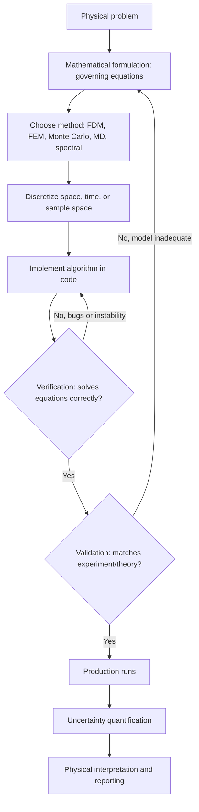

## Computational Modeling of Physical Systems


### Overview

Computational modeling of physical systems is the overarching discipline of translating physical laws — expressed as differential equations, variational principles, or statistical rules — into algorithms that can be executed on a computer to predict, analyze, or explore the behavior of a system. It sits above specific techniques like Monte Carlo methods, molecular dynamics, and finite difference/finite element methods, providing the conceptual framework for choosing among them: how to represent a physical system numerically, how to validate that representation against theory or experiment, and how to manage the trade-offs between accuracy, computational cost, and interpretability. This topic ties together the model-building process itself, independent of any single numerical method.

### Key Points

- **A computational model is an approximation**, not a re-derivation, of physical reality: it discretizes continuous quantities, truncates infinite domains, and introduces numerical parameters (step sizes, cutoffs, basis sizes) that must be controlled and justified.
- **The modeling pipeline** generally follows: physical problem → mathematical formulation (governing equations) → numerical discretization → algorithm/implementation → verification → validation → production runs and analysis.
- **Verification and validation (V&V) are distinct**: verification asks "are we solving the equations correctly?" (numerical/implementation correctness), while validation asks "are we solving the correct equations?" (physical fidelity to reality).
- **Choice of method is dictated by the nature of the problem**: deterministic PDEs favor FDM/FEM/spectral methods; high-dimensional integrals and thermodynamic sampling favor Monte Carlo; explicit particle trajectories and dynamics favor MD or $N$-body methods.
- **Dimensional analysis and non-dimensionalization** are standard preprocessing steps, reducing the number of free parameters and revealing the natural dimensionless groups (Reynolds number, Mach number, coupling constants) that govern system behavior.

### The Modeling Pipeline

#### 1. Physical Problem Formulation

Begin from the governing physics: conservation laws (mass, momentum, energy), symmetries, and constraints. For example, a fluid flow problem starts from the Navier-Stokes equations; a quantum system starts from the Schrödinger equation; a thermodynamic system starts from a Hamiltonian and partition function.

#### 2. Mathematical Formulation

Cast the physics into a solvable mathematical form: a PDE with boundary/initial conditions, a stochastic process, a variational (energy-minimization) principle, or a set of coupled ODEs. Simplifying assumptions (linearization, symmetry reduction, mean-field approximations) are made explicit at this stage and documented, since they bound the model's regime of validity.

#### 3. Discretization and Algorithm Selection

Continuous quantities are replaced by finite representations:

- **Spatial discretization**: grids (FDM), meshes (FEM), particles (MD, SPH), or basis expansions (spectral/Galerkin methods).
- **Temporal discretization**: explicit vs. implicit time-stepping, chosen based on stiffness of the equations and stability requirements (e.g., CFL condition).
- **Stochastic discretization**: sampling strategies for Monte Carlo approaches, including variance reduction and Markov chain design.

The choice is guided by the problem's dimensionality, geometry, required accuracy, and available computational resources.

#### 4. Implementation

Translate the discretized model into code, typically leveraging existing numerical libraries (linear algebra, ODE/PDE solvers, random number generation) rather than reimplementing fundamentals. Key implementation concerns include numerical precision (single vs. double vs. extended), memory layout for performance, and parallelization strategy (shared-memory, distributed-memory/MPI, or GPU acceleration) for large-scale problems.

#### 5. Verification

Confirms the code correctly solves the discretized equations, independent of whether those equations correctly describe the physics. Standard techniques:

- **Method of manufactured solutions**: construct an artificial solution, derive the corresponding source term, and confirm the code reproduces the known solution to within expected discretization error.
- **Convergence testing**: confirm that error decreases at the theoretically expected rate as grid spacing, time step, or sample count is refined (e.g., $O(h^2)$ for central differences, $O(1/\sqrt{N})$ for Monte Carlo).
- **Conservation checks**: for physical systems with conserved quantities (energy, momentum, probability), confirm these remain constant (within numerical tolerance) over the simulation, catching implementation bugs and integrator instabilities.

#### 6. Validation

Confirms the model's predictions agree with experimental data or higher-fidelity reference calculations, within the domain the model claims to describe. A model can be fully verified (correctly solving its equations) yet invalid (the equations themselves are a poor description of the physics) — the two checks are independent and both necessary.

#### 7. Production and Uncertainty Quantification

Once verified and validated, the model is used to generate results, ideally accompanied by an estimate of uncertainty arising from: discretization error, statistical/sampling error, parameter uncertainty, and model-form uncertainty (the gap between the mathematical model and true physics).

### Diagram: The Computational Modeling Pipeline



### Choosing a Method: Decision Considerations

| Problem Characteristic | Favored Approach |
| --- | --- |
| Smooth PDE on regular/simple geometry | Finite difference, spectral methods |
| Complex/irregular geometry, structural mechanics | Finite element |
| High-dimensional integral or thermodynamic sampling | Monte Carlo |
| Explicit particle trajectories, transport properties | Molecular dynamics, $N$-body methods |
| Sharply peaked or rare-event probability distributions | Importance sampling, MCMC variants |
| Stiff ODEs (widely separated timescales) | Implicit integrators (e.g., backward Euler, Crank-Nicolson) |
| Long-range interactions (gravity, electrostatics) | Tree codes, Fast Multipole Method, Ewald summation |

**Example** — Contrasting approaches for a heat diffusion problem:

A physicist studying heat flow through a complex turbine blade geometry, versus heat flow through a uniform metal rod, would typically choose differently:

```python
# Simple 1D rod: regular geometry favors FDM (see prior finite-difference example)
# result = heat_fdm_explicit(L=1.0, T=0.1, nx=50, alpha=0.01)

# Complex 3D turbine blade geometry: irregular boundary favors FEM
# Conceptual outline (using an FEM library such as FEniCS or scikit-fem):
#   1. Import/generate mesh conforming to blade geometry
#   2. Define weak form of heat equation with appropriate BCs
#   3. Assemble global stiffness/mass matrices
#   4. Time-step (implicit, for stability) or solve steady-state directly
#   5. Post-process temperature field, extract max stress-inducing gradients
```

This illustrates a core modeling decision: geometric complexity, not just the governing equation, often determines which numerical method is practical.

### Sources of Error in Computational Models

- **Discretization error**: arises from replacing continuous derivatives/integrals with finite approximations; controlled by grid/mesh resolution, time step, or sample count.
- **Round-off error**: accumulates from finite floating-point precision, particularly significant in ill-conditioned systems or long-running simulations with many arithmetic operations.
- **Truncation error**: from finite-order Taylor expansions (FDM) or finite basis sets/element order (FEM, spectral methods).
- **Statistical error**: intrinsic to stochastic methods (Monte Carlo, MD ensemble averages), scaling as $1/\sqrt{N_{\text{eff}}}$.
- **Model-form (structural) error**: the difference between the chosen mathematical model and the true underlying physics, e.g., using a classical force field where quantum effects are non-negligible, or a mean-field approximation where correlations matter.

### Applications Across Physics

- **Astrophysics**: $N$-body and hydrodynamic simulations of galaxy formation, stellar structure, and gravitational wave sources, combining particle methods with adaptive mesh refinement.
- **Plasma physics**: Particle-in-cell (PIC) methods combining discrete particle tracking with field solutions on a grid.
- **Condensed matter and materials science**: Multiscale modeling spanning ab initio electronic structure (DFT), atomistic MD, and continuum FEM, each handing off parameters to the coarser scale.
- **Climate and geophysics**: Coupled PDE systems (fluid dynamics, radiative transfer, chemistry) discretized on global grids, with uncertainty quantification central to interpreting projections.
- **High-energy physics**: Detector simulation (Monte Carlo particle transport, e.g., Geant4) combined with statistical inference for parameter extraction from data.

### Best Practices and Common Pitfalls

- **Always non-dimensionalize** governing equations where practical; this reduces the parameter space, avoids floating-point scaling issues, and reveals the dimensionless numbers that control regime behavior (e.g., Reynolds number for flow, coupling constant for perturbative field theory).
- **Never skip verification** in favor of jumping straight to physical interpretation — a model that produces plausible-looking output can still contain implementation errors that convergence and conservation checks would catch.
- **Report resolution/sample-size sensitivity**: results should be presented alongside evidence that they are converged (grid-independent, mesh-independent, or statistically converged), not as single-run outputs.
- **Beware of hidden assumptions inherited from libraries**: default solver tolerances, boundary condition handling, or random number generator seeding in third-party libraries can silently affect results if not explicitly checked. [Inference: the specific defaults and their impact are library- and version-dependent and should be checked against current documentation rather than assumed.]
- **Reproducibility**: seed all random number generators explicitly, and version-control both code and the exact parameters used for reported results, since small changes in numerical settings can materially change output in nonlinear or chaotic systems.

### Related Topics

- Uncertainty quantification and sensitivity analysis in simulation
- Verification and validation (V&V) methodology in computational science
- Multiscale and multiphysics modeling
- Dimensional analysis and non-dimensionalization techniques
- High-performance computing: parallelization strategies (MPI, GPU acceleration) for large-scale simulations
- Particle-in-cell (PIC) methods for plasma physics
- Reduced-order modeling and surrogate/emulator techniques for expensive simulations
- Chaos and sensitivity to initial/numerical conditions in nonlinear dynamical systems