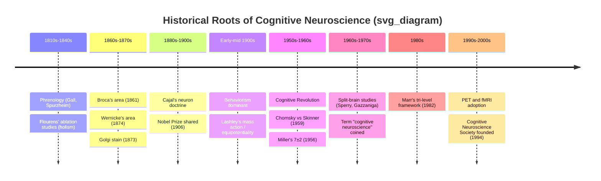

## Historical Roots from Phrenology to Modern Neuroscience

### Overview

Cognitive neuroscience emerged from the convergence of several independent intellectual traditions: localizationist anatomy, experimental psychology, clinical neurology, and computational theory. Understanding this lineage clarifies why the field's central assumptions — that mental functions can be mapped to neural substrates, and that cognition can be studied empirically — were neither obvious nor uncontested at their origin.

### Phrenology (Early 1800s)

**Key Points**

- Founded by Franz Joseph Gall, later popularized by Johann Spurzheim
- Proposed that the brain is composed of discrete "organs," each responsible for a specific mental faculty (e.g., "amativeness," "combativeness," "veneration")
- Claimed that the relative size of each organ was reflected in the shape of the skull, making mental traits readable via cranial palpation
- Introduced two ideas that persisted long after the practice itself was discredited: (1) the brain, not the heart, is the organ of the mind, and (2) different mental functions are localized to different brain regions

Phrenology's methodology was fundamentally flawed — it lacked controlled observation, relied on circular reasoning (traits were inferred from bumps, and bumps were explained by traits), and had no lesion or physiological verification. It is now classified as a pseudoscience. Its enduring contribution was reframing the *question* — where in the brain does function reside — even though its *answer* was wrong.

### Nineteenth-Century Localizationism

**Key Points**

- **Paul Broca (1861)**: Studied patient "Tan" (Leborgne), who retained language comprehension but lost the ability to produce fluent speech. Post-mortem examination revealed damage to the left posterior inferior frontal gyrus (now Broca's area), providing the first strong lesion-based evidence for functional localization.
- **Carl Wernicke (1874)**: Identified a distinct language deficit — impaired comprehension with fluent but meaningless speech — associated with damage to the left posterior superior temporal gyrus (Wernicke's area). Proposed a connectionist model linking distinct regions via white-matter pathways (the arcuate fasciculus), an early precursor to network-based thinking in neuroscience.
- **Jean-Baptiste Bouillaud and Ernest Auburtin**: Predecessors whose clinical case collections supported frontal-lobe language localization prior to Broca's more rigorous single-case demonstration.

These findings shifted localization from an untestable cranial theory (phrenology) to an evidence-based clinical method: correlate a specific behavioral deficit with a specific site of damage, verified post-mortem.

**[Inference]** The Broca-Wernicke tradition is often described as the beginning of "lesion-deficit mapping," a method that remains foundational to clinical neuropsychology, though the term itself was formalized later.

### Countercurrents: Holism and Equipotentiality

**Key Points**

- **Pierre Flourens (1820s–1840s)**: Using ablation experiments in animals, argued against strict localization, proposing instead that the cerebral cortex functions as a unified whole (holism) — damage anywhere produced generalized deficits proportional to the amount of tissue removed, not the specific location.
- **Karl Lashley (early-to-mid 1900s)**: Extended this with the concepts of **mass action** (the degree of behavioral deficit is proportional to the amount of cortex destroyed, not its specific locus) and the **equipotentiality hypothesis** (any part of a functional cortical area can substitute for another for certain tasks, notably in his search for the "engram," or physical trace of memory, in rats).

This tension between localizationist and holistic views was not fully resolved by either side; modern neuroscience instead adopted a synthesis in which specific regions have specialized computational roles but operate within distributed, interacting networks — neither pure localization nor pure equipotentiality.

### Structural Foundations: The Neuron Doctrine

**Key Points**

- **Camillo Golgi (1873)**: Developed the silver staining method ("la reazione nera") that made individual neurons visible under microscopy for the first time.
- **Santiago Ramón y Cajal (1888–1900s)**: Used Golgi's stain to argue that the nervous system is composed of discrete, individual cells (neurons) connected by contact rather than a continuous fused network (reticulum) — the **neuron doctrine**.
- Golgi himself held the opposing "reticular theory." Both shared the 1906 Nobel Prize in Physiology or Medicine despite their disagreement, and Cajal's interpretation was later vindicated by electron microscopy confirming the existence of the synaptic cleft.

The neuron doctrine gave localizationism a plausible physical mechanism: if the nervous system is built of discrete, specialized units connected in specific circuits, then specialized function distributed across specific circuits becomes mechanistically coherent — laying groundwork for later circuit-level and network-level neuroscience.

### The Detour Through Behaviorism (Early-to-Mid 1900s)

**Key Points**

- Dominant paradigm in American psychology (John B. Watson, B.F. Skinner) that rejected the study of internal mental states as unscientific, focusing exclusively on observable stimulus-response relationships
- Effectively suspended mainstream psychological interest in internal cognitive or neural mechanisms for several decades
- Coexisted with, but was largely separate from, ongoing clinical/neurological localization work (e.g., Lashley worked during this period but was more aligned with physiological psychology)

Behaviorism is historically significant to cognitive neuroscience primarily as the paradigm the field's founding generation explicitly reacted against.

### The Cognitive Revolution (1950s–1960s)

**Key Points**

- Reintroduced the study of internal mental representations and processes as legitimate scientific objects, catalyzed by convergent developments outside psychology:
  - **Information theory** (Claude Shannon) — treating communication and processing as quantifiable
  - **Computer science and the Turing machine model** — providing a formal vocabulary (input, processing, storage, output) for describing cognition
  - **Noam Chomsky's critique of Skinner's *Verbal Behavior* (1959)** — argued that language acquisition could not be explained by stimulus-response conditioning alone, implying innate, structured internal representations
  - **George Miller's "The Magical Number Seven, Plus or Minus Two" (1956)** — demonstrated quantifiable limits on working memory capacity, treatable as an information-processing constraint
- Established the **computer metaphor of mind**: cognition as computation over internal representations, independent (in principle) of the physical substrate performing it

This period produced cognitive psychology as a discipline but, notably, it was largely **not yet neuroscientific** — early cognitive models were functional/computational, often agnostic about neural implementation.

### The Birth of Cognitive Neuroscience Proper (1970s–1980s)

**Key Points**

- The term "cognitive neuroscience" is generally credited to **Michael Gazzaniga and George Miller**, reportedly coined in a conversation in the back of a New York taxi in the late 1970s, reflecting the intent to fuse the cognitive (computational/representational) level of analysis with the neuroscientific (biological/mechanistic) level.
- **Split-brain studies (Roger Sperry, Michael Gazzaniga, 1960s–70s)**: Studied patients with severed corpus callosum, revealing functional and representational differences between the cerebral hemispheres — direct experimental evidence linking a specific neuroanatomical structure to specific cognitive/representational consequences.
- **David Marr's tri-level framework (Vision, 1982)**: Proposed that any information-processing system should be understood at three complementary levels — computational (what problem is being solved), algorithmic/representational (what procedure and representation solves it), and implementational (how it is physically realized in neural hardware). This gave the field a principled way to relate cognitive theory to neural mechanism without collapsing one into the other.
- Formation of the **Cognitive Neuroscience Society** (1994) and the naming of the journal *Journal of Cognitive Neuroscience* (1989, MIT Press) marked institutional consolidation of the field.

### The Neuroimaging Revolution (1990s–2000s)

**Key Points**

- **PET (Positron Emission Tomography)**: Enabled indirect measurement of regional brain activity via blood flow/metabolism in living humans, extending lesion-based localization to functional localization in healthy subjects.
- **fMRI (functional Magnetic Resonance Imaging, 1990s)**: Using the BOLD (blood-oxygen-level-dependent) signal, provided non-invasive, higher-resolution spatial mapping of task-related brain activity, becoming the dominant tool of the field.
- **EEG/MEG**: Provided millisecond-scale temporal resolution to complement the spatial resolution of PET/fMRI, supporting study of the time-course of cognitive processes.
- This era shifted the field's central method from correlating *lesions* with deficits to correlating *activation patterns* with cognitive tasks in intact brains, vastly expanding testable questions but also introducing new methodological debates (e.g., reverse inference, the replication crisis in social/cognitive neuroscience of the 2010s).

**[Inference]** The rapid adoption of fMRI is often cited as the single largest driver of the field's growth from the 1990s onward, though this is a historiographic judgment rather than a directly measurable claim.

### Timeline Diagram

### Conceptual Lineage Diagram

<svg xmlns="http://www.w3.org/2000/svg" viewBox="0 0 900 480" font-family="Helvetica, Arial, sans-serif">
<text x="450" y="30" text-anchor="middle" font-size="18" font-weight="bold" fill="#1a1a1a">Conceptual Lineage: Phrenology to Cognitive Neuroscience (svg_diagram)</text>
<rect x="40" y="60" width="180" height="60" rx="8" fill="#f4d9d9" stroke="#a33" />
<text x="130" y="85" text-anchor="middle" font-size="13" font-weight="bold">Phrenology</text>
<text x="130" y="103" text-anchor="middle" font-size="11">Gall / Spurzheim</text>
<rect x="40" y="160" width="180" height="70" rx="8" fill="#d9e8f4" stroke="#357" />
<text x="130" y="182" text-anchor="middle" font-size="13" font-weight="bold">Lesion Localizationism</text>
<text x="130" y="200" text-anchor="middle" font-size="11">Broca / Wernicke</text>
<text x="130" y="215" text-anchor="middle" font-size="11">vs. Flourens / Lashley</text>
<rect x="360" y="160" width="180" height="60" rx="8" fill="#d9f4df" stroke="#3a7" />
<text x="450" y="182" text-anchor="middle" font-size="13" font-weight="bold">Neuron Doctrine</text>
<text x="450" y="200" text-anchor="middle" font-size="11">Cajal / Golgi</text>
<rect x="680" y="160" width="180" height="60" rx="8" fill="#f4ecd9" stroke="#a83" />
<text x="770" y="182" text-anchor="middle" font-size="13" font-weight="bold">Behaviorism</text>
<text x="770" y="200" text-anchor="middle" font-size="11">Watson / Skinner</text>
<rect x="360" y="280" width="180" height="60" rx="8" fill="#e0d9f4" stroke="#66a" />
<text x="450" y="302" text-anchor="middle" font-size="13" font-weight="bold">Cognitive Revolution</text>
<text x="450" y="320" text-anchor="middle" font-size="11">Chomsky / Miller</text>
<rect x="360" y="380" width="180" height="70" rx="8" fill="#f4d9ec" stroke="#a37" />
<text x="450" y="402" text-anchor="middle" font-size="13" font-weight="bold">Cognitive Neuroscience</text>
<text x="450" y="420" text-anchor="middle" font-size="11">Gazzaniga / Miller / Marr</text>
<text x="450" y="435" text-anchor="middle" font-size="11">Split-brain, tri-level model</text>
<line x1="130" y1="120" x2="130" y2="158" stroke="#666" stroke-width="2" marker-end="url(#arrow)" />
<line x1="220" y1="195" x2="358" y2="195" stroke="#666" stroke-width="2" marker-end="url(#arrow)" />
<line x1="450" y1="220" x2="450" y2="278" stroke="#666" stroke-width="2" marker-end="url(#arrow)" />
<line x1="770" y1="220" x2="500" y2="290" stroke="#666" stroke-width="2" marker-end="url(#arrow)" />
<line x1="450" y1="340" x2="450" y2="378" stroke="#666" stroke-width="2" marker-end="url(#arrow)" />
</svg>

### Example: Reading a Historical Case Study

Given the Broca "Tan" case, a cognitive neuroscience analysis proceeds as:

1. **Behavioral observation**: Preserved comprehension, severely impaired speech production (nonfluent, largely limited to the syllable "tan")
2. **Structural correlation**: Post-mortem lesion localized to left inferior frontal gyrus
3. **Inference**: A specific region contributes selectively to speech production (a *dissociation*, in modern neuropsychological terms), distinct from comprehension
4. **Modern reframing**: fMRI and diffusion imaging in contemporary patients confirm involvement of this region within a broader left-hemisphere perisylvian language network rather than as an isolated "speech organ," refining rather than discarding Broca's original localization

### Key Distinctions Across Eras

| Era | Method | Core Claim | Status |
| --- | --- | --- | --- |
| Phrenology | Cranial palpation | Skull shape reflects mental faculties | Discredited |
| Lesion localizationism | Post-mortem correlation | Specific regions support specific functions | Refined, retained |
| Holism (Flourens/Lashley) | Ablation | Cortex acts as a unified mass | Partially retained (distributed processing) |
| Neuron doctrine | Histology | Discrete neurons, not continuous net | Confirmed |
| Behaviorism | S-R conditioning | Internal states unstudiable | Rejected by field |
| Cognitive revolution | Computational modeling | Mind as information processor | Retained, extended |
| Modern cognitive neuroscience | Neuroimaging + computation | Function is specialized yet networked | Current paradigm |

**Related Topics**

- Lesion-deficit mapping and modern neuropsychological methods
- The neuron doctrine and synaptic transmission
- David Marr's tri-level framework of analysis
- Split-brain research and hemispheric specialization
- Development and principles of fMRI/BOLD signal
- Localization of function vs. distributed network models
- The cognitive revolution and computational theory of mind
- History of EEG and electrophysiological methods