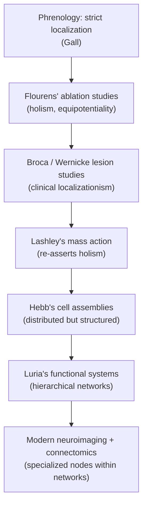

## Localizationism versus Holism Debates

### Overview

The localizationism-holism debate concerns whether cognitive functions are implemented by discrete, specialized brain regions ("localizationism") or by the brain acting as a distributed, interactive system in which function emerges from widespread neural activity ("holism"). This was not a single historical dispute but a recurring tension that resurfaced across multiple methodological eras — clinical lesion studies, ablation experiments, and later neuroimaging — with each era reframing the question using new evidence.

### Core Positions Defined

**Key Points**

- **Strict localizationism**: A given cognitive function is implemented by a specific, circumscribed region; damage to that region selectively impairs that function while sparing others
- **Strict holism (equipotentiality)**: Cognitive functions are not tied to specific loci; the cortex operates as an undifferentiated mass, and the *degree* of impairment depends on the *amount* of tissue damaged, not its location (Lashley's "mass action")
- **Modern distributed/network view**: A synthesis position — specific regions have specialized computational contributions, but complex cognition arises from interactions across distributed networks; damage to a "hub" region can produce widespread effects due to disrupted connectivity, not just local loss of function

Most working cognitive neuroscientists today hold some version of the third position, but the terms of the debate — what counts as evidence for localization vs. distribution — were set by the earlier controversies.

### Round One: Gall's Organology and Its Critics (Early 1800s)

**Key Points**

- Franz Joseph Gall proposed strict localization of ~27 mental faculties to specific cortical "organs," inferred from skull morphology (phrenology)
- **Pierre Flourens** directly challenged this with controlled ablation experiments in birds and rabbits, systematically removing portions of the cerebrum, cerebellum, and brainstem
- Flourens found that behavioral deficits after cerebral ablation were generalized (affecting perception, judgment, and will together) and that their severity scaled with lesion size rather than lesion location, concluding the cerebral hemispheres act as a functionally unified whole
- Flourens' work was methodologically rigorous relative to phrenology (controlled, experimental, replicable) and served to discredit organology scientifically, even as Gall's underlying premise — that the brain is the organ of mind and can be regionally differentiated — survived

**[Inference]** Flourens' conclusions were influenced by the coarseness of his lesions and the limited behavioral repertoire of the species studied; finer-grained lesions in later work would complicate his holistic conclusions.

### Round Two: Broca, Wernicke, and Clinical Localizationism (1860s–1870s)

**Key Points**

- Paul Broca's 1861 case (patient "Tan") linked nonfluent aphasia to left posterior inferior frontal damage, offering direct clinico-anatomical evidence against strict holism: a highly circumscribed lesion produced a highly circumscribed deficit (impaired production, preserved comprehension)
- Carl Wernicke's 1874 findings identified a double dissociation counterpart — fluent but meaningless speech with impaired comprehension, linked to left posterior superior temporal damage — strengthening the localizationist case by showing two distinct deficits from two distinct lesion sites
- Wernicke's connectionist model (linking Broca's and Wernicke's areas via the arcuate fasciculus) introduced an important refinement: localization of *components* of a function, integrated via *pathways*, rather than the whole function residing in a single "organ" — an early bridge toward network thinking

This period is generally regarded as the strongest historical evidence in favor of localizationism, and it directly motivated the clinical method of lesion-deficit mapping still used in behavioral neurology.

### Round Three: Lashley's Search for the Engram (1920s–1950s)

**Key Points**

- Karl Lashley conducted systematic cortical lesion studies in rats trained on maze-learning tasks, attempting to locate the physical trace of memory (the "engram")
- Found that maze-learning deficits correlated with the *total amount* of cortex removed, largely independent of *which* cortical area was damaged — the basis for the **mass action** principle
- Proposed **equipotentiality**: within a functional area, undamaged regions can compensate for damaged ones for a given task, up to a point
- Lashley's own 1950 paper, "In Search of the Engram," concluded (with some irony) that despite extensive searching, no single localized memory trace could be found, famously suggesting that learning is "simply not possible" under a strict localizationist framework based on his data

**[Inference]** Lashley's negative results are now understood partly as a consequence of testing complex, multi-component behaviors (maze learning involves visual, motor, and spatial demands distributed across multiple systems) rather than as definitive evidence against localization of simpler or more specific functions. This interpretation is widely held but represents a retrospective methodological critique rather than a claim Lashley made himself.

### Round Four: Reconciliation via Systems Neuroscience (Mid-to-Late 1900s)

**Key Points**

- **Donald Hebb (1949)**, in *The Organization of Behavior*, proposed that cognitive functions are implemented by **cell assemblies** — distributed groups of interconnected neurons whose synaptic strength changes with correlated activity ("neurons that fire together wire together"). This offered a mechanism compatible with both localization (assemblies can be regionally concentrated) and distribution (assemblies span multiple regions).
- **Alexander Luria** (mid-1900s), studying brain-injured patients (notably in WWII), argued that complex cognitive functions are supported by **functional systems**: dynamic, hierarchically organized networks of cooperating brain regions, each contributing a different elementary operation to the overall function. This directly reframed the debate — a function could be "localized" in the sense of depending on a specific network node, while the function itself was never reducible to that single node.
- This systems-level view is generally treated as the resolution (or dissolution) of the strict localization-vs-holism dichotomy: the correct unit of localization is not "the function" but the **elementary component processes** that jointly constitute it, distributed across an interacting network.

### Round Five: Neuroimaging-Era Evidence (1990s–Present)

**Key Points**

- **fMRI and PET studies** consistently show that even simple cognitive tasks activate multiple, distributed regions simultaneously, rather than a single isolated area — empirically supporting network-based accounts over strict single-region localizationism
- **Connectomics and graph-theoretic analyses** (e.g., identifying "hub" regions with high connectivity) show that damage to highly connected hub nodes can produce disproportionately large, widespread cognitive deficits — a modern echo of Lashley's mass-action findings, but explained via network disruption rather than undifferentiated cortical mass
- **Double dissociation** remains the standard evidentiary bar for claiming functional specialization: demonstrating that Lesion A impairs Function X but not Y, while Lesion B impairs Function Y but not X, in different patients — a methodological legacy directly descended from the Broca/Wernicke logic
- **Population receptive field and multivoxel pattern analysis (MVPA)** methods now allow researchers to detect distributed, fine-grained representational patterns that are not visible at the level of gross regional activation, revealing forms of "localization" (information encoded in a specific location) that coexist with distributed processing (information also decodable from broader patterns)

**[Unverified]** Claims about the relative dominance of localized vs. distributed coding for any specific cognitive function (e.g., face recognition in the fusiform face area) remain actively debated in the current literature and should not be treated as settled beyond the specific paradigms tested.

### Illustrative Comparison: Double Dissociation Logic

$$\text{Lesion A} \rightarrow \text{Impaired}(X), \text{Intact}(Y)$$

$$\text{Lesion B} \rightarrow \text{Intact}(X), \text{Impaired}(Y)$$

This pattern is the strongest classical evidence for functional (and by extension, anatomical) separability between two cognitive processes, and it is the formal descendant of the Broca-Wernicke comparison.

### Conceptual Diagram

### Region-Function Mapping Diagram

<svg xmlns="http://www.w3.org/2000/svg" viewBox="0 0 900 420" font-family="Helvetica, Arial, sans-serif">
<text x="450" y="28" text-anchor="middle" font-size="17" font-weight="bold" fill="#1a1a1a">Localization vs. Distribution: Two Models (svg_diagram)</text>

<text x="220" y="60" text-anchor="middle" font-size="14" font-weight="bold" fill="#333">Strict Localizationism</text>

<circle cx="220" cy="180" r="120" fill="`#f9f9f9`" stroke="#999" stroke-width="1.5" />

<circle cx="170" cy="150" r="22" fill="`#d9e8f4`" stroke="#357" />

<text x="170" y="154" text-anchor="middle" font-size="10">Function A</text>

<circle cx="270" cy="150" r="22" fill="`#f4d9d9`" stroke="#a33" />

<text x="270" y="154" text-anchor="middle" font-size="10">Function B</text>

<circle cx="220" cy="220" r="22" fill="`#d9f4df`" stroke="#3a7" />

<text x="220" y="224" text-anchor="middle" font-size="10">Function C</text>

<text x="220" y="330" text-anchor="middle" font-size="11" fill="#555">Each function = one isolated region</text>

<text x="680" y="60" text-anchor="middle" font-size="14" font-weight="bold" fill="#333">Distributed Network Model</text>

<circle cx="680" cy="180" r="120" fill="`#f9f9f9`" stroke="#999" stroke-width="1.5" />

<circle cx="630" cy="140" r="18" fill="`#d9e8f4`" stroke="#357" />

<circle cx="730" cy="140" r="18" fill="`#f4d9d9`" stroke="#a33" />

<circle cx="680" cy="220" r="18" fill="`#d9f4df`" stroke="#3a7" />

<circle cx="620" cy="220" r="14" fill="`#e0d9f4`" stroke="#66a" />

<circle cx="740" cy="200" r="14" fill="`#f4ecd9`" stroke="#a83" />

<line x1="630" y1="140" x2="730" y2="140" stroke="#888" stroke-width="1.5" />

<line x1="630" y1="140" x2="680" y2="220" stroke="#888" stroke-width="1.5" />

<line x1="730" y1="140" x2="680" y2="220" stroke="#888" stroke-width="1.5" />

<line x1="620" y1="220" x2="680" y2="220" stroke="#888" stroke-width="1.5" />

<line x1="740" y1="200" x2="680" y2="220" stroke="#888" stroke-width="1.5" />

<line x1="630" y1="140" x2="740" y2="200" stroke="#888" stroke-width="1" />

<text x="680" y="330" text-anchor="middle" font-size="11" fill="#555">Function = pattern across interconnected nodes</text>

</svg>

### Example: Applying Both Frameworks to Memory

- **Localizationist framing**: The hippocampus is necessary for encoding new declarative memories (evidenced by patient H.M., whose bilateral medial temporal lobe resection produced severe anterograde amnesia while leaving procedural learning intact)
- **Holistic/distributed framing**: Long-term storage and retrieval of consolidated memories depends on distributed neocortical networks rather than the hippocampus alone, consistent with **systems consolidation theory**, in which the hippocampus's role diminishes over time as memory traces become integrated into cortical networks
- **Synthesis**: Memory is neither purely localized (a single "memory center") nor purely holistic (uniform storage across all cortex); it depends on a specific, identifiable structure (hippocampus) for one *process* (encoding/consolidation) operating within a broader distributed network for *storage*

### Key Distinctions Table

| Position | Core Claim | Primary Evidence | Modern Status |
| --- | --- | --- | --- |
| Strict localizationism (Gall) | One region = one faculty | Cranial morphology | Discredited |
| Holism (Flourens) | Cortex acts as unified mass | Ablation, deficit scales with lesion size | Superseded, partially informative |
| Clinical localizationism (Broca/Wernicke) | Specific lesions cause specific deficits | Post-mortem correlation | Retained, refined |
| Mass action/equipotentiality (Lashley) | Deficit scales with amount, not locus, of damage | Maze-learning ablation in rats | Reinterpreted as task-complexity artifact |
| Cell assemblies (Hebb) | Distributed but structured neuronal groups | Theoretical/computational | Highly influential, foundational to connectionism |
| Functional systems (Luria) | Hierarchical, cooperating networks | Clinical neuropsychology | Widely adopted |
| Network neuroscience (modern) | Specialized nodes within distributed networks | fMRI, connectomics, MVPA | Current consensus framework |

**Related Topics**

- Double dissociation methodology in neuropsychology
- Donald Hebb's cell assembly theory and Hebbian learning
- Luria's theory of functional systems
- Patient H.M. and the neuropsychology of memory
- Graph-theoretic connectomics and hub regions
- Multivoxel pattern analysis (MVPA) and distributed coding
- Systems consolidation theory of memory