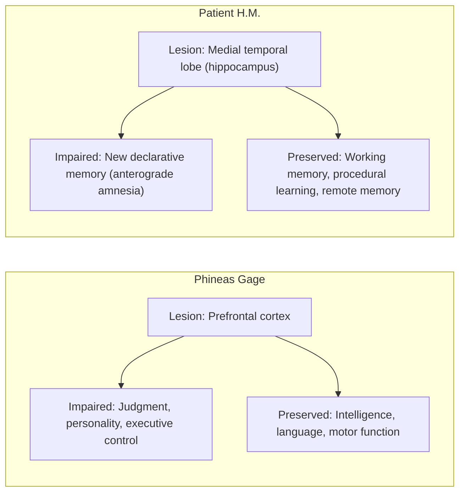

## Landmark Case Studies including Phineas Gage and HM

### Overview

Single-case studies played an outsized role in founding cognitive neuroscience because they provided rare, naturally occurring "lesion experiments" in humans, linking damage to specific brain structures with specific, measurable changes in behavior or cognition. Two cases in particular — Phineas Gage and patient H.M. — are foundational to the field's understanding of the frontal lobes and the medial temporal lobe memory system, respectively, and both illustrate the strengths and limitations of single-case methodology.

### Phineas Gage (1848)

**Key Points**

- Gage was a railroad construction foreman who survived an accident in which a tamping iron (approx. 1.1 m long, 6 kg) was driven through his skull by an explosive charge, entering below the left cheekbone and exiting through the top of the frontal skull, destroying much of his left frontal lobe
- He remained conscious and was reportedly able to speak and walk shortly after the injury; there was no significant loss of basic motor, sensory, memory, or language function
- Attending physician **John Martyn Harlow** documented the case, noting a marked change in **personality and social/executive behavior** post-injury: previously described as reliable, hardworking, and well-balanced, Gage reportedly became impulsive, irreverent, profane, and unable to follow through on plans, in a way friends described as "no longer Gage"
- The case was historically significant because it dissociated **basic sensorimotor and intellectual function** (preserved) from **personality, judgment, and social-emotional regulation** (impaired), providing early evidence that frontal lobe damage could selectively affect executive and emotional control without impairing general intelligence or language

**[Unverified]** The specific behavioral details of Gage's post-injury personality change come primarily from Harlow's own clinical descriptions, written years after the accident, and from secondary retellings; the historical record is comparatively thin, and some widely repeated claims about the severity and permanence of his personality change have been challenged by later historical scholarship (e.g., evidence suggesting partial recovery and successful employment as a stagecoach driver in Chile years later). Modern reconstructions of the case should be treated with appropriate caution regarding embellishment across a century and a half of retelling.

- Modern neuroimaging reconstructions (notably by **Hanna Damasio and colleagues, 1994**) used skull measurements and CT data to estimate the trajectory of the injury, concluding it likely damaged both left and right prefrontal cortex, particularly ventromedial regions — informing later theoretical work (e.g., Antonio Damasio's **somatic marker hypothesis**) linking ventromedial prefrontal cortex to emotion-guided decision-making

### Patient H.M. — Henry Molaison (1953 onward)

**Key Points**

- H.M. (identified posthumously as Henry Molaison) underwent bilateral **medial temporal lobectomy**, including the hippocampus, amygdala, and surrounding cortex, performed by **William Scoville** in 1953 as an experimental treatment for severe, intractable epilepsy
- The surgery successfully reduced seizure frequency but produced severe, permanent **anterograde amnesia**: H.M. was profoundly unable to form new long-term declarative (explicit) memories from that point forward, unable to recall day-to-day events, new facts, or people met after the surgery
- Critically, H.M. retained:
  - **Short-term/working memory** (could hold information in mind briefly, e.g., for ordinary conversation, as long as not distracted)
  - **Procedural memory** (could learn and retain new motor skills, e.g., mirror-tracing tasks, improving with practice despite no explicit memory of having practiced)
  - **General intelligence, language, and pre-surgical (remote) memories**, though with some retrograde amnesia for the years immediately preceding surgery
- Studied extensively over decades, primarily by **Brenda Milner** (beginning 1955) and later **Suzanne Corkin**, H.M.'s case became the single most influential source of evidence for:
  - The **hippocampus and medial temporal lobe as necessary for the encoding/consolidation of new declarative memories**, but not for their long-term storage or retrieval once consolidated
  - The **dissociation between declarative (explicit) and procedural (implicit) memory systems**, since these were shown to depend on largely separable neural substrates
  - Foundational support for **systems consolidation theory**, in which memories become progressively independent of the hippocampus as they are consolidated into distributed neocortical storage over time

This single case is widely regarded as having done more to shape the modern neuroscience of memory than any other individual study, largely because of the unusual combination of a well-characterized, bilateral, relatively circumscribed lesion with decades of careful longitudinal testing.

### Comparative Analysis: Gage vs. H.M.

| Dimension | Phineas Gage | Patient H.M. |
| --- | --- | --- |
| Lesion location | Left (and likely bilateral) prefrontal cortex | Bilateral medial temporal lobe (hippocampus, amygdala, surrounding cortex) |
| Cause | Traumatic accident | Planned bilateral surgical resection |
| Primary deficit | Personality change, impaired judgment/executive control | Anterograde amnesia (declarative memory) |
| Preserved functions | Intelligence, language, motor/sensory function | Working memory, procedural learning, intelligence, language |
| Documentation quality | Sparse, retrospective, partly reconstructed | Extensive, longitudinal, systematically tested |
| Theoretical impact | Frontal lobe role in emotion/executive function; somatic marker hypothesis | Hippocampal role in memory consolidation; declarative/procedural dissociation |

### Methodological Significance and Limitations

**Key Points**

- Both cases exemplify the **single-case study (n = 1) method**, historically essential in neuropsychology because naturally occurring, well-localized lesions in humans are rare and cannot be ethically induced experimentally
- **Strengths**: Provides direct evidence in the human brain (unlike animal ablation studies), can reveal highly specific dissociations not otherwise observable, and can generate hypotheses later tested more systematically
- **Limitations**:
  - Lesions from injury or disease are rarely perfectly circumscribed, complicating precise structure-function attribution (a persistent issue in the Gage case specifically)
  - Findings from a single individual may not generalize, given individual variability in brain organization and pre-existing cognitive/personality traits
  - Retrospective or long-delayed documentation (as with Gage) is vulnerable to embellishment, memory distortion, and reconstruction bias
  - Ethical and consent considerations differ substantially between an accidental injury (Gage) and a planned surgical intervention undertaken with contemporary medical consent standards (H.M., though standards of informed consent in 1953 were far less rigorous than today)

**[Inference]** The contrast between the relatively weak evidentiary basis of the Gage case and the much stronger, systematically documented H.M. case is often used pedagogically to illustrate how single-case methodology improved in rigor over the following century, though this is a historiographic interpretation rather than an explicit claim made in either original source.

### Other Landmark Cases (Brief Reference)

**Key Points**

- **Patient "Tan" (Leborgne)** — Broca's 1861 case establishing left frontal involvement in speech production (see Broca's area)
- **Clive Wearing** — Case of severe amnesia (both anterograde and retrograde) following herpes simplex encephalitis damaging the hippocampus and surrounding structures, notable for near-total loss of autobiographical memory alongside preserved procedural musical skill, offering convergent evidence with H.M.'s dissociations under a different etiology
- **"K.F." (Shallice and Warrington, 1970)** — A case of impaired short-term/working memory with relatively preserved long-term memory, providing a double dissociation with H.M.'s pattern and contributing to multi-component models of working memory

### Illustrative Diagram: Structure-Function Dissociation

### Lesion Site Diagram

<svg xmlns="http://www.w3.org/2000/svg" viewBox="0 0 900 360" font-family="Helvetica, Arial, sans-serif">
<text x="450" y="26" text-anchor="middle" font-size="17" font-weight="bold" fill="#1a1a1a">Approximate Lesion Sites (svg_diagram)</text>

<text x="220" y="55" text-anchor="middle" font-size="13" font-weight="bold">Phineas Gage</text>

<path d="M110,90 C110,160 150,220 220,220 C290,220 330,160 330,90 C330,50 290,20 220,20 C150,20 110,50 110,90 Z" fill="`#f9f9f9`" stroke="#666" stroke-width="1.5" />

<ellipse cx="175" cy="90" rx="45" ry="35" fill="`#f4a3a3`" stroke="#a33" stroke-width="1.5" />

<text x="175" y="94" text-anchor="middle" font-size="10">Prefrontal</text>

<text x="220" y="250" text-anchor="middle" font-size="11" fill="#555">Ventromedial + left prefrontal cortex</text>

<text x="680" y="55" text-anchor="middle" font-size="13" font-weight="bold">Patient H.M.</text>

<path d="M570,90 C570,160 610,220 680,220 C750,220 790,160 790,90 C790,50 750,20 680,20 C610,20 570,50 570,90 Z" fill="`#f9f9f9`" stroke="#666" stroke-width="1.5" />

<ellipse cx="700" cy="140" rx="35" ry="20" fill="`#a3c9f4`" stroke="#357" stroke-width="1.5" />

<text x="700" y="144" text-anchor="middle" font-size="9">MTL</text>

<text x="680" y="250" text-anchor="middle" font-size="11" fill="#555">Bilateral hippocampus + medial temporal lobe</text>

</svg>

**Related Topics**

- Somatic marker hypothesis (Antonio Damasio)
- Declarative vs. procedural memory systems
- Systems consolidation theory of memory
- Brenda Milner's neuropsychological methods
- Double dissociation methodology
- Prefrontal cortex and executive function
- Working memory models (Baddeley and Hitch)