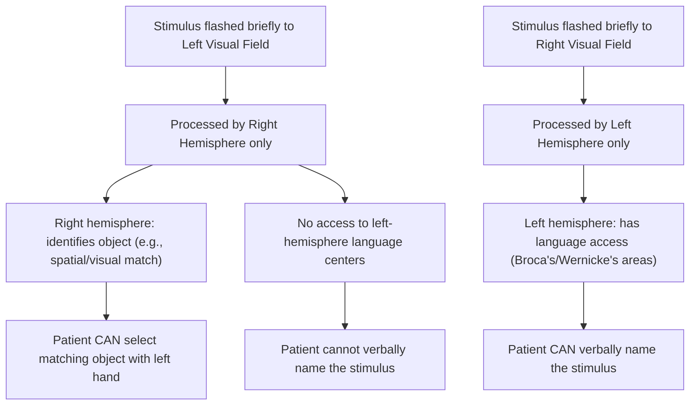

## Hemispheric Lateralization and Split-Brain Research

### Overview

Hemispheric lateralization refers to the tendency of the two cerebral hemispheres to specialize for different cognitive functions despite their broadly similar anatomy. Split-brain research — studying patients whose corpus callosum has been surgically severed — provided the most direct experimental evidence for lateralization by allowing each hemisphere to be tested in relative isolation, fundamentally shaping the modern understanding of hemispheric specialization and interhemispheric communication.

### Neuroanatomical Basis

**Key Points**

- The cerebral cortex is divided into two hemispheres connected primarily by the **corpus callosum**, the largest white-matter commissure in the brain (approx. 200–300 million axons), along with smaller commissures (anterior commissure, hippocampal commissure)
- Each hemisphere receives predominantly **contralateral sensory input and controls contralateral motor output**: the left visual field projects to the right visual cortex (and vice versa), the left hand is controlled by the right motor cortex (and vice versa)
- Under normal (non-split) conditions, the corpus callosum continuously integrates information across hemispheres, so lateralized processing differences are not behaviorally obvious in intact individuals except under specialized experimental conditions (e.g., divided visual field tasks, dichotic listening)

### The Split-Brain Procedure

**Key Points**

- **Corpus callosotomy**: Surgical transection of the corpus callosum (sometimes with additional commissures), historically performed as a treatment for severe, medically intractable epilepsy to prevent seizure activity from spreading between hemispheres
- First performed with modern technique and systematic follow-up by neurosurgeons **Philip Vogel and Joseph Bogen** in the 1960s, building on earlier, less complete procedures from the 1940s
- Patients undergoing the full procedure are referred to as "split-brain" patients; in daily life, they typically show few obvious behavioral abnormalities because the two hemispheres largely receive similar bilateral sensory input under natural viewing conditions and can coordinate via subcortical structures and behavioral cues

### Sperry and Gazzaniga's Experimental Paradigm

**Key Points**

- **Roger Sperry** (with collaborators including **Michael Gazzaniga**) developed lateralized testing methods exploiting the contralateral organization of the visual system to present information to only one hemisphere at a time
- **Divided visual field technique**: A stimulus is flashed briefly (typically <150 ms, too fast for an eye movement to shift it to the other visual field) to either the left or right visual field while the patient fixates centrally; information from the left visual field reaches only the right hemisphere, and vice versa, because the severed corpus callosum can no longer relay it to the other side
- Patients could also be tested using **tactile stimuli** presented to one hand out of view, since somatosensory information from each hand likewise projects predominantly to the contralateral hemisphere
- Sperry received the **1981 Nobel Prize in Physiology or Medicine** for this body of work on the functional specialization of the cerebral hemispheres

### Key Findings

**Key Points**

- **Language lateralization**: In the majority of individuals (particularly right-handed individuals), the **left hemisphere is dominant for language production and, to a large extent, comprehension**. When words were flashed to the left visual field (right hemisphere), split-brain patients typically could not verbally name the stimulus, because the right hemisphere lacked access to the left hemisphere's language production systems and could not transmit the information across the severed callosum.
- **Right hemisphere competencies**: Despite lacking robust expressive language, the right hemisphere showed capacities for **spatial processing, facial recognition, and some degree of language comprehension** — patients could often select a corresponding object with the left hand (controlled by the right hemisphere) even when unable to name what they had seen, demonstrating that the right hemisphere had processed the stimulus without being able to report on it verbally
- **The "interpreter" phenomenon**: Gazzaniga proposed that the left hemisphere contains a specialized system (the **left-hemisphere interpreter**) that constructs post-hoc narrative explanations for behaviors, including those initiated by the right hemisphere, even when the left hemisphere has no actual access to the true cause — demonstrated in experiments where the right hemisphere was cued to prompt an action (e.g., via a instruction visible only to the left visual field) and the (unaware) left hemisphere would confabulate a plausible but incorrect verbal justification for it
- **Independent, sometimes conflicting, hemispheric processing**: In some split-brain patients, each hand (each hemisphere) could be induced to pursue different, sometimes contradictory goals in a task simultaneously — offering striking behavioral evidence that each disconnected hemisphere can operate with a degree of independent awareness and decision-making capacity

**[Inference]** The degree to which split-brain findings imply two separate "streams of consciousness" within one skull remains a subject of philosophical and empirical debate; Sperry and Gazzaniga's own interpretations evolved over time, and more recent work (e.g., Pinto et al., 2017) has questioned how completely perceptual integration breaks down after callosotomy, suggesting some residual subcortical integration. This is an area of active, unresolved research rather than settled consensus.

### General Principles of Lateralization (Beyond Split-Brain Studies)

**Key Points**

- Lateralization is not absolute — most cognitive functions involve both hemispheres to some degree, with **relative** rather than **exclusive** specialization
- **Left hemisphere** (in most right-handed individuals): language production/comprehension (Broca's/Wernicke's areas), sequential/analytic processing, fine motor control of the dominant hand
- **Right hemisphere**: visuospatial processing, facial recognition, prosody (emotional tone of speech), holistic/gestalt processing, sustained attention
- **Handedness correlation**: Approximately 95–99% of right-handed individuals and roughly 70% of left-handed individuals show left-hemisphere language dominance; the relationship between handedness and lateralization is statistical, not deterministic
- Evidence for lateralization in the intact brain comes from multiple convergent methods beyond split-brain studies: the **Wada test** (temporary anesthetization of one hemisphere via carotid artery injection to assess language dominance pre-surgically), **dichotic listening tasks**, **lesion studies**, and modern **fMRI lateralization indices**

### Methodological and Interpretive Cautions

**Key Points**

- Split-brain findings derive from a small, clinically atypical population (patients with long-standing, severe epilepsy, often with additional pre-existing neurological abnormalities), so generalization to typical brain organization requires caution
- Popular science writing has often overstated and oversimplified lateralization findings (e.g., "left-brained vs. right-brained" personality typologies), which are **not supported** by the empirical lateralization literature; virtually all complex cognitive tasks engage both hemispheres working in a coordinated, complementary manner
- **[Unverified]** The precise boundary conditions under which split-brain patients experience genuinely independent hemispheric awareness, versus effective behavioral integration via alternate pathways (eye movements, cross-cuing, subcortical commissures), continue to be refined by ongoing research and should not be treated as fully resolved

### Diagram: Divided Visual Field Testing Paradigm

### Diagram: Hemispheric Pathways in the Intact vs. Split Brain

<svg xmlns="http://www.w3.org/2000/svg" viewBox="0 0 900 380" font-family="Helvetica, Arial, sans-serif">
<text x="450" y="26" text-anchor="middle" font-size="17" font-weight="bold" fill="#1a1a1a">Intact vs. Split Corpus Callosum (svg_diagram)</text>

<text x="220" y="55" text-anchor="middle" font-size="13" font-weight="bold">Intact Brain</text>

<circle cx="150" cy="180" r="80" fill="`#d9e8f4`" stroke="#357" stroke-width="1.5" />

<text x="150" y="184" text-anchor="middle" font-size="11">Left Hemisphere</text>

<circle cx="330" cy="180" r="80" fill="`#f4d9d9`" stroke="#a33" stroke-width="1.5" />

<text x="330" y="184" text-anchor="middle" font-size="11">Right Hemisphere</text>

<rect x="220" y="160" width="40" height="40" fill="`#e8e8a3`" stroke="#996" stroke-width="2" />

<text x="240" y="220" text-anchor="middle" font-size="9">Corpus Callosum (intact)</text>

<line x1="230" y1="180" x2="250" y2="180" stroke="#333" stroke-width="2" marker-end="url(#arrow2)" />

<line x1="250" y1="190" x2="230" y2="190" stroke="#333" stroke-width="2" marker-end="url(#arrow2)" />

<text x="680" y="55" text-anchor="middle" font-size="13" font-weight="bold">Split Brain (Callosotomy)</text>

<circle cx="610" cy="180" r="80" fill="`#d9e8f4`" stroke="#357" stroke-width="1.5" />

<text x="610" y="184" text-anchor="middle" font-size="11">Left Hemisphere</text>

<circle cx="790" cy="180" r="80" fill="`#f4d9d9`" stroke="#a33" stroke-width="1.5" />

<text x="790" y="184" text-anchor="middle" font-size="11">Right Hemisphere</text>

<line x1="680" y1="140" x2="720" y2="220" stroke="`#cc0000`" stroke-width="4" />

<line x1="720" y1="140" x2="680" y2="220" stroke="`#cc0000`" stroke-width="4" />

<text x="700" y="255" text-anchor="middle" font-size="9" fill="#a00">Severed connection</text>

</svg>

### Example: Interpreting a Split-Brain Trial

Suppose the word "SPOON" is flashed to the left visual field of a split-brain patient:

1. Information reaches only the right hemisphere (via contralateral visual pathway)
2. Patient, when asked "What did you see?", says "Nothing" — because the left hemisphere (language-dominant) had no input
3. Patient, when asked to reach behind a screen with their **left hand** and select the object they saw, correctly picks up a spoon — because the right hemisphere controls the left hand and had processed the stimulus
4. If then asked why they picked the spoon, the patient's left hemisphere may confabulate an explanation (e.g., "I don't know, it just felt right") — illustrating the interpreter phenomenon

### Comparative Summary

| Function | Typically Left-Lateralized | Typically Right-Lateralized |
| --- | --- | --- |
| Language production | Yes (Broca's area) | Minimal |
| Language comprehension | Primary | Some basic comprehension |
| Spatial processing | Minimal | Yes |
| Facial recognition | Minimal | Yes |
| Prosody/emotional tone | Minimal | Yes |
| Analytic/sequential processing | Yes | Minimal |
| Holistic/gestalt processing | Minimal | Yes |

**Related Topics**

- Corpus callosum anatomy and interhemispheric communication
- The left-hemisphere interpreter (Gazzaniga)
- Wada test and pre-surgical language mapping
- Broca's and Wernicke's areas
- Handedness and language dominance
- Divided visual field and dichotic listening paradigms
- Confabulation and post-hoc reasoning in neuroscience