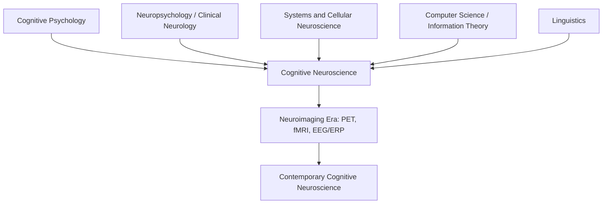

## Emergence of Cognitive Neuroscience as an Interdisciplinary Field

### Definition and Scope

Cognitive neuroscience is the scientific field concerned with the biological substrates underlying cognition, with a specific focus on the neural mechanisms of mental processes such as perception, attention, memory, language, decision-making, and consciousness. Its emergence as a distinct discipline represents the convergence of previously separate research traditions that each addressed the mind-brain problem from a partial vantage point.

The field is defined less by a single method than by its interdisciplinary integration: it draws data, theory, and technique from psychology, neuroscience, computer science, linguistics, and philosophy, and combines them using a shared computational framework of information processing implemented in neural tissue.

### Precursor Disciplines

**Cognitive Psychology**

Cognitive psychology emerged in the 1950s-1960s as a reaction against behaviorism, which had dominated American psychology for decades and treated the mind as a "black box" unsuitable for scientific study. Cognitive psychologists argued that internal mental representations and processes could be studied rigorously through behavioral experimentation (reaction times, error patterns, accuracy under load) without needing to reference underlying neural implementation. Key figures include George Miller, whose 1956 paper on the capacity limits of short-term memory ("The Magical Number Seven, Plus or Minus Two") is often cited as a founding document, and Ulric Neisser, whose 1967 textbook *Cognitive Psychology* gave the field its name and coherence.

**Neuropsychology and Clinical Neurology**

A parallel tradition studied brain-behavior relationships through the effects of brain damage. Nineteenth-century work by Paul Broca (1861) and Carl Wernicke (1874) established that damage to specific cortical regions produced dissociable language deficits, providing early evidence for functional localization. This tradition continued through the twentieth century with figures such as Alexander Luria, whose case-based method examined how focal lesions disrupted specific cognitive functions while sparing others, and later Brenda Milner, whose studies of patient H.M. (a patient with bilateral medial temporal lobe resection) established the role of the hippocampus in forming new long-term declarative memories while leaving procedural learning intact.

**Systems and Cellular Neuroscience**

Basic neuroscience contributed an increasingly detailed understanding of neuronal signaling, cortical architecture, and sensory-motor systems. Work by David Hubel and Torsten Wiesel on receptive fields in the visual cortex of cats (1959 onward) demonstrated that single neurons could be characterized by their selective responses to specific stimulus features, offering a template for linking neural activity directly to a well-defined computational function.

**Computer Science and Cybernetics**

The development of information theory (Claude Shannon, 1948) and early computing provided cognitive science with a formal vocabulary: mental operations could be described as processes that receive, transform, store, and output information, analogous to a computer processing data. This computational metaphor allowed psychologists to build formal, testable models of processes like memory encoding or decision-making without committing prematurely to a specific neural mechanism. The 1956 Dartmouth Summer Research Project on Artificial Intelligence and contemporaneous work by Allen Newell and Herbert Simon on symbolic problem-solving systems reinforced the idea that cognition could be studied as computation.

**Linguistics**

Noam Chomsky's critique of B.F. Skinner's behaviorist account of language (1959) was a pivotal event in what is now called the "cognitive revolution." Chomsky argued that the rapid, rule-governed acquisition of language by children could not be explained by simple stimulus-response conditioning, and instead required innate, structured cognitive mechanisms. This argument helped delegitimize strict behaviorism across the human sciences and reinforced the need for a mentalistic, internally-structured theory of cognition.

### The Cognitive Revolution as Catalyst

The **cognitive revolution** of the 1950s-1960s is the historical label for the shift away from behaviorism toward the study of internal mental representations and processes. It was not caused by a single event but by convergent dissatisfaction with behaviorism's explanatory limits across psychology, linguistics, and the emerging computer sciences.

- **[Inference]** Historians of science generally treat the 1956 Symposium on Information Theory at MIT as a symbolic turning point, since it featured presentations by Miller, Chomsky, and Newell and Simon within a single event, though characterizing it as a discrete "revolution" moment (rather than a longer gradual shift) remains a matter of interpretation.
- The cognitive revolution supplied the theoretical object of study (internal information-processing mechanisms) that cognitive neuroscience would later ground in neural tissue.

### Formal Naming and Institutional Founding

The term "cognitive neuroscience" is widely credited to **Michael Gazzaniga** and **George Miller**, reportedly coined during a conversation in a New York taxicab in the late 1970s while discussing how to describe research that combined cognitive psychology's rigor with neuroscience's biological grounding. The term was intended to name an approach that neither pure cognitive psychology (which bracketed neural implementation) nor pure neuroscience (which often lacked a sophisticated cognitive-functional framework) fully captured on its own.

Institutionally, the field consolidated through:

- The founding of the **Cognitive Neuroscience Society (CNS)** in 1994, providing a dedicated scholarly home distinct from the Society for Neuroscience and the Psychonomic Society.
- The launch of the *Journal of Cognitive Neuroscience* in 1989, edited by Gazzaniga, as the first dedicated publication venue.
- The publication of *Cognitive Neuroscience: The Biology of the Mind* by Gazzaniga, Richard Ivry, and George Mangun (first edition 1998), which became a standard textbook and helped define the field's canonical scope and pedagogy.

### Split-Brain Research as a Bridging Case

Gazzaniga's own research trajectory illustrates the interdisciplinary synthesis directly. Working with Roger Sperry in the 1960s, Gazzaniga studied "split-brain" patients whose corpus callosum had been surgically severed to treat epilepsy. By presenting stimuli to a single visual hemifield (and therefore a single cerebral hemisphere), the researchers showed that the two hemispheres could process information and even generate behavior independently, with the left hemisphere's language systems sometimes confabulating explanations for actions initiated by the non-verbal right hemisphere.

This work is a paradigm case of cognitive neuroscience methodology: it used a precise anatomical/surgical fact (a severed corpus callosum), a cognitive-experimental paradigm (lateralized stimulus presentation and behavioral report), and yielded a conclusion about a high-level cognitive architecture (hemispheric specialization and the notion of an "interpreter" mechanism), integrating levels of analysis that earlier disciplines had studied separately.

### The Technological Catalyst: Neuroimaging

Interdisciplinary integration accelerated sharply with the availability of methods that could measure brain activity in healthy, awake humans performing cognitive tasks, removing the field's historical dependence on rare lesion patients.

- **Positron Emission Tomography (PET)**, developed in the 1970s and applied to cognitive tasks through the 1980s, measured regional cerebral blood flow as a proxy for neural activity, enabling studies such as Petersen et al.'s (1988) work localizing stages of single-word processing.
- **Functional Magnetic Resonance Imaging (fMRI)**, developed in the early 1990s and based on the blood-oxygen-level-dependent (BOLD) signal (Ogawa et al., 1990), offered superior spatial resolution and no ionizing radiation, rapidly becoming the dominant tool in human cognitive neuroscience research from the mid-1990s onward.
- **Electroencephalography (EEG)** and its **Event-Related Potential (ERP)** derivative provided millisecond-scale temporal resolution, complementing the coarser temporal resolution of hemodynamic methods and allowing researchers to track the time course of cognitive operations such as early perceptual processing versus later semantic evaluation.

**[Inference]** The rapid adoption of fMRI in the 1990s is generally regarded by historians of the field as the single largest driver of the discipline's growth and public visibility, though this is a claim about relative causal weighting among several converging factors rather than a directly measurable fact.

### Interdisciplinary Structure: Levels of Analysis

A useful organizing framework, drawn from David Marr's (1982) tri-level hypothesis in computational vision, describes how cognitive neuroscience integrates contributions from its parent disciplines at distinct levels of explanation:

| Level | Question Addressed | Contributing Discipline |
| --- | --- | --- |
| Computational | What problem is being solved, and why? | Cognitive psychology, linguistics |
| Algorithmic/Representational | What representations and procedures solve it? | Cognitive psychology, computer science |
| Implementational | How is it physically realized in neural tissue? | Systems/cellular neuroscience, neuroimaging |

Cognitive neuroscience is distinguished from its parent fields precisely by its insistence on connecting all three levels for a given phenomenon, rather than operating exclusively at one.

### Diagram: Convergence Timeline (svg_diagram)

<svg xmlns="http://www.w3.org/2000/svg" viewBox="0 0 900 320">
<text x="450" y="25" text-anchor="middle" font-size="16" font-weight="bold" fill="#1a1a1a">Convergence Timeline of Cognitive Neuroscience (svg_diagram)</text>
<line x1="60" y1="160" x2="860" y2="160" stroke="#333" stroke-width="2" />
<line x1="100" y1="150" x2="100" y2="170" stroke="#333" stroke-width="2" />
<text x="100" y="190" text-anchor="middle" font-size="11">1861</text>
<text x="100" y="205" text-anchor="middle" font-size="10">Broca's Area</text>
<line x1="220" y1="150" x2="220" y2="170" stroke="#333" stroke-width="2" />
<text x="220" y="190" text-anchor="middle" font-size="11">1956</text>
<text x="220" y="205" text-anchor="middle" font-size="10">Miller / Dartmouth AI</text>
<line x1="330" y1="150" x2="330" y2="170" stroke="#333" stroke-width="2" />
<text x="330" y="190" text-anchor="middle" font-size="11">1959</text>
<text x="330" y="205" text-anchor="middle" font-size="10">Chomsky Critiques Skinner</text>
<line x1="440" y1="150" x2="440" y2="170" stroke="#333" stroke-width="2" />
<text x="440" y="190" text-anchor="middle" font-size="11">1960s</text>
<text x="440" y="205" text-anchor="middle" font-size="10">Split-Brain Studies</text>
<line x1="560" y1="150" x2="560" y2="170" stroke="#333" stroke-width="2" />
<text x="560" y="190" text-anchor="middle" font-size="11">Late 1970s</text>
<text x="560" y="205" text-anchor="middle" font-size="10">Term Coined (Gazzaniga/Miller)</text>
<line x1="680" y1="150" x2="680" y2="170" stroke="#333" stroke-width="2" />
<text x="680" y="190" text-anchor="middle" font-size="11">1989-1994</text>
<text x="680" y="205" text-anchor="middle" font-size="10">Journal + CNS Founded</text>
<line x1="800" y1="150" x2="800" y2="170" stroke="#333" stroke-width="2" />
<text x="800" y="190" text-anchor="middle" font-size="11">1990s</text>
<text x="800" y="205" text-anchor="middle" font-size="10">fMRI Adoption</text>
<circle cx="100" cy="160" r="5" fill="#2b6cb0" />
<circle cx="220" cy="160" r="5" fill="#2b6cb0" />
<circle cx="330" cy="160" r="5" fill="#2b6cb0" />
<circle cx="440" cy="160" r="5" fill="#2b6cb0" />
<circle cx="560" cy="160" r="5" fill="#c0392b" />
<circle cx="680" cy="160" r="5" fill="#c0392b" />
<circle cx="800" cy="160" r="5" fill="#c0392b" />

<text x="450" y="260" text-anchor="middle" font-size="11" fill="#555">Blue: precursor discipline milestones. Red: field-founding and consolidation milestones.</text>

</svg>

### Methodological Contrast with Predecessor Fields

**Key Points**

- Behaviorism restricted scientific inquiry to observable stimulus-response relationships and explicitly avoided reference to internal mental states.
- Cognitive psychology reintroduced internal representations and processes but treated the brain largely as an unspecified implementation substrate ("functionalism"), studying the mind independent of neural detail.
- Classical clinical neuropsychology inferred cognitive organization from naturally occurring lesions, but was constrained by small samples, variable lesion locations, and an inability to observe healthy on-line processing.
- Cognitive neuroscience uniquely combines a cognitive-computational task analysis with direct, often non-invasive, measurement of neural activity in healthy participants performing controlled experimental tasks, closing the gap between behavioral inference and biological mechanism.

### Contemporary Interdisciplinary Extensions

The field continues to expand its disciplinary integration:

- **Computational neuroscience** contributes formal, mathematically specified models (e.g., drift-diffusion models of decision-making, predictive coding frameworks) that generate quantitative, falsifiable predictions about neural dynamics.
- **Genetics and molecular biology** contribute methods such as optogenetics and genetically defined cell-type targeting, primarily in animal models, to establish causal roles for specific circuits in cognition.
- **Developmental science** examines how cognitive-neural mappings change across the lifespan, giving rise to developmental cognitive neuroscience as a recognized subfield.
- **Social and affective neuroscience** extend the field's scope beyond classical "cold" cognition (memory, attention, language) to social cognition, emotion regulation, and decision-making under affective influence.
- **Machine learning**, particularly deep neural network models, is increasingly used both as a source of computational hypotheses about neural coding and as an analysis tool for large-scale neuroimaging datasets.

**[Inference]** The degree to which deep learning models are treated as genuine mechanistic hypotheses about brain function, versus merely useful predictive tools, remains an actively debated methodological question within the field rather than a settled consensus.

### Example: A Prototypical Cognitive Neuroscience Study Design

**Example**

A study on working memory might proceed as follows, illustrating the interdisciplinary logic directly:

1. **Cognitive/behavioral level:** Define a task (e.g., an n-back task) grounded in cognitive-psychological theory of working memory capacity limits.
2. **Neuroimaging level:** Record fMRI or EEG while participants perform the task, to identify which brain regions or temporal components show load-dependent activity.
3. **Lesion/causal level:** Corroborate correlational imaging findings with data from patients with damage to the implicated regions (e.g., dorsolateral prefrontal cortex), or with causal manipulation via transcranial magnetic stimulation (TMS) in healthy participants.
4. **Computational level:** Model the observed neural dynamics with a formal account (e.g., attractor network models of sustained delay-period activity) to generate further testable predictions.

This multi-level design—impossible within any single parent discipline alone—is characteristic of mature cognitive neuroscience research.

### Conclusion

Cognitive neuroscience emerged not from a single discovery but from the historical convergence of cognitive psychology's rigorous behavioral methodology, neuropsychology's lesion-based localization evidence, systems neuroscience's cellular-level mechanistic detail, computer science's formal information-processing vocabulary, and linguistics' arguments for structured innate cognitive systems. The cognitive revolution of the 1950s-60s supplied the shared theoretical object (internal mental representations), while the development of non-invasive neuroimaging in the 1980s-90s supplied the empirical means to study that object's neural implementation directly in healthy humans. Its formal institutional identity, established through named terminology, dedicated journals, and a professional society in the late twentieth century, reflects a genuine synthesis rather than a mere relabeling of an existing field.

**Related Topics**

- Localizationism vs. holism in nineteenth-century brain science
- The Chomsky-Skinner debate and its role in the cognitive revolution
- Marr's tri-level hypothesis and levels of explanation in cognitive science
- History and physical principles of fMRI (BOLD signal)
- Split-brain research and hemispheric specialization
- Patient H.M. and the neuropsychology of memory systems
- Computational neuroscience and formal modeling approaches
- Development of EEG/ERP methodology and cognitive time-course research