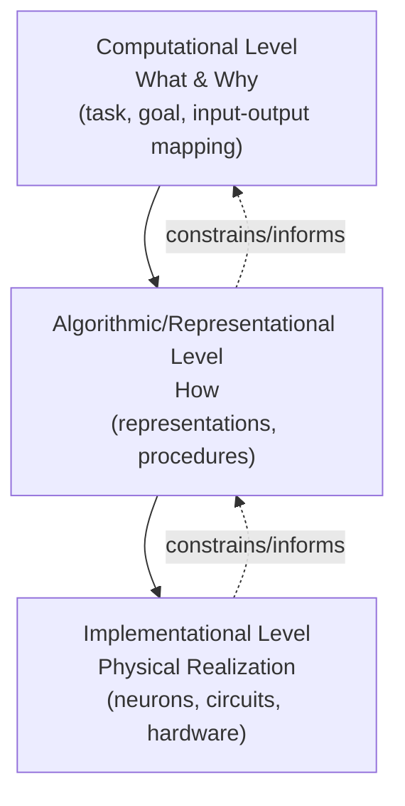

## Marr's Levels of Analysis

### Overview

David Marr, a British neuroscientist working at MIT in the late 1970s, proposed a tri-level framework for understanding any information-processing system, whether biological or artificial. His 1982 posthumously published book *Vision: A Computational Investigation into the Human Representation and Processing of Visual Information* laid out the argument that a complete explanation of a system like the brain requires answers at three distinct, mutually irreducible levels of description. This framework remains one of the most cited conceptual tools in cognitive science and cognitive neuroscience for organizing research questions and reconciling apparently conflicting explanations of the same phenomenon.

### The Core Problem Marr Addressed

Marr observed that early approaches to understanding vision and neural computation focused almost exclusively on the physiological substrate: recording single neurons, mapping receptive fields, and cataloguing anatomical connections. He argued this was insufficient. Understanding a hardware implementation alone does not reveal *what* the system computes or *why*. His famous analogy was that trying to understand vision solely by studying neurons is like trying to understand flight solely by studying feathers.

### The Three Levels

#### 1. Computational Level

**Key Points**

- Specifies the *goal* of the computation: what problem is being solved and why
- Defines the input-output mapping in abstract terms, independent of mechanism
- Asks: What is being computed, and what is this computation good for in the organism's ecology?
- Concerned with the logic of the task, not the algorithm or hardware

**Example**

For stereopsis (depth perception from binocular disparity), the computational-level question is: given two slightly different 2D retinal images, how can the visual system recover the 3D structure of a scene? The goal is to solve the "correspondence problem" — matching points in the left and right retinal images that arise from the same physical point in space.

#### 2. Algorithmic/Representational Level

**Key Points**

- Specifies *how* the computation is carried out
- Defines the representation used for inputs and outputs (e.g., arrays, symbolic lists, vectors)
- Defines the specific algorithm/procedure that transforms input representations into output representations
- Multiple algorithms can implement the same computational-level goal

**Example**

For stereopsis, an algorithmic-level answer might specify that the visual system represents each retinal image as a 2D array of edge/zero-crossing features, then applies a constraint-satisfaction algorithm (e.g., uniqueness and continuity constraints, as in Marr and Poggio's 1976 cooperative algorithm) to solve correspondence and output a disparity map.

#### 3. Implementational/Physical Level

**Key Points**

- Specifies how the representations and algorithm are physically realized
- In biological systems, this means specific neurons, circuits, neurotransmitters, and biophysical mechanisms
- In artificial systems, this means silicon transistors, specific code, or hardware architecture
- The same algorithm can, in principle, be implemented in different physical substrates

**Example**

For stereopsis, the implementational level describes how disparity-tuned neurons in primary visual cortex (V1), with receptive fields offset between the two eyes, physically compute local disparity signals via patterns of synaptic input and spiking activity.

### Summary Table

| Level | Question Answered | Key Terms | Example Content |
| --- | --- | --- | --- |
| Computational | What is computed, and why? | Goal, task, input-output mapping | Recovering depth from disparity |
| Algorithmic | How is it computed? | Representation, procedure, steps | Zero-crossing matching, constraint satisfaction |
| Implementational | How is it physically realized? | Neurons, circuits, hardware | Disparity-tuned V1 neurons |

### Relationships Between the Levels

**Key Points**

- The levels are logically independent but empirically constraining on one another
- A given computational goal underdetermines the algorithm (many algorithms can compute the same function)
- A given algorithm underdetermines the implementation (many physical systems can run the same algorithm)
- Marr argued the computational level has explanatory *primacy* — understanding what a system is for often constrains and guides investigation at the lower levels
- In practice, evidence flows in both directions: algorithmic and implementational data (e.g., neural recordings, reaction times) can also revise hypotheses about the computational-level goal

### Illustrative Diagram

<svg xmlns="http://www.w3.org/2000/svg" viewBox="0 0 720 460">
<text x="360" y="30" text-anchor="middle" font-size="18" font-weight="bold" fill="#1a1a2e">Marr's Three Levels of Analysis (svg_diagram)</text>
<rect x="80" y="60" width="560" height="100" rx="10" fill="#e8f0fe" stroke="#3b5bdb" stroke-width="2" />
<text x="360" y="90" text-anchor="middle" font-size="16" font-weight="bold" fill="#1a1a2e">Computational Level</text>
<text x="360" y="115" text-anchor="middle" font-size="13" fill="#333">What is computed, and why?</text>
<text x="360" y="135" text-anchor="middle" font-size="12" fill="#555">e.g., "Recover 3D depth from two 2D retinal images"</text>
<line x1="360" y1="160" x2="360" y2="190" stroke="#333" stroke-width="2" marker-end="url(#arrow)" />
<rect x="80" y="190" width="560" height="100" rx="10" fill="#e6fcf5" stroke="#0ca678" stroke-width="2" />
<text x="360" y="220" text-anchor="middle" font-size="16" font-weight="bold" fill="#1a1a2e">Algorithmic / Representational Level</text>
<text x="360" y="245" text-anchor="middle" font-size="13" fill="#333">How is it computed? What representations are used?</text>
<text x="360" y="265" text-anchor="middle" font-size="12" fill="#555">e.g., edge-map representation + constraint-satisfaction matching</text>
<line x1="360" y1="290" x2="360" y2="320" stroke="#333" stroke-width="2" marker-end="url(#arrow)" />
<rect x="80" y="320" width="560" height="100" rx="10" fill="#fff4e6" stroke="#e8590c" stroke-width="2" />
<text x="360" y="350" text-anchor="middle" font-size="16" font-weight="bold" fill="#1a1a2e">Implementational / Physical Level</text>
<text x="360" y="375" text-anchor="middle" font-size="13" fill="#333">How is it physically realized?</text>
<text x="360" y="395" text-anchor="middle" font-size="12" fill="#555">e.g., disparity-tuned neurons in primary visual cortex (V1)</text>
<path d="M 660 100 C 700 220 700 220 660 340" fill="none" stroke="#888" stroke-width="1.5" stroke-dasharray="4,3" marker-end="url(#arrow2)" />
<text x="705" y="220" font-size="11" fill="#666" transform="rotate(90 705 220)">mutual constraint</text>
</svg>

### Applications Beyond Vision

**Key Points**

- Marr originally developed the framework for visual processing but explicitly intended it as general to any information-processing system
- Widely applied in cognitive neuroscience to memory, language, motor control, and decision-making research
- Used in computational psychiatry to separate "what a symptom represents functionally" from "what algorithm is disrupted" from "what circuit/neurotransmitter system is implicated"
- Applied in comparative cognition to ask whether different species solve the same computational problem via different algorithms or implementations

**Example**

In studying working memory, a computational-level account asks why the system maintains a limited amount of information over short delays (e.g., to support flexible, goal-directed behavior). An algorithmic-level account might posit an attractor-network representation with population-vector coding. An implementational account would specify persistent delay-period firing in dorsolateral prefrontal cortex maintained via recurrent excitatory connections and NMDA-receptor-dependent dynamics.

### Common Critiques and Limitations

**Key Points**

- [Inference] Some researchers argue the strict separation between levels is too clean for biological systems, where implementational details (e.g., neural noise, metabolic constraints) can shape the algorithm rather than merely realizing it — this is sometimes called "backward" influence from lower to higher levels
- Critics note that many neural computations do not have a clean, task-independent "goal" the way idealized vision problems do, making the computational level harder to specify for phenomena like emotion or social cognition
- The framework was developed in an era before deep learning; [Inference] applying it directly to modern artificial neural networks is debated, since learned representations often blur the algorithmic/implementational distinction
- Some cognitive neuroscientists (e.g., Kay Poggio, Tomaso Poggio, and later machine learning-influenced researchers) have proposed a fourth "learning level," describing how the algorithm itself is acquired or optimized over development or training — this extension is not part of Marr's original 1982 formulation

### Why the Framework Matters for Cognitive Neuroscience

**Key Points**

- Provides a shared vocabulary for interdisciplinary collaboration between psychologists (often working at computational/algorithmic levels), computational modelers (algorithmic level), and neuroscientists (implementational level)
- Helps prevent a common error: assuming a neural finding (e.g., "neuron X fires during task Y") constitutes a full explanation without specifying the underlying computation
- Encourages researchers to ask whether apparently conflicting findings reflect genuine disagreement or simply operate at different levels
- Frequently invoked when evaluating whether a model (e.g., a deep neural network model of visual cortex) is a good scientific explanation versus merely a good predictive fit

**Next Steps**

**Related Topics**

- Computational neuroscience methods and modeling approaches
- Marr and Poggio's stereopsis algorithm (1976)
- The binding problem in visual perception
- Representational theories of mind
- Connectionism and parallel distributed processing
- Bayesian approaches to perception (as computational-level theories)
- Neural coding schemes (rate coding, population coding, temporal coding)
- The debate over levels of explanation in philosophy of neuroscience (e.g., mechanistic explanation, Craver's work)
- Comparative approaches: how different species solve the same computational problems