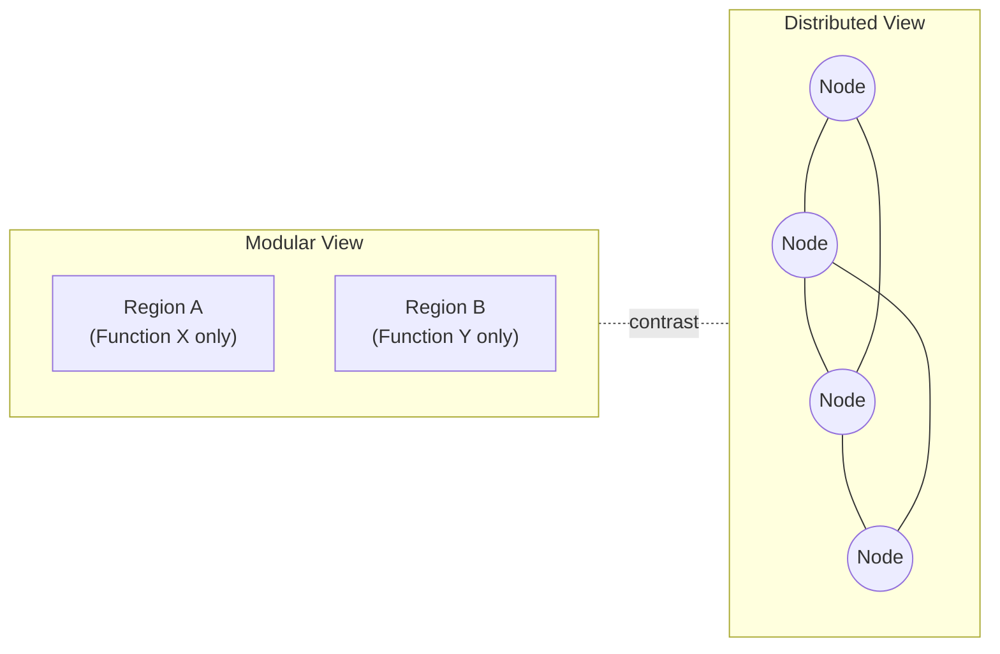

## Modularity versus Distributed Processing Theories

### Overview

A central theoretical divide in cognitive neuroscience concerns how mental functions are organized in the brain: whether cognitive processes are carried out by specialized, encapsulated neural modules dedicated to specific functions, or whether they emerge from distributed, interactive processing across widespread neural populations. This debate has shaped research methodology, interpretation of lesion and imaging data, and models of how the mind is built from neural tissue since the early days of the field.

### Historical Background

**Key Points**

- Roots trace to 19th-century localizationism (Franz Joseph Gall's phrenology, later refined by Paul Broca's and Carl Wernicke's aphasia studies) versus equipotentiality/holism (Pierre Flourens, later Karl Lashley's mass action and equipotentiality principles from ablation studies in rats)
- Broca (1861) and Wernicke (1874) provided influential lesion evidence linking specific brain regions to specific language functions, supporting localizationist/modular views
- Lashley's early-to-mid 20th century work on maze learning after cortical lesions found that the amount of tissue removed mattered more than its specific location, supporting a distributed, holistic view
- The debate was reframed in the 1980s by Jerry Fodor's modularity thesis, which gave the "modular" position a rigorous cognitive-science formulation
- Modern cognitive neuroscience largely synthesizes both views rather than treating them as strictly opposed

### Fodor's Modularity Thesis

**Key Points**

- Proposed in *The Modularity of Mind* (1983)
- Distinguished peripheral input systems (e.g., early vision, speech perception) from central cognition (e.g., belief fixation, reasoning)
- Argued input systems are modular, while central cognition is largely non-modular ("isotropic" and holistic)
- Defined modules by a cluster of properties, not a single criterion

**Fodor's Criteria for Modularity**

| Property | Description |
| --- | --- |
| Domain specificity | Operates only on a restricted class of inputs (e.g., faces, phonemes) |
| Mandatory operation | Processing occurs automatically, cannot be voluntarily suppressed |
| Limited central accessibility | Intermediate computational states are not consciously accessible |
| Fast processing speed | Rapid, often faster than deliberate reasoning |
| Informational encapsulation | Cannot be influenced by information/beliefs from other cognitive systems |
| Shallow outputs | Produces simple, fixed-format outputs |
| Fixed neural architecture | Associated with dedicated, often innate neural circuitry |
| Characteristic breakdown patterns | Damage produces specific, dissociable deficits |
| Characteristic developmental pace | Follows a fixed maturational sequence |

### The Modular Position in Neuroscience

**Key Points**

- Supported by double dissociations from neuropsychology: damage to one region impairs function A but spares function B, while damage elsewhere shows the reverse pattern
- Supported by findings of category-specific neural regions, such as the fusiform face area (FFA) for face processing and the parahippocampal place area (PPA) for scene processing, identified via fMRI
- Supported by developmental evidence of domain-specific impairments (e.g., prosopagnosia, a highly selective face-recognition deficit, sometimes occurring with otherwise intact object recognition)
- Evolutionary psychologists (e.g., Cosmides and Tooby) extended modularity to argue the mind consists of many evolved, domain-specific modules (e.g., cheater-detection modules, mate-selection modules)

**Example**

Patients with prosopagnosia following damage to the fusiform gyrus can often recognize objects, read facial expressions of emotion in some cases, and identify people by voice, yet fail to recognize familiar faces, illustrating a highly selective, seemingly modular deficit.

### The Distributed Processing Position

**Key Points**

- Rooted in connectionist and parallel distributed processing (PDP) models developed by Rumelhart, McClelland, and colleagues in the 1980s
- Proposes that cognitive functions arise from patterns of activity distributed across large, overlapping neural populations rather than isolated dedicated regions
- Representations are argued to be encoded in the pattern of activation across many units/neurons (population coding), not in single, localized nodes
- Supported by neuroimaging findings that many "specialized" regions (e.g., FFA) also respond, to a lesser degree, to non-preferred stimuli, and that widespread networks are co-activated during most complex tasks
- Emphasizes graceful degradation: damage to distributed systems tends to produce partial, graded impairments rather than the complete loss of one function with total sparing of another

**Example**

Studies using multivariate pattern analysis (MVPA) on fMRI data have shown that object category information (e.g., distinguishing tools from animals) can be decoded from distributed patterns of activity across ventral temporal cortex, not just from category-selective "hotspots," suggesting the neural code for object recognition is more distributed than a strict modular view would predict.

### Key Contrast

| Dimension | Modular View | Distributed View |
| --- | --- | --- |
| Neural organization | Discrete, localized regions | Overlapping, widespread networks |
| Representation | Localized, symbolic-like codes | Distributed population codes |
| Damage pattern | Sharp, selective deficits | Graded, graceful degradation |
| Processing style | Encapsulated, domain-specific | Interactive, context-sensitive |
| Primary evidence | Double dissociations, category-selective regions | MVPA decoding, network co-activation, connectomics |
| Theoretical lineage | Fodor, evolutionary psychology, localizationism | PDP/connectionism, Lashley, network neuroscience |

### Reconciling the Two Views: Modern Synthesis

**Key Points**

- Contemporary cognitive neuroscience often adopts a hybrid view: some processes show clear regional specialization (especially early sensory processing), while higher-order cognition relies on flexible, distributed, interacting networks
- The concept of "hub-and-spoke" architecture (e.g., in semantic cognition models by Lambon Ralph and colleagues) proposes that distributed modality-specific regions feed into an amodal convergence hub (anterior temporal lobe), combining both principles
- Graph-theoretic network neuroscience describes the brain as organized into modules (communities of densely interconnected regions) that are themselves interconnected by hub regions, showing that "modularity" in the network-science sense is compatible with distributed information flow
- [Inference] Many researchers now treat "is the brain modular or distributed" as underspecified, arguing the more productive question is at what spatial scale, timescale, and level of description (cf. Marr's levels of analysis) a given function is best characterized as localized versus distributed

**Example**

Language processing shows both patterns: classic aphasia studies support relatively localized syntactic/phonological processing near perisylvian cortex, while modern network studies show that semantic and pragmatic aspects of language comprehension recruit a widely distributed, bilateral network extending well beyond classical Broca's and Wernicke's areas.

### Methodological Implications

**Key Points**

- Univariate fMRI analyses (looking for peak activation in specific voxels/regions) are naturally suited to detecting modular organization
- Multivariate pattern analysis and representational similarity analysis (RSA) are better suited to detecting distributed representational codes
- Lesion-symptom mapping studies must consider that a deficit following damage to one region does not prove that region is the sole substrate of a function; it may instead be a critical node in a distributed network
- Connectomic and graph-theory approaches (e.g., analyzing resting-state functional connectivity) provide tools to quantify the degree of network-level modularity mathematically, distinct from Fodorian cognitive modularity

**Behavioral/Methodological Disclaimer**

[Inference] The degree to which a given cognitive function appears modular or distributed can depend substantially on the analysis method, spatial resolution, and task design used, so findings may vary across studies employing different neuroimaging or lesion-mapping approaches.

**Next Steps**

**Related Topics**

- Fodor's Modularity of Mind and the language of thought
- Double dissociation methodology in neuropsychology
- Fusiform face area and category-selective visual regions
- Parallel distributed processing (PDP) and connectionist models
- Graph theory and network neuroscience (small-world networks, hubs, modularity index)
- Hub-and-spoke models of semantic cognition
- Population coding and multivariate pattern analysis (MVPA)
- Evolutionary psychology and massive modularity hypothesis
- Broca's and Wernicke's aphasia
- Lashley's equipotentiality and mass action principles