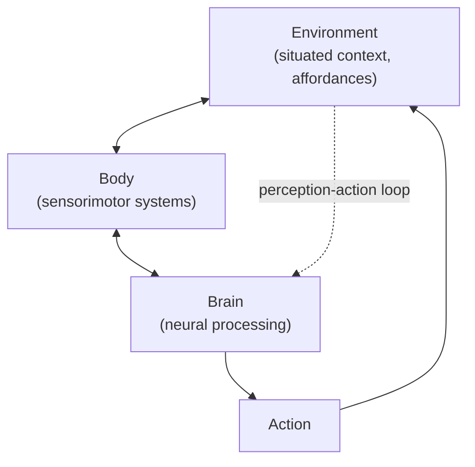

## Embodied and Situated Cognition Perspectives

### Overview

Embodied and situated cognition represent a family of theoretical perspectives that challenge classical, computationalist views of the mind as an abstract symbol-manipulating system housed in the brain alone. These perspectives argue that cognitive processes are fundamentally shaped by, and often partially constituted by, the body's sensorimotor systems and the physical/social environment in which an organism is situated. Emerging as a significant countercurrent within cognitive science from the late 1980s onward, these views have increasingly influenced cognitive neuroscience research on perception, action, language, and concepts.

### Historical and Philosophical Roots

**Key Points**

- Draws on phenomenological philosophy, particularly Maurice Merleau-Ponty's *Phenomenology of Perception* (1945), which emphasized the body as the primary site of experience and knowledge
- Influenced by American pragmatism (John Dewey) and ecological psychology, especially James J. Gibson's theory of affordances (1979), which proposed that organisms perceive the environment directly in terms of action possibilities rather than through internal representation-building
- Developed as a reaction against classical cognitivism and the computer/symbol-processing metaphor of mind dominant in the 1960s-1980s
- Francisco Varela, Evan Thompson, and Eleanor Rosch's *The Embodied Mind* (1991) is a foundational text explicitly linking embodiment, enactivism, and Buddhist philosophy to cognitive science
- Andy Clark's *Being There* (1997) and later work helped popularize embodied and "extended mind" perspectives within analytic philosophy of mind and cognitive science

### Core Theoretical Claims

**Key Points**

- **Embodiment**: Cognitive processes are shaped by the specific properties of an organism's body (its sensorimotor capacities, morphology) rather than being substrate-independent computations
- **Embeddedness/Situatedness**: Cognition is adapted to and dependent upon features of the immediate physical and social environment; the environment can function as an external resource that offloads cognitive work
- **Enaction**: Cognition arises through dynamic, ongoing sensorimotor interaction between an organism and its environment, not through passive internal representation of a pre-given world
- **Extended cognition**: In some formulations (notably Clark and Chalmers' 1998 "extended mind" thesis), cognitive processes can extend beyond the brain and body into external tools and artifacts (e.g., a notebook functioning as external memory)

### Distinguishing the Four "E"s

| Perspective | Core Claim | Key Proponents |
| --- | --- | --- |
| Embodied | Cognition depends on the body's sensorimotor properties | Varela, Thompson, Rosch; Lakoff & Johnson |
| Embedded | Cognition depends on environmental structure/context | Gibson; ecological psychology |
| Enactive | Cognition arises through active perception-action loops | Varela, Noë, O'Regan |
| Extended | Cognitive processes can incorporate external tools/artifacts | Clark & Chalmers |

### Evidence from Cognitive Neuroscience

**Key Points**

- **Mirror neuron system**: Neurons in macaque premotor cortex (area F5) and putative human homologues fire both when performing and observing an action, suggested by some researchers to support embodied simulation accounts of action understanding
- **Grounded cognition / conceptual metaphor**: Neuroimaging studies show that comprehending action-related language (e.g., "kick," "grasp") activates corresponding sensorimotor cortical regions, supporting the view that abstract concepts may be partially grounded in bodily experience (Lakoff and Johnson's conceptual metaphor theory)
- **Motor resonance studies**: Behavioral and TMS studies show that observing or imagining actions modulates motor cortex excitability in an effector-specific manner, suggesting perception-action coupling
- **Peripersonal space representation**: Neurons in premotor and parietal cortex (e.g., area VIP, area F4) encode space near the body in a multisensory, action-oriented reference frame, supporting embedded/situated processing of space relative to the body's action capabilities

**Example**

In classic work by Pulvermüller and colleagues, fMRI studies found that reading action verbs like "kick," "pick," and "lick" activates somatotopically appropriate regions of motor and premotor cortex corresponding to the leg, hand, and mouth respectively, taken as evidence that word meaning is partly grounded in sensorimotor systems.

### Contrast with Classical Cognitivism

| Dimension | Classical Cognitivism | Embodied/Situated Cognition |
| --- | --- | --- |
| Locus of cognition | Brain as abstract symbol processor | Brain-body-environment system |
| Representation | Amodal, abstract symbols | Modal, sensorimotor-grounded representations |
| Role of body | Peripheral input/output device | Constitutive of cognitive processing |
| Role of environment | External source of input data | Active resource that can offload/scaffold cognition |
| Metaphor for mind | Digital computer | Dynamical, coupled system |

### Applications and Research Domains

**Key Points**

- **Robotics**: Embodied cognition has directly influenced "behavior-based robotics" (e.g., Rodney Brooks' subsumption architecture), which builds intelligent behavior from tight sensorimotor loops rather than centralized symbolic planning
- **Concept representation research**: Motivates "grounded" or "grounded and abstract" hybrid models of conceptual knowledge, debating whether abstract concepts (e.g., "justice," "number") can be fully explained by sensorimotor grounding or require additional amodal or linguistic scaffolding
- **Developmental cognitive neuroscience**: Used to explain how infants' motor development (e.g., reaching, crawling) scaffolds emerging perceptual and cognitive capacities
- **Clinical and rehabilitation neuroscience**: Embodied cognition principles inform approaches like mirror therapy for phantom limb pain and action-observation therapy in stroke rehabilitation

### Critiques and Limitations

**Key Points**

- Critics argue embodied cognition sometimes lacks a precise, falsifiable formulation, with claims ranging from a trivial ("the body matters for cognition") to a strong, more contested thesis ("cognition cannot be understood without the body")
- Mirror neuron-based claims about action understanding and embodied simulation have been challenged; [Inference] some researchers argue the functional role of mirror neurons in humans is less clear-cut and more debated than earlier popular accounts suggested, given mixed replication and interpretation issues in human mirror neuron research
- Some researchers argue that "grounded" sensorimotor activation during language comprehension may be a secondary consequence of understanding rather than constitutive of the core semantic representation itself — this remains an active empirical debate
- The extended mind thesis faces the "coupling-constitution fallacy" critique: that an external resource being reliably *coupled* to a cognitive process does not prove it is *constitutive* of that process
- [Inference] Reconciling strong embodiment claims with evidence of relatively abstract, amodal representations in some brain regions (e.g., anterior temporal lobe hub regions in semantic cognition models) remains an unresolved theoretical tension

**Behavioral Disclaimer**

[Inference] The degree to which specific cognitive functions are embodied, as opposed to relying on more abstract or amodal representations, may vary across task, brain region, and stimulus type, and remains an area of active empirical investigation.

**Next Steps**

**Related Topics**

- Mirror neuron system and action understanding
- Gibson's ecological psychology and theory of affordances
- Extended mind thesis (Clark and Chalmers)
- Conceptual metaphor theory (Lakoff and Johnson)
- Grounded cognition and amodal versus modal representation debates
- Dynamical systems approaches to cognition
- Peripersonal space representation in parietal and premotor cortex
- Behavior-based robotics and subsumption architecture
- Enactivism and the sensorimotor contingency theory of perception (O'Regan and Noë)
- Modularity versus distributed processing theories (contrast/complement)