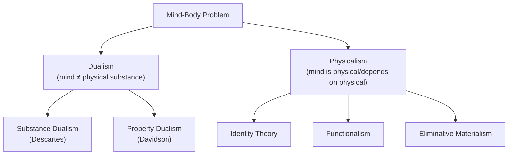

## Philosophy of Mind and the Mind-Body Problem

### Overview

The mind-body problem asks how mental phenomena — thoughts, feelings, consciousness, subjective experience — relate to the physical body, particularly the brain. It is one of the oldest and most persistent problems in philosophy and sits at the theoretical foundation of cognitive neuroscience, since the field's basic premise (that mental processes can be studied via their neural substrates) presupposes some answer, implicit or explicit, to this problem.

### Historical Origins

**Key Points**

- Formulated explicitly in modern form by René Descartes in *Meditations on First Philosophy* (1641), who argued mind and body are two distinct kinds of substance
- Descartes proposed the pineal gland as the physical point of interaction between the immaterial mind (res cogitans) and the physical body (res extensa) — an early, now-abandoned attempt to solve the "interaction problem"
- Predecessors include Aristotle's hylomorphism (the soul as the "form" of a living body) and various dualist and materialist strands in Greek and later philosophy
- The problem was reinvigorated in 20th-century analytic philosophy alongside the rise of behaviorism, functionalism, and later, cognitive science and neuroscience

### Cartesian (Substance) Dualism

**Key Points**

- Holds that mind and body are two fundamentally different kinds of substance: mental substance (non-physical, characterized by thought) and physical substance (extended in space, governed by physical laws)
- Faces the classic **interaction problem**: if the mind is non-physical, how can it causally interact with the physical brain/body (e.g., how does a non-physical intention cause a physical arm movement)?
- Largely rejected by contemporary neuroscientists and most philosophers of mind due to its difficulty explaining causal interaction and its tension with the principle of causal closure of the physical world
- Retains some contemporary defenders in philosophy of religion and certain interpretations of quantum consciousness theories, though these remain minority positions

### Physicalist/Materialist Positions

#### Identity Theory (Type Physicalism)

**Key Points**

- Holds that mental states are identical to brain states (e.g., "pain is identical to C-fiber firing")
- Proposed by U.T. Place and J.J.C. Smart in the late 1950s
- Faces the **multiple realizability** objection (Hilary Putnam): if the same mental state (e.g., pain) can be realized by different physical states in different species or systems (e.g., octopus nervous systems versus human nervous systems), then mental states cannot be strictly identical to one specific type of physical state

#### Functionalism

**Key Points**

- Holds that mental states are defined by their functional/causal role — their relationship to inputs, outputs, and other mental states — rather than by their specific physical composition
- Compatible with multiple realizability: the same functional state could be realized in biological neurons, silicon circuits, or other substrates
- Became the dominant framework underlying classical computational cognitive science and much of cognitive neuroscience's working assumptions
- Criticized via thought experiments like Ned Block's "China Brain" and John Searle's "Chinese Room" argument, which question whether functional organization alone is sufficient for genuine understanding or consciousness

#### Eliminative Materialism

**Key Points**

- Argues that some or all everyday "folk psychology" mental concepts (belief, desire, intention) do not correspond to any real brain states and will eventually be eliminated in favor of a mature neuroscientific vocabulary, analogous to how "phlogiston" was eliminated from chemistry
- Associated with Paul and Patricia Churchland
- A minority but influential position, particularly relevant to debates about how much neuroscience should reshape or replace folk-psychological explanations of behavior

#### Non-Reductive Physicalism / Property Dualism

**Key Points**

- Holds that mental properties are not identical to physical properties but nonetheless depend entirely on (are "supervenient" upon) physical properties, with no separate mental substance
- Mental properties are typically treated as **emergent**: arising from complex physical organization but not reducible to simple physical descriptions
- Donald Davidson's "anomalous monism" is an influential version: mental and physical events are the same events described in different, non-reducible vocabularies

### Comparison of Major Positions

| Position | Mind = Body? | Multiple Realizability? | Key Proponents |
| --- | --- | --- | --- |
| Substance dualism | No, distinct substances | N/A | Descartes |
| Type identity theory | Yes, strict identity | No | Place, Smart |
| Functionalism | Mind = functional role | Yes | Putnam, Fodor |
| Eliminative materialism | Folk concepts don't refer | N/A | Churchland, Churchland |
| Property dualism/emergentism | Mental properties depend on but ≠ physical | Partial | Davidson (anomalous monism) |
| Panpsychism | Mind is fundamental, ubiquitous property of matter | N/A | Chalmers (sympathetic), Goff |

### The Hard Problem of Consciousness

**Key Points**

- Term coined by David Chalmers (1995) to distinguish the **easy problems** of consciousness (explaining cognitive functions like attention, discrimination, reportability, which are in principle tractable via standard neuroscientific/computational methods) from the **hard problem**: explaining why and how physical processes give rise to subjective experience ("qualia") at all
- The hard problem asks why there is "something it is like" (Thomas Nagel's phrase, from his 1974 paper "What Is It Like to Be a Bat?") to undergo a given neural process, rather than the process occurring "in the dark," with no accompanying experience
- Chalmers argues that even a complete functional/physical account of the brain would not by itself explain why subjective experience accompanies that function — this is sometimes formalized via the **explanatory gap** (a term from Joseph Levine)
- The **philosophical zombie** thought experiment (a hypothetical being physically and functionally identical to a conscious being but lacking subjective experience) is used to argue that physical/functional facts do not logically entail facts about consciousness

**Example**

Explaining how the visual system discriminates red from green wavelengths and reports the difference is an "easy problem" (tractable via standard neuroscience). Explaining why this discrimination is accompanied by the subjective, qualitative experience of "redness" rather than occurring with no experience at all is the "hard problem."

### Relevance to Cognitive Neuroscience Methodology

**Key Points**

- Most working cognitive neuroscientists operate under an implicit or explicit physicalist/functionalist framework, treating mental states as identical to, or fully dependent upon, brain states
- The hard problem remains largely bracketed in mainstream empirical research: most neuroscience addresses correlates and mechanisms of cognitive function (the "easy problems") rather than attempting to solve the explanatory gap directly
- The search for **neural correlates of consciousness (NCC)** (a research program advanced by Francis Crick and Christof Koch, and later Giulio Tononi's Integrated Information Theory) represents an empirical approach to consciousness that largely sidesteps, rather than resolves, the hard problem
- [Inference] Some researchers consider the hard problem a genuine metaphysical puzzle that empirical neuroscience cannot in principle resolve, while others consider it a linguistic or conceptual confusion that will dissolve with sufficient scientific progress — this remains a live and unresolved debate among philosophers and scientists

### Critiques and Ongoing Debates

**Key Points**

- Daniel Dennett and other physicalist-oriented philosophers argue the hard problem is based on a misleading intuition and that a sufficiently detailed functional/computational account (as in his "multiple drafts" model of consciousness) dissolves the apparent mystery
- Panpsychist views (e.g., Philip Goff, and Chalmers as a sympathetic explorer) propose consciousness as a fundamental, ubiquitous feature of matter, attempting to avoid both the interaction problem of dualism and the explanatory gap of physicalism, though this remains a minority position
- Integrated Information Theory (IIT), proposed by Giulio Tononi, offers a mathematically formalized theory attempting to specify what physical systems are conscious and to what degree, based on the concept of integrated information (Φ); [Inference] IIT remains scientifically and philosophically contested, with ongoing debate about its testability and its implications (e.g., that certain simple systems could in principle be conscious)

**Behavioral/Theoretical Disclaimer**

[Inference] The mind-body problem, and particularly the hard problem of consciousness, remains philosophically unresolved; positions described here reflect major schools of thought rather than settled scientific consensus.

**Next Steps**

**Related Topics**

- Neural correlates of consciousness (NCC)
- Integrated Information Theory (Tononi)
- Global Workspace Theory (Baars, Dehaene)
- Qualia and the knowledge argument (Frank Jackson's "Mary's Room")
- Functionalism and multiple realizability
- Panpsychism and neutral monism
- The Chinese Room argument (Searle)
- Emergentism and levels of explanation
- Marr's levels of analysis (methodological parallel)
- Philosophical zombies and the explanatory gap