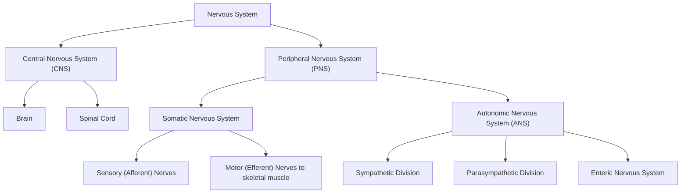

## Organization of the Central and Peripheral Nervous Systems

### Overview

The nervous system is anatomically and functionally divided into two major components: the central nervous system (CNS), comprising the brain and spinal cord, and the peripheral nervous system (PNS), comprising all neural tissue outside the CNS. This division provides the foundational anatomical framework for cognitive neuroscience, establishing how information is transmitted between the body, the external environment, and the neural structures responsible for cognition.

### High-Level Organizational Hierarchy

### Central Nervous System (CNS)

**Key Points**

- Comprises the brain and spinal cord, enclosed within the skull and vertebral column respectively
- Protected by three meningeal layers (dura mater, arachnoid mater, pia mater) and cerebrospinal fluid (CSF), which cushions the tissue and provides some metabolic exchange
- Further protected by the blood-brain barrier (BBB), a selective semipermeable boundary formed by tight junctions between endothelial cells of brain capillaries, astrocytic end-feet, and pericytes, which restricts passage of many substances from blood to neural tissue
- Composed of gray matter (neuronal cell bodies, dendrites, and synapses) and white matter (myelinated axon tracts)
- Responsible for integrating sensory information, generating perception and cognition, and initiating and coordinating motor output

#### Major Subdivisions of the Brain

| Division | Major Structures | Primary Functions |
| --- | --- | --- |
| Forebrain (prosencephalon) | Cerebrum (cortex, basal ganglia), thalamus, hypothalamus | Higher cognition, sensory relay, homeostasis, emotion |
| Midbrain (mesencephalon) | Tectum, tegmentum, substantia nigra | Visual/auditory reflexes, motor coordination, arousal |
| Hindbrain (rhombencephalon) | Pons, medulla oblongata, cerebellum | Vital autonomic functions, motor coordination, balance |

**Key Points**

- The brainstem (midbrain, pons, medulla) regulates vital autonomic functions (respiration, cardiovascular control) and serves as a conduit for ascending/descending tracts between spinal cord and forebrain
- The cerebellum, though anatomically part of the hindbrain, plays major roles in motor coordination, timing, and increasingly recognized contributions to cognitive and affective processing
- The cerebral cortex is organized into four traditional lobes (frontal, parietal, temporal, occipital) per hemisphere, each associated with characteristic functional specializations (executive function/motor control, somatosensation/spatial processing, auditory processing/memory, visual processing respectively), though functional organization frequently crosses these anatomical boundaries

#### Spinal Cord

**Key Points**

- Extends from the medulla oblongata to approximately the L1-L2 vertebral level in adults, organized into cervical, thoracic, lumbar, sacral, and coccygeal segments
- Gray matter forms a butterfly/H-shaped core (dorsal horns process sensory input; ventral horns contain motor neurons), surrounded by white matter tracts
- Contains ascending sensory tracts (e.g., dorsal column-medial lemniscus pathway for fine touch/proprioception; spinothalamic tract for pain/temperature) and descending motor tracts (e.g., corticospinal tract for voluntary movement)
- Mediates spinal reflexes (e.g., the stretch reflex) independently of higher brain centers, though most complex movement involves descending cortical control

### Peripheral Nervous System (PNS)

**Key Points**

- Comprises all neural tissue outside the brain and spinal cord: 12 pairs of cranial nerves, 31 pairs of spinal nerves, and associated ganglia
- Not protected by the blood-brain barrier or meninges, making it more vulnerable to certain toxins and mechanical injury but also more accessible for some diagnostic and therapeutic purposes
- Divided functionally into the somatic nervous system (voluntary control, sensory input from skin/muscles/joints) and the autonomic nervous system (involuntary regulation of internal organs)

#### Somatic Nervous System

**Key Points**

- Carries sensory (afferent) information from skin, muscles, and joints to the CNS
- Carries motor (efferent) commands from the CNS to skeletal (voluntary) muscle via alpha motor neurons
- Neuromuscular junctions use acetylcholine as the primary neurotransmitter
- Generally considered under voluntary/conscious control, though many reflexive somatic responses (e.g., withdrawal reflex) occur without conscious mediation

#### Autonomic Nervous System (ANS)

**Key Points**

- Regulates involuntary physiological functions: heart rate, digestion, respiration rate, pupillary response, glandular secretion
- Composed of two anatomically and functionally distinct divisions with largely opposing (though more accurately, complementary and context-dependent) effects: sympathetic and parasympathetic
- A third component, the enteric nervous system, semi-independently governs gastrointestinal function and is sometimes referred to as a "second brain" due to its extensive local neural circuitry

**Sympathetic vs. Parasympathetic Comparison**

| Feature | Sympathetic Division | Parasympathetic Division |
| --- | --- | --- |
| Common function | "Fight-or-flight" mobilization | "Rest-and-digest" conservation |
| Spinal origin | Thoracolumbar (T1-L2) | Craniosacral (cranial nerves III, VII, IX, X; sacral S2-S4) |
| Primary neurotransmitter (postganglionic) | Norepinephrine | Acetylcholine |
| Ganglion location | Near spinal cord (sympathetic chain) | Near/within target organ |
| Example effect on heart rate | Increases | Decreases |
| Example effect on pupils | Dilates (mydriasis) | Constricts (miosis) |

**Example**

During an acute stressor, sympathetic activation increases heart rate and redirects blood flow to skeletal muscle via norepinephrine release, while parasympathetic activity is correspondingly suppressed; once the stressor resolves, parasympathetic (vagal) activity predominates to restore resting physiological states, a dynamic often indexed in research via heart rate variability.

### Cranial and Spinal Nerves

**Key Points**

- The 12 pairs of cranial nerves (CN I-XII) arise directly from the brain/brainstem and primarily innervate structures of the head and neck, though the vagus nerve (CN X) extends into the thorax and abdomen, carrying substantial parasympathetic output
- The 31 pairs of spinal nerves arise from the spinal cord (8 cervical, 12 thoracic, 5 lumbar, 5 sacral, 1 coccygeal) and carry mixed sensory and motor fibers to the trunk and limbs
- Cranial nerve function is a key component of clinical neurological examination, since specific deficits (e.g., CN VII facial nerve palsy) can help localize lesions

### Illustrative Diagram: CNS/PNS Relationship

<svg xmlns="http://www.w3.org/2000/svg" viewBox="0 0 700 420">
<text x="350" y="28" text-anchor="middle" font-size="17" font-weight="bold" fill="#1a1a2e">CNS and PNS Organization (svg_diagram)</text>
<rect x="230" y="55" width="240" height="90" rx="10" fill="#e8f0fe" stroke="#3b5bdb" stroke-width="2" />
<text x="350" y="85" text-anchor="middle" font-size="14" font-weight="bold">Central Nervous System</text>
<text x="350" y="108" text-anchor="middle" font-size="12">Brain + Spinal Cord</text>
<text x="350" y="126" text-anchor="middle" font-size="11" fill="#555">Protected by meninges, BBB, CSF</text>
<line x1="350" y1="145" x2="350" y2="175" stroke="#333" stroke-width="2" marker-end="url(#arrow3)" />
<rect x="230" y="175" width="240" height="60" rx="10" fill="#fff4e6" stroke="#e8590c" stroke-width="2" />
<text x="350" y="200" text-anchor="middle" font-size="14" font-weight="bold">Peripheral Nervous System</text>
<text x="350" y="220" text-anchor="middle" font-size="12">Cranial + Spinal Nerves</text>
<line x1="290" y1="235" x2="150" y2="280" stroke="#333" stroke-width="1.5" marker-end="url(#arrow3)" />
<line x1="410" y1="235" x2="550" y2="280" stroke="#333" stroke-width="1.5" marker-end="url(#arrow3)" />
<rect x="40" y="280" width="220" height="90" rx="10" fill="#e6fcf5" stroke="#0ca678" stroke-width="2" />
<text x="150" y="305" text-anchor="middle" font-size="13" font-weight="bold">Somatic NS</text>
<text x="150" y="325" text-anchor="middle" font-size="11">Voluntary muscle control</text>
<text x="150" y="342" text-anchor="middle" font-size="11">Sensory input from skin/joints</text>
<text x="150" y="359" text-anchor="middle" font-size="11" fill="#555">ACh at neuromuscular junction</text>
<rect x="440" y="280" width="220" height="90" rx="10" fill="#fce8f3" stroke="#c2255c" stroke-width="2" />
<text x="550" y="305" text-anchor="middle" font-size="13" font-weight="bold">Autonomic NS</text>
<text x="550" y="325" text-anchor="middle" font-size="11">Sympathetic (fight-or-flight)</text>
<text x="550" y="342" text-anchor="middle" font-size="11">Parasympathetic (rest-digest)</text>
<text x="550" y="359" text-anchor="middle" font-size="11" fill="#555">+ Enteric NS</text>
</svg>

### Relevance to Cognitive Neuroscience

**Key Points**

- The CNS, particularly cerebral cortex and subcortical structures, is the primary focus of cognitive neuroscience research using techniques like fMRI, EEG, and lesion studies
- The PNS is critical to understanding sensory input pathways (how information reaches the CNS for processing) and motor output pathways (how cognitive/motor decisions translate into behavior)
- Autonomic nervous system activity is widely used as a physiological index of emotional and cognitive states in psychophysiology research (e.g., skin conductance response reflecting sympathetic arousal, heart rate variability reflecting parasympathetic/vagal tone)
- Peripheral nerve and spinal cord injuries provide important dissociation evidence for understanding the division of labor between central processing and peripheral transmission of sensory/motor signals

**Behavioral Disclaimer**

[Inference] While the classical CNS/PNS and somatic/autonomic divisions provide a foundational organizational framework, functional boundaries (e.g., enteric-CNS gut-brain signaling, autonomic influences on cognition) are increasingly understood to be more interactive and less strictly separated than the traditional anatomical scheme suggests.

**Next Steps**

**Related Topics**

- Neuroanatomical planes and terminology (anterior/posterior, dorsal/ventral, etc.)
- Blood-brain barrier structure and function
- Cerebral cortex lobar organization and functional localization
- Cranial nerve examination and clinical correlations
- Autonomic nervous system and psychophysiological measurement (skin conductance, heart rate variability)
- Spinal reflex arcs and descending motor pathways
- Meninges and cerebrospinal fluid circulation
- Neurodevelopment: neural tube formation and CNS/PNS differentiation
- Enteric nervous system and gut-brain axis