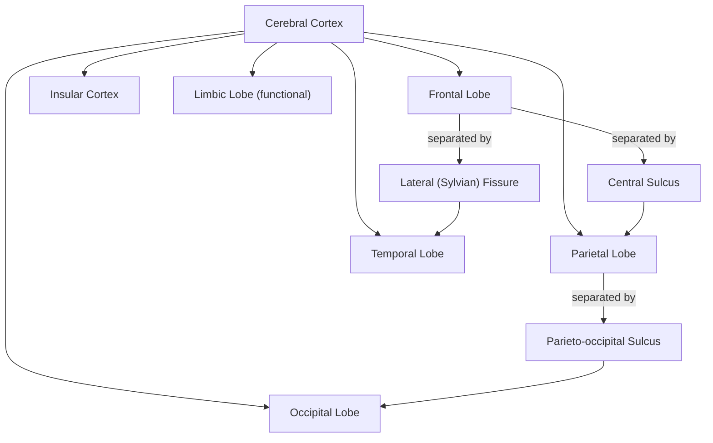

## Cerebral Cortex Lobes and Cytoarchitecture


### Overview

The cerebral cortex is the outer layered sheet of neural tissue covering the cerebral hemispheres, central to higher-order sensory, motor, and cognitive processing. It is organized both at a macroscopic level into anatomically defined lobes and at a microscopic level into distinct cytoarchitectonic areas distinguished by their cellular composition and laminar structure. Understanding both levels of organization is foundational to interpreting functional neuroimaging, lesion studies, and comparative neuroanatomy.

### Macroscopic Organization: The Four (or Five) Lobes

**Key Points**

- The cerebral cortex is conventionally divided into four lobes per hemisphere, named for the overlying cranial bones: frontal, parietal, temporal, and occipital
- A fifth region, the insular cortex (insula), is sometimes classified as a fifth lobe; it lies buried within the lateral sulcus and is not visible from the brain's external surface
- The limbic lobe (a phylogenetically older set of structures including cingulate cortex and parahippocampal gyrus) is sometimes described as a sixth, functionally rather than strictly anatomically defined division
- Lobes are separated by major sulci (grooves): the central sulcus separates frontal from parietal lobe; the lateral (Sylvian) fissure separates temporal from frontal/parietal lobes; the parieto-occipital sulcus separates parietal from occipital lobe



### Lobe Functions Summary

| Lobe | Key Structures | Primary Functions |
| --- | --- | --- |
| Frontal | Primary motor cortex, premotor cortex, prefrontal cortex, Broca's area | Voluntary movement, executive function, planning, working memory, expressive language |
| Parietal | Primary somatosensory cortex, posterior parietal cortex | Somatosensation, spatial processing, sensorimotor integration, attention |
| Temporal | Primary auditory cortex, Wernicke's area, hippocampus/medial temporal lobe, fusiform gyrus | Auditory processing, language comprehension, memory formation, object/face recognition |
| Occipital | Primary visual cortex (V1), extrastriate visual areas | Visual processing |
| Insula | Anterior and posterior insula | Interoception, taste, pain, emotional awareness |

### Frontal Lobe Detail

**Key Points**

- The primary motor cortex (M1, Brodmann area 4) lies along the precentral gyrus, immediately anterior to the central sulcus, and contains a somatotopic map of the body (the motor homunculus)
- Premotor cortex and supplementary motor area (SMA) lie anterior to M1 and are involved in movement planning and sequencing
- Prefrontal cortex, the most anterior region, is subdivided into dorsolateral, ventromedial, and orbitofrontal regions, associated respectively with working memory/executive control, value-based decision-making, and reward processing/impulse regulation
- Broca's area (typically left inferior frontal gyrus, Brodmann areas 44/45) is central to expressive/motor aspects of language production

### Parietal Lobe Detail

**Key Points**

- Primary somatosensory cortex (S1, Brodmann areas 3, 1, 2) lies along the postcentral gyrus, immediately posterior to the central sulcus, containing a somatotopic sensory homunculus
- Posterior parietal cortex integrates sensory modalities and supports spatial attention, visuomotor coordination, and number processing
- The intraparietal sulcus is a key region for visuospatial attention and hand-eye coordination
- Damage to right parietal cortex (particularly the temporoparietal junction) is classically associated with hemispatial neglect

### Temporal Lobe Detail

**Key Points**

- Primary auditory cortex (A1, Brodmann area 41/42) lies on the superior temporal gyrus within the lateral fissure (Heschl's gyrus)
- Wernicke's area (typically left posterior superior temporal gyrus, Brodmann area 22) supports language comprehension
- The medial temporal lobe, including hippocampus, entorhinal cortex, and parahippocampal gyrus, is critical for declarative memory formation and consolidation
- The fusiform gyrus on the ventral temporal surface contains regions specialized for high-level visual recognition, including the fusiform face area (FFA)

### Occipital Lobe Detail

**Key Points**

- Primary visual cortex (V1, striate cortex, Brodmann area 17) lies along the calcarine sulcus, retinotopically organized so that adjacent points on the retina map to adjacent cortical locations
- Surrounding extrastriate visual areas (V2, V3, V4, V5/MT, and others) process progressively more complex visual features, feeding into ventral ("what") and dorsal ("where"/"how") processing streams that extend into temporal and parietal cortex respectively

### Microscopic Organization: Cytoarchitecture

**Key Points**

- Cytoarchitecture refers to the study of the cellular organization, density, and layering (lamination) of the cortex, distinct from its gross anatomical (lobar) divisions
- Most of the cerebral cortex is **neocortex** (also called isocortex), characterized by a six-layered laminar structure
- Phylogenetically older cortex, including the hippocampus (**archicortex**) and olfactory/piriform cortex (**paleocortex**), has fewer layers (typically three) and is collectively termed **allocortex**
- The transitional zone between neocortex and allocortex is called **mesocortex** (e.g., cingulate cortex, insular cortex, parahippocampal gyrus)

### The Six Layers of Neocortex

| Layer | Name | Key Characteristics |
| --- | --- | --- |
| I | Molecular layer | Sparse cell bodies; mainly dendrites and axons; synaptic integration |
| II | External granular layer | Small pyramidal and granule (stellate) cells; cortico-cortical connections |
| III | External pyramidal layer | Pyramidal cells; primary source of cortico-cortical efferents |
| IV | Internal granular layer | Densely packed granule cells; primary target of thalamocortical sensory input |
| V | Internal pyramidal layer | Large pyramidal cells (e.g., Betz cells in M1); primary source of subcortical/corticospinal efferents |
| VI | Multiform (polymorphic) layer | Diverse cell types; projects back to thalamus (corticothalamic feedback) |

**Key Points**

- Layer IV is especially thick in primary sensory cortices (e.g., V1, S1), reflecting dense thalamic sensory input, and is sometimes called "granular" or "koniocortex"
- Layer IV is thin or absent in primary motor cortex, which is classified as "agranular" cortex, reflecting its role as an output rather than input region
- Layer V pyramidal neurons in M1 include Betz cells, among the largest neurons in the CNS, whose axons form part of the corticospinal tract
- Variation in the relative thickness of these six layers across cortical regions forms the basis for cytoarchitectonic parcellation schemes

### Brodmann's Cytoarchitectonic Map

**Key Points**

- Korbinian Brodmann (1909) parcellated the human cortex into 52 numbered areas based on differences in cellular organization and layering observed under the microscope, using Nissl-stained tissue
- Brodmann areas (BAs) remain widely used as a reference nomenclature in neuroscience, despite being based on relatively coarse 20th-century histological methods
- Key examples: BA 4 (primary motor cortex), BA 3/1/2 (primary somatosensory cortex), BA 17 (primary visual cortex/V1), BA 41/42 (primary auditory cortex), BA 44/45 (Broca's area), BA 22 (Wernicke's area)
- Modern parcellation approaches (e.g., the Human Connectome Project's multimodal cortical parcellation) combine cytoarchitecture with myeloarchitecture, functional connectivity, and topographic organization to produce more fine-grained maps (e.g., 180 areas per hemisphere in the Glasser et al. 2016 atlas)

### Cytoarchitectonic Classification Types

| Type | Description | Example Regions |
| --- | --- | --- |
| Koniocortex (granular) | Thick layer IV, thin layers III/V | Primary sensory cortices (V1, S1, A1) |
| Agranular cortex | Thin/absent layer IV, thick layers III/V | Primary motor cortex (M1) |
| Homotypical (eulaminate) cortex | All six layers clearly present, moderate proportions | Most association cortex |
| Allocortex | Three layers, phylogenetically older | Hippocampus, olfactory cortex |

### Illustrative Diagram: Lobes and Cortical Layers

<svg xmlns="http://www.w3.org/2000/svg" viewBox="0 0 720 440">
<text x="360" y="26" text-anchor="middle" font-size="16" font-weight="bold" fill="#1a1a2e">Cortical Lobes and Six-Layer Lamination (svg_diagram)</text>

<ellipse cx="200" cy="180" rx="150" ry="100" fill="#f1f3f5" stroke="#333" stroke-width="2" />
<path d="M 100 150 Q 180 110 260 150" fill="none" stroke="#666" stroke-width="1.5" />
<text x="130" y="130" font-size="12" font-weight="bold" fill="#3b5bdb">Frontal</text>
<text x="220" y="120" font-size="12" font-weight="bold" fill="#0ca678">Parietal</text>
<text x="270" y="200" font-size="12" font-weight="bold" fill="#e8590c">Occipital</text>
<text x="140" y="230" font-size="12" font-weight="bold" fill="#c2255c">Temporal</text>
<line x1="185" y1="105" x2="185" y2="245" stroke="#888" stroke-width="1" stroke-dasharray="3,2" />
<line x1="100" y1="195" x2="290" y2="150" stroke="#888" stroke-width="1" stroke-dasharray="3,2" />


<text x="500" y="70" text-anchor="middle" font-size="13" font-weight="bold">Neocortex Layers</text>

<g font-size="11">

<rect x="420" y="80" width="160" height="20" fill="`#f8f9fa`" stroke="#333" />

<text x="500" y="94" text-anchor="middle">I - Molecular</text>



```
<rect x="420" y="100" width="160" height="20" fill="#e8f0fe" stroke="#333" />
<text x="500" y="114" text-anchor="middle">II - External Granular</text>

<rect x="420" y="120" width="160" height="30" fill="#d0ebff" stroke="#333" />
<text x="500" y="139" text-anchor="middle">III - External Pyramidal</text>

<rect x="420" y="150" width="160" height="25" fill="#b2f2bb" stroke="#333" />
<text x="500" y="167" text-anchor="middle">IV - Internal Granular</text>

<rect x="420" y="175" width="160" height="30" fill="#ffd8a8" stroke="#333" />
<text x="500" y="194" text-anchor="middle">V - Internal Pyramidal</text>

<rect x="420" y="205" width="160" height="25" fill="#eebefa" stroke="#333" />
<text x="500" y="222" text-anchor="middle">VI - Multiform</text>
```

</g>
<text x="500" y="250" text-anchor="middle" font-size="10" fill="#555">White matter below</text>
<rect x="420" y="255" width="160" height="15" fill="#dee2e6" stroke="#333" />
</svg>

### Clinical and Research Relevance

**Key Points**

- Lobar localization underpins lesion-symptom mapping in neuropsychology (e.g., frontal lesions and executive dysfunction; medial temporal lesions and amnesia)
- Cytoarchitectonic boundaries frequently, though not perfectly, correspond to functional boundaries identified via neuroimaging, motivating multimodal parcellation approaches combining structure and function
- Neurodegenerative diseases often show characteristic patterns of cortical thinning or atrophy that respect cytoarchitectonic and network boundaries (e.g., early entorhinal/hippocampal involvement in Alzheimer's disease)

**Behavioral Disclaimer**

[Inference] While lobes and Brodmann areas provide standard anatomical reference points, functional specialization within the cortex is graded and overlapping rather than strictly confined to these boundaries, and modern parcellations continue to be refined using multimodal data.

**Next Steps**

**Related Topics**

- Brodmann areas and modern multimodal cortical parcellation (Human Connectome Project atlas)
- Primary motor and somatosensory homunculi
- Dorsal ("where/how") and ventral ("what") visual processing streams
- Broca's and Wernicke's areas and the classical language model
- Medial temporal lobe memory system
- Cortical column and minicolumn organization
- Retinotopic, tonotopic, and somatotopic mapping
- Comparative cytoarchitecture across species
- Organization of the central and peripheral nervous systems (related foundational topic)