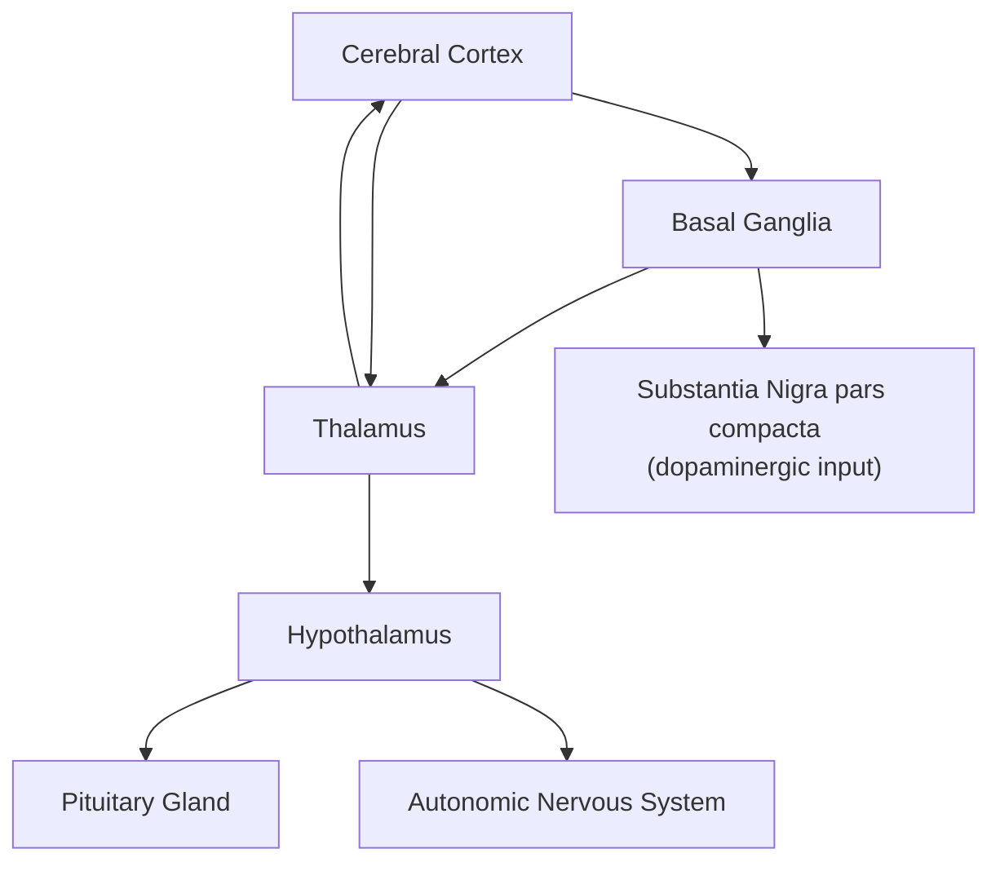

## Basal Ganglia, Thalamus, and Hypothalamus

### Overview

The basal ganglia, thalamus, and hypothalamus are interconnected subcortical structures central to motor control, sensory relay, and homeostatic/motivational regulation, respectively. Though anatomically distinct and serving different primary functions, they are extensively interconnected with the cerebral cortex and with each other, forming critical loops that support movement selection, arousal, attention, and integration of cognition with bodily state.

### Basal Ganglia

**Key Points**

- A collection of interconnected subcortical nuclei primarily involved in action selection, motor control, procedural learning, and reward-based learning
- Major components: the striatum (caudate nucleus and putamen), globus pallidus (external and internal segments), subthalamic nucleus, and substantia nigra (pars compacta and pars reticulata)
- The striatum is the primary input structure, receiving excitatory glutamatergic projections from nearly all of cerebral cortex, as well as dopaminergic input from substantia nigra pars compacta (SNc)
- The internal globus pallidus and substantia nigra pars reticulata serve as primary output structures, projecting inhibitory (GABAergic) signals to the thalamus

#### Basal Ganglia Components

| Structure | Subcomponents | Role |
| --- | --- | --- |
| Striatum | Caudate nucleus, putamen (+ nucleus accumbens, ventral striatum) | Primary input; action selection, reward learning |
| Globus pallidus | External segment (GPe), internal segment (GPi) | Relay/output; GPi is primary output nucleus |
| Subthalamic nucleus (STN) | — | Modulatory excitatory node ("indirect"/"hyperdirect" pathways) |
| Substantia nigra | Pars compacta (SNc), pars reticulata (SNr) | SNc: dopaminergic input to striatum; SNr: output nucleus |

#### Direct and Indirect Pathways

**Key Points**

- The classic basal ganglia circuit model describes two parallel pathways through which cortical input influences thalamic output and ultimately movement
- **Direct pathway**: cortex → striatum → GPi/SNr (inhibitory) → thalamus; net effect is disinhibition of thalamus, facilitating movement
- **Indirect pathway**: cortex → striatum → GPe → STN → GPi/SNr → thalamus; net effect is increased inhibition of thalamus, suppressing movement
- Dopamine from SNc modulates this balance: it excites the direct pathway (via D1 receptors) and inhibits the indirect pathway (via D2 receptors), net effect favoring movement facilitation
- This circuit model underlies understanding of movement disorders: Parkinson's disease involves loss of SNc dopaminergic neurons, shifting the balance toward the indirect pathway and producing hypokinesia; Huntington's disease involves early striatal degeneration affecting the indirect pathway, contributing to hyperkinetic chorea

**Example**

In Parkinson's disease, reduced dopaminergic tone from SNc degeneration disinhibits the indirect pathway and reduces facilitation of the direct pathway, resulting in excessive net inhibition of thalamocortical output and the characteristic bradykinesia (slowness of movement) seen clinically.

### Basal Ganglia Beyond Motor Control

**Key Points**

- The ventral striatum (including nucleus accumbens) is central to reward processing, reinforcement learning, and motivation, receiving dense dopaminergic input from the ventral tegmental area (VTA), a structure closely related to but distinct from SNc
- The basal ganglia participate in parallel cortico-striato-thalamo-cortical loops (described by Alexander, DeLong, and Strick, 1986) that include not only motor circuits but also oculomotor, associative/cognitive (dorsolateral prefrontal), and limbic circuits, implicating the basal ganglia in executive function and emotional/motivational processing, not solely movement

### Thalamus

**Key Points**

- A paired, egg-shaped structure situated at the center of the diencephalon, often described as the primary "relay station" of the brain
- Composed of numerous distinct nuclei, most of which project to and receive reciprocal input from specific cortical areas, forming thalamocortical loops
- Virtually all sensory modalities (except olfaction) pass through the thalamus before reaching primary sensory cortex
- Beyond passive relay, the thalamus performs active gating and modulation of information flow, playing a significant role in arousal, attention, and consciousness

#### Key Thalamic Nuclei

| Nucleus | Primary Input | Primary Cortical Target | Function |
| --- | --- | --- | --- |
| Lateral geniculate nucleus (LGN) | Retina (optic tract) | Primary visual cortex (V1) | Visual relay |
| Medial geniculate nucleus (MGN) | Inferior colliculus (auditory) | Primary auditory cortex (A1) | Auditory relay |
| Ventral posterior nucleus (VPL/VPM) | Somatosensory pathways, trigeminal | Primary somatosensory cortex (S1) | Somatosensory relay |
| Ventral anterior/lateral nuclei | Basal ganglia, cerebellum | Motor and premotor cortex | Motor relay |
| Mediodorsal nucleus | Amygdala, olfactory, prefrontal cortex | Prefrontal cortex | Cognition, emotion regulation |
| Anterior nucleus | Mammillary bodies, hippocampus (via fornix) | Cingulate cortex | Memory (part of Papez circuit) |
| Reticular nucleus | Widespread thalamic/cortical collaterals | (No cortical projection; modulates other thalamic nuclei) | Gating/gatekeeping of thalamocortical transmission |

**Key Points**

- The thalamic reticular nucleus (TRN) forms a thin shell around the rest of the thalamus and provides inhibitory GABAergic modulation of thalamocortical relay, playing a key role in generating sleep spindles and gating sensory information based on attentional demands
- The thalamus is implicated in disorders of consciousness; damage to specific thalamic nuclei (e.g., intralaminar nuclei) can produce profound impairments in arousal, illustrating its role beyond simple sensory relay

### Hypothalamus

**Key Points**

- A small but functionally critical structure situated below the thalamus, forming the floor and part of the walls of the third ventricle
- Serves as the primary integrative center linking the nervous system to the endocrine system, chiefly via control of the pituitary gland
- Composed of multiple distinct nuclei, each associated with relatively specific homeostatic and motivated-behavior functions
- Regulates autonomic nervous system output, body temperature, hunger/satiety, thirst, circadian rhythms, and reproductive/sexual behavior

#### Key Hypothalamic Nuclei

| Nucleus | Primary Function |
| --- | --- |
| Suprachiasmatic nucleus (SCN) | Master circadian pacemaker, entrained by retinal light input |
| Paraventricular nucleus (PVN) | Releases corticotropin-releasing hormone (CRH), oxytocin, vasopressin; central to HPA axis stress response |
| Supraoptic nucleus | Produces oxytocin and vasopressin (antidiuretic hormone) |
| Lateral hypothalamus | Feeding/hunger promotion; orexin/hypocretin neurons involved in arousal |
| Ventromedial nucleus | Satiety signaling |
| Preoptic area | Thermoregulation, sexually dimorphic reproductive behavior |
| Mammillary bodies | Memory circuitry (part of Papez circuit), input from hippocampal formation via fornix |

**Key Points**

- The hypothalamic-pituitary-adrenal (HPA) axis, initiated by PVN release of CRH, is the primary neuroendocrine pathway mediating physiological stress responses, ultimately triggering cortisol release from the adrenal cortex
- The hypothalamus links to the pituitary gland via two distinct pathways: the hypophyseal portal system (controlling anterior pituitary hormone release via releasing/inhibiting hormones) and direct axonal projection (posterior pituitary release of oxytocin and vasopressin, synthesized in PVN/supraoptic nucleus)
- Bidirectional connections with the limbic system (amygdala, hippocampus) and brainstem autonomic centers allow the hypothalamus to translate emotional and cognitive states into physiological/endocrine responses

**Example**

Chronic psychological stress activates the PVN to release CRH, stimulating anterior pituitary ACTH release, which in turn triggers adrenal cortisol secretion; elevated cortisol subsequently provides negative feedback to the hypothalamus and hippocampus, a system frequently studied in cognitive neuroscience research on stress, memory, and psychopathology.

### Integration: How the Three Structures Interrelate

**Key Points**

- Basal ganglia output is directed largely to thalamus (particularly ventral anterior/lateral nuclei), which then relays modulated motor and cognitive signals back to cortex, forming closed-loop circuits
- The thalamus provides sensory and motor relay to cortex, while the hypothalamus operates comparatively independently as a homeostatic/endocrine control center, though it receives input from limbic and brainstem structures that also interact with thalamic circuits
- All three structures are richly interconnected with the cerebral cortex, illustrating that subcortical structures are not merely passive relay stations but active participants in cognition, motivation, and behavior regulation

### Illustrative Diagram: Basal Ganglia Direct/Indirect Pathways

<svg xmlns="http://www.w3.org/2000/svg" viewBox="0 0 720 420">
<text x="360" y="26" text-anchor="middle" font-size="16" font-weight="bold" fill="#1a1a2e">Basal Ganglia Direct and Indirect Pathways (svg_diagram)</text>
<rect x="280" y="50" width="160" height="45" rx="8" fill="#e8f0fe" stroke="#3b5bdb" stroke-width="2" />
<text x="360" y="78" text-anchor="middle" font-size="13" font-weight="bold">Cortex</text>
<rect x="280" y="130" width="160" height="45" rx="8" fill="#d0ebff" stroke="#3b5bdb" stroke-width="2" />
<text x="360" y="158" text-anchor="middle" font-size="13" font-weight="bold">Striatum</text>
<line x1="360" y1="95" x2="360" y2="125" stroke="#333" stroke-width="2" marker-end="url(#arrow4)" />

<rect x="90" y="210" width="160" height="45" rx="8" fill="#b2f2bb" stroke="#0ca678" stroke-width="2" />
<text x="170" y="238" text-anchor="middle" font-size="12" font-weight="bold">GPi / SNr (direct↓)</text>
<line x1="300" y1="175" x2="200" y2="205" stroke="#0ca678" stroke-width="2" marker-end="url(#arrow5)" />
<text x="220" y="195" font-size="10" fill="#0ca678">Direct (inhibits GPi)</text>

<rect x="470" y="210" width="150" height="40" rx="8" fill="#ffd8a8" stroke="#e8590c" stroke-width="2" />
<text x="545" y="235" text-anchor="middle" font-size="12" font-weight="bold">GPe</text>
<line x1="420" y1="175" x2="510" y2="205" stroke="#e8590c" stroke-width="2" marker-end="url(#arrow5)" />
<text x="470" y="195" font-size="10" fill="#e8590c">Indirect</text>
<rect x="470" y="270" width="150" height="40" rx="8" fill="#ffd8a8" stroke="#e8590c" stroke-width="2" />
<text x="545" y="295" text-anchor="middle" font-size="12" font-weight="bold">STN</text>
<line x1="545" y1="250" x2="545" y2="265" stroke="#e8590c" stroke-width="2" marker-end="url(#arrow5)" />
<line x1="470" y1="290" x2="260" y2="235" stroke="#e8590c" stroke-width="2" marker-end="url(#arrow5)" />
<rect x="230" y="320" width="260" height="45" rx="8" fill="#eebefa" stroke="#9c36b6" stroke-width="2" />
<text x="360" y="348" text-anchor="middle" font-size="13" font-weight="bold">Thalamus</text>
<line x1="170" y1="255" x2="300" y2="325" stroke="#333" stroke-width="2" marker-end="url(#arrow4)" />
<line x1="545" y1="250" x2="420" y2="325" stroke="#333" stroke-width="2" marker-end="url(#arrow4)" />
<line x1="360" y1="320" x2="360" y2="100" stroke="#888" stroke-width="1.5" stroke-dasharray="4,3" marker-end="url(#arrow4)" />
<text x="400" y="220" font-size="10" fill="#666">to Cortex</text>
</svg>

### Clinical and Research Relevance

**Key Points**

- Basal ganglia dysfunction underlies major movement disorders (Parkinson's disease, Huntington's disease) as well as contributes to some psychiatric conditions (e.g., obsessive-compulsive disorder, implicating cortico-striato-thalamo-cortical loop dysfunction)
- Thalamic damage or dysfunction is implicated in disorders of consciousness, certain forms of amnesia (e.g., anterior/mediodorsal thalamic damage), and thalamocortical dysrhythmia models of chronic pain and some psychiatric conditions
- Hypothalamic dysfunction is studied extensively in relation to stress, mood disorders, eating disorders, and sleep disorders, given its central role in the HPA axis and circadian regulation

**Behavioral Disclaimer**

[Inference] The direct/indirect pathway model, while foundational and widely used, is a simplified schematic; contemporary research (e.g., work on the "hyperdirect" cortico-subthalamic pathway and cell-type-specific striatal circuitry) suggests basal ganglia function is more complex than the classical dual-pathway model captures.

**Next Steps**

**Related Topics**

- Parkinson's disease and dopaminergic degeneration
- Huntington's disease and striatal pathology
- HPA axis and the neuroendocrinology of stress
- Circadian rhythm regulation and the suprachiasmatic nucleus
- Limbic system and the Papez circuit
- Reward circuitry: ventral tegmental area, nucleus accumbens, dopamine signaling
- Thalamocortical loops and mechanisms of consciousness/arousal
- Cerebral cortex lobes and cytoarchitecture (related foundational topic)
- Deep brain stimulation as a treatment modality for basal ganglia circuit disorders