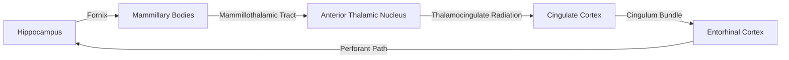

## Limbic System Structures

### Overview

The limbic system is a set of interconnected subcortical and cortical structures involved in emotion generation and regulation, memory formation, motivation, and autonomic/endocrine control. The term originates from Paul Broca's 1878 description of the "grand lobe limbique," a ring of cortex bordering the corpus callosum and diencephalon (Latin *limbus* = border). The concept was substantially expanded by James Papez (1937), whose proposed circuit for emotional expression became the anatomical core of what Paul MacLean later termed the "limbic system" (1952).

[Inference] The limbic system is not a strictly delineated anatomical entity with universally agreed boundaries; rather, it is a functional-anatomical grouping that varies somewhat across textbooks and research traditions. Most contemporary accounts include the structures detailed below.

### Core Structures

#### Hippocampus and Hippocampal Formation

- **Location**: Medial temporal lobe, curving along the floor of the lateral ventricle's temporal horn.
- **Subdivisions**: Dentate gyrus, cornu ammonis fields (CA1–CA4), subiculum, presubiculum, parasubiculum, and entorhinal cortex (the latter often grouped as "hippocampal formation" rather than hippocampus proper).
- **Function**: Declarative (explicit) memory consolidation, spatial navigation and cognitive mapping, pattern separation and pattern completion.
- **Key circuitry**: The trisynaptic circuit — entorhinal cortex → dentate gyrus (perforant path) → CA3 (mossy fibers) → CA1 (Schaffer collaterals) → subiculum → entorhinal cortex (output).
- **Clinical correlation**: Bilateral hippocampal damage (e.g., patient H.M.) produces profound anterograde amnesia with relative sparing of procedural memory and working memory. The hippocampus is also an early and severe site of pathology in Alzheimer's disease.

#### Amygdala

- **Location**: Almond-shaped nuclear mass in the anteromedial temporal lobe, anterior to the hippocampus.
- **Subdivisions**: Basolateral complex (lateral, basal, accessory basal nuclei), corticomedial nuclei, central nucleus.
- **Function**: Fear conditioning and threat detection, emotional salience tagging of memories, modulation of autonomic and endocrine fear responses via projections to the hypothalamus and brainstem.
- **Key circuitry**: Sensory input converges on the lateral nucleus; information is processed through basolateral nuclei; output is primarily via the central nucleus to the hypothalamus (autonomic response), periaqueductal gray (freezing behavior), and brainstem nuclei.
- **Clinical correlation**: Bilateral amygdala damage (e.g., Urbach-Wiethe disease) impairs fear recognition, particularly of facial expressions, and reduces conditioned fear acquisition.

#### Hypothalamus

- **Location**: Ventral diencephalon, below the thalamus, forming the floor and part of the lateral walls of the third ventricle.
- **Function**: Homeostatic regulation (temperature, hunger, thirst, circadian rhythm), neuroendocrine control via the hypothalamic-pituitary axis, autonomic nervous system output, and expression of emotional/motivational states (rage, pleasure).
- **Key nuclei**: Paraventricular nucleus (oxytocin, vasopressin, CRH), suprachiasmatic nucleus (circadian pacemaker), ventromedial and lateral nuclei (satiety/hunger), mammillary bodies (part of the Papez circuit).
- **Note**: The mammillary bodies, technically part of the hypothalamus, are frequently discussed separately within limbic circuitry due to their prominent role in the Papez circuit and their vulnerability in Wernicke-Korsakoff syndrome.

#### Cingulate Gyrus (Cingulate Cortex)

- **Location**: Arches over the corpus callosum on the medial surface of each cerebral hemisphere.
- **Subdivisions**: Anterior cingulate cortex (ACC), posterior cingulate cortex (PCC), and (in some schemes) retrosplenial cortex.
- **Function**: ACC — conflict monitoring, error detection, emotional regulation, pain affect, autonomic control. PCC — self-referential processing, part of the default mode network, contributes to spatial and episodic memory retrieval.
- **Clinical correlation**: Cingulotomy (surgical lesioning of the anterior cingulate) has historically been used for treatment-resistant depression and OCD.

#### Fornix

- **Location**: C-shaped white matter tract.
- **Function**: Major output pathway of the hippocampus, carrying fibers from the subiculum and hippocampus proper to the mammillary bodies and septal nuclei.
- **Course**: Fimbria → crus of fornix → body of fornix → columns of fornix → mammillary bodies (postcommissural fibers) and septal area (precommissural fibers).

#### Septal Nuclei (Septal Area)

- **Location**: Medial and lateral septal nuclei, near the midline beneath the corpus callosum, anterior to the fornix columns.
- **Function**: Reward processing (historically implicated in Olds and Milner's intracranial self-stimulation experiments), modulation of hippocampal theta rhythm, interconnection hub between hippocampus, hypothalamus, and brainstem.

#### Thalamus (Limbic-Relevant Nuclei)

- **Anterior nucleus**: Receives mammillothalamic tract input from mammillary bodies; relays to cingulate cortex; integral node of the Papez circuit.
- **Mediodorsal nucleus**: Reciprocal connections with prefrontal cortex and amygdala; implicated in emotional and cognitive integration.

#### Olfactory Structures

- **Olfactory bulb and tract**: Direct sensory input historically central to the "paleomammalian" origin of the limbic concept.
- **Piriform cortex, uncus**: Primary olfactory cortex; the only sensory modality with direct cortical access bypassing the thalamus, which explains the strong link between smell and emotional/autobiographical memory.

#### Basal Forebrain Structures (Often Included)

- **Nucleus accumbens**: Ventral striatum component, central to reward, motivation, and reinforcement learning; major dopaminergic target from the ventral tegmental area.
- **Basal nucleus of Meynert**: Major source of cortical cholinergic innervation; degenerates in Alzheimer's disease.

### The Papez Circuit

James Papez's 1937 circuit was proposed as the anatomical substrate of emotional experience and expression. Though its role as a pure "emotion circuit" has been revised (it is now understood to be more directly involved in memory consolidation), it remains foundational to limbic anatomy teaching.

**Pathway**:

$$\text{Hippocampus} \rightarrow \text{Fornix} \rightarrow \text{Mammillary Bodies} \rightarrow \text{Mammillothalamic Tract} \rightarrow \text{Anterior Thalamic Nucleus} \rightarrow \text{Cingulate Cortex} \rightarrow \text{Cingulum} \rightarrow \text{Hippocampus (Entorhinal Cortex)}$$

**Clinical relevance**: Damage to any node — particularly the mammillary bodies (thiamine deficiency, Wernicke-Korsakoff syndrome) or the anterior thalamic nucleus (thalamic stroke) — can produce anterograde amnesia, underscoring the circuit's role in memory rather than pure affect.

### MacLean's Extension and the Triune Brain (Historical Model)

Paul MacLean expanded Papez's circuit into the "limbic system" and proposed the "triune brain" model: reptilian complex (brainstem/basal ganglia), paleomammalian complex (limbic system), and neomammalian complex (neocortex).

[Speculation] While historically influential and still widely referenced in introductory teaching, the triune brain model is considered largely obsolete in contemporary comparative neuroscience, as it oversimplifies evolutionary neuroanatomy — the neocortex, for instance, has homologs in non-mammalian vertebrates, and limbic structures are not a simple evolutionary layer added atop a "reptilian" core.

### Amygdala vs. Hippocampus: Functional Dissociation

| Feature | Amygdala | Hippocampus |
| --- | --- | --- |
| Primary role | Emotional salience, fear conditioning | Declarative memory, spatial cognition |
| Memory type | Implicit emotional memory | Explicit/episodic memory |
| Lesion effect | Impaired fear recognition, blunted emotional response | Anterograde amnesia |
| Key output | Central nucleus → hypothalamus/brainstem | Subiculum → fornix → mammillary bodies |
| Interaction | Modulates hippocampal encoding strength for emotionally salient events (e.g., flashbulb memories) | Provides contextual/spatial framing for amygdala-tagged memories |

### Illustrative Diagram: Limbic System Overview

<svg xmlns="http://www.w3.org/2000/svg" viewBox="0 0 800 500">
<text x="400" y="30" font-size="18" font-weight="bold" text-anchor="middle" fill="#222">Limbic System Structures (svg_diagram)</text>

<ellipse cx="400" cy="280" rx="320" ry="180" fill="none" stroke="#888" stroke-width="2" />

<path d="M 220 200 Q 400 130 580 200" fill="none" stroke="#aaa" stroke-width="6" stroke-linecap="round" />
<text x="400" y="120" font-size="12" text-anchor="middle" fill="#666">Corpus Callosum</text>

<path d="M 230 210 Q 400 150 570 210" fill="none" stroke="#d4645a" stroke-width="10" stroke-linecap="round" />
<text x="400" y="165" font-size="12" text-anchor="middle" fill="#d4645a" font-weight="bold">Cingulate Gyrus</text>

<path d="M 300 230 Q 400 260 500 230" fill="none" stroke="#c9a227" stroke-width="5" stroke-linecap="round" />
<text x="400" y="250" font-size="11" text-anchor="middle" fill="#8a6d1a">Fornix</text>

<ellipse cx="400" cy="270" rx="55" ry="35" fill="#9b7fd4" opacity="0.85" />
<text x="400" y="275" font-size="12" text-anchor="middle" fill="#fff" font-weight="bold">Thalamus</text>
<text x="400" y="250" font-size="9" text-anchor="middle" fill="#fff">(Anterior Nucleus)</text>

<ellipse cx="400" cy="330" rx="40" ry="22" fill="#5aa9d4" />
<text x="400" y="334" font-size="11" text-anchor="middle" fill="#fff" font-weight="bold">Hypothalamus</text>

<circle cx="400" cy="365" r="10" fill="#3d7ea6" />
<text x="400" y="390" font-size="9" text-anchor="middle" fill="#3d7ea6">Mammillary Body</text>

<path d="M 200 320 Q 170 350 190 390 Q 220 420 260 400 Q 240 370 260 340 Q 230 320 200 320 Z" fill="#4caf7d" />
<text x="160" y="420" font-size="11" fill="#2e7d54" font-weight="bold">Hippocampus</text>

<path d="M 600 320 Q 630 350 610 390 Q 580 420 540 400 Q 560 370 540 340 Q 570 320 600 320 Z" fill="#4caf7d" />
<text x="595" y="420" font-size="11" fill="#2e7d54" font-weight="bold">Hippocampus</text>

<circle cx="240" cy="350" r="16" fill="#e08a2c" />
<text x="180" y="345" font-size="11" fill="#b5691a" font-weight="bold">Amygdala</text>

<circle cx="560" cy="350" r="16" fill="#e08a2c" />
<text x="590" y="345" font-size="11" fill="#b5691a" font-weight="bold">Amygdala</text>

<circle cx="400" cy="230" r="10" fill="#c65fa0" />
<text x="400" y="205" font-size="10" text-anchor="middle" fill="#c65fa0">Septal Area</text>

<rect x="20" y="440" width="12" height="12" fill="#d4645a" />
<text x="38" y="450" font-size="11" fill="#333">Cingulate Cortex</text>
<rect x="180" y="440" width="12" height="12" fill="#4caf7d" />
<text x="198" y="450" font-size="11" fill="#333">Hippocampus</text>
<rect x="320" y="440" width="12" height="12" fill="#e08a2c" />
<text x="338" y="450" font-size="11" fill="#333">Amygdala</text>
<rect x="440" y="440" width="12" height="12" fill="#5aa9d4" />
<text x="458" y="450" font-size="11" fill="#333">Hypothalamus</text>
<rect x="600" y="440" width="12" height="12" fill="#9b7fd4" />
<text x="618" y="450" font-size="11" fill="#333">Thalamus</text>
</svg>

### Functional Integration Summary

| Structure | Primary Function | Key Connections |
| --- | --- | --- |
| Hippocampus | Declarative memory, spatial cognition | Entorhinal cortex, fornix, mammillary bodies |
| Amygdala | Fear/emotional processing, salience | Hypothalamus, PAG, sensory thalamus/cortex |
| Hypothalamus | Homeostasis, autonomic/endocrine output | Pituitary, brainstem autonomic centers, amygdala |
| Cingulate cortex | Emotion regulation, conflict monitoring | Prefrontal cortex, anterior thalamus |
| Fornix | Hippocampal output tract | Hippocampus ↔ mammillary bodies/septum |
| Septal nuclei | Reward, hippocampal modulation | Hippocampus, hypothalamus, habenula |
| Nucleus accumbens | Reward, motivation | VTA (dopamine), prefrontal cortex |
| Mammillary bodies | Memory circuit relay | Fornix, anterior thalamus |

### Clinical Correlations

- **Klüver-Bucy syndrome**: Bilateral temporal lobe (including amygdala) lesions producing hyperorality, hypersexuality, placidity, and visual agnosia.
- **Wernicke-Korsakoff syndrome**: Thiamine deficiency (often alcohol-related) damaging mammillary bodies and thalamic nuclei, producing severe anterograde amnesia and confabulation.
- **Temporal lobe epilepsy**: Seizure foci frequently arise in the hippocampus/amygdala (mesial temporal sclerosis), producing characteristic auras (fear, déjà vu, olfactory hallucinations).
- **Alzheimer's disease**: Early neurofibrillary tangle deposition in entorhinal cortex and hippocampus correlates with early memory symptoms.

### Related Topics

- Basal ganglia circuitry and its interaction with limbic reward pathways
- Neurotransmitter systems of the limbic system (dopaminergic mesolimbic pathway, serotonergic and noradrenergic modulation)
- Prefrontal-limbic circuitry and top-down emotion regulation
- Default mode network and posterior cingulate/precuneus function
- Hypothalamic-pituitary-adrenal (HPA) axis and stress physiology
- Memory systems taxonomy (declarative vs. non-declarative memory)
- Fear conditioning paradigms and extinction learning
- Neuroanatomy of the medial temporal lobe in detail (entorhinal, perirhinal, parahippocampal cortices)