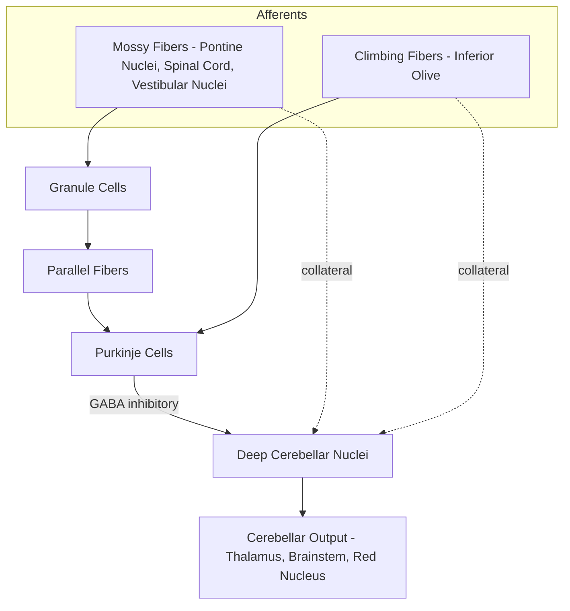

## Cerebellum Anatomy and Connections

### Overview

The cerebellum ("little brain") is a densely foliated structure located in the posterior cranial fossa, dorsal to the pons and medulla, separated from the occipital lobes by the tentorium cerebelli. Despite constituting roughly 10% of total brain volume, [Unverified] it contains a substantial majority of the brain's total neurons — commonly cited estimates put this at over half, largely due to the extraordinarily dense population of granule cells. The cerebellum is classically associated with motor coordination, balance, and motor learning, though contemporary research implicates it in cognitive and affective processing as well.

### Gross Anatomical Organization

#### External Anatomy

- **Vermis**: Midline structure connecting the two cerebellar hemispheres; associated with axial/postural control and eye movements.
- **Cerebellar hemispheres**: Paired lateral structures; associated with coordination of ipsilateral limb movements.
- **Folia**: Fine, parallel-ridged surface convolutions that dramatically increase cortical surface area.
- **Fissures**: Divide the cerebellum into lobes; the primary fissure separates the anterior and posterior lobes, and the posterolateral fissure separates the posterior lobe from the flocculonodular lobe.

#### Lobar Divisions

| Lobe | Location | Primary Function |
| --- | --- | --- |
| Anterior lobe | Rostral to primary fissure | Limb coordination, proprioceptive processing |
| Posterior lobe | Between primary and posterolateral fissures | Fine motor coordination, cognitive functions |
| Flocculonodular lobe | Most inferior/posterior | Vestibular reflexes, balance, eye movement control |

#### Functional-Phylogenetic Divisions

A parallel classification scheme, based on phylogeny and connectivity rather than gross fissures, is often more clinically and functionally relevant:

| Division | Phylogenetic Name | Corresponds To | Function |
| --- | --- | --- | --- |
| Vestibulocerebellum | Archicerebellum | Flocculonodular lobe | Balance, vestibulo-ocular reflex |
| Spinocerebellum | Paleocerebellum | Vermis + intermediate hemisphere | Muscle tone, posture, gait, limb coordination |
| Cerebrocerebellum | Neocerebellum | Lateral hemispheres | Motor planning, timing, cognitive/language functions (via cerebral cortex loops) |

### Cerebellar Cortex: Layered Microarchitecture

The cerebellar cortex has a highly stereotyped, three-layered structure repeated uniformly across its entire surface.

1. **Molecular layer** (outermost): Contains stellate and basket cell interneurons, parallel fibers (axons of granule cells), and Purkinje cell dendritic trees.
2. **Purkinje cell layer**: Single layer of large, GABAergic Purkinje cell bodies — the sole output neurons of the cerebellar cortex.
3. **Granule cell layer** (innermost): Densely packed granule cells (the most numerous neuron type in the brain) and Golgi cell interneurons.

#### Key Cell Types and Circuitry

| Cell Type | Neurotransmitter | Role |
| --- | --- | --- |
| Purkinje cell | GABA (inhibitory) | Sole cortical output; inhibits deep cerebellar nuclei |
| Granule cell | Glutamate (excitatory) | Relays mossy fiber input via parallel fibers to Purkinje dendrites |
| Golgi cell | GABA (inhibitory) | Feedback inhibition onto granule cells |
| Basket cell | GABA (inhibitory) | Lateral inhibition of adjacent Purkinje cells |
| Stellate cell | GABA (inhibitory) | Inhibits Purkinje cell dendrites |
| Unipolar brush cell | Glutamate (excitatory) | Amplifies mossy fiber signals, mainly in vestibulocerebellum |

#### Two Principal Afferent Fiber Types

- **Mossy fibers**: Originate from pontine nuclei, spinal cord, and vestibular nuclei; synapse on granule cells in cerebellar glomeruli; granule cell axons ascend and bifurcate into parallel fibers that synapse on many Purkinje cells (~200,000 per Purkinje cell), producing simple spikes.
- **Climbing fibers**: Originate exclusively from the inferior olivary nucleus (contralateral); each climbing fiber wraps around and makes powerful multiple synapses onto a single Purkinje cell, producing complex spikes. [Inference] Climbing fiber activity is widely thought to encode "error signals" central to cerebellar motor learning theories (e.g., Marr-Albus-Ito model), though the precise computational role remains an active research area.

### Deep Cerebellar Nuclei

Embedded within the cerebellar white matter, these nuclei represent the primary output stage of the cerebellum. Purkinje cells inhibit these nuclei, while mossy and climbing fiber collaterals provide direct excitatory drive — a dual excitatory-inhibitory arrangement.

| Nucleus | Location (medial→lateral) | Primary Output Target |
| --- | --- | --- |
| Fastigial | Most medial | Vestibular nuclei, reticular formation (posture, balance) |
| Globose and Emboliform (Interposed nuclei) | Intermediate | Red nucleus (limb coordination) |
| Dentate | Most lateral, largest | Ventrolateral thalamus → motor cortex (motor planning, cognition) |

[Note] The flocculonodular lobe (vestibulocerebellum) is unusual in that it projects directly to the vestibular nuclei, largely bypassing the deep cerebellar nuclei.

### Cerebellar Peduncles

Three paired white matter tracts connect the cerebellum to the brainstem, carrying the great majority of afferent and efferent traffic.

| Peduncle | Connects To | Primary Direction | Major Tracts Carried |
| --- | --- | --- | --- |
| Superior cerebellar peduncle (brachium conjunctivum) | Midbrain | Primarily efferent | Dentatothalamic, interposed-rubral tracts |
| Middle cerebellar peduncle (brachium pontis) | Pons | Afferent only | Pontocerebellar fibers (largest peduncle) |
| Inferior cerebellar peduncle (restiform body) | Medulla | Mixed afferent/efferent | Dorsal spinocerebellar tract, olivocerebellar fibers, vestibulocerebellar fibers |

### Major Functional Circuits

#### Cerebrocerebellar Loop (Motor Planning)

$$\text{Cerebral Cortex} \rightarrow \text{Pontine Nuclei} \rightarrow \text{Contralateral Cerebellar Hemisphere} \rightarrow \text{Dentate Nucleus} \rightarrow \text{Contralateral Ventrolateral Thalamus} \rightarrow \text{Motor Cortex}$$

This double decussation means that each cerebellar hemisphere ultimately influences the **ipsilateral** body — a key clinical point distinguishing cerebellar from cerebral lesions.

#### Spinocerebellar Loop (Ongoing Movement Feedback)

- **Dorsal (posterior) spinocerebellar tract**: Carries unconscious proprioceptive information from the lower limb/trunk, entering via the inferior cerebellar peduncle.
- **Ventral (anterior) spinocerebellar tract**: Also lower limb proprioception, but crosses twice (double decussation) and enters via the superior cerebellar peduncle.
- **Cuneocerebellar tract**: Upper limb equivalent of the dorsal spinocerebellar tract.

#### Vestibulocerebellar Loop (Balance and Eye Movements)

Vestibular nuclei and primary vestibular afferents project to the flocculonodular lobe, which projects back to the vestibular nuclei to coordinate the vestibulo-ocular reflex (VOR) and postural balance.

### Illustrative Diagram: Cerebellar Circuit Overview

<svg xmlns="http://www.w3.org/2000/svg" viewBox="0 0 800 480">
<text x="400" y="30" font-size="18" font-weight="bold" text-anchor="middle" fill="#222">Cerebellar Cortical Circuit (svg_diagram)</text>

<rect x="100" y="60" width="600" height="90" fill="#e8f0fb" stroke="#9bb8e0" stroke-width="1" />
<text x="120" y="80" font-size="12" fill="#3a5a8c" font-weight="bold">Molecular Layer</text>

<rect x="100" y="150" width="600" height="40" fill="#fbe8ec" stroke="#d98ea0" />
<text x="120" y="175" font-size="12" fill="#a13a55" font-weight="bold">Purkinje Cell Layer</text>

<rect x="100" y="190" width="600" height="90" fill="#eafbea" stroke="#8ed99b" />
<text x="120" y="210" font-size="12" fill="#2e7d3a" font-weight="bold">Granule Cell Layer</text>

<rect x="100" y="280" width="600" height="50" fill="#f0f0f0" stroke="#bbb" />
<text x="120" y="300" font-size="12" fill="#555" font-weight="bold">White Matter / Deep Cerebellar Nuclei</text>

<circle cx="400" cy="170" r="12" fill="#c1355f" />
<text x="420" y="175" font-size="11" fill="#a13a55">Purkinje cell body</text>

<path d="M 400 158 L 380 100 M 400 158 L 400 90 M 400 158 L 420 100" stroke="#c1355f" stroke-width="2" fill="none" />

<line x1="150" y1="100" x2="650" y2="100" stroke="#5a8cc9" stroke-width="2" />
<text x="660" y="104" font-size="10" fill="#3a5a8c">Parallel fiber</text>

<circle cx="400" cy="240" r="6" fill="#3a9b4d" />
<text x="415" y="244" font-size="10" fill="#2e7d3a">Granule cell</text>
<line x1="400" y1="234" x2="400" y2="100" stroke="#3a9b4d" stroke-width="1.5" />

<path d="M 150 320 Q 250 300 400 246" stroke="#e08a2c" stroke-width="3" fill="none" />
<text x="150" y="340" font-size="11" fill="#b5691a" font-weight="bold">Mossy fiber (pontine nuclei)</text>

<path d="M 650 320 Q 550 250 400 170" stroke="#7a4fc9" stroke-width="3" fill="none" />
<text x="560" y="340" font-size="11" fill="#5a35a0" font-weight="bold">Climbing fiber (inferior olive)</text>

<line x1="400" y1="182" x2="400" y2="290" stroke="#c1355f" stroke-width="2" stroke-dasharray="4,3" />
<text x="410" y="310" font-size="10" fill="#a13a55">Inhibitory output to DCN</text>

<path d="M 400 330 L 400 420" stroke="#333" stroke-width="2" marker-end="url(#arrow)" />
<text x="410" y="410" font-size="11" fill="#333" font-weight="bold">To thalamus / brainstem</text>
</svg>

### Blood Supply

| Artery | Territory |
| --- | --- |
| Superior cerebellar artery (SCA) | Superior cerebellum, superior cerebellar peduncle |
| Anterior inferior cerebellar artery (AICA) | Anterolateral cerebellum, flocculus, middle cerebellar peduncle |
| Posterior inferior cerebellar artery (PICA) | Posteroinferior cerebellum, inferior cerebellar peduncle, lateral medulla |

[Note] PICA territory infarcts are clinically significant as they can produce lateral medullary (Wallenberg) syndrome due to concurrent brainstem involvement.

### Clinical Correlations

- **Ipsilateral motor signs**: Due to double decussation, cerebellar hemisphere lesions cause ipsilateral (not contralateral) motor deficits — a key distinguishing feature from cerebral lesions.
- **Dysmetria and intention tremor**: Impaired trajectory/endpoint control of voluntary movement, tested clinically via finger-to-nose and heel-to-shin tests.
- **Dysdiadochokinesia**: Impaired rapid alternating movements.
- **Ataxic gait**: Wide-based, staggering gait from spinocerebellar/vermian dysfunction.
- **Nystagmus and VOR abnormalities**: From flocculonodular lobe/vestibulocerebellar dysfunction.
- **Scanning dysarthria**: Irregular, poorly coordinated speech from cerebellar involvement in speech motor control.
- **Cerebellar cognitive affective syndrome (CCAS/Schmahmann syndrome)**: [Inference] Increasingly recognized cluster of executive dysfunction, impaired spatial cognition, personality change, and language deficits following lesions of the posterior lobe and vermis, supporting a broader role for the cerebellum beyond pure motor control.
- **Common pathologies**: Cerebellar stroke, alcohol-related cerebellar degeneration (anterior lobe/vermis predilection), spinocerebellar ataxias (genetic, progressive), medulloblastoma (pediatric posterior fossa tumor), Arnold-Chiari malformation.

### Related Topics

- Basal ganglia motor loops and comparison with cerebellar circuits
- Motor learning theories (Marr-Albus-Ito cerebellar learning model)
- Vestibular system anatomy and the vestibulo-ocular reflex
- Brainstem anatomy: pons, medulla, and cranial nerve nuclei
- Ataxia differential diagnosis and localization
- Cerebellar cognitive affective syndrome and cerebro-cerebellar cognitive circuits
- Proprioceptive pathways: dorsal column-medial lemniscus vs. spinocerebellar tracts
- Neuroimaging of posterior fossa structures (MRI protocols for cerebellar evaluation)