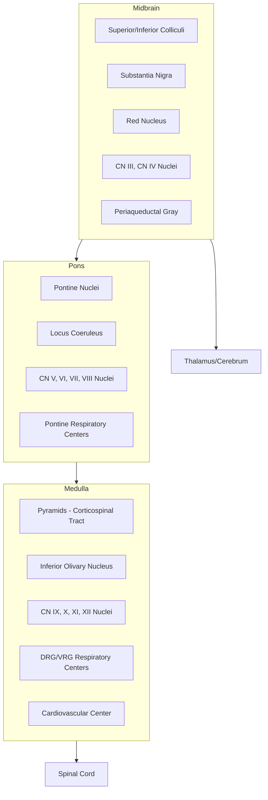

## Brainstem Nuclei and Functions

### Overview

The brainstem connects the cerebrum and diencephalon to the spinal cord and cerebellum, comprising the midbrain (mesencephalon), pons (metencephalon, ventral part), and medulla oblongata (myelencephalon). It houses the majority of cranial nerve nuclei (III–XII), major ascending and descending white matter tracts, the reticular formation, and nuclei controlling arousal, autonomic regulation, and vital functions (respiration, cardiovascular control). Damage to relatively small brainstem regions can be disproportionately life-threatening given the density of critical structures packed into a small volume.

### General Organizational Principles

- **Cranial nerve nuclei columns**: Arranged in longitudinal functional columns along the brainstem, reflecting embryological origin — somatic motor, branchial (special visceral) motor, general visceral (autonomic) motor, general visceral sensory, special visceral (taste) sensory, general somatic sensory, and special somatic sensory (vestibulocochlear).
- **Motor nuclei tend to be medial; sensory nuclei tend to be lateral** — a rule inherited from the alar (sensory, dorsal) and basal (motor, ventral) plate organization of the embryonic neural tube, with the sulcus limitans marking the boundary.
- **Long tracts pass through**: Corticospinal, corticobulbar, spinothalamic, dorsal column-medial lemniscal pathways, and cerebellar peduncles all traverse the brainstem, making brainstem lesions classically produce "crossed" syndromes (ipsilateral cranial nerve deficit + contralateral body deficit).

### Midbrain (Mesencephalon)

#### Key Structures

| Structure | Function |
| --- | --- |
| Superior colliculi | Visual reflexes, saccadic eye movement coordination |
| Inferior colliculi | Auditory relay, sound localization |
| Substantia nigra (pars compacta/reticulata) | Dopaminergic output to striatum; basal ganglia motor circuit |
| Red nucleus | Rubrospinal tract origin; limb flexor tone, motor coordination |
| Periaqueductal gray (PAG) | Descending pain modulation, defensive behaviors, fear/analgesia |
| Cerebral peduncles (crus cerebri) | Corticospinal and corticopontine fibers |
| Ventral tegmental area (VTA) | Dopaminergic reward pathway origin (mesolimbic/mesocortical) |

#### Cranial Nerve Nuclei

| Nerve | Nucleus | Function |
| --- | --- | --- |
| CN III (Oculomotor) | Oculomotor nucleus, Edinger-Westphal nucleus | Extraocular muscles (except lateral rectus, superior oblique); pupillary constriction, accommodation |
| CN IV (Trochlear) | Trochlear nucleus | Superior oblique muscle (only cranial nerve exiting dorsally, and the only one that decussates) |

### Pons (Metencephalon)

#### Key Structures

| Structure | Function |
| --- | --- |
| Basis pontis (pontine nuclei) | Relay from cerebral cortex to contralateral cerebellum (cerebrocerebellar loop) |
| Locus coeruleus | Primary noradrenergic nucleus of the CNS; arousal, attention, stress response |
| Pontine reticular formation | Arousal, muscle tone regulation, REM sleep generation |
| Superior olivary complex | Binaural sound localization (interaural time/intensity differences) |
| Pneumotaxic/apneustic centers | Modulation of respiratory rhythm (in conjunction with medullary centers) |

#### Cranial Nerve Nuclei

| Nerve | Nucleus | Function |
| --- | --- | --- |
| CN V (Trigeminal) | Main sensory, spinal, mesencephalic nuclei; motor nucleus | Facial/oral sensation, mastication muscles |
| CN VI (Abducens) | Abducens nucleus | Lateral rectus muscle |
| CN VII (Facial) | Facial motor nucleus, solitary nucleus (rostral), superior salivatory nucleus | Facial expression muscles, taste (anterior 2/3 tongue), lacrimal/salivary glands |
| CN VIII (Vestibulocochlear) | Vestibular nuclei, cochlear nuclei | Balance, hearing |

[Note] The vestibular nuclei (superior, inferior, medial, lateral) straddle the pontomedullary junction and are frequently grouped with pontine structures, though the inferior and medial nuclei extend into the medulla.

### Medulla Oblongata (Myelencephalon)

#### Key Structures

| Structure | Function |
| --- | --- |
| Pyramids | Corticospinal tract; pyramidal decussation marks the medulla-spinal cord boundary |
| Inferior olivary nucleus | Major climbing fiber input to cerebellum; motor learning/error signaling |
| Nucleus gracilis and cuneatus | Relay of dorsal column proprioceptive/fine touch information; decussate as internal arcuate fibers to form the medial lemniscus |
| Dorsal motor nucleus of vagus | Parasympathetic output to thoracic/abdominal viscera |
| Nucleus ambiguus | Motor output to pharynx, larynx (swallowing, phonation) |
| Nucleus tractus solitarius (caudal) | Visceral sensory integration, cardiovascular/respiratory reflexes |
| Area postrema | Chemoreceptor trigger zone (emesis); lacks blood-brain barrier |

#### Cardiorespiratory Control Centers

- **Dorsal respiratory group (DRG)**: Primarily inspiratory drive, located near the nucleus tractus solitarius.
- **Ventral respiratory group (VRG)**: Contains the pre-Bötzinger complex, considered the primary rhythm-generating region for respiration; active in both inspiration and expiration.
- **Cardiovascular (vasomotor) center**: Integrates baroreceptor/chemoreceptor input to regulate heart rate and vascular tone via sympathetic and parasympathetic (vagal) output.

#### Cranial Nerve Nuclei

| Nerve | Nucleus | Function |
| --- | --- | --- |
| CN IX (Glossopharyngeal) | Nucleus ambiguus, solitary nucleus, inferior salivatory nucleus | Pharyngeal muscles, taste (posterior 1/3 tongue), parotid gland, carotid body/sinus sensation |
| CN X (Vagus) | Nucleus ambiguus, dorsal motor nucleus, solitary nucleus | Pharyngeal/laryngeal muscles, parasympathetic to thoracoabdominal viscera, visceral sensation |
| CN XI (Accessory) | Spinal accessory nucleus (extends into cervical cord) | Sternocleidomastoid, trapezius |
| CN XII (Hypoglossal) | Hypoglossal nucleus | Intrinsic/extrinsic tongue muscles |

### Reticular Formation

A diffuse network of interconnected nuclei running through the core of the brainstem from medulla to midbrain, not confined to a single subdivision.

- **Ascending reticular activating system (ARAS)**: Projects to thalamus and cortex; maintains wakefulness and consciousness; damage produces coma.
- **Raphe nuclei**: Serotonergic nuclei distributed along the midline of the brainstem; mood regulation, sleep-wake cycling, pain modulation.
- **Locus coeruleus**: [Cross-referenced above] Primary source of CNS norepinephrine.
- **Central pattern generators**: Contribute to rhythmic motor behaviors including respiration and locomotion.

### Classic Crossed Brainstem Syndromes

Brainstem vascular lesions classically produce ipsilateral cranial nerve signs with contralateral body (long tract) signs, since cranial nerve nuclei/fascicles have not yet decussated at the point of lesion while corticospinal/spinothalamic fibers have (or will, more caudally).

| Syndrome | Level | Key Features |
| --- | --- | --- |
| Weber syndrome | Midbrain (medial) | Ipsilateral CN III palsy + contralateral hemiparesis |
| Wallenberg syndrome (lateral medullary) | Medulla (PICA territory) | Ipsilateral facial pain/temperature loss, ataxia, Horner syndrome; contralateral body pain/temperature loss; dysphagia, dysarthria |
| Millard-Gubler syndrome | Pons (ventral) | Ipsilateral CN VI and VII palsy + contralateral hemiparesis |
| Medial medullary syndrome | Medulla (anterior spinal artery territory) | Ipsilateral tongue weakness (CN XII) + contralateral hemiparesis and dorsal column loss |

### Illustrative Diagram: Brainstem Cranial Nerve Nuclei (Dorsal View Schematic)

<svg xmlns="http://www.w3.org/2000/svg" viewBox="0 0 700 520">
<text x="350" y="28" font-size="18" font-weight="bold" text-anchor="middle" fill="#222">Brainstem Cranial Nerve Nuclei — Dorsal View (svg_diagram)</text>

<rect x="250" y="50" width="200" height="90" rx="20" fill="#f6e2c4" stroke="#c99a4a" stroke-width="2" />
<text x="350" y="75" font-size="13" font-weight="bold" text-anchor="middle" fill="#7a5420">Midbrain</text>
<circle cx="310" cy="105" r="8" fill="#c1355f" /><text x="325" y="110" font-size="10" fill="#a13a55">CN III</text>
<circle cx="390" cy="105" r="8" fill="#c1355f" /><text x="405" y="110" font-size="10" fill="#a13a55">CN IV</text>

<rect x="220" y="150" width="260" height="120" rx="24" fill="#dceaf7" stroke="#5a8cc9" stroke-width="2" />
<text x="350" y="175" font-size="13" font-weight="bold" text-anchor="middle" fill="#2c4a70">Pons</text>
<circle cx="290" cy="205" r="8" fill="#c1355f" /><text x="270" y="225" font-size="10" fill="#a13a55">CN V</text>
<circle cx="330" cy="205" r="8" fill="#c1355f" /><text x="325" y="225" font-size="10" fill="#a13a55">CN VI</text>
<circle cx="370" cy="205" r="8" fill="#c1355f" /><text x="370" y="225" font-size="10" fill="#a13a55">CN VII</text>
<circle cx="410" cy="205" r="8" fill="#c1355f" /><text x="415" y="225" font-size="10" fill="#a13a55">CN VIII</text>

<rect x="240" y="280" width="220" height="160" rx="30" fill="#e2f6e6" stroke="#4caf7d" stroke-width="2" />
<text x="350" y="305" font-size="13" font-weight="bold" text-anchor="middle" fill="#276b45">Medulla</text>
<circle cx="300" cy="340" r="8" fill="#c1355f" /><text x="280" y="360" font-size="10" fill="#a13a55">CN IX</text>
<circle cx="340" cy="340" r="8" fill="#c1355f" /><text x="325" y="360" font-size="10" fill="#a13a55">CN X</text>
<circle cx="380" cy="340" r="8" fill="#c1355f" /><text x="365" y="360" font-size="10" fill="#a13a55">CN XI</text>
<circle cx="420" cy="340" r="8" fill="#c1355f" /><text x="405" y="360" font-size="10" fill="#a13a55">CN XII</text>
<text x="350" y="400" font-size="10" text-anchor="middle" fill="#276b45">Pyramids / Corticospinal Tract (ventral, not shown)</text>

<rect x="320" y="440" width="60" height="60" fill="#eeeeee" stroke="#999" />
<text x="350" y="475" font-size="10" text-anchor="middle" fill="#555">Spinal Cord</text>

<line x1="350" y1="140" x2="350" y2="150" stroke="#666" stroke-width="2" />
<line x1="350" y1="270" x2="350" y2="280" stroke="#666" stroke-width="2" />
<line x1="350" y1="440" x2="350" y2="440" stroke="#666" stroke-width="2" />
</svg>

### Clinical Correlations

- **Locked-in syndrome**: Ventral pontine lesion (often basilar artery occlusion) sparing the reticular formation and CN III/IV nuclei, producing quadriplegia and lower cranial nerve paralysis with preserved consciousness and vertical eye movement/blinking.
- **Coma and brain death evaluation**: Brainstem reflexes (pupillary, corneal, oculocephalic, gag) test the integrity of specific cranial nerve nuclei and their interconnections, forming the basis of brain death examinations.
- **Central pontine myelinolysis**: Rapid correction of hyponatremia can cause demyelination of the basis pontis, producing quadriparesis and pseudobulbar palsy.
- **Progressive supranuclear palsy**: Degeneration affecting midbrain structures including the superior colliculus region, producing vertical gaze palsy.
- **Ondine's curse (congenital central hypoventilation)**: Failure of automatic respiratory drive, implicating dysfunction of medullary respiratory centers.

### Related Topics

- Cranial nerve examination and clinical localization
- Ascending sensory pathways (spinothalamic tract, dorsal column-medial lemniscus)
- Descending motor pathways (corticospinal, rubrospinal, vestibulospinal, reticulospinal tracts)
- Autonomic nervous system central control (hypothalamic-brainstem integration)
- Sleep-wake regulation and the reticular activating system
- Basal ganglia dopaminergic pathways (nigrostriatal, mesolimbic, mesocortical)
- Vascular territories and stroke syndromes of the posterior circulation
- Neuroanatomy of brain death and coma assessment