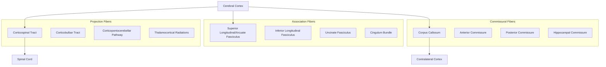

## Major White Matter Tracts and Connectivity

### Overview

White matter consists of myelinated axon bundles that connect neuronal populations within and across brain regions, contrasting with gray matter's predominantly cell-body composition. White matter tracts are classically divided into three broad categories based on the origin and destination of their fibers: **projection fibers** (connecting cortex to subcortical/spinal structures), **association fibers** (connecting cortical regions within the same hemisphere), and **commissural fibers** (connecting corresponding regions across hemispheres). Diffusion tensor imaging (DTI) and tractography have substantially refined the mapping of these pathways over the past two decades, revealing more complex fiber architecture than classical dissection alone suggested.

### Projection Fibers

Fibers connecting the cerebral cortex with subcortical structures, brainstem, and spinal cord, running in a largely vertical orientation.

#### Corticospinal Tract

- **Origin**: Primary motor cortex (~30%), premotor/supplementary motor areas, and primary somatosensory cortex (contributing to dorsal horn modulation).
- **Course**: Corona radiata → posterior limb of internal capsule → cerebral peduncle (midbrain) → basis pontis → medullary pyramids → pyramidal decussation (~85-90% of fibers cross) → lateral corticospinal tract (crossed) and anterior corticospinal tract (uncrossed, ~10-15%).
- **Function**: Voluntary control of contralateral limb musculature (lateral tract) and axial/proximal musculature (anterior tract, bilateral innervation).
- **Clinical correlation**: Upper motor neuron lesions produce spasticity, hyperreflexia, Babinski sign, and initially flaccid paralysis in acute injury (spinal shock).

#### Corticobulbar Tract

- **Course**: Parallels the corticospinal tract through the internal capsule (genu) before terminating on cranial nerve motor nuclei in the brainstem.
- **Function**: Voluntary control of cranial nerve musculature (face, jaw, pharynx, larynx).
- **Note**: Most cranial nerve nuclei receive bilateral corticobulbar input, except the lower facial nucleus (contralateral predominance) and the hypoglossal nucleus, which is clinically relevant in distinguishing upper motor neuron facial/tongue weakness from lower motor neuron patterns.

#### Corticopontocerebellar Pathway

- **Course**: Cortex → corona radiata/internal capsule → cerebral peduncle → pontine nuclei → decussate → middle cerebellar peduncle → contralateral cerebellar cortex.
- **Function**: Forms the afferent limb of the cerebrocerebellar loop for motor planning and coordination.

#### Thalamocortical and Corticothalamic Radiations

- **Anterior limb of internal capsule**: Frontopontine fibers, thalamocortical radiation to prefrontal cortex.
- **Genu**: Corticobulbar fibers.
- **Posterior limb**: Corticospinal fibers, thalamocortical sensory radiations (face, arm, leg somatotopy from posterior to more posterior).
- **Retrolenticular/sublenticular segments**: Optic radiations, auditory radiations.

### Association Fibers

Connect cortical regions within the same hemisphere; subdivided into short (U-fibers, connecting adjacent gyri) and long association tracts (connecting distant lobes).

| Tract | Connects | Function |
| --- | --- | --- |
| Superior longitudinal fasciculus (incl. arcuate fasciculus) | Frontal, parietal, temporal, occipital lobes | Language (arcuate fasciculus links Broca's and Wernicke's areas), visuospatial processing |
| Inferior longitudinal fasciculus | Occipital and temporal lobes | Visual object/face recognition, connects visual cortex to memory/language areas |
| Inferior fronto-occipital fasciculus | Frontal and occipital lobes | Semantic processing, visual attention |
| Uncinate fasciculus | Anterior temporal lobe and orbitofrontal cortex | Semantic memory, emotional regulation, social/affective processing |
| Cingulum bundle | Cingulate cortex to parahippocampal/entorhinal cortex | Papez circuit component; memory, emotion, executive function |
| Superior/Inferior occipitofrontal fasciculi | Occipital and frontal regions | Visual-motor integration |

#### Arcuate Fasciculus (Special Note)

[Inference] Classically described as the direct dorsal pathway connecting Broca's area (posterior inferior frontal gyrus) to Wernicke's area (posterior superior temporal gyrus), the arcuate fasciculus is now understood via modern tractography to be part of a more complex dual-stream language network (dorsal stream for phonological/articulatory processing, ventral stream via the extreme capsule/uncinate fasciculus for semantic processing), per the Hickok-Poeppel model. Damage classically produces conduction aphasia (fluent speech, poor repetition, relatively preserved comprehension).

### Commissural Fibers

Connect homologous (and some non-homologous) regions across the two cerebral hemispheres.

#### Corpus Callosum

- **Largest commissural tract in the brain**, containing approximately 200 million axons.
- **Subdivisions (rostral to caudal)**: Rostrum, genu, body, isthmus, splenium.
- **Topography**: Genu connects prefrontal/frontal regions; body connects motor/parietal regions; splenium connects occipital and posterior temporal regions (including visual cortex).
- **Function**: Interhemispheric integration of sensory, motor, and cognitive information.
- **Clinical correlation**: Callosal disconnection syndrome (split-brain) — classically studied via commissurotomy for refractory epilepsy — demonstrates lateralized processing (e.g., left-hand tactile naming deficits due to disconnection from left-hemisphere language areas, alien hand phenomena in some cases).

#### Anterior Commissure

- **Course**: Crosses anterior to the columns of the fornix.
- **Function**: Connects olfactory structures, anterior temporal lobes (including amygdala), and some middle/inferior temporal gyrus regions; partially compensates for callosal function in agenesis of the corpus callosum.

#### Posterior Commissure

- **Location**: Near the pineal gland, at the junction of the third ventricle and cerebral aqueduct.
- **Function**: Involved in the pupillary light reflex (consensual response) and vertical gaze coordination.

#### Hippocampal Commissure (Commissure of the Fornix)

- **Function**: Connects the two hippocampi via crossing fibers of the fornix body; interhemispheric memory integration.

### Internal Capsule: Detailed Topography

The internal capsule is a critical white matter bottleneck through which nearly all cortical projection fibers pass, making it a high-yield site for clinically devastating focal lesions (e.g., lacunar strokes from lenticulostriate artery occlusion).

| Segment | Location | Fibers Carried |
| --- | --- | --- |
| Anterior limb | Between caudate and lentiform nucleus | Frontopontine, thalamocortical (prefrontal) |
| Genu | Bend between limbs | Corticobulbar |
| Posterior limb | Between thalamus and lentiform nucleus | Corticospinal, thalamocortical (sensory) |
| Retrolenticular part | Posterior to lentiform nucleus | Optic radiations |
| Sublenticular part | Inferior to lentiform nucleus | Auditory radiations |

### Illustrative Diagram: Major Fiber Tract Categories (Coronal-Schematic)

<svg xmlns="http://www.w3.org/2000/svg" viewBox="0 0 750 480">
<text x="375" y="28" font-size="18" font-weight="bold" text-anchor="middle" fill="#222">Three Classes of White Matter Fibers (svg_diagram)</text>

<ellipse cx="375" cy="260" rx="320" ry="190" fill="#faf6ef" stroke="#999" stroke-width="2" />

<ellipse cx="230" cy="260" rx="150" ry="170" fill="#f0ece0" stroke="#bbb" />

<ellipse cx="520" cy="260" rx="150" ry="170" fill="#f0ece0" stroke="#bbb" />

<path d="M 150 190 Q 375 130 600 190" fill="none" stroke="#c1355f" stroke-width="8" stroke-linecap="round" />
<text x="375" y="115" font-size="12" text-anchor="middle" fill="#a13a55" font-weight="bold">Commissural (Corpus Callosum)</text>

<path d="M 130 220 Q 230 380 330 240" fill="none" stroke="#3a9b4d" stroke-width="6" stroke-linecap="round" />
<text x="130" y="410" font-size="12" fill="#2e7d3a" font-weight="bold">Association (e.g., Arcuate F.)</text>

<line x1="520" y1="150" x2="520" y2="420" stroke="#5a8cc9" stroke-width="8" stroke-linecap="round" />
<text x="530" y="440" font-size="12" fill="#3a5a8c" font-weight="bold">Projection (e.g., Corticospinal)</text>

<rect x="500" y="420" width="40" height="30" fill="#ddd" stroke="#999" />
<text x="520" y="465" font-size="10" text-anchor="middle" fill="#555">Spinal Cord</text>
</svg>

### Fiber Tract Summary Table

| Category | Direction | Example Tracts | Key Clinical Syndrome |
| --- | --- | --- | --- |
| Projection | Cortex ↔ subcortical/spinal | Corticospinal, corticobulbar | Upper motor neuron syndrome |
| Association | Intrahemispheric | Arcuate, uncinate, cingulum | Conduction aphasia, disconnection syndromes |
| Commissural | Interhemispheric | Corpus callosum, anterior commissure | Split-brain/callosal disconnection syndrome |

### Clinical Correlations

- **Lacunar stroke (internal capsule)**: Pure motor or pure sensory stroke from small-vessel occlusion (lenticulostriate arteries), given the dense fiber packing in a small territory.
- **Conduction aphasia**: Arcuate fasciculus damage producing fluent speech with impaired repetition and frequent phonemic paraphasias, comprehension relatively intact.
- **Alexia without agraphia**: Splenium of corpus callosum plus left occipital lesion, disconnecting visual input from language areas while sparing writing ability.
- **Agenesis of the corpus callosum**: Congenital absence, with variable clinical presentation ranging from asymptomatic to significant cognitive/behavioral impairment; often partially compensated via anterior commissure and other pathways.
- **Diffuse axonal injury (DAI)**: Traumatic shearing of white matter tracts (especially at gray-white junctions and the corpus callosum) from rotational acceleration forces, a major cause of persistent post-traumatic cognitive impairment.
- **Multiple sclerosis**: Autoimmune demyelination preferentially affecting periventricular white matter, corpus callosum, optic nerves, and brainstem/cerebellar tracts.

### Related Topics

- Diffusion tensor imaging (DTI) and tractography methodology
- Language network models (Hickok-Poeppel dual-stream model, Broca-Wernicke-Geschwind model)
- Internal capsule and basal ganglia lesion syndromes
- Split-brain research and hemispheric lateralization
- White matter changes in neurodegenerative and demyelinating disease
- Corticospinal tract development and plasticity after injury
- Connectomics and structural brain network analysis
- Traumatic brain injury and diffuse axonal injury pathophysiology