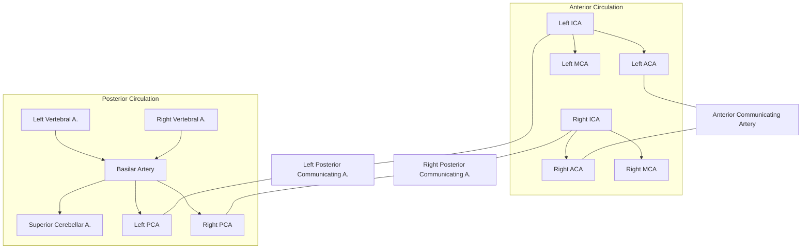

## Cerebral Vasculature and the Blood-Brain Barrier

### Overview

The brain receives approximately 15-20% of resting cardiac output despite constituting only about 2% of body mass, reflecting its extraordinarily high and continuous metabolic demand. Cerebral blood supply is organized into anterior (carotid) and posterior (vertebrobasilar) circulations, unified by the circle of Willis, an anastomotic ring providing collateral flow redundancy. The blood-brain barrier (BBB) is a specialized structural and functional interface that tightly regulates the exchange of substances between systemic circulation and neural tissue, essential for maintaining the stable extracellular environment required for neuronal signaling.

### Arterial Supply: Anterior Circulation

#### Internal Carotid Artery (ICA)

- **Course**: Arises from common carotid bifurcation, ascends through the carotid canal, cavernous sinus (C4 segment), and terminates by bifurcating into the anterior and middle cerebral arteries.
- **Branches**: Ophthalmic artery, posterior communicating artery, anterior choroidal artery, then terminal bifurcation.

#### Anterior Cerebral Artery (ACA)

- **Territory**: Medial frontal and parietal lobes, including the medial primary motor/sensory cortex (leg/foot representation), supplementary motor area, and anterior corpus callosum.
- **Key segments**: A1 (precommunicating, connects to anterior communicating artery), A2 (postcommunicating).
- **Clinical correlation**: Occlusion classically produces contralateral leg-predominant weakness/sensory loss, urinary incontinence, and abulia/personality changes (frontal lobe involvement).

#### Middle Cerebral Artery (MCA)

- **Territory**: Largest cerebral artery territory; lateral frontal, parietal, and temporal lobes, including primary motor/sensory cortex (face/arm representation), Broca's and Wernicke's areas (dominant hemisphere), and lenticulostriate perforators supplying the internal capsule and basal ganglia.
- **Key segments**: M1 (horizontal/sphenoidal), M2 (insular), M3 (opercular), M4 (cortical branches).
- **Clinical correlation**: Most common site of ischemic stroke; produces contralateral face/arm-predominant weakness, aphasia (if dominant hemisphere), hemineglect (if non-dominant hemisphere), and homonymous hemianopia.

### Arterial Supply: Posterior Circulation

#### Vertebral Arteries

- **Origin**: Subclavian arteries, ascending through transverse foramina of cervical vertebrae, entering the skull via the foramen magnum.
- **Branches**: Posterior inferior cerebellar artery (PICA), anterior spinal artery, posterior spinal artery.
- **Union**: The two vertebral arteries merge at the pontomedullary junction to form the basilar artery.

#### Basilar Artery

- **Branches**: Anterior inferior cerebellar artery (AICA), pontine perforating branches, superior cerebellar artery (SCA), terminating in bilateral posterior cerebral arteries.

#### Posterior Cerebral Artery (PCA)

- **Territory**: Occipital lobe (primary visual cortex), medial and inferior temporal lobe, thalamus (via thalamoperforating branches), midbrain.
- **Clinical correlation**: Occlusion produces contralateral homonymous hemianopia (often with macular sparing due to dual MCA/PCA supply to the occipital pole), and can cause thalamic pain syndrome or memory deficits (medial temporal involvement).

### Circle of Willis

An anastomotic arterial ring at the base of the brain connecting anterior and posterior circulations, providing collateral potential in the event of proximal arterial occlusion.

**Components**: Anterior communicating artery, bilateral A1 segments (ACA), bilateral ICA termini, bilateral posterior communicating arteries, bilateral P1 segments (PCA).

[Inference] Anatomical variation in the circle of Willis is common — complete, symmetric circles are present in a minority of the population, which has implications for collateral flow adequacy during acute vessel occlusion and is a recognized risk factor consideration in cerebrovascular disease.

### Venous Drainage

- **Superficial system**: Superior cerebral veins drain into the superior sagittal sinus; superficial middle cerebral vein drains lateral surface.
- **Deep system**: Internal cerebral veins and basal veins of Rosenthal drain deep structures (basal ganglia, thalamus, periventricular white matter), converging to form the great cerebral vein (of Galen), which joins the inferior sagittal sinus to form the straight sinus.
- **Dural venous sinuses**: Superior sagittal sinus, inferior sagittal sinus, straight sinus, transverse sinuses, sigmoid sinuses, converging at the confluence of sinuses, ultimately draining into the internal jugular veins.
- **Clinical correlation**: Cerebral venous sinus thrombosis can produce venous infarction (often hemorrhagic), elevated intracranial pressure, and papilledema; risk factors include hypercoagulable states, pregnancy/postpartum, and dehydration.

### The Blood-Brain Barrier: Structural Components

The BBB is formed primarily at the level of the cerebral capillary endothelium, distinct from peripheral capillaries in several key respects.

| Component | Role |
| --- | --- |
| Endothelial cells (brain capillary) | Joined by tight junctions (claudins, occludins, junctional adhesion molecules); minimal fenestration and low pinocytotic activity |
| Tight junctions | Restrict paracellular diffusion of hydrophilic/large molecules |
| Basement membrane | Structural support, contains extracellular matrix proteins |
| Pericytes | Embedded within the basement membrane; regulate capillary blood flow, BBB integrity, and angiogenesis |
| Astrocyte end-feet | Encircle capillaries; contribute to induction/maintenance of BBB properties, potassium/glutamate buffering |

Collectively, endothelium, pericytes, astrocyte end-feet, and neurons are often described as the **neurovascular unit**, emphasizing the functionally integrated (not merely structural) nature of BBB regulation.

### Transport Mechanisms Across the BBB

| Mechanism | Examples | Notes |
| --- | --- | --- |
| Passive diffusion | Lipophilic molecules (O2, CO2, ethanol, some lipophilic drugs) | Governed by lipid solubility and molecular size |
| Carrier-mediated transport | Glucose (GLUT1), amino acids (LAT1), monocarboxylates | Facilitated diffusion via specific transporters |
| Receptor-mediated transcytosis | Insulin, transferrin, IGF-1 | Used for large molecule delivery, exploited in drug delivery research |
| Active efflux transport | P-glycoprotein, BCRP (breast cancer resistance protein) | Pumps xenobiotics/drugs back into blood, contributing to drug resistance and limiting CNS drug penetration |
| Adsorptive-mediated transcytosis | Cationic proteins | Charge-based, lower specificity |

### Circumventricular Organs (BBB-Deficient Regions)

Certain midline structures adjacent to the ventricular system lack a conventional BBB, permitting direct sensing of, or secretion into, the bloodstream.

| Structure | Function |
| --- | --- |
| Area postrema | Chemoreceptor trigger zone (vomiting reflex, toxin detection) |
| Median eminence | Hypothalamic releasing hormone secretion into hypophyseal portal system |
| Neurohypophysis (posterior pituitary) | Oxytocin/vasopressin release into systemic circulation |
| Subfornical organ | Osmoreceptors, thirst regulation, angiotensin II sensing |
| Organum vasculosum of the lamina terminalis (OVLT) | Osmoreceptors, fever response |
| Pineal gland | Melatonin secretion |

### Illustrative Diagram: Neurovascular Unit and BBB

<ns0:svg xmlns:ns0="[http://www.w3.org/2000/svg" viewBox="0 0 700 400">](http://www.w3.org/2000/svg%22%3E)

<ns0:text x="350" y="28" font-size="18" font-weight="bold" text-anchor="middle" fill="#222">Blood-Brain Barrier — Neurovascular Unit (svg_diagram)</ns0:text>

<ns0:rect x="200" y="150" width="300" height="60" rx="30" fill="#fbdede" stroke="#c1355f" stroke-width="2" />

<ns0:text x="350" y="185" font-size="12" text-anchor="middle" fill="#a13a55" font-weight="bold">Capillary Lumen (blood)</ns0:text>

<ns0:rect x="190" y="140" width="320" height="12" fill="#e0a0b0" stroke="#a13a55" />

<ns0:rect x="190" y="208" width="320" height="12" fill="#e0a0b0" stroke="#a13a55" />

<ns0:text x="530" y="150" font-size="10" fill="#a13a55">Endothelium</ns0:text>

<ns0:circle cx="280" cy="146" r="4" fill="#8c1f3f" />

<ns0:circle cx="350" cy="146" r="4" fill="#8c1f3f" />

<ns0:circle cx="420" cy="146" r="4" fill="#8c1f3f" />

<ns0:text x="440" y="130" font-size="10" fill="#8c1f3f">Tight junctions</ns0:text>

<ns0:rect x="180" y="222" width="340" height="8" fill="#d9d0b8" stroke="#a08e5c" />

<ns0:text x="540" y="230" font-size="10" fill="#a08e5c">Basement membrane</ns0:text>

<ns0:ellipse cx="250" cy="240" rx="35" ry="14" fill="#e8c97a" stroke="#a8862c" />

<ns0:text x="250" y="244" font-size="9" text-anchor="middle" fill="#6b4f14">Pericyte</ns0:text>

<ns0:path d="M 160 260 Q 200 290 250 300 Q 300 310 350 300 Q 400 290 450 300 Q 500 290 540 260" fill="none" stroke="#4caf7d" stroke-width="6" stroke-linecap="round" />

<ns0:text x="350" y="325" font-size="11" text-anchor="middle" fill="#2e7d3a" font-weight="bold">Astrocyte end-feet</ns0:text>

<ns0:circle cx="180" cy="340" r="18" fill="#7fd99b" />

<ns0:text x="150" y="370" font-size="10" fill="#2e7d3a">Astrocyte</ns0:text>

<ns0:circle cx="550" cy="340" r="16" fill="#9b7fd4" />

<ns0:path d="M 550 324 L 530 290 M 550 324 L 550 280 M 550 324 L 570 290" stroke="#9b7fd4" stroke-width="2" fill="none" />

<ns0:text x="560" y="370" font-size="10" fill="#5a35a0">Neuron</ns0:text>

<ns0:line x1="350" y1="180" x2="350" y2="140" stroke="#333" stroke-width="2" marker-end="url(#arrow2)" />

<ns0:text x="360" y="100" font-size="10" fill="#333">Selective transport</ns0:text>

<ns0:defs>

<ns0:marker id="arrow2" markerWidth="10" markerHeight="10" refX="5" refY="5" orient="auto">

<ns0:path d="M0,0 L10,5 L0,10 Z" fill="#333" />

</ns0:marker>

</ns0:defs>

</ns0:svg>

### Clinical Correlations

- **Ischemic stroke**: Occlusion within specific vascular territories produces characteristic, localizable neurological deficits (see territory tables above); time-critical management given the narrow therapeutic window for thrombolysis/thrombectomy.
- **BBB disruption**: Occurs in ischemic stroke, traumatic brain injury, multiple sclerosis (contributing to lesion formation and contrast enhancement on MRI), CNS infections (facilitating pathogen entry, e.g., in bacterial meningitis), and brain tumors (contributing to vasogenic edema and enabling contrast enhancement in imaging).
- **Drug development challenges**: [Inference] The BBB's selective permeability is a major obstacle to CNS drug delivery; efflux transporters such as P-glycoprotein actively exclude many therapeutic candidates, an active area of pharmaceutical research (e.g., nanoparticle carriers, focused ultrasound BBB opening).
- **Watershed (border-zone) infarcts**: Occur at the boundaries between adjacent vascular territories (e.g., ACA-MCA, MCA-PCA borders) during systemic hypoperfusion (e.g., cardiac arrest, severe hypotension) rather than focal arterial occlusion.
- **Subarachnoid hemorrhage**: Most commonly due to rupture of a berry (saccular) aneurysm, frequently located at branch points of the circle of Willis (e.g., anterior communicating artery, posterior communicating artery).

### Related Topics

- Stroke syndromes and vascular territory correlation with neurological deficits
- Neuroimaging techniques for cerebrovascular assessment (CT angiography, MR angiography, digital subtraction angiography)
- Cerebral autoregulation and intracranial pressure dynamics
- Neuroinflammation and BBB breakdown in neurodegenerative disease
- Pharmacokinetics of CNS-active drugs and strategies for BBB penetration
- Aneurysm formation, rupture risk, and subarachnoid hemorrhage management
- Cerebrospinal fluid production, circulation, and the blood-CSF barrier (choroid plexus)
- Neurovascular coupling and functional neuroimaging (fMRI BOLD signal basis)