## Neuroanatomical Planes and Imaging Orientation

### Overview

Neuroanatomical planes and imaging orientation constitute the standardized spatial reference system used to describe location, direction, and sectioning of the central nervous system. This system underlies all neuroimaging interpretation (MRI, CT, PET), surgical planning, histological sectioning, and communication of lesion location in both clinical and research contexts. Because the nervous system bends at the cephalic and cervical flexures during development, its axes of reference deviate from simple body-based planes, requiring cognitive neuroscientists to distinguish between neuraxis-based terms and standard anatomical planes.

### Cardinal Anatomical Planes

**Key Points**

- **Sagittal plane**: divides the body/brain into left and right portions. The **midsagittal** (median) plane produces two symmetric halves; **parasagittal** planes are offset from midline.
- **Coronal plane** (frontal plane): divides structures into anterior (front) and posterior (back) portions; oriented perpendicular to the long axis of the body.
- **Axial plane** (horizontal/transverse plane): divides structures into superior (upper) and inferior (lower) portions, running parallel to the ground in standard anatomical position.

These three mutually orthogonal planes intersect at right angles and form the basis for all volumetric neuroimaging reconstruction (multiplanar reformatting).

Below is a diagram of the three cardinal planes relative to a head:

<svg xmlns="http://www.w3.org/2000/svg" viewBox="0 0 640 420" font-family="Arial, sans-serif">
<text x="320" y="30" text-anchor="middle" font-size="18" font-weight="bold" fill="#222">Cardinal Anatomical Planes (svg_diagram)</text>

<g>
<text x="110" y="65" text-anchor="middle" font-size="14" font-weight="bold" fill="#1a5276">Sagittal Plane</text>
<ellipse cx="110" cy="150" rx="55" ry="75" fill="#eaf2f8" stroke="#1a5276" stroke-width="2" />
<line x1="110" y1="75" x2="110" y2="225" stroke="#c0392b" stroke-width="3" />
<text x="110" y="245" text-anchor="middle" font-size="11" fill="#555">divides L / R</text>
<text x="60" y="150" text-anchor="middle" font-size="10" fill="#333">L</text>
<text x="160" y="150" text-anchor="middle" font-size="10" fill="#333">R</text>
</g>

<g>
<text x="320" y="65" text-anchor="middle" font-size="14" font-weight="bold" fill="#1a5276">Coronal Plane</text>
<ellipse cx="320" cy="150" rx="55" ry="75" fill="#eaf2f8" stroke="#1a5276" stroke-width="2" />
<line x1="245" y1="150" x2="395" y2="150" stroke="#c0392b" stroke-width="3" />
<text x="320" y="245" text-anchor="middle" font-size="11" fill="#555">divides Ant / Post</text>
<text x="320" y="70" text-anchor="middle" font-size="10" fill="#333">A</text>
<text x="320" y="235" text-anchor="middle" font-size="10" fill="#333">P</text>
</g>

<g>
<text x="530" y="65" text-anchor="middle" font-size="14" font-weight="bold" fill="#1a5276">Axial Plane</text>
<ellipse cx="530" cy="150" rx="55" ry="75" fill="#eaf2f8" stroke="#1a5276" stroke-width="2" />
<line x1="475" y1="150" x2="585" y2="150" stroke="#c0392b" stroke-width="3" stroke-dasharray="0" />
<ellipse cx="530" cy="150" rx="55" ry="15" fill="none" stroke="#c0392b" stroke-width="2" stroke-dasharray="4,2" />
<text x="530" y="245" text-anchor="middle" font-size="11" fill="#555">divides Sup / Inf</text>
<text x="530" y="70" text-anchor="middle" font-size="10" fill="#333">S</text>
<text x="530" y="235" text-anchor="middle" font-size="10" fill="#333">I</text>
</g>

<g transform="translate(320,330)">
<text x="0" y="0" text-anchor="middle" font-size="12" fill="#333" font-weight="bold">Reference Axes (standard anatomical position)</text>
<line x1="-150" y1="30" x2="150" y2="30" stroke="#333" stroke-width="1.5" />
<text x="-160" y="34" text-anchor="end" font-size="11" fill="#333">Anterior</text>
<text x="160" y="34" text-anchor="start" font-size="11" fill="#333">Posterior</text>
<line x1="0" y1="10" x2="0" y2="60" stroke="#333" stroke-width="1.5" />
<text x="0" y="8" text-anchor="middle" font-size="11" fill="#333">Superior</text>
<text x="0" y="72" text-anchor="middle" font-size="11" fill="#333">Inferior</text>
</g>
</svg>

### Neuraxis-Based Directional Terms

Because the human neuraxis bends approximately 120° at the cephalic flexure (between forebrain and brainstem) and again at the cervical flexure (between brainstem and spinal cord), directional terminology is defined relative to the **long axis of the neural tube itself**, not gravity.

**Key Points**

- **Rostral**: toward the nose/front of the neuraxis (from Latin *rostrum*, "beak")
- **Caudal**: toward the tail end of the neuraxis
- **Dorsal**: toward the back (superior surface in forebrain; posterior surface in spinal cord)
- **Ventral**: toward the belly (inferior surface in forebrain; anterior surface in spinal cord)
- **Medial**: toward the midline
- **Lateral**: away from the midline, toward the side

In the spinal cord and brainstem, dorsal = posterior and ventral = anterior, since this segment of the neuraxis runs roughly parallel to the body's long axis. In the cerebral hemispheres, however, the neuraxis bends forward so that dorsal = superior and ventral = inferior, while rostral = anterior and caudal = posterior. This distinction is a frequent source of confusion and a common exam point.

Mermaid diagram illustrating the axis bend:

```mermaid
flowchart LR
    subgraph Forebrain_Axis["Forebrain / Cerebrum segment"]
        direction TB
        Dorsal1["Dorsal = Superior"]
        Ventral1["Ventral = Inferior"]
        Rostral1["Rostral = Anterior"]
        Caudal1["Caudal = Posterior"]
    end
    subgraph Flexure["Cephalic Flexure (~120 degree bend)"]
        Bend["Axis rotates forward"]
    end
    subgraph Brainstem_Spinal_Axis["Brainstem / Spinal cord segment"]
        direction TB
        Dorsal2["Dorsal = Posterior"]
        Ventral2["Ventral = Anterior"]
        Rostral2["Rostral = Superior"]
        Caudal2["Caudal = Inferior"]
    end
    Forebrain_Axis --> Flexure --> Brainstem_Spinal_Axis
```

### Position and Relation Terms

**Key Points**

- **Anterior / Posterior**: front / back (body-axis based, used interchangeably with rostral/caudal in forebrain contexts)
- **Superior / Inferior**: above / below (body-axis based)
- **Proximal / Distal**: nearer to / farther from a reference point (more common in peripheral nerve and limb anatomy)
- **Ipsilateral**: same side as a reference structure
- **Contralateral**: opposite side from a reference structure
- **Bilateral**: present on both sides
- **Decussation**: crossing of fiber tracts from one side to the other (e.g., pyramidal decussation, optic chiasm), which explains many ipsilateral/contralateral clinical findings (e.g., left motor cortex lesion causing right-sided weakness)

### Imaging Orientation Conventions

**Key Points**

- **Radiological convention**: axial images are displayed as if viewed from the patient's feet looking up (caudal-to-cranial view). Consequently, the patient's right side appears on the **viewer's left**. This is the dominant convention in clinical MRI/CT and most PACS (Picture Archiving and Communication System) software.
- **Neurological (anatomical) convention**: images displayed as if facing the patient directly, so the patient's right appears on the **viewer's right**. More common in some neurosurgical and research contexts, and in most non-clinical anatomy textbooks.
- **DICOM standard**: DICOM headers encode patient orientation via the `ImageOrientationPatient` and `ImagePositionPatient` tags, which define direction cosines for image rows/columns in the patient coordinate system (LPS convention: Left, Posterior, Superior as positive axes).
- **Neuroimaging research software conventions** (relevant for fMRI/structural analysis pipelines):
  - **RAS** (Right, Anterior, Superior positive) — used by FreeSurfer and many NIfTI-based tools
  - **LAS** — used by some legacy formats
  - **LPI/RPI** and other permutations exist across platforms (AFNI, SPM, FSL); mismatched orientation headers are a common source of left-right flipping errors in analysis pipelines. [Unverified: exact default orientation can vary by software version and should be confirmed against current documentation for any specific pipeline in use.]

Always confirm orientation using an anatomical landmark (e.g., confirm the right hemisphere contains structures with known right-sided asymmetry, or check anterior commissure/posterior commissure landmarks) rather than assuming convention, since mislabeled orientation is a well-documented error source in both clinical reads and research pipelines.

### Standard Stereotactic Reference Systems

**Key Points**

- **Talairach coordinate system**: a proportional stereotactic space based on a single post-mortem brain, using the anterior commissure (AC) as the origin and the AC-PC (anterior commissure–posterior commissure) line as the horizontal reference axis. Coordinates expressed as $(x, y, z)$ in millimeters relative to AC.
- **MNI space** (Montreal Neurological Institute): a probabilistic average-brain template derived from many individuals (e.g., MNI152), now the dominant standard in fMRI and structural neuroimaging research. MNI and Talairach coordinates are similar but not identical, and nonlinear transformations (e.g., the Lancaster/"mni2tal" transform) are used to convert between them.
- **AC-PC line**: the plane connecting the anterior and posterior commissures, used clinically and in research as the standard horizontal reference for axial slice alignment, minimizing variability introduced by head tilt during scanning.

$$\text{MNI-to-Talairach (approximate, Lancaster transform, non-linear)}: \quad (x,y,z)_{Tal} \approx f(x,y,z)_{MNI}$$

### Standard Imaging Planes in Practice

**Example**

| Plane | Common Clinical Use | Typical View Shows |
| --- | --- | --- |
| Axial | Routine CT/MRI head screening, stroke evaluation | Ventricles, basal ganglia, both hemispheres simultaneously |
| Coronal | Hippocampal/temporal lobe evaluation (e.g., epilepsy workup), pituitary imaging | Symmetric left/right structures at a given rostrocaudal level |
| Sagittal | Midline structures (corpus callosum, brainstem, cerebellum, pituitary stalk) | Best plane for AC-PC line identification |

### Common Errors and Clinical Relevance

**Key Points**

- Misreading radiological vs. neurological convention can lead to catastrophic **wrong-side surgical errors**; institutional protocols and explicit orientation markers (L/R labels, laterality checklists) mitigate this risk. [Inference: specific institutional error rates are not cited here, as this depends on site-specific safety protocols.]
- fMRI and DTI (diffusion tensor imaging) preprocessing pipelines require correct orientation headers before **normalization** to template space (e.g., MNI); an undetected left-right flip prior to normalization can silently invalidate lateralization findings (e.g., language lateralization studies).
- Understanding decussation patterns (e.g., pyramidal, medial lemniscus, spinothalamic) is essential for correctly localizing lesions from contralateral vs. ipsilateral symptom patterns — a foundational skill in clinical neuroanatomy and lesion-based cognitive neuroscience.

### Related Topics

- Stereotactic neurosurgery and coordinate-guided targeting
- Cephalic and cervical flexures in neural tube development
- Brain atlases: Talairach, MNI152, Human Connectome Project (HCP) surface-based atlases
- DICOM and NIfTI file format standards for neuroimaging data
- Decussation patterns of major sensory and motor pathways
- Structural MRI preprocessing: normalization, registration, and coregistration pipelines
- Neuroanatomical terminology of gyri, sulci, and lobar boundaries