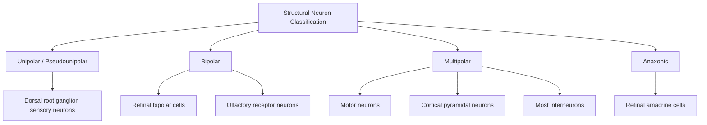

## Neuron Types and Structure

### Overview

Neurons are the fundamental signaling units of the nervous system, specialized for receiving, integrating, and transmitting electrochemical information. Unlike most somatic cells, mature neurons are typically post-mitotic (non-dividing), exhibit extreme morphological polarization (distinct input and output compartments), and maintain this polarization to support unidirectional information flow. Understanding neuronal structure and classification is foundational to interpreting circuit-level function, synaptic plasticity, and the cellular basis of cognition.

### Basic Neuronal Structure

**Key Points**

- **Soma (cell body)**: contains the nucleus and major organelles (rough endoplasmic reticulum, known as Nissl substance/Nissl bodies; Golgi apparatus; mitochondria); site of most protein synthesis.
- **Dendrites**: branched, tapering processes that receive synaptic input; typically covered in **dendritic spines**, small protrusions that form the postsynaptic component of most excitatory synapses and increase surface area for connectivity.
- **Axon**: a single, typically long, uniform-diameter process that conducts the **action potential** away from the soma toward target cells; originates at the **axon hillock**, the site of action potential initiation due to high density of voltage-gated sodium channels.
- **Axon hillock / axon initial segment (AIS)**: the trigger zone for action potentials; contains a specialized cytoskeletal structure (ankyrin-G scaffolding) that anchors ion channels and maintains the axon-dendrite boundary.
- **Myelin sheath**: lipid-rich insulation produced by **oligodendrocytes** (CNS) or **Schwann cells** (PNS), wrapping the axon in segments to enable **saltatory conduction**.
- **Nodes of Ranvier**: unmyelinated gaps between myelin segments, densely packed with voltage-gated sodium channels, where action potential regeneration occurs during saltatory conduction.
- **Axon terminals (synaptic boutons/terminal buttons)**: distal endings containing synaptic vesicles filled with neurotransmitter, positioned at the **presynaptic membrane** across the synaptic cleft from a postsynaptic target.

Below is a labeled diagram of a prototypical multipolar neuron:

<svg xmlns="http://www.w3.org/2000/svg" viewBox="0 0 700 380" font-family="Arial, sans-serif">
<text x="350" y="25" text-anchor="middle" font-size="17" font-weight="bold" fill="#222">Structure of a Multipolar Neuron (svg_diagram)</text>

<g stroke="#1a5276" stroke-width="2" fill="none">
<path d="M100,150 Q60,110 40,90" />
<path d="M100,150 Q60,140 30,140" />
<path d="M100,150 Q60,170 35,190" />
<path d="M110,130 Q80,90 60,70" />
<path d="M110,170 Q80,200 55,220" />
</g>
<text x="55" y="60" font-size="11" fill="#1a5276">Dendrites</text>

<g fill="#1a5276">
<circle cx="60" cy="90" r="2.5" />
<circle cx="45" cy="110" r="2.5" />
<circle cx="70" cy="140" r="2.5" />
<circle cx="50" cy="170" r="2.5" />
</g>

<ellipse cx="150" cy="150" rx="45" ry="38" fill="#eaf2f8" stroke="#1a5276" stroke-width="2.5" />
<circle cx="150" cy="150" r="14" fill="#aed6f1" stroke="#1a5276" stroke-width="1.5" />
<text x="150" y="155" text-anchor="middle" font-size="9" fill="#154360">Nucleus</text>
<text x="150" y="205" text-anchor="middle" font-size="11" fill="#1a5276">Soma</text>

<path d="M195,150 L230,150" stroke="#1a5276" stroke-width="6" />
<text x="210" y="130" text-anchor="middle" font-size="9" fill="#1a5276">Axon Hillock</text>

<line x1="230" y1="150" x2="560" y2="150" stroke="#333" stroke-width="3" />
<g fill="#f9e79f" stroke="#b7950b" stroke-width="1.5">
<rect x="240" y="140" width="50" height="20" rx="8" />
<rect x="310" y="140" width="50" height="20" rx="8" />
<rect x="380" y="140" width="50" height="20" rx="8" />
<rect x="450" y="140" width="50" height="20" rx="8" />
</g>
<text x="400" y="100" text-anchor="middle" font-size="11" fill="#7d6608">Myelin Sheath (oligodendrocyte/Schwann cell)</text>

<text x="300" y="175" text-anchor="middle" font-size="8" fill="#333">Node</text>

<text x="370" y="175" text-anchor="middle" font-size="8" fill="#333">Node</text>

<text x="440" y="175" text-anchor="middle" font-size="8" fill="#333">Node</text>

<text x="150" y="240" text-anchor="middle" font-size="11" fill="#333">Axon</text>

<g stroke="#c0392b" stroke-width="2" fill="none">
<path d="M560,150 Q590,120 615,110" />
<path d="M560,150 Q595,150 625,150" />
<path d="M560,150 Q590,180 615,195" />
</g>
<g fill="#c0392b">
<circle cx="615" cy="110" r="5" />
<circle cx="625" cy="150" r="5" />
<circle cx="615" cy="195" r="5" />
</g>
<text x="600" y="230" text-anchor="middle" font-size="11" fill="#c0392b">Axon Terminals</text>
</svg>

### Structural (Morphological) Classification

**Key Points**

- **Unipolar (pseudounipolar) neurons**: a single process extends from the soma and bifurcates into peripheral and central branches; characteristic of most primary sensory neurons in dorsal root ganglia, where the peripheral branch collects sensory information and the central branch relays it to the spinal cord/brainstem.
- **Bipolar neurons**: two distinct processes extend from opposite poles of the soma — one dendritic, one axonal; found in specialized sensory systems (e.g., retinal bipolar cells, olfactory receptor neurons, vestibulocochlear ganglion).
- **Multipolar neurons**: multiple dendrites and a single axon extend from the soma; the most common neuron type in the CNS, including **motor neurons** and the majority of **interneurons**.
- **Anaxonic neurons**: lack a morphologically distinct axon; processes are indistinguishable structurally, with signaling occurring bidirectionally along short processes (e.g., some retinal amacrine cells).

### Functional Classification

**Key Points**

- **Sensory (afferent) neurons**: transmit signals from peripheral receptors toward the CNS; typically pseudounipolar in the somatosensory system.
- **Motor (efferent) neurons**: transmit signals from the CNS to effectors (muscles, glands); typically multipolar, with somata in the spinal ventral horn or cranial nerve motor nuclei.
- **Interneurons (association neurons/local circuit neurons)**: connect neurons within the CNS, comprising the vast majority of neurons in the human brain; can be excitatory or inhibitory and range from short-axon local circuit neurons to long-range projection interneurons.

### Neurotransmitter-Based Classification

**Key Points**

- **Excitatory neurons**: primarily **glutamatergic** in the CNS; glutamate acting on ionotropic (AMPA, NMDA, kainate) and metabotropic receptors.
- **Inhibitory neurons**: primarily **GABAergic** in the CNS (glycinergic in spinal cord/brainstem); GABA acting on ionotropic (GABA-A) and metabotropic (GABA-B) receptors.
- **Modulatory neurons**: release **neuromodulators** such as dopamine, serotonin, norepinephrine, acetylcholine, and histamine; often project diffusely from subcortical nuclei (e.g., ventral tegmental area for dopamine, raphe nuclei for serotonin, locus coeruleus for norepinephrine) and modulate the gain, plasticity, or state-dependence of target circuits rather than driving fast point-to-point transmission.

### Cortical Pyramidal Neurons: A Principal Excitatory Type

**Key Points**

- **Pyramidal neurons** are the dominant excitatory cell type in cerebral cortex, characterized by a pyramid-shaped soma, a single prominent **apical dendrite** extending toward the pial surface (often reaching layer I), multiple **basal dendrites** near the soma, and a long projection axon.
- Apical dendrites integrate top-down and long-range inputs; basal dendrites integrate local and feedforward inputs — this dendritic compartmentalization is thought to support hierarchical and predictive processing. [Inference: the precise computational role of apical/basal integration remains an active area of research and is not fully settled across cortical areas.]
- Found predominantly in layers II/III and V of neocortex and in hippocampal CA1–CA3 regions.

### Interneuron Subtypes (GABAergic Diversity)

**Key Points**

- **Parvalbumin-positive (PV+) interneurons**: fast-spiking; include basket cells (perisomatic inhibition) and chandelier cells (axo-axonic inhibition targeting the AIS); critical for feedforward inhibition and gamma oscillation generation.
- **Somatostatin-positive (SST+) interneurons**: target distal dendrites; implicated in dendritic inhibition and gating of plasticity.
- **VIP-positive (vasoactive intestinal peptide) interneurons**: often disinhibitory, preferentially inhibiting SST+ interneurons, enabling context-dependent gating of cortical circuits.

### Glial Support Cells (Structural Context, Non-Neuronal)

**Key Points**

While not neurons, glia are essential to neuronal structure and function:

- **Astrocytes**: metabolic support, blood-brain barrier maintenance, synaptic modulation ("tripartite synapse")
- **Oligodendrocytes**: CNS myelination (a single oligodendrocyte myelinates multiple axon segments)
- **Schwann cells**: PNS myelination (one Schwann cell myelinates a single axon segment)
- **Microglia**: resident CNS immune cells, involved in synaptic pruning and immune surveillance

### Comparative Summary

**Example**

| Feature | Unipolar | Bipolar | Multipolar |
| --- | --- | --- | --- |
| Dendrite count | 0 distinct (single bifurcating process) | 1 | Multiple |
| Axon count | 1 (part of bifurcating process) | 1 | 1 |
| Typical location | Dorsal root ganglia | Retina, olfactory epithelium | CNS (cortex, spinal cord) |
| Example function | Somatosensation | Special sensory transduction | Motor output, cortical processing |

### Clinical and Research Relevance

**Key Points**

- Selective vulnerability of specific neuron types underlies several neurodegenerative diseases (e.g., dopaminergic neuron loss in the substantia nigra in Parkinson's disease; motor neuron degeneration in amyotrophic lateral sclerosis).
- Interneuron dysfunction, particularly PV+ interneuron hypofunction, has been implicated in the pathophysiology of schizophrenia and epilepsy. [Inference: this remains an area of active investigation, and causal mechanisms are not fully established.]
- Demyelinating diseases (e.g., multiple sclerosis) disrupt saltatory conduction by damaging oligodendrocyte-produced myelin, illustrating the functional dependence of axonal signaling on glial structural support.

### Related Topics

- Resting membrane potential and the ionic basis of excitability
- Action potential generation and propagation
- Synaptic transmission: chemical and electrical synapses
- Dendritic spine plasticity and long-term potentiation (LTP)
- Neurogenesis and neuronal migration during development
- Glial cell biology and the tripartite synapse
- Neurodegenerative disease mechanisms at the cellular level