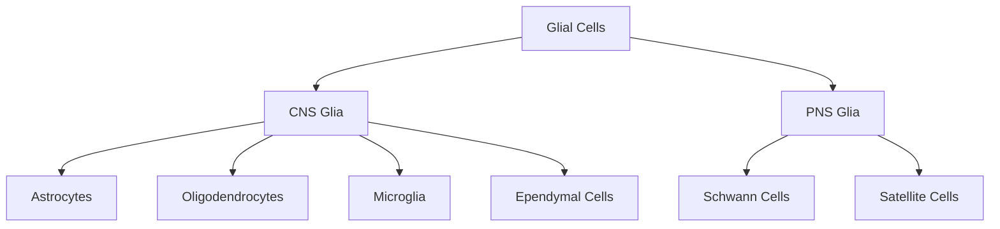

## Glial Cell Functions

### Overview

Glial cells (neuroglia) constitute the non-neuronal support cell population of the nervous system. Historically regarded as passive structural "glue" (from Greek *glia*, "glue"), glia are now understood to actively participate in signaling, metabolic support, myelination, immune defense, and homeostatic regulation of the neural microenvironment. Glial cells outnumber neurons in many brain regions and are essential for normal neuronal excitability, synaptic transmission, and plasticity. [Unverified: the widely cited historical "10:1 glia-to-neuron ratio" has been revised by modern stereological studies and varies substantially by brain region; a precise global ratio should not be treated as fixed.]

### Classification of Glial Cells

**Key Points**

CNS (central nervous system) glia:

- **Astrocytes**
- **Oligodendrocytes**
- **Microglia**
- **Ependymal cells**

PNS (peripheral nervous system) glia:

- **Schwann cells**
- **Satellite cells**

### Astrocytes

**Key Points**

- **Structural support**: star-shaped cells that form a scaffold framework within the CNS parenchyma, contributing to the architecture of gray and white matter.
- **Blood-brain barrier (BBB) maintenance**: astrocytic end-feet ensheath cerebral capillaries and induce/maintain tight junctions in endothelial cells, restricting passage of substances from blood to brain tissue.
- **Metabolic support**: supply neurons with lactate via the **astrocyte-neuron lactate shuttle (ANLS)** [Inference: the ANLS model is well-supported but its quantitative contribution relative to direct neuronal glucose uptake remains debated in the literature]; store glycogen, the primary energy reserve in the CNS.
- **Extracellular ion homeostasis**: buffer extracellular potassium (K+) via **spatial potassium buffering**, preventing hyperexcitability after neuronal firing.
- **Neurotransmitter recycling**: clear synaptic glutamate via excitatory amino acid transporters (EAAT1/EAAT2, i.e., GLAST/GLT-1) and convert it to glutamine via glutamine synthetase, returning it to neurons in the **glutamate-glutamine cycle**.
- **Tripartite synapse**: astrocytic processes closely appose pre- and postsynaptic terminals, allowing bidirectional signaling (via gliotransmitters such as ATP, D-serine, and glutamate) that modulates synaptic strength and plasticity. [Inference: the functional significance and generality of gliotransmission across all synapse types is an active and somewhat contested area of research.]
- **Glial scar formation**: following CNS injury, reactive astrocytes proliferate and form a glial scar that limits lesion spread but can also inhibit axonal regeneration.

### Oligodendrocytes

**Key Points**

- **CNS myelination**: each oligodendrocyte extends multiple processes, each of which myelinates a segment of a different axon, allowing one oligodendrocyte to myelinate up to several dozen axon segments across potentially multiple neurons. [Unverified: the exact number of internodes myelinated per oligodendrocyte varies considerably by region and reported values in the literature differ.]
- **Saltatory conduction support**: myelin insulation, combined with the high-density sodium channel clusters at **nodes of Ranvier**, allows action potentials to "jump" between nodes, dramatically increasing conduction velocity while reducing metabolic cost relative to unmyelinated axons.
- **Distinct from Schwann cells**: unlike Schwann cells (PNS), a single oligodendrocyte myelinates multiple axons rather than one axon per cell, and CNS myelin lacks the basal lamina present in PNS myelin.
- **Vulnerability**: oligodendrocytes are targets of autoimmune attack in demyelinating diseases such as multiple sclerosis, leading to conduction failure and the characteristic symptoms of these conditions.

### Microglia

**Key Points**

- **Resident immune cells of the CNS**: derived from yolk-sac progenitors during early development (distinct developmental origin from most other CNS glia, which arise from neuroectoderm), microglia function as the brain's primary innate immune surveillance system.
- **Immune surveillance**: continuously extend and retract processes to monitor the local microenvironment for pathogens, debris, and damage signals, even in the resting ("ramified") state.
- **Phagocytosis**: clear cellular debris, dead cells, and protein aggregates; activated ("amoeboid") microglia proliferate and migrate toward sites of injury or infection.
- **Synaptic pruning**: during development and in adulthood, microglia selectively engulf weak or unnecessary synapses via complement-mediated tagging (e.g., C1q, C3 pathway components), a process implicated in circuit refinement.
- **Neuroinflammation**: chronic or dysregulated microglial activation is implicated in neurodegenerative and neuropsychiatric conditions. [Inference: the precise causal role of microglial activation—whether primarily protective, primarily pathological, or context-dependent—remains actively debated across specific diseases.]

### Ependymal Cells

**Key Points**

- Line the **ventricular system** of the brain and the **central canal** of the spinal cord.
- Cuboidal-to-columnar epithelial cells, many ciliated, that help circulate **cerebrospinal fluid (CSF)**.
- Specialized ependymal cells in the **choroid plexus** (choroid plexus epithelial cells) are involved in CSF production via active transport and filtration of blood plasma.
- Contribute to the **blood-CSF barrier**, distinct from the blood-brain barrier formed by astrocyte-endothelial interactions.

### Schwann Cells (PNS)

**Key Points**

- **Myelination**: each Schwann cell myelinates a single internode of a single peripheral axon, in contrast to the one-to-many relationship of CNS oligodendrocytes.
- **Nerve regeneration support**: following peripheral nerve injury, Schwann cells dedifferentiate, proliferate, and form **bands of Büngner** that guide regenerating axons back to their targets — a key reason peripheral nerves regenerate more successfully than CNS axons.
- **Non-myelinating Schwann cells**: ensheath multiple small-diameter (typically unmyelinated) axons in a Remak bundle without forming a myelin sheath.

### Satellite Cells (PNS)

**Key Points**

- Surround neuronal cell bodies within peripheral ganglia (dorsal root ganglia, autonomic ganglia).
- Provide structural support, regulate the microenvironment surrounding the neuronal soma, and are functionally analogous in some respects to CNS astrocytes.

### Comparative Summary

**Example**

| Glial Type | Location | Primary Function |
| --- | --- | --- |
| Astrocyte | CNS | Metabolic support, BBB maintenance, ion/neurotransmitter homeostasis |
| Oligodendrocyte | CNS | Myelination (multiple axons per cell) |
| Microglia | CNS | Immune surveillance, phagocytosis, synaptic pruning |
| Ependymal cell | CNS (ventricles/central canal) | CSF circulation and production |
| Schwann cell | PNS | Myelination (one axon per cell), nerve regeneration support |
| Satellite cell | PNS | Support of ganglionic neuronal somata |

### Diagram: Astrocyte at the Tripartite Synapse

<svg xmlns="http://www.w3.org/2000/svg" viewBox="0 0 640 360" font-family="Arial, sans-serif">
<text x="320" y="25" text-anchor="middle" font-size="16" font-weight="bold" fill="#222">Astrocyte and the Tripartite Synapse (svg_diagram)</text>

<ellipse cx="180" cy="180" rx="60" ry="45" fill="#f9e79f" stroke="#7d6608" stroke-width="2" />
<text x="180" y="140" text-anchor="middle" font-size="11" fill="#7d6608">Presynaptic Terminal</text>
<circle cx="160" cy="170" r="4" fill="#7d6608" />
<circle cx="175" cy="185" r="4" fill="#7d6608" />
<circle cx="195" cy="165" r="4" fill="#7d6608" />
<circle cx="190" cy="195" r="4" fill="#7d6608" />

<line x1="240" y1="180" x2="320" y2="180" stroke="#c0392b" stroke-width="2" marker-end="url(#arrow)" />
<text x="280" y="170" text-anchor="middle" font-size="9" fill="#c0392b">Glutamate</text>
<ellipse cx="420" cy="180" rx="60" ry="45" fill="#d6eaf8" stroke="#1a5276" stroke-width="2" />
<text x="420" y="140" text-anchor="middle" font-size="11" fill="#1a5276">Postsynaptic Dendrite</text>
<rect x="405" y="170" width="10" height="10" fill="#1a5276" />
<rect x="425" y="175" width="10" height="10" fill="#1a5276" />
<rect x="415" y="190" width="10" height="10" fill="#1a5276" />

<path d="M100,260 Q180,300 280,270 Q350,250 420,270 Q500,300 540,250" fill="none" stroke="#28a745" stroke-width="4" />
<path d="M100,260 Q140,220 180,225" fill="none" stroke="#28a745" stroke-width="3" />
<path d="M540,250 Q480,220 460,225" fill="none" stroke="#28a745" stroke-width="3" />
<ellipse cx="90" cy="270" rx="30" ry="22" fill="#d5f5e3" stroke="#28a745" stroke-width="2" />
<text x="90" y="275" text-anchor="middle" font-size="9" fill="#1e7e34">Astrocyte</text>
<text x="320" y="330" text-anchor="middle" font-size="11" fill="#1e7e34">Astrocytic processes ensheath the synapse (glutamate/K+ clearance, gliotransmission)</text>
</svg>

### Clinical and Research Relevance

**Key Points**

- **Multiple sclerosis**: autoimmune-mediated oligodendrocyte/myelin destruction, illustrating the functional necessity of glial myelination for normal conduction.
- **Neuroinflammation and neurodegeneration**: microglial and astrocytic reactivity are consistently observed in Alzheimer's disease, Parkinson's disease, and traumatic brain injury; whether this reactivity is primarily protective, primarily damaging, or shifts across disease stages remains an area of ongoing investigation. [Inference]
- **Epilepsy**: impaired astrocytic potassium buffering and glutamate clearance are hypothesized contributors to hyperexcitability in some seizure disorders. [Inference: causal contribution varies by epilepsy subtype and is not uniformly established across all seizure types.]
- **Glioma**: primary brain tumors most commonly arise from glial cell lineages (e.g., astrocytoma, oligodendroglioma), reflecting the proliferative capacity retained by certain glial precursor populations relative to mature neurons.

### Related Topics

- Blood-brain barrier structure and transport mechanisms
- Myelination and saltatory conduction
- Neuroinflammation in neurodegenerative disease
- Synaptic pruning and developmental circuit refinement
- Astrocyte-neuron metabolic coupling (lactate shuttle)
- Peripheral nerve injury and regeneration
- Neuroglial contributions to the glymphatic system