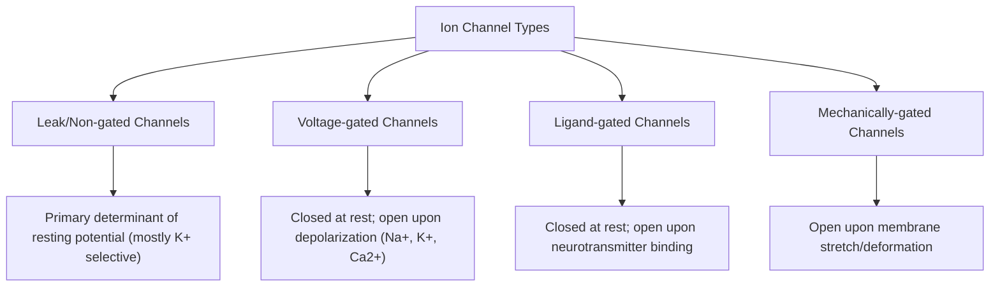

## Resting Membrane Potential and Ion Channels

### Overview

The resting membrane potential (RMP) is the voltage difference across a neuron's plasma membrane when the cell is not actively signaling, typically ranging from approximately $-60$ to $-70\ \text{mV}$ (intracellular relative to extracellular). This potential arises from the unequal distribution of ions across the membrane, differential membrane permeability to those ions, and the active maintenance of ionic gradients by transport proteins. The resting potential is not a passive equilibrium state but an actively maintained, energy-dependent steady state, and it establishes the baseline excitability from which action potentials and synaptic potentials are generated.

### Ionic Basis of the Resting Potential

**Key Points**

- **Key ions**: sodium (Na+), potassium (K+), chloride (Cl-), and large intracellular anions (proteins, organic phosphates) that cannot cross the membrane.
- **Concentration gradients** (typical mammalian neuron, approximate values):
  - Na+: high extracellular (~145 mM), low intracellular (~15 mM)
  - K+: high intracellular (~140 mM), low extracellular (~5 mM)
  - Cl-: high extracellular (~110 mM), low intracellular (~10 mM)
- **Differential permeability**: at rest, the membrane is far more permeable to K+ than to Na+, due to a higher density of open **leak (non-gated) K+ channels** relative to open Na+ channels. This is the primary reason the resting potential lies close to the K+ equilibrium potential rather than being neutral or near the Na+ equilibrium potential.
- **Donnan effect / impermeant anions**: large intracellular anions (proteins, nucleic acids) cannot cross the membrane, contributing to the overall charge asymmetry.

### Equilibrium Potentials and the Nernst Equation

**Key Points**

- The **equilibrium potential** for a given ion is the membrane voltage at which the electrical force driving that ion in one direction exactly balances the concentration (chemical) force driving it in the other, resulting in zero net flux for that ion alone.
- Calculated using the **Nernst equation**:

$$E_{ion} = \frac{RT}{zF} \ln\left(\frac{[\text{ion}]_{out}}{[\text{ion}]_{in}}\right)$$

where $R$ is the gas constant, $T$ is absolute temperature, $z$ is the ion's valence, and $F$ is Faraday's constant. At physiological temperature (~37°C), this is often approximated using $61.5\ \text{mV}$ per tenfold concentration ratio for monovalent ions (base-10 log form).

- Typical approximate equilibrium potentials in mammalian neurons:
  - $E_K \approx -90\ \text{mV}$
  - $E_{Na} \approx +60\ \text{mV}$
  - $E_{Cl} \approx -65\ \text{to}\ -70\ \text{mV}$ (varies by cell type and chloride transporter expression)

### The Goldman-Hodgkin-Katz (GHK) Equation

**Key Points**

- Because the membrane is permeable to multiple ions simultaneously (not just one), the actual resting potential is better predicted by the **Goldman-Hodgkin-Katz equation**, which weights each ion's equilibrium potential by its relative membrane permeability:

$$V_m = \frac{RT}{F} \ln\left(\frac{P_K[K^+]_{out} + P_{Na}[Na^+]_{out} + P_{Cl}[Cl^-]_{in}}{P_K[K^+]_{in} + P_{Na}[Na^+]_{in} + P_{Cl}[Cl^-]_{out}}\right)$$

- Note that chloride terms are inverted (in/out swapped) relative to cations because of its negative charge.
- Because $P_K \gg P_{Na}$ at rest, the GHK equation yields a resting potential close to, but slightly less negative than, $E_K$ alone — consistent with the small resting Na+ permeability constantly leaking depolarizing current into the cell.

### Ion Channels Relevant to the Resting State

**Key Points**

- **Leak channels (non-gated/"always open" channels)**: predominantly K+-selective (e.g., two-pore domain K+ channels, K2P family); the primary determinant of resting membrane permeability and thus RMP.
- **Voltage-gated channels**: closed at rest but open in response to membrane depolarization; not major contributors to the resting state itself but essential for the action potential (voltage-gated Na+ and K+ channels) once threshold is reached.
- **Ligand-gated (ionotropic) channels**: closed at rest in the absence of neurotransmitter binding; contribute to postsynaptic potentials rather than baseline RMP.
- **Mechanically gated channels**: open in response to membrane stretch or deformation; relevant to mechanotransduction rather than baseline resting potential.

### The Sodium-Potassium Pump (Na+/K+-ATPase)

**Key Points**

- An active transport protein that uses ATP hydrolysis to pump **3 Na+ ions out** of the cell for every **2 K+ ions pumped in**, against their respective concentration gradients.
- This 3:2 stoichiometry makes the pump **electrogenic**, directly contributing a small hyperpolarizing component to the membrane potential in addition to its primary role of maintaining the concentration gradients that leak channels depend on.
- Without continuous Na+/K+-ATPase activity, the ionic gradients would gradually dissipate via passive leak, and the resting potential would decay toward zero — underscoring that the RMP is a metabolically maintained steady state rather than a true thermodynamic equilibrium.

### Diagram: Resting Ionic Gradients and Channels

<svg xmlns="http://www.w3.org/2000/svg" viewBox="0 0 640 360" font-family="Arial, sans-serif">
<text x="320" y="25" text-anchor="middle" font-size="16" font-weight="bold" fill="#222">Resting Membrane Ionic Gradients (svg_diagram)</text>

<rect x="80" y="140" width="480" height="20" fill="#d5d8dc" stroke="#333" stroke-width="1.5" />
<text x="320" y="135" text-anchor="middle" font-size="10" fill="#333">Plasma Membrane</text>

<text x="320" y="70" text-anchor="middle" font-size="12" fill="#333" font-weight="bold">Extracellular Fluid</text>

<text x="150" y="95" font-size="11" fill="`#1a5276`">Na+ : high (~145 mM)</text>

<text x="150" y="115" font-size="11" fill="`#7d3c98`">Cl- : high (~110 mM)</text>

<text x="400" y="105" font-size="11" fill="`#c0392b`">K+ : low (~5 mM)</text>

<text x="320" y="330" text-anchor="middle" font-size="12" fill="#333" font-weight="bold">Intracellular Fluid</text>

<text x="150" y="250" font-size="11" fill="`#1a5276`">Na+ : low (~15 mM)</text>

<text x="150" y="270" font-size="11" fill="`#7d3c98`">Cl- : low (~10 mM)</text>

<text x="400" y="260" font-size="11" fill="`#c0392b`">K+ : high (~140 mM)</text>

<text x="230" y="300" font-size="10" fill="#555">Impermeant anions (proteins)</text>

<rect x="270" y="140" width="18" height="20" fill="#f5b7b1" stroke="#c0392b" stroke-width="1.5" />
<text x="279" y="185" text-anchor="middle" font-size="9" fill="#c0392b">K+ leak</text>
<line x1="279" y1="200" x2="279" y2="150" stroke="#c0392b" stroke-width="2" marker-end="url(#arrowK)" />

<rect x="380" y="140" width="30" height="20" fill="#aed6f1" stroke="#1a5276" stroke-width="1.5" rx="4" />
<text x="395" y="185" text-anchor="middle" font-size="9" fill="#1a5276">Na+/K+-ATPase</text>
<line x1="388" y1="200" x2="388" y2="150" stroke="#1a5276" stroke-width="2" marker-end="url(#arrowNa)" />
<line x1="402" y1="150" x2="402" y2="200" stroke="#c0392b" stroke-width="2" marker-end="url(#arrowK)" />
</svg>

### Summary Table of Key Values

**Example**

| Ion | Extracellular (mM) | Intracellular (mM) | Approx. $E_{ion}$ |
| --- | --- | --- | --- |
| Na+ | ~145 | ~15 | +60 mV |
| K+ | ~5 | ~140 | -90 mV |
| Cl- | ~110 | ~10 | -65 to -70 mV |
| Resting $V_m$ | — | — | -60 to -70 mV |

### Factors That Alter the Resting Potential

**Key Points**

- **Extracellular K+ changes**: because RMP tracks closely with $E_K$, even modest changes in extracellular K+ concentration substantially shift the resting potential — clinically relevant in conditions such as hyperkalemia, which can cause pathological depolarization and impaired excitability.
- **Channel expression changes**: altered density or kinetics of leak channels (e.g., through neuromodulation or disease) shifts baseline excitability by changing relative ion permeabilities.
- **Metabolic failure**: ischemia or hypoxia impairs ATP production, compromising Na+/K+-ATPase function and leading to gradual depolarization — a mechanism implicated in excitotoxic neuronal injury during stroke. [Inference: the downstream excitotoxic cascade involves multiple additional mechanisms beyond RMP collapse alone, such as glutamate-mediated calcium influx.]

### Clinical and Research Relevance

**Key Points**

- **Channelopathies**: mutations in leak or voltage-gated channel genes can alter resting excitability, contributing to conditions such as certain epilepsy syndromes and periodic paralyses.
- **Local anesthetics and channel blockers**: many pharmacological agents act by modulating ion channel function, though most clinically relevant local anesthetics primarily target voltage-gated Na+ channels rather than resting leak channels specifically.
- **Electrophysiological recording**: understanding RMP and its ionic basis is foundational for interpreting patch-clamp and intracellular recording data used throughout cellular neuroscience research.

### Related Topics

- Action potential generation and propagation
- Voltage-gated ion channel structure and gating kinetics
- Synaptic potentials: EPSPs and IPSPs
- Nernst and Goldman-Hodgkin-Katz equation derivations
- Channelopathies and their clinical manifestations
- Patch-clamp electrophysiology methodology
- Astrocytic potassium buffering and extracellular ion homeostasis