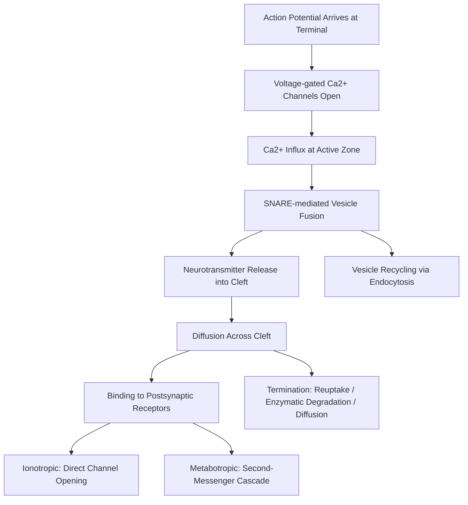

## Chemical and Electrical Synaptic Transmission

### Overview

Synaptic transmission is the process by which neurons communicate with target cells (other neurons, muscle fibers, or glands) across specialized junctions called synapses. Two fundamentally distinct mechanisms exist: **chemical synaptic transmission**, which relies on neurotransmitter release and receptor binding, and **electrical synaptic transmission**, which relies on direct ionic current flow through intercellular channels. These mechanisms differ substantially in speed, directionality, plasticity, and signal properties, and both are essential to normal circuit function.

### Chemical Synapses: Structural Overview

**Key Points**

- **Presynaptic terminal**: contains synaptic vesicles filled with neurotransmitter, active zones with voltage-gated Ca2+ channels, and the molecular machinery for vesicle docking, priming, and fusion.
- **Synaptic cleft**: a ~20 nm extracellular gap separating pre- and postsynaptic membranes.
- **Postsynaptic membrane**: contains neurotransmitter receptors (ionotropic and/or metabotropic), often organized within a postsynaptic density (PSD) at excitatory synapses.

### The Chemical Synaptic Transmission Cycle

**Key Points**

1. **Action potential arrival** at the presynaptic terminal depolarizes the membrane.
2. **Voltage-gated Ca2+ channel opening**: depolarization opens voltage-gated Ca2+ channels concentrated at the active zone, allowing Ca2+ influx down its steep electrochemical gradient.
3. **Vesicle fusion**: the rapid, localized rise in intracellular Ca2+ triggers SNARE-complex-mediated fusion of neurotransmitter-filled vesicles with the presynaptic membrane (exocytosis), primarily via the calcium sensor **synaptotagmin** interacting with the SNARE proteins (synaptobrevin, syntaxin, SNAP-25).
4. **Neurotransmitter diffusion**: released neurotransmitter diffuses across the synaptic cleft.
5. **Receptor binding**: neurotransmitter binds postsynaptic receptors, producing either direct ion channel opening (ionotropic) or second-messenger cascades (metabotropic).
6. **Termination of signaling**: neurotransmitter action is terminated via reuptake (transporter-mediated, e.g., into presynaptic terminal or glia), enzymatic degradation (e.g., acetylcholinesterase breaking down acetylcholine), or diffusion away from the cleft.
7. **Vesicle recycling**: vesicle membrane is retrieved via endocytosis (commonly clathrin-mediated) and refilled with neurotransmitter for reuse.

### Ionotropic vs. Metabotropic Receptors

**Key Points**

- **Ionotropic receptors (ligand-gated ion channels)**: neurotransmitter binding directly opens an integral ion channel, producing fast (millisecond-scale) postsynaptic potentials. Examples: AMPA and NMDA receptors (glutamate), GABA-A receptors (GABA), nicotinic acetylcholine receptors.
- **Metabotropic receptors (G-protein-coupled receptors, GPCRs)**: neurotransmitter binding activates an intracellular G-protein signaling cascade, which may open/close nearby ion channels indirectly or trigger broader second-messenger effects (e.g., cAMP, IP3/DAG pathways). Slower onset (tens of milliseconds to seconds) but longer-lasting and often modulatory. Examples: GABA-B receptors, metabotropic glutamate receptors, muscarinic acetylcholine receptors, most monoamine receptors (dopamine, serotonin, norepinephrine).

### Excitatory vs. Inhibitory Postsynaptic Potentials

**Key Points**

- **EPSP (excitatory postsynaptic potential)**: depolarizing potential that brings the membrane closer to threshold; commonly mediated by glutamate acting on AMPA/NMDA receptors, driving Na+ (and Ca2+ via NMDA receptors) influx.
- **IPSP (inhibitory postsynaptic potential)**: hyperpolarizing or shunting potential that moves the membrane away from threshold or stabilizes it near resting potential; commonly mediated by GABA (GABA-A: Cl- influx) or glycine.
- **Spatial and temporal summation**: postsynaptic potentials summate across multiple synapses (spatial) and across closely timed inputs (temporal) at the axon hillock/AIS to determine whether threshold is reached — the core integrative computation performed by dendrites and soma.

### The NMDA Receptor: A Coincidence Detector

**Key Points**

- NMDA receptors are both ligand-gated (require glutamate binding) and voltage-dependent (require relief of a resting Mg2+ block that occludes the channel pore at hyperpolarized potentials).
- Because NMDA receptor conduction requires simultaneous presynaptic glutamate release AND postsynaptic depolarization (to expel the Mg2+ block), the receptor functions as a **coincidence detector**, permitting Ca2+ influx only when pre- and postsynaptic activity co-occur — a molecular substrate widely implicated in Hebbian synaptic plasticity (long-term potentiation). [Inference: while NMDA receptor-dependent LTP is one of the most extensively validated plasticity mechanisms, not all forms of synaptic plasticity across all brain regions are NMDA receptor-dependent.]

### Electrical Synapses (Gap Junctions)

**Key Points**

- **Structure**: formed by **connexons** (hexameric assemblies of connexin proteins) on each of two adjacent cell membranes, which align to form a continuous aqueous channel (**gap junction**) directly connecting the cytoplasm of two cells.
- **Mechanism**: ionic current (and small molecules, up to ~1 kDa) flows directly between coupled cells through the gap junction channel, without neurotransmitter release or diffusion across a cleft.
- **Speed**: essentially instantaneous (sub-millisecond), since there is no chemical intermediary step — much faster than chemical transmission.
- **Bidirectionality**: many gap junctions permit current flow in both directions (though some exhibit rectification, conducting preferentially in one direction).
- **Synchronization role**: electrical synapses are particularly important for synchronizing activity across populations of neurons (e.g., certain inhibitory interneuron networks, some brainstem and retinal circuits) and are prominent in early development and in some invertebrate escape circuits. [Inference: relative prevalence of electrical vs. chemical synapses varies substantially by species, circuit, and developmental stage.]

### Comparative Summary

**Example**

| Feature | Chemical Synapse | Electrical Synapse |
| --- | --- | --- |
| Transmission mechanism | Neurotransmitter release and receptor binding | Direct ionic current through gap junctions |
| Speed | Slower (synaptic delay ~0.5-several ms) | Near-instantaneous |
| Directionality | Typically unidirectional | Often bidirectional |
| Signal type | Can amplify, invert (excite/inhibit), or modulate | Passes current largely unchanged, no sign inversion |
| Plasticity | Highly plastic (LTP/LTD, receptor modulation) | Generally less plastic, though some modulation occurs |
| Structural gap | ~20 nm synaptic cleft | Direct cytoplasmic continuity via connexons |

### Diagram: Chemical vs. Electrical Synapse Structure

<svg xmlns="http://www.w3.org/2000/svg" viewBox="0 0 660 320" font-family="Arial, sans-serif">
<text x="330" y="25" text-anchor="middle" font-size="16" font-weight="bold" fill="#222">Chemical vs. Electrical Synapse (svg_diagram)</text>

<text x="150" y="55" text-anchor="middle" font-size="12" font-weight="bold" fill="#333">Chemical Synapse</text>

<rect x="80" y="70" width="140" height="50" fill="`#f9e79f`" stroke="`#7d6608`" stroke-width="2" />

<text x="150" y="100" text-anchor="middle" font-size="9" fill="`#7d6608`">Presynaptic Terminal</text>

<circle cx="110" cy="85" r="4" fill="`#7d6608`" />

<circle cx="130" cy="95" r="4" fill="`#7d6608`" />

<circle cx="150" cy="82" r="4" fill="`#7d6608`" />

<rect x="80" y="130" width="140" height="15" fill="#fff" stroke="none" />
<text x="150" y="142" text-anchor="middle" font-size="8" fill="#555">Synaptic cleft (~20nm)</text>
<line x1="115" y1="120" x2="115" y2="150" stroke="#c0392b" stroke-width="1.5" marker-end="url(#arrC)" />
<line x1="150" y1="120" x2="150" y2="150" stroke="#c0392b" stroke-width="1.5" marker-end="url(#arrC)" />
<rect x="80" y="150" width="140" height="50" fill="#d6eaf8" stroke="#1a5276" stroke-width="2" />
<text x="150" y="180" text-anchor="middle" font-size="9" fill="#1a5276">Postsynaptic Membrane</text>
<rect x="105" y="150" width="10" height="10" fill="#1a5276" />
<rect x="140" y="150" width="10" height="10" fill="#1a5276" />
<text x="490" y="55" text-anchor="middle" font-size="12" font-weight="bold" fill="#333">Electrical Synapse</text>

<rect x="420" y="70" width="140" height="50" fill="`#d5f5e3`" stroke="`#1e7e34`" stroke-width="2" />

<text x="490" y="100" text-anchor="middle" font-size="9" fill="`#1e7e34`">Cell 1</text>

<rect x="470" y="118" width="40" height="12" fill="#a9dfbf" stroke="#1e7e34" stroke-width="1.5" />
<text x="490" y="145" text-anchor="middle" font-size="8" fill="#1e7e34">Gap Junction (Connexons)</text>
<line x1="485" y1="120" x2="485" y2="130" stroke="#1e7e34" stroke-width="3" />
<line x1="495" y1="120" x2="495" y2="130" stroke="#1e7e34" stroke-width="3" />
<rect x="420" y="150" width="140" height="50" fill="#d5f5e3" stroke="#1e7e34" stroke-width="2" />
<text x="490" y="180" text-anchor="middle" font-size="9" fill="#1e7e34">Cell 2</text>
<text x="490" y="220" text-anchor="middle" font-size="9" fill="#555">Direct cytoplasmic continuity</text>
</svg>

### Clinical and Research Relevance

**Key Points**

- **Neuromuscular junction pharmacology**: the neuromuscular junction is a well-characterized chemical synapse (acetylcholine/nicotinic receptor-based), and its transmission is targeted by drugs (neuromuscular blockers) and disrupted in conditions such as myasthenia gravis (autoimmune destruction of postsynaptic acetylcholine receptors).
- **Excitotoxicity**: excessive glutamate release and NMDA receptor overactivation, leading to pathological Ca2+ influx, is implicated in neuronal injury during stroke and other acute CNS insults. [Inference: excitotoxicity involves multiple downstream mechanisms beyond NMDA receptor activation alone, and relative contribution varies by injury type.]
- **Psychopharmacology**: most psychiatric medications act on chemical synaptic transmission — e.g., selective serotonin reuptake inhibitors (SSRIs) block serotonin transporters, antipsychotics commonly antagonize dopamine D2 receptors.
- **Gap junction disorders**: connexin gene mutations are implicated in certain inherited conditions (e.g., some forms of hereditary deafness, certain skin disorders), reflecting the broader physiological role of gap junctions beyond neural tissue. [Unverified: specific connexin-disease associations are numerous and gene/disease pairing should be confirmed against current genetic reference sources for any specific clinical claim.]

### Related Topics

- Neurotransmitter systems: glutamate, GABA, monoamines, acetylcholine
- Synaptic vesicle cycle and SNARE-mediated exocytosis
- Long-term potentiation and long-term depression (synaptic plasticity)
- Receptor pharmacology: agonists, antagonists, and allosteric modulation
- Neuromuscular junction physiology
- Dendritic integration and postsynaptic potential summation
- Gap junction connexin biology