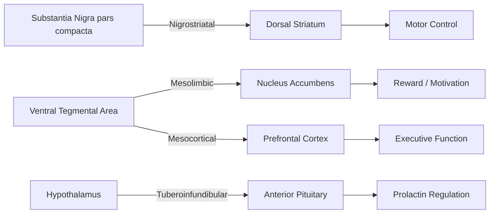

## Major Neurotransmitter Systems

### Overview and Classification

Neurotransmitters are endogenous chemical messengers released from presynaptic axon terminals that act on receptors of a target cell to alter its electrical or biochemical state. They are classified structurally into several major categories:

- **Amino acids**: glutamate, GABA, glycine
- **Monoamines**: dopamine, norepinephrine, epinephrine, serotonin, histamine (subdivided into catecholamines and indolamines)
- **Cholinergic transmitter**: acetylcholine
- **Neuropeptides**: endorphins, substance P, oxytocin, vasopressin, and many others
- **Purines**: adenosine, ATP
- **Gasotransmitters**: nitric oxide, carbon monoxide

Neurotransmitters act through two broad receptor mechanisms:

- **Ionotropic receptors** (ligand-gated ion channels): produce fast, brief postsynaptic effects by directly opening an ion channel (e.g., AMPA receptors, GABA-A receptors).
- **Metabotropic receptors** (G-protein-coupled receptors): produce slower, longer-lasting effects by triggering intracellular second-messenger cascades (e.g., D1/D2 dopamine receptors, GABA-B receptors).

### Glutamate: The Principal Excitatory System

Glutamate is the primary excitatory neurotransmitter in the mammalian central nervous system, involved in the majority of fast excitatory synaptic transmission.

**Synthesis and Clearance**

Glutamate is synthesized from glutamine via the enzyme glutaminase in presynaptic terminals, and is also produced as an intermediate of the Krebs cycle. After release, it is cleared from the synaptic cleft primarily by excitatory amino acid transporters (EAATs) on astrocytes, converted back to glutamine via glutamine synthetase, and shuttled back to neurons in what is known as the glutamate-glutamine cycle.

**Receptor Subtypes**

- **Ionotropic**: AMPA receptors (mediate fast excitatory postsynaptic potentials), NMDA receptors (voltage-dependent, magnesium-blocked channels critical for synaptic plasticity due to their coincidence-detection properties and calcium permeability), and kainate receptors.
- **Metabotropic**: mGluR1-8, subdivided into three groups based on signaling mechanism and pharmacology, modulating neuronal excitability and synaptic strength over slower timescales.

**Functional Significance**

- NMDA receptor-dependent long-term potentiation (LTP) is the dominant cellular model of learning and memory formation, particularly in the hippocampus.
- Excessive glutamate signaling is implicated in excitotoxicity, a mechanism of neuronal death following stroke, traumatic brain injury, and in several neurodegenerative conditions.

### GABA: The Principal Inhibitory System

Gamma-aminobutyric acid (GABA) is the primary inhibitory neurotransmitter in the adult mammalian CNS.

**Synthesis and Clearance**

GABA is synthesized from glutamate by the enzyme glutamic acid decarboxylase (GAD), using vitamin B6 (pyridoxal phosphate) as a cofactor. It is cleared via reuptake transporters (GATs) and degraded by GABA transaminase.

**Receptor Subtypes**

- **GABA-A receptors**: ionotropic, chloride-permeable channels producing fast inhibitory postsynaptic potentials by hyperpolarizing (or shunting) the postsynaptic membrane. These receptors are the binding site for benzodiazepines, barbiturates, and ethanol, which act as positive allosteric modulators.
- **GABA-B receptors**: metabotropic, G-protein-coupled receptors producing slower, prolonged inhibitory effects via potassium channel activation and calcium channel inhibition.

**Developmental Note**

**[Unverified]** In early neural development, GABA-A receptor activation can be depolarizing rather than hyperpolarizing, due to different chloride gradients in immature neurons; this developmental switch is well documented in animal models but its precise timing and generality across human brain regions is not fully established.

### Acetylcholine

Acetylcholine (ACh) operates in both the central and peripheral nervous systems.

**Synthesis and Clearance**

ACh is synthesized from choline and acetyl-CoA by choline acetyltransferase (ChAT), and is degraded in the synaptic cleft by acetylcholinesterase (AChE) into choline and acetate, with choline recycled via presynaptic reuptake.

**Receptor Subtypes**

- **Nicotinic receptors**: ionotropic, found at the neuromuscular junction, in autonomic ganglia, and throughout the CNS, mediating fast excitatory transmission.
- **Muscarinic receptors**: metabotropic, five subtypes (M1-M5), mediating slower modulatory effects in the CNS and parasympathetic target organs.

**Functional Significance**

- The basal forebrain cholinergic system (including the nucleus basalis of Meynert) projects broadly to cortex and is central to attention and arousal.
- Degeneration of cholinergic neurons is a well-established pathological feature of Alzheimer's disease, and acetylcholinesterase inhibitors (e.g., donepezil) are a standard symptomatic pharmacological treatment.
- ACh is the neurotransmitter at all neuromuscular junctions and at preganglionic synapses throughout the autonomic nervous system.

### Dopamine

Dopamine is a catecholamine synthesized via the pathway tyrosine → L-DOPA (by tyrosine hydroxylase, the rate-limiting enzyme) → dopamine (by DOPA decarboxylase). It is cleared via the dopamine transporter (DAT) and degraded by monoamine oxidase (MAO) and catechol-O-methyltransferase (COMT).

**Major Pathways**

- **Nigrostriatal pathway**: substantia nigra pars compacta to dorsal striatum; degeneration of these neurons produces the motor symptoms of Parkinson's disease.
- **Mesolimbic pathway**: ventral tegmental area (VTA) to nucleus accumbens; central to reward prediction, motivation, and the reinforcing effects of addictive drugs.
- **Mesocortical pathway**: VTA to prefrontal cortex; implicated in executive function and working memory.
- **Tuberoinfundibular pathway**: hypothalamus to pituitary; regulates prolactin secretion.

**Receptor Subtypes**

D1-like receptors (D1, D5) are generally excitatory via Gs-coupled adenylyl cyclase activation; D2-like receptors (D2, D3, D4) are generally inhibitory via Gi-coupled adenylyl cyclase inhibition.

**Functional Significance**

- Phasic dopamine firing in VTA/substantia nigra neurons has been proposed to encode a reward prediction error signal, a concept central to reinforcement learning models of behavior.
- Dopaminergic dysfunction is implicated in Parkinson's disease (nigrostriatal loss), schizophrenia (the historical "dopamine hypothesis" implicating mesolimbic hyperactivity), and substance use disorders.

### Norepinephrine (Noradrenaline)

Norepinephrine is synthesized from dopamine by the enzyme dopamine beta-hydroxylase. The primary source of central noradrenergic projections is the **locus coeruleus**, a brainstem nucleus that projects diffusely throughout the cortex, hippocampus, cerebellum, and spinal cord.

**Receptor Subtypes**

Alpha-1, alpha-2, and beta (beta-1, beta-2, beta-3) adrenergic receptors, all metabotropic, mediate norepinephrine's effects both centrally and peripherally as part of the sympathetic nervous system.

**Functional Significance**

- Central norepinephrine is strongly associated with arousal, vigilance, and the regulation of attention, with locus coeruleus activity correlating with shifts between exploratory and exploitative behavioral states.
- Peripherally, norepinephrine (along with epinephrine) mediates the sympathetic "fight-or-flight" response, increasing heart rate, blood pressure, and glucose availability.

### Serotonin (5-Hydroxytryptamine, 5-HT)

Serotonin is synthesized from the dietary amino acid tryptophan via tryptophan hydroxylase (rate-limiting) and aromatic amino acid decarboxylase. The majority of central serotonergic neurons originate in the **raphe nuclei** of the brainstem, projecting diffusely throughout the forebrain.

**Receptor Subtypes**

At least fourteen 5-HT receptor subtypes have been identified, grouped into seven families (5-HT1 through 5-HT7); all are metabotropic except 5-HT3, which is an ionotropic ligand-gated cation channel.

**Functional Significance**

- Serotonergic signaling is implicated in mood regulation, and selective serotonin reuptake inhibitors (SSRIs), which block the serotonin transporter (SERT), are a first-line pharmacological treatment for major depressive disorder and several anxiety disorders.
- **[Inference]** The precise mechanism by which increased synaptic serotonin availability translates into clinically observed antidepressant effects, which typically emerge over weeks rather than immediately, remains an active area of research; the classical "monoamine deficiency" hypothesis of depression is now considered an oversimplification by most researchers in the field.
- Serotonin also regulates sleep-wake cycles, appetite, and is a precursor for melatonin synthesis in the pineal gland.

### Neuropeptides (Selected Systems)

Neuropeptides differ from classical small-molecule transmitters in that they are synthesized in the cell body from precursor proteins, packaged in dense-core vesicles, typically co-released with a classical transmitter, and act at lower concentrations with generally slower and longer-lasting effects.

- **Endogenous opioids** (endorphins, enkephalins, dynorphins): act on mu, delta, and kappa opioid receptors; involved in analgesia, stress response, and reward.
- **Oxytocin and vasopressin**: synthesized in the hypothalamus; implicated in social bonding, trust, and parental behavior (oxytocin), and in social recognition and aggression (vasopressin).
- **Substance P**: involved in pain transmission and inflammatory responses.

### Comparative Summary Table

| System | Primary Source Nuclei | Principal Receptor Types | Primary Cognitive/Behavioral Association |
| --- | --- | --- | --- |
| Glutamate | Widespread (cortex, hippocampus) | AMPA, NMDA, kainate, mGluR | Fast excitation, synaptic plasticity, learning |
| GABA | Widespread interneurons | GABA-A, GABA-B | Fast inhibition, network regulation |
| Acetylcholine | Basal forebrain, brainstem | Nicotinic, Muscarinic | Attention, arousal, memory |
| Dopamine | Substantia nigra, VTA | D1-like, D2-like | Reward, motor control, motivation |
| Norepinephrine | Locus coeruleus | Alpha, Beta | Arousal, vigilance, stress |
| Serotonin | Raphe nuclei | 5-HT1-7 | Mood, sleep, appetite |

### Diagram: Ascending Neuromodulatory Projection Systems (svg_diagram)

<svg xmlns="http://www.w3.org/2000/svg" viewBox="0 0 900 400">
<text x="450" y="25" text-anchor="middle" font-size="16" font-weight="bold" fill="#1a1a1a">Ascending Neuromodulatory Projection Systems (svg_diagram)</text>
<ellipse cx="450" cy="200" rx="120" ry="60" fill="none" stroke="#555" stroke-width="1.5" />
<text x="450" y="204" text-anchor="middle" font-size="11" fill="#333">Brainstem Nuclei</text>
<rect x="100" y="90" width="140" height="40" rx="6" fill="#fce8e6" stroke="#c0392b" />
<text x="170" y="115" text-anchor="middle" font-size="11">Cortex</text>
<rect x="660" y="90" width="140" height="40" rx="6" fill="#e6f0fc" stroke="#2b6cb0" />
<text x="730" y="115" text-anchor="middle" font-size="11">Hippocampus</text>
<rect x="100" y="310" width="140" height="40" rx="6" fill="#eafaf1" stroke="#1e8449" />
<text x="170" y="335" text-anchor="middle" font-size="11">Striatum</text>
<rect x="660" y="310" width="140" height="40" rx="6" fill="#fdf2e3" stroke="#b9770e" />
<text x="730" y="335" text-anchor="middle" font-size="11">Prefrontal Cortex</text>
<line x1="380" y1="180" x2="240" y2="120" stroke="#c0392b" stroke-width="1.5" marker-end="url(#arrow1)" />
<line x1="520" y1="180" x2="660" y2="120" stroke="#2b6cb0" stroke-width="1.5" marker-end="url(#arrow1)" />
<line x1="380" y1="230" x2="240" y2="310" stroke="#1e8449" stroke-width="1.5" marker-end="url(#arrow1)" />
<line x1="520" y1="230" x2="660" y2="310" stroke="#b9770e" stroke-width="1.5" marker-end="url(#arrow1)" />
<text x="450" y="375" text-anchor="middle" font-size="11" fill="#555">Locus coeruleus (NE), raphe nuclei (5-HT), VTA/substantia nigra (DA), and basal forebrain (ACh) project diffusely to forebrain targets.</text>

</svg>

### Diagram: Dopaminergic Pathway Logic

### Example: Pharmacological Manipulation Across Systems

**Example**

- **SSRIs** (e.g., fluoxetine) block SERT, increasing synaptic serotonin availability — used clinically for depression and anxiety.
- **L-DOPA** is administered in Parkinson's disease because, unlike dopamine itself, it crosses the blood-brain barrier and is converted to dopamine centrally, replenishing depleted nigrostriatal dopamine.
- **Benzodiazepines** act as positive allosteric modulators at GABA-A receptors, increasing chloride channel opening frequency and enhancing inhibitory tone — used clinically for anxiety and seizure disorders.
- **Nicotine** acts as an agonist at nicotinic acetylcholine receptors, contributing to its reinforcing and cognitive-enhancing effects.

**[Inference]** These drug mechanisms describe well-established receptor-level pharmacology; the downstream behavioral and clinical effects in any individual may vary considerably due to genetic, developmental, and environmental factors, and should not be treated as uniform across all patients.

### Conclusion

The major neurotransmitter systems form a set of chemically and anatomically distinct signaling pathways that jointly regulate the moment-to-moment excitability of neural circuits (glutamate and GABA), diffuse neuromodulatory states such as arousal, motivation, and mood (dopamine, norepinephrine, serotonin, acetylcholine), and slower peptide-mediated modulation of social and homeostatic behavior. Understanding each system's synthesis pathway, clearance mechanism, receptor subtypes, and anatomical projection pattern provides the biochemical foundation for interpreting both normal cognitive function and the mechanisms of neurological and psychiatric disorders.

**Related Topics**

- Synaptic transmission and vesicle release mechanisms
- Long-term potentiation and NMDA receptor-dependent plasticity
- Reward prediction error and computational models of dopamine signaling
- Monoamine hypothesis of depression and its critiques
- Pharmacology of psychoactive drugs and receptor-level mechanisms
- Neurotransmitter systems in neurodegenerative disease (Parkinson's, Alzheimer's)
- Co-transmission and neuropeptide-classical transmitter interactions