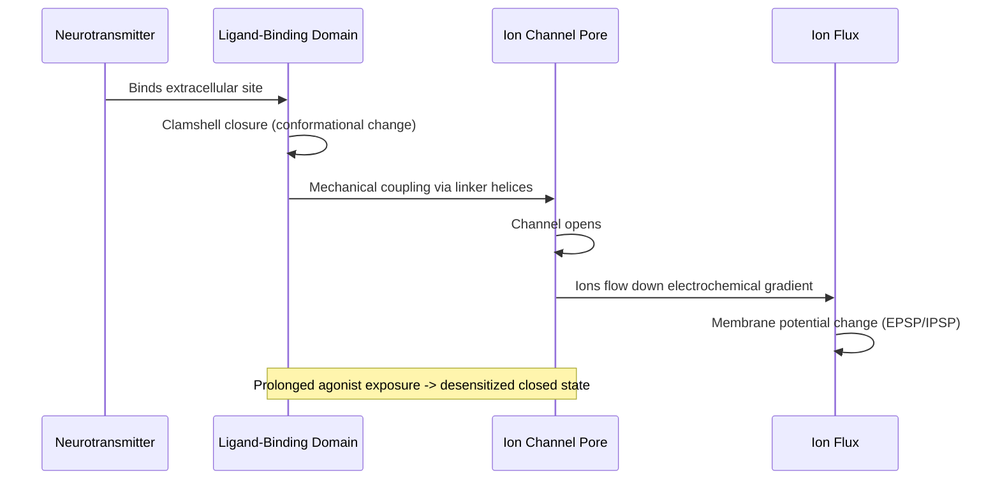
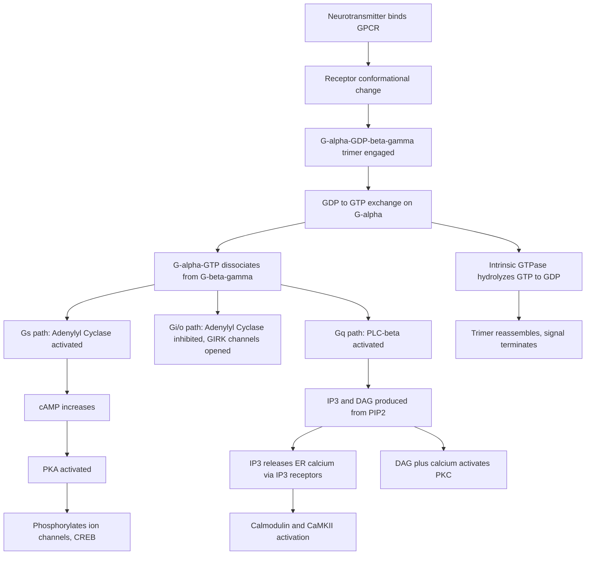

## Receptor Types and Intracellular Signaling

### Overview

Neuronal signaling depends on membrane and intracellular receptors that transduce chemical signals (neurotransmitters, neuromodulators, hormones, growth factors) into changes in cell physiology. Receptors fall into two broad functional classes based on signaling speed and mechanism: **ionotropic receptors** (ligand-gated ion channels), which produce fast, millisecond-scale electrical signaling, and **metabotropic receptors** (G protein-coupled receptors, GPCRs), which produce slower, longer-lasting signaling via intracellular second messenger cascades. A third category, **receptor tyrosine kinases (RTKs)** and related enzyme-linked receptors, mediates trophic and developmental signaling with signaling timescales of minutes to hours to days.

---

### Ionotropic Receptors (Ligand-Gated Ion Channels)

**Key Points**

- Ligand binding directly opens an integral ion channel pore; no intermediate signaling step
- Mediate fast synaptic transmission (sub-millisecond to a few milliseconds)
- Typically pentameric or tetrameric multi-subunit assemblies with a central pore
- Ion selectivity (cation vs. anion) determines whether the receptor is excitatory or inhibitory

#### Structural Organization

Most ionotropic receptors are formed from multiple subunits arranged around a central ion-conducting pore. The two major structural superfamilies in the CNS are:

1. **Cys-loop receptor superfamily** (pentameric): nicotinic acetylcholine receptors (nAChRs), $GABA_A$ receptors, glycine receptors, and serotonin 5-$HT_3$ receptors. Each subunit contributes four transmembrane domains (M1–M4), with M2 lining the pore.
2. **Glutamate receptor superfamily** (tetrameric): AMPA, NMDA, and kainate receptors. Each subunit has three transmembrane domains plus a re-entrant pore loop, an extracellular ligand-binding domain (LBD, "clamshell" structure), and an amino-terminal domain (ATD) involved in assembly and modulation.

#### Major Ionotropic Receptor Families

- **Ionotropic glutamate receptors (iGluRs)** — excitatory, cation-permeable ($Na^+$, $K^+$, and in some cases $Ca^{2+}$)
  - **AMPA receptors**: fast excitatory transmission; permeability to $Ca^{2+}$ depends on GluA2 subunit editing (edited GluA2-containing receptors are $Ca^{2+}$-impermeable)
  - **NMDA receptors**: require simultaneous glutamate binding and postsynaptic depolarization to relieve voltage-dependent $Mg^{2+}$ block; highly permeable to $Ca^{2+}$; obligatory GluN1 + GluN2(A–D) heterotetramers; central to synaptic plasticity
  - **Kainate receptors**: modulate both pre- and postsynaptic excitability
- **$GABA_A$ receptors** — inhibitory, $Cl^-$-permeable pentamers (commonly $2\alpha,2\beta,1\gamma$); allosteric sites for benzodiazepines, barbiturates, neurosteroids, and ethanol
- **Glycine receptors** — inhibitory, $Cl^-$-permeable, predominant in spinal cord and brainstem
- **Nicotinic ACh receptors** — cation-permeable; muscle-type ($\alpha_2\beta\gamma\delta$ or $\alpha_2\beta\varepsilon\delta$) and neuronal-type (e.g., $\alpha_4\beta_2$, $\alpha_7$ homomers)
- **Purinergic P2X receptors** — ATP-gated, trimeric, cation-permeable (including $Ca^{2+}$)

#### Gating and Kinetics

Ligand binding at the extracellular LBD triggers a conformational "clamshell closure" that is mechanically coupled to the transmembrane pore-lining helices, causing channel opening. Receptors then desensitize (a distinct closed, agonist-bound state) with kinetics that shape the time course of the postsynaptic current.

**Example**

An EPSC (excitatory postsynaptic current) at a glutamatergic synapse shows a fast AMPA receptor component (rise time ~0.2–0.5 ms, decay $\tau$ ~1–5 ms) followed by a slower NMDA receptor component (decay $\tau$ ~50–500 ms) that only activates appreciably near resting or depolarized membrane potentials due to $Mg^{2+}$ block relief.

---

### Metabotropic Receptors (G Protein-Coupled Receptors)

**Key Points**

- Seven-transmembrane (7TM) domain receptors coupled to heterotrimeric G proteins
- Signal via intracellular second messenger cascades rather than direct ion flux
- Slower onset (tens of milliseconds to seconds) but longer duration (seconds to minutes) than ionotropic signaling
- Signal amplification: one receptor can activate many G proteins, each activating many effector molecules

#### Structural and Activation Cycle

GPCRs consist of an extracellular N-terminus, seven transmembrane $\alpha$-helices, three extracellular loops, three intracellular loops, and an intracellular C-terminus. Agonist binding to the extracellular/transmembrane pocket induces a conformational shift (notably in TM6) that opens an intracellular cavity, allowing the receptor to act as a guanine nucleotide exchange factor (GEF) for a heterotrimeric G protein ($\alpha\beta\gamma$).

1. Agonist binds receptor
2. Receptor undergoes conformational change and engages $G\alpha\beta\gamma$
3. $G\alpha$ subunit exchanges GDP for GTP
4. $G\alpha$-GTP dissociates from $G\beta\gamma$; both can independently regulate effectors
5. Intrinsic GTPase activity of $G\alpha$ hydrolyzes GTP to GDP, terminating the signal and allowing trimer reassembly (accelerated by RGS proteins, "regulators of G protein signaling")

#### G Protein Subtype Signaling Pathways

- **$G_s$ (stimulatory)**: activates adenylyl cyclase → increases cAMP → activates protein kinase A (PKA). Example: $\beta$-adrenergic receptors, $D_1$ dopamine receptors
- **$G_i/G_o$ (inhibitory)**: inhibits adenylyl cyclase → decreases cAMP; $G\beta\gamma$ can directly open GIRK ($K^+$) channels and inhibit voltage-gated $Ca^{2+}$ channels. Example: $\mu$-opioid receptors, $D_2$ dopamine receptors, $GABA_B$ receptors, $\alpha_2$-adrenergic receptors
- **$G_q/G_{11}$**: activates phospholipase C-$\beta$ (PLC$\beta$) → hydrolyzes $PIP_2$ into $IP_3$ and diacylglycerol (DAG) → $IP_3$ triggers $Ca^{2+}$ release from ER stores; DAG activates protein kinase C (PKC). Example: $\alpha_1$-adrenergic receptors, $M_1/M_3$ muscarinic receptors, group I metabotropic glutamate receptors
- **$G_{12}/G_{13}$**: activates RhoGEFs → Rho GTPase signaling, cytoskeletal remodeling

#### Second Messenger Cascades in Detail

**cAMP–PKA pathway**

$$ATP \xrightarrow{\text{adenylyl cyclase}} cAMP + PP_i$$

cAMP binds the regulatory subunits of PKA, releasing catalytic subunits that phosphorylate serine/threonine residues on target proteins (ion channels, transcription factors such as CREB, cytoskeletal regulators). cAMP is degraded by phosphodiesterases (PDEs), which are pharmacological targets (e.g., PDE4 inhibitors, caffeine as a nonselective PDE inhibitor).

**PLC–IP₃/DAG–PKC pathway**

$$PIP_2 \xrightarrow{\text{PLC}\beta} IP_3 + DAG$$

$IP_3$ diffuses to the endoplasmic reticulum and binds $IP_3$ receptors ($IP_3Rs$), ligand-gated $Ca^{2+}$ channels on the ER membrane, releasing stored $Ca^{2+}$ into the cytosol. DAG remains membrane-bound and, together with elevated $Ca^{2+}$, activates conventional PKC isoforms. Released $Ca^{2+}$ also binds calmodulin (CaM), activating $Ca^{2+}$/calmodulin-dependent protein kinases (CaMKII, CaMKIV) and calcineurin (a $Ca^{2+}$/CaM-dependent phosphatase).

**Example**

Activation of group I metabotropic glutamate receptors (mGluR1/5, $G_q$-coupled) at the postsynaptic density triggers PLC$\beta$-mediated $IP_3$ production, ER $Ca^{2+}$ release, and downstream ERK/MAPK activation — contributing to a form of long-term depression (mGluR-LTD) distinct from NMDA receptor-dependent LTD.

---

### Receptor Tyrosine Kinases and Enzyme-Linked Receptors

**Key Points**

- Single-pass transmembrane receptors with intrinsic or associated enzymatic activity
- Mediate neurotrophic signaling, cell growth, survival, differentiation, and synaptic plasticity
- Activation typically requires ligand-induced dimerization

#### Neurotrophin Signaling (Trk Receptors)

Neurotrophins (NGF, BDNF, NT-3, NT-4/5) bind Trk receptors (TrkA, TrkB, TrkC respectively) and the low-affinity p75 neurotrophin receptor. Ligand binding induces receptor dimerization and trans-autophosphorylation of intracellular tyrosine residues, creating docking sites for adaptor proteins that engage three principal downstream cascades:

1. **Ras–MAPK/ERK pathway**: via Shc/Grb2/SOS → Ras-GTP → Raf → MEK → ERK1/2 → gene transcription, neurite growth, synaptic plasticity
2. **PI3K–Akt pathway**: promotes cell survival, inhibits apoptotic proteins (e.g., BAD, caspase-9)
3. **PLC$\gamma$ pathway**: generates $IP_3$/DAG, analogous to the GPCR-linked PLC$\beta$ pathway, contributing to $Ca^{2+}$-dependent plasticity (implicated in BDNF-TrkB-dependent LTP)

**Example**

BDNF-TrkB signaling at hippocampal synapses activates PLC$\gamma$ and downstream CaMKII, contributing to the enhancement of synaptic strength observed during LTP; TrkB signaling also regulates local dendritic protein synthesis via mTOR downstream of PI3K-Akt.

---

### Signal Termination and Receptor Regulation

**Key Points**

- Signal duration is actively regulated at multiple levels, not simply passive decay
- Desensitization, internalization, and degradation shape the temporal dynamics and adaptation of receptor signaling

#### GPCR Desensitization Cycle

1. **Phosphorylation**: GPCR kinases (GRKs) phosphorylate agonist-occupied, active-conformation receptors
2. **Arrestin recruitment**: $\beta$-arrestin binds phosphorylated receptor, sterically uncoupling it from G proteins (desensitization) and often initiating arrestin-dependent signaling (e.g., ERK activation independent of G proteins)
3. **Internalization**: Clathrin-mediated endocytosis via arrestin-adaptor (AP-2) interactions
4. **Fate**: Receptors are either dephosphorylated and recycled to the membrane (resensitization) or trafficked to lysosomes for degradation (downregulation)

#### Ionotropic Receptor Regulation

AMPA receptor trafficking (insertion/removal from the postsynaptic membrane) via phosphorylation-dependent interactions with scaffolding proteins (PSD-95, GRIP, PICK1) is a principal mechanism of LTP and LTD expression. NMDA receptor subunit composition changes developmentally (GluN2B to GluN2A shift) altering channel kinetics and plasticity thresholds.

---

### Comparative Summary

| Feature | Ionotropic | Metabotropic (GPCR) | RTK |
| --- | --- | --- | --- |
| Structure | Multi-subunit ion channel | 7TM, G protein-coupled | Single-pass, dimerizing |
| Onset | Sub-ms to ms | ~100 ms to seconds | Seconds to minutes |
| Duration | ms | Seconds to minutes | Minutes to hours/days |
| Amplification | None (1:1 ion flux) | High (enzymatic cascade) | High (kinase cascade) |
| Typical role | Fast synaptic transmission | Neuromodulation | Trophic/developmental signaling |

---

### Receptor Signaling Cascade Overview (svg_diagram)

<svg xmlns="http://www.w3.org/2000/svg" viewBox="0 0 900 480" font-family="Helvetica, Arial, sans-serif">
<text x="450" y="28" text-anchor="middle" font-size="18" font-weight="bold" fill="#1a1a2e">Receptor Signaling Cascades Overview (svg_diagram)</text>

<rect x="40" y="90" width="820" height="16" fill="#d8d8e8" stroke="#555" stroke-width="1" />
<text x="30" y="102" text-anchor="end" font-size="11" fill="#333">Extracellular</text>
<text x="30" y="130" text-anchor="end" font-size="11" fill="#333">Intracellular</text>

<rect x="90" y="70" width="50" height="60" rx="8" fill="#4a7fb5" stroke="#1a1a2e" stroke-width="1.5" />
<text x="115" y="60" text-anchor="middle" font-size="12" font-weight="bold" fill="#1a1a2e">Ionotropic</text>
<line x1="115" y1="130" x2="115" y2="190" stroke="#1a1a2e" stroke-width="2" marker-end="url(#arrow)" />
<text x="115" y="210" text-anchor="middle" font-size="11" fill="#333">Ion flux</text>
<text x="115" y="225" text-anchor="middle" font-size="11" fill="#333">(Na+, K+, Ca2+, Cl-)</text>
<text x="115" y="245" text-anchor="middle" font-size="11" fill="#333">Membrane</text>
<text x="115" y="260" text-anchor="middle" font-size="11" fill="#333">potential change</text>

<rect x="380" y="70" width="50" height="60" rx="20" fill="#c1502e" stroke="#1a1a2e" stroke-width="1.5" />
<text x="405" y="60" text-anchor="middle" font-size="12" font-weight="bold" fill="#1a1a2e">GPCR</text>
<line x1="405" y1="130" x2="405" y2="165" stroke="#1a1a2e" stroke-width="2" marker-end="url(#arrow)" />
<ellipse cx="405" cy="185" rx="45" ry="20" fill="#f2c14e" stroke="#1a1a2e" stroke-width="1.5" />
<text x="405" y="190" text-anchor="middle" font-size="10" fill="#1a1a2e">G-alpha-beta-gamma</text>
<line x1="360" y1="195" x2="300" y2="220" stroke="#1a1a2e" stroke-width="2" marker-end="url(#arrow)" />
<line x1="450" y1="195" x2="510" y2="220" stroke="#1a1a2e" stroke-width="2" marker-end="url(#arrow)" />
<text x="270" y="235" font-size="11" fill="#333">Gs/Gi: Adenylyl Cyclase</text>
<text x="270" y="250" font-size="11" fill="#333">-&gt; cAMP -&gt; PKA</text>
<text x="490" y="235" font-size="11" fill="#333">Gq: PLC-beta</text>
<text x="490" y="250" font-size="11" fill="#333">-&gt; IP3/DAG</text>
<text x="490" y="265" font-size="11" fill="#333">-&gt; Ca2+ / PKC</text>

<rect x="700" y="70" width="16" height="60" fill="#3a8f6e" stroke="#1a1a2e" stroke-width="1.5" />
<rect x="740" y="70" width="16" height="60" fill="#3a8f6e" stroke="#1a1a2e" stroke-width="1.5" />
<text x="728" y="60" text-anchor="middle" font-size="12" font-weight="bold" fill="#1a1a2e">RTK (dimer)</text>
<line x1="708" y1="130" x2="708" y2="165" stroke="#1a1a2e" stroke-width="2" marker-end="url(#arrow)" />
<line x1="748" y1="130" x2="748" y2="165" stroke="#1a1a2e" stroke-width="2" marker-end="url(#arrow)" />
<text x="728" y="185" text-anchor="middle" font-size="10" fill="#1a1a2e">Trans-autophosphorylation</text>
<line x1="728" y1="195" x2="728" y2="225" stroke="#1a1a2e" stroke-width="2" marker-end="url(#arrow)" />
<text x="728" y="245" text-anchor="middle" font-size="11" fill="#333">Ras-MAPK / PI3K-Akt</text>
<text x="728" y="260" text-anchor="middle" font-size="11" fill="#333">/ PLC-gamma</text>

<line x1="60" y1="330" x2="840" y2="330" stroke="#1a1a2e" stroke-width="2" />
<text x="450" y="350" text-anchor="middle" font-size="12" fill="#333">Signaling Timescale</text>
<text x="115" y="370" text-anchor="middle" font-size="11" fill="#333">ms</text>
<text x="405" y="370" text-anchor="middle" font-size="11" fill="#333">100 ms - seconds</text>
<text x="728" y="370" text-anchor="middle" font-size="11" fill="#333">minutes - hours</text>
</svg>

---

### Clinical and Pharmacological Relevance

- Benzodiazepines act as positive allosteric modulators at $GABA_A$ receptors, distinct from the GABA orthosteric site
- Ketamine and PCP are NMDA receptor open-channel blockers (use-dependent antagonists)
- $\beta$-blockers antagonize $\beta$-adrenergic ($G_s$-coupled) receptors, reducing cAMP-PKA signaling in cardiac and neural tissue
- Opioids act at $G_i/G_o$-coupled $\mu$, $\delta$, $\kappa$ receptors, reducing cAMP and hyperpolarizing neurons via GIRK activation
- [Inference] Biased agonism at GPCRs (ligands preferentially activating G protein-dependent versus arrestin-dependent pathways) is an active area of drug design intended to separate therapeutic from side-effect signaling, though clinical translation success varies by receptor system and remains an evolving area of study

---

**Related Topics**

- Synaptic plasticity mechanisms (LTP/LTD) and receptor trafficking
- Second messenger crosstalk and signal integration
- Neurotransmitter synthesis, release, and reuptake mechanisms
- Ion channel structure-function and voltage-gated channels
- G protein-independent GPCR signaling (arrestin-biased pathways)
- Neurotrophic factor signaling in neurodevelopment
- Receptor pharmacology: agonists, antagonists, allosteric modulators
- Second messenger systems in learning and memory (CREB, immediate early genes)