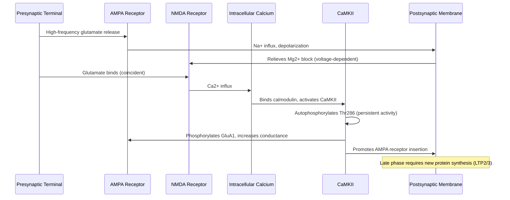
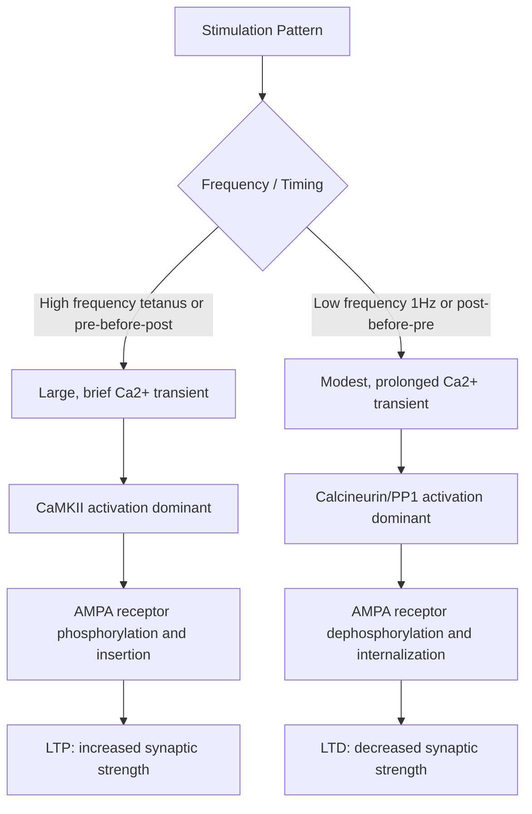

## Synaptic Plasticity, Long-Term Potentiation, and Depression

### Overview

Synaptic plasticity refers to the activity-dependent modification of synaptic strength — the capacity of synapses to change their efficacy in response to patterns of use. It is the leading cellular model for learning and memory storage in the brain. **Long-term potentiation (LTP)** is a persistent increase in synaptic efficacy following brief high-frequency stimulation; **long-term depression (LTD)** is a persistent decrease in synaptic efficacy following low-frequency or asynchronous stimulation. Both phenomena were originally characterized at hippocampal glutamatergic synapses and have since been documented at synapses throughout the CNS, with mechanisms that vary by brain region, synapse type, and developmental stage.

---

### Historical and Conceptual Framework

**Key Points**

- Rooted in Hebb's postulate: "cells that fire together, wire together"
- First experimentally demonstrated by Bliss and Lømo (1973) in the rabbit hippocampal dentate gyrus
- Provides a synaptic-level mechanism satisfying the requirements of associative learning theories

Donald Hebb's 1949 postulate proposed that repeated, persistent co-activation of a presynaptic and postsynaptic neuron strengthens the synaptic connection between them. LTP is widely regarded as the physiological instantiation of this principle because its induction typically requires coincident presynaptic glutamate release and postsynaptic depolarization — a Hebbian coincidence-detection mechanism realized molecularly by the NMDA receptor.

---

### NMDA Receptor-Dependent LTP (Hippocampal CA1, Schaffer Collateral Pathway)

**Key Points**

- Prototypical and best-characterized form of LTP
- Requires coincident glutamate binding and postsynaptic depolarization
- Expressed primarily via increased AMPA receptor number/conductance at the postsynaptic membrane
- Divided into induction, expression, and maintenance phases with distinct molecular requirements

#### Induction

At resting membrane potential, the NMDA receptor channel pore is occluded by extracellular $Mg^{2+}$ in a voltage-dependent manner. High-frequency presynaptic stimulation (e.g., 100 Hz tetanus) releases glutamate that binds both AMPA and NMDA receptors. AMPA receptor activation depolarizes the postsynaptic membrane sufficiently to relieve the $Mg^{2+}$ block, allowing NMDA receptor-mediated $Ca^{2+}$ influx. This dual requirement — presynaptic glutamate release AND postsynaptic depolarization — makes the NMDA receptor a coincidence detector.

$$P_{open}(NMDAR) \propto [Glu] \times f(V_m)$$

where $f(V_m)$ represents the voltage-dependent relief of $Mg^{2+}$ block.

#### Downstream Signaling Cascade

1. $Ca^{2+}$ influx through NMDA receptors elevates local dendritic spine $[Ca^{2+}]_i$
2. $Ca^{2+}$ binds calmodulin (CaM), forming a $Ca^{2+}$/CaM complex
3. $Ca^{2+}$/CaM activates **CaMKII** (calcium/calmodulin-dependent protein kinase II), a central molecular switch for LTP
4. CaMKII autophosphorylates at Thr286, rendering it constitutively (calcium-independent) active — a proposed molecular substrate of synaptic "memory"
5. Activated CaMKII phosphorylates AMPA receptor GluA1 subunits (Ser831), increasing channel conductance
6. CaMKII and associated signaling promote **AMPA receptor insertion** into the postsynaptic density from extrasynaptic and intracellular pools, mediated by interactions with scaffolding proteins (PSD-95, stargazin/TARPs)
7. Structural enlargement of the dendritic spine occurs, driven by actin cytoskeleton remodeling (Rho GTPase family: RhoA, Rac1, Cdc42)

**Example**

A single 100 Hz, 1-second tetanic stimulus delivered to Schaffer collateral axons produces a synaptic response in CA1 pyramidal neurons that is potentiated relative to baseline for hours in vitro and can persist for weeks in vivo, reflecting both increased AMPA receptor conductance (early phase) and increased AMPA receptor number (later phase).

#### Phases of LTP

- **Early-phase LTP (E-LTP)**: lasts 1–3 hours; independent of new gene transcription/translation; relies on post-translational modification (phosphorylation) and receptor trafficking
- **Late-phase LTP (L-LTP)**: persists for many hours to days/weeks; requires PKA activation, CREB-mediated gene transcription, and new protein synthesis; involves structural synapse remodeling and, in some models, synaptic tagging and capture (a hypothesized mechanism by which weakly stimulated synapses can capture plasticity-related proteins synthesized in response to strong stimulation elsewhere in the same neuron)

---

### Long-Term Depression (LTD)

**Key Points**

- Multiple mechanistically distinct forms exist depending on synapse and induction protocol
- NMDA receptor-dependent LTD and mGluR-dependent LTD are the two principal hippocampal forms
- Generally involves AMPA receptor internalization and dephosphorylation rather than degradation of postsynaptic machinery

#### NMDA Receptor-Dependent LTD

Low-frequency stimulation (e.g., 1 Hz for 10–15 minutes) produces smaller, more prolonged $Ca^{2+}$ elevations than tetanic stimulation. This distinct $Ca^{2+}$ signature preferentially activates **protein phosphatases** rather than kinases:

1. Modest, prolonged $Ca^{2+}$ influx via NMDA receptors
2. Activation of **calcineurin** (protein phosphatase 2B, PP2B) and **protein phosphatase 1 (PP1)**
3. Dephosphorylation of GluA1 (reversing the CaMKII-mediated phosphorylation associated with LTP)
4. Clathrin-mediated **endocytosis (internalization) of AMPA receptors**, reducing postsynaptic receptor density
5. Interaction with AP2/clathrin adaptor complexes and the scaffold protein PICK1

#### Metabotropic Glutamate Receptor (mGluR)-Dependent LTD

Activation of group I mGluRs (mGluR1/5, $G_q$-coupled) triggers a distinct cascade:

1. PLC$\beta$ activation → $IP_3$/DAG production
2. In some forms, rapid **local dendritic protein synthesis** is required (a hallmark distinguishing this pathway) — implicated in Fragile X syndrome, where loss of FMRP (an mRNA-binding translational repressor) leads to exaggerated mGluR-LTD
3. Enhanced AMPA receptor internalization

**Example**

In Fragile X model mice (Fmr1 knockout), mGluR-LTD is exaggerated because loss of FMRP removes translational suppression of mRNAs encoding proteins required for AMPA receptor internalization, producing excessive synaptic weakening — a molecular link between a specific plasticity mechanism and a neurodevelopmental disorder phenotype.

#### Spike-Timing-Dependent Plasticity (STDP)

An alternative induction framework based on the precise millisecond-scale timing between presynaptic and postsynaptic action potentials, rather than stimulation frequency alone:

- Presynaptic spike **preceding** postsynaptic spike (by ~0–20 ms) → LTP ("pre-before-post")
- Presynaptic spike **following** postsynaptic spike → LTD ("post-before-pre")

This asymmetric timing rule provides a biologically plausible mechanism for temporal-order learning and is consistent with the coincidence-detection properties of the NMDA receptor and back-propagating dendritic action potentials.

---

### Presynaptic Forms of Plasticity

**Key Points**

- Not all LTP/LTD is postsynaptically expressed
- Presynaptic LTP is prominent at mossy fiber-CA3 synapses in the hippocampus

Mossy fiber LTP at the hippocampal DG-to-CA3 synapse is largely **NMDA receptor-independent** and instead relies on presynaptic mechanisms: $Ca^{2+}$ influx into the presynaptic terminal (via voltage-gated $Ca^{2+}$ channels) activates **calcium-sensitive adenylyl cyclase**, elevating cAMP and activating PKA, which enhances neurotransmitter release probability. This distinguishes it mechanistically from CA3-CA1 Schaffer collateral LTP.

---

### Structural and Homeostatic Aspects

**Key Points**

- Persistent plasticity is accompanied by structural remodeling of dendritic spines
- Homeostatic plasticity constrains Hebbian plasticity to prevent runaway potentiation or depression

#### Structural Plasticity

LTP induction is associated with:

- Enlargement of existing dendritic spine heads (via actin polymerization)
- Formation of new dendritic spines and, over longer timescales, new synaptic contacts
- Enlargement of the postsynaptic density and increased scaffolding protein content (PSD-95)

LTD induction is associated with spine shrinkage and, in some cases, spine elimination.

#### Homeostatic Plasticity (Synaptic Scaling)

Distinct from Hebbian LTP/LTD, homeostatic mechanisms globally adjust synaptic strength to stabilize overall neuronal firing rates:

- Chronic activity elevation → global downscaling of synaptic AMPA receptor content
- Chronic activity suppression → global upscaling of synaptic AMPA receptor content
- Mediated in part by TNF-$\alpha$ signaling and activity-regulated changes in AMPA receptor trafficking, operating on timescales of hours to days — much slower than Hebbian LTP/LTD

[Inference] Homeostatic scaling is generally considered synapse-nonspecific (multiplicative across a neuron's synapses) in contrast to the input-specific nature of Hebbian LTP/LTD, though the degree of specificity may vary somewhat by synapse type and experimental preparation.

---

### Behavioral and Systems-Level Correlates

**Key Points**

- LTP/LTD are correlational and causal candidate mechanisms for memory, supported by converging pharmacological, genetic, and optogenetic evidence
- The hippocampus is the most heavily studied substrate, but analogous plasticity occurs in cortex, amygdala, cerebellum, and striatum
- Pharmacological NMDA receptor blockade (e.g., APV) impairs both LTP induction and hippocampus-dependent spatial learning in rodents
- CaMKII knockout or Thr286 mutant mice show impaired LTP and impaired spatial memory (Morris water maze)
- Optogenetic reactivation of neuronal ensembles potentiated during a specific memory can artificially recall or bidirectionally modify the associated memory, providing causal evidence linking synaptic weight changes to specific memories (engram studies)
- Cerebellar LTD (parallel fiber–Purkinje cell synapses) is implicated in motor learning and adaptation (e.g., vestibulo-ocular reflex adaptation), and is mechanistically distinct — climbing fiber-driven, PKC-dependent, and involving AMPA receptor internalization

---

### Comparative Summary Table

| Feature | NMDAR-dependent LTP | NMDAR-dependent LTD | mGluR-dependent LTD | Mossy Fiber LTP |
| --- | --- | --- | --- | --- |
| Locus | Postsynaptic | Postsynaptic | Postsynaptic (local translation) | Presynaptic |
| Induction stimulus | High-frequency / pre-post pairing | Low-frequency (1 Hz) | Group I mGluR activation | High-frequency, NMDAR-independent |
| Key Ca2+ source | NMDAR (large, brief) | NMDAR (modest, prolonged) | ER release (IP3) | Presynaptic VGCCs |
| Key enzyme | CaMKII | Calcineurin / PP1 | Local protein synthesis machinery | Ca2+-sensitive adenylyl cyclase / PKA |
| AMPAR trafficking | Insertion | Internalization | Internalization | N/A (release probability change) |

---

### Synapse-Level Plasticity Diagram (svg_diagram)

<svg xmlns="http://www.w3.org/2000/svg" viewBox="0 0 900 420" font-family="Helvetica, Arial, sans-serif">
<text x="450" y="28" text-anchor="middle" font-size="18" font-weight="bold" fill="#1a1a2e">LTP vs LTD Molecular Divergence (svg_diagram)</text>

<ellipse cx="450" cy="70" rx="120" ry="40" fill="#e8d9c4" stroke="#1a1a2e" stroke-width="1.5" />
<text x="450" y="75" text-anchor="middle" font-size="12" fill="#1a1a2e">Presynaptic Terminal (Glutamate)</text>
<line x1="380" y1="110" x2="380" y2="150" stroke="#1a1a2e" stroke-width="2" marker-end="url(#arrow2)" />
<line x1="520" y1="110" x2="520" y2="150" stroke="#1a1a2e" stroke-width="2" marker-end="url(#arrow2)" />

<rect x="90" y="150" width="720" height="14" fill="#d8d8e8" stroke="#555" stroke-width="1" />

<rect x="360" y="164" width="40" height="55" fill="#4a7fb5" stroke="#1a1a2e" stroke-width="1.5" />
<text x="380" y="235" text-anchor="middle" font-size="10" fill="#1a1a2e">NMDAR</text>

<rect x="500" y="164" width="40" height="55" fill="#c1502e" stroke="#1a1a2e" stroke-width="1.5" />
<text x="520" y="235" text-anchor="middle" font-size="10" fill="#1a1a2e">AMPAR</text>

<line x1="380" y1="219" x2="380" y2="250" stroke="#1a1a2e" stroke-width="2" marker-end="url(#arrow2)" />
<circle cx="380" cy="260" r="14" fill="#f2c14e" stroke="#1a1a2e" stroke-width="1.5" />
<text x="380" y="264" text-anchor="middle" font-size="10" fill="#1a1a2e">Ca2+</text>

<line x1="360" y1="272" x2="220" y2="310" stroke="#1a1a2e" stroke-width="2" marker-end="url(#arrow2)" />
<text x="180" y="330" text-anchor="middle" font-size="11" fill="#333">Large/brief Ca2+</text>
<text x="180" y="345" text-anchor="middle" font-size="11" fill="#333">-&gt; CaMKII</text>
<rect x="120" y="355" width="140" height="34" rx="6" fill="#c8e6c9" stroke="#1a1a2e" />
<text x="190" y="376" text-anchor="middle" font-size="12" font-weight="bold" fill="#1a1a2e">LTP: AMPAR insertion</text>

<line x1="400" y1="272" x2="560" y2="310" stroke="#1a1a2e" stroke-width="2" marker-end="url(#arrow2)" />
<text x="600" y="330" text-anchor="middle" font-size="11" fill="#333">Modest/prolonged Ca2+</text>
<text x="600" y="345" text-anchor="middle" font-size="11" fill="#333">-&gt; Calcineurin/PP1</text>
<rect x="520" y="355" width="160" height="34" rx="6" fill="#ffcdd2" stroke="#1a1a2e" />
<text x="600" y="376" text-anchor="middle" font-size="12" font-weight="bold" fill="#1a1a2e">LTD: AMPAR internalization</text>
</svg>

---

### Clinical and Research Relevance

- Alzheimer's disease: soluble amyloid-$\beta$ oligomers impair LTP and facilitate LTD-like AMPA receptor internalization at hippocampal synapses, providing a candidate synaptic mechanism for early memory impairment
- NMDA receptor hypofunction is implicated in schizophrenia pathophysiology models
- Fragile X syndrome: exaggerated mGluR-LTD due to FMRP loss, motivating mGluR5 antagonist trials [Unverified — clinical trial outcomes for mGluR5-targeted therapeutics have been mixed and should be checked against current literature]
- Memantine, a moderate-affinity NMDA receptor antagonist, is used clinically in Alzheimer's disease, reflecting the therapeutic relevance of NMDA receptor-dependent signaling

---

**Related Topics**

- Receptor types and intracellular signaling (AMPA/NMDA receptor structure, GPCR cascades)
- Dendritic spine structural plasticity and actin dynamics
- CREB, immediate early genes, and memory consolidation
- Engram cells and memory allocation
- Homeostatic plasticity and synaptic scaling mechanisms
- Cerebellar motor learning and parallel fiber LTD
- Neurodevelopmental disorders and synaptic plasticity dysfunction (Fragile X, autism spectrum models)
- Optogenetic and chemogenetic tools for probing synaptic plasticity in vivo