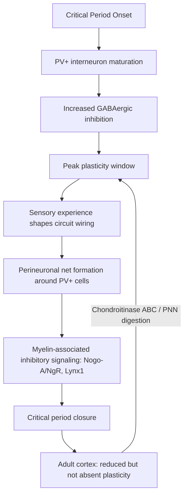
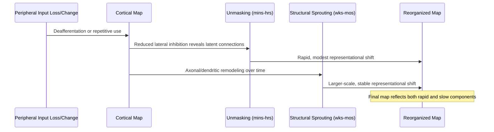

## Cortical Reorganization and Experience-Dependent Plasticity

### Overview

Experience-dependent plasticity refers to the capacity of cortical circuits to alter their structural and functional organization in response to sensory experience, learning, injury, or deprivation. Unlike the synapse-level mechanisms of LTP/LTD, this domain concerns **circuit-level and map-level reorganization** — changes in receptive field properties, cortical territory allocation, and topographic representation — observable across sensory, motor, and association cortices. Cortical reorganization is most pronounced during developmental **critical periods** but persists, in attenuated form, throughout life.

---

### Critical Periods and Developmental Plasticity

**Key Points**

- Critical periods are developmental windows of heightened plasticity during which experience has outsized, often permanent, effects on circuit wiring
- Best characterized in the visual system (ocular dominance plasticity)
- Critical period timing and closure are actively regulated by specific molecular "brakes," not simply a passive loss of plasticity

#### Ocular Dominance Plasticity (Hubel and Wiesel Paradigm)

In normal binocular development, most primary visual cortex (V1) neurons respond to input from both eyes, organized into alternating ocular dominance columns. Monocular deprivation (eyelid suture) during the critical period produces a dramatic, lasting shift in ocular dominance: cortical neurons preferentially respond to the non-deprived eye, and the deprived eye's cortical territory shrinks — a phenomenon underlying **amblyopia** ("lazy eye") when uncorrected in humans.

Mechanistically:

1. Initial functional shift is rapid (within 24–48 hours) and involves weakening of deprived-eye synapses via LTD-like mechanisms (NMDA receptor and CaMKII/calcineurin-dependent) and potentiation of open-eye inputs
2. Prolonged deprivation produces **structural changes**: retraction of deprived-eye geniculocortical axon arbors in layer IV and corresponding expansion of open-eye arbors
3. The same manipulation produces little or no effect in adulthood, defining the closure of the critical period

#### Molecular Regulation of Critical Period Timing

- **GABAergic inhibition maturation**: critical period onset is triggered by the maturation of parvalbumin-positive (PV+) fast-spiking inhibitory interneurons, particularly those forming perisomatic "basket cell" synapses; enhancing GABAergic transmission pharmacologically (e.g., benzodiazepines) can prematurely trigger critical period onset in animal models
- **Perineuronal nets (PNNs)**: chondroitin sulfate proteoglycan-rich extracellular matrix structures that condense around PV+ interneurons as the critical period closes, physically and molecularly restricting further plasticity; enzymatic degradation of PNNs (chondroitinase ABC) can reopen juvenile-like plasticity in adult cortex
- **Myelin-associated inhibitory signaling**: Nogo-A and its receptor NgR, along with the Lynx1 protein (which modulates nicotinic receptor signaling and closes the ocular dominance critical period), constrain adult structural plasticity
- **Epigenetic and transcriptional brakes**: Otx2 homeoprotein transfer into PV+ interneurons and changes in histone acetylation patterns contribute to critical period closure

**Example**

Chondroitinase ABC infusion into adult rat visual cortex digests perineuronal nets surrounding PV+ interneurons and restores susceptibility to monocular deprivation-induced ocular dominance shifts that would otherwise be absent in the mature brain — demonstrating that critical period closure reflects active molecular constraints rather than an irreversible developmental endpoint.

---

### Cortical Map Reorganization

**Key Points**

- Topographic sensory and motor maps are not fixed but continuously shaped by patterned use
- Deafferentation (loss of sensory input) produces reorganization extending beyond the deprived representation into adjacent cortical territory
- Reorganization is mediated by both unmasking of existing latent connections and, over longer timescales, structural axonal/dendritic sprouting

#### Somatosensory Cortex Reorganization

Classic studies of digit amputation or peripheral nerve lesion in primates demonstrate that the cortical territory formerly representing the lost digit becomes progressively responsive to inputs from adjacent, intact digits, effectively "invading" the deprived territory over a timescale of weeks to months. Two mechanistic stages are typically distinguished:

1. **Rapid unmasking** (minutes to hours): pre-existing but normally subthreshold or inhibited horizontal cortical connections become functionally effective following removal of competing input, likely via reduced lateral inhibition
2. **Slow structural sprouting** (weeks to months): new axonal collateral growth and dendritic remodeling extend representational changes beyond what unmasking alone can explain, and can extend reorganization across several millimeters of cortex — distances too great to be explained by local unmasking alone

#### Motor Cortex Reorganization

Motor skill training produces expansion of the cortical representation devoted to trained movements, demonstrated via intracortical microstimulation mapping. This process depends on:

- LTP-like synaptic strengthening of horizontal intracortical connections within motor cortex
- Structural synaptogenesis, visualized in vivo via two-photon imaging as increased formation and stabilization of dendritic spines on layer V pyramidal neuron apical dendrites during motor learning
- New spine formation exceeds spine elimination during acquisition; a subset of newly formed spines are selectively stabilized and persist, correlating with retained motor skill

**Example**

In vivo two-photon imaging of mouse motor cortex during acquisition of a novel forelimb reaching task reveals a transient increase in the rate of new dendritic spine formation on layer V pyramidal neurons within the trained forelimb representation, with a subset of newly formed spines persisting for weeks and correlating with retention of the learned motor sequence — while spines formed during the same period in untrained cortical regions show no such selective stabilization.

---

### Molecular and Cellular Substrates of Cortical Plasticity

**Key Points**

- Overlaps mechanistically with synapse-level LTP/LTD but operates at the scale of distributed circuits and topographic maps
- Neuromodulatory systems gate the induction of use-dependent map plasticity

#### Neuromodulatory Gating

Cortical map plasticity is not solely a function of correlated activity; it requires permissive neuromodulatory signals:

- **Acetylcholine** (from nucleus basalis) is required for many forms of adult cortical map plasticity; nucleus basalis lesions abolish experience-dependent receptive field reorganization in auditory and somatosensory cortex despite continued sensory experience
- **Norepinephrine** (from locus coeruleus) contributes to attention-gated plasticity and has been implicated in a proposed "second critical period" reopening in some paradigms (e.g., imprinting-like plasticity)
- **Dopamine** signals reward-prediction and value, biasing which sensory associations are consolidated into stable map changes

#### Structural Mechanisms

- Dendritic spine turnover (formation/elimination), visualized by longitudinal two-photon imaging through cranial windows, as the primary substrate of adult structural plasticity
- Axonal bouton formation and retraction paralleling postsynaptic spine dynamics
- Glial contributions: astrocytic processes dynamically remodel around synapses (tripartite synapse plasticity) and microglia participate in activity-dependent synaptic pruning via complement-tagging mechanisms (C1q/C3-CR3 pathway), most extensively characterized during developmental refinement but also implicated in adult plasticity and pathological states

---

### Perceptual Learning

**Key Points**

- Repeated sensory discrimination training improves perceptual acuity and is accompanied by cortical representational changes
- Often highly specific to trained stimulus parameters (retinotopic location, orientation, frequency), implicating early sensory cortex rather than purely higher-order decision mechanisms

Perceptual learning (e.g., improved visual orientation discrimination or auditory frequency discrimination with practice) is accompanied by sharpening of neuronal tuning curves and, in some paradigms, expansion of cortical territory representing the trained stimulus feature (e.g., expanded representation of a trained sound frequency in primary auditory cortex tonotopic maps). The specificity of many perceptual learning effects to trained retinal location or orientation is frequently cited as evidence for a locus of plasticity in early sensory cortex, though contributions from higher-order read-out mechanisms are also debated in the literature.

---

### Clinical and Translational Relevance

**Key Points**

- Cortical reorganization underlies both adaptive rehabilitation phenomena and maladaptive pathological states
- Critical period biology directly informs treatment windows for developmental sensory disorders
- **Amblyopia**: results from critical-period ocular dominance shifts following strabismus, anisometropia, or cataract; treatment (patching the stronger eye, atropine penalization) is most effective when initiated within the pediatric critical period, motivating early screening
- **Phantom limb pain**: cortical remapping following limb amputation, in which somatosensory territory formerly representing the missing limb becomes responsive to adjacent body-part inputs, has been proposed as a contributing mechanism, though the relationship between the degree of remapping and pain severity remains debated in the literature [Unverified — the causal contribution of cortical remapping to phantom pain versus its role as a correlate is contested across studies]
- **Stroke rehabilitation**: constraint-induced movement therapy leverages use-dependent motor map reorganization to promote recovery of function in the affected limb by forcing its use and preventing "learned non-use"
- **Focal hand dystonia** in musicians: proposed to arise, in part, from maladaptive somatosensory map "smearing" or fusion of adjacent digit representations due to highly repetitive, temporally correlated finger movements [Inference — this mechanism is a leading hypothesis but the field has not fully resolved the relative contributions of cortical versus peripheral/subcortical factors]
- **Perineuronal net and critical-period-reopening research** is being explored as a therapeutic strategy for adult amblyopia and post-stroke plasticity enhancement, though clinical translation remains at an early stage

---

### Comparative Summary

| Feature | Ocular Dominance Plasticity | Somatosensory Map Reorganization | Motor Skill-Related Reorganization |
| --- | --- | --- | --- |
| Primary trigger | Monocular deprivation | Deafferentation / altered use | Repetitive skilled movement |
| Time course (rapid component) | 24–48 hours | Minutes to hours (unmasking) | Days |
| Time course (structural component) | Days to weeks | Weeks to months | Weeks |
| Key restrictive factor | Perineuronal nets, myelin signaling | Lateral inhibition strength | Competing representations |
| Primary developmental window | Strongly critical-period dependent | Present in both juvenile and adult, attenuated with age | Persists substantially into adulthood |

---

### Cortical Reorganization Timeline (svg_diagram)

<svg xmlns="http://www.w3.org/2000/svg" viewBox="0 0 900 400" font-family="Helvetica, Arial, sans-serif">
<text x="450" y="28" text-anchor="middle" font-size="18" font-weight="bold" fill="#1a1a2e">Timeline of Experience-Dependent Cortical Change (svg_diagram)</text>

<line x1="80" y1="330" x2="820" y2="330" stroke="#1a1a2e" stroke-width="2" marker-end="url(#arrow3)" />
<text x="820" y="355" text-anchor="middle" font-size="12" fill="#333">Time</text>

<circle cx="150" cy="330" r="6" fill="#4a7fb5" />
<line x1="150" y1="330" x2="150" y2="120" stroke="#4a7fb5" stroke-dasharray="4,3" />
<rect x="80" y="80" width="140" height="40" rx="6" fill="#4a7fb5" fill-opacity="0.15" stroke="#4a7fb5" />
<text x="150" y="100" text-anchor="middle" font-size="11" fill="#1a1a2e">Deprivation /</text>
<text x="150" y="114" text-anchor="middle" font-size="11" fill="#1a1a2e">altered input onset</text>
<circle cx="320" cy="330" r="6" fill="#c1502e" />
<line x1="320" y1="330" x2="320" y2="170" stroke="#c1502e" stroke-dasharray="4,3" />
<rect x="250" y="130" width="140" height="40" rx="6" fill="#c1502e" fill-opacity="0.15" stroke="#c1502e" />
<text x="320" y="150" text-anchor="middle" font-size="11" fill="#1a1a2e">Rapid unmasking</text>
<text x="320" y="164" text-anchor="middle" font-size="11" fill="#1a1a2e">(mins-hrs)</text>
<circle cx="500" cy="330" r="6" fill="#3a8f6e" />
<line x1="500" y1="330" x2="500" y2="220" stroke="#3a8f6e" stroke-dasharray="4,3" />
<rect x="430" y="180" width="140" height="40" rx="6" fill="#3a8f6e" fill-opacity="0.15" stroke="#3a8f6e" />
<text x="500" y="200" text-anchor="middle" font-size="11" fill="#1a1a2e">Synaptic weakening/</text>
<text x="500" y="214" text-anchor="middle" font-size="11" fill="#1a1a2e">strengthening (LTD/LTP-like)</text>
<circle cx="680" cy="330" r="6" fill="#f2a13e" />
<line x1="680" y1="330" x2="680" y2="260" stroke="#f2a13e" stroke-dasharray="4,3" />
<rect x="610" y="220" width="150" height="40" rx="6" fill="#f2a13e" fill-opacity="0.15" stroke="#f2a13e" />
<text x="680" y="240" text-anchor="middle" font-size="11" fill="#1a1a2e">Structural sprouting /</text>
<text x="680" y="254" text-anchor="middle" font-size="11" fill="#1a1a2e">spine turnover (wks-mos)</text>
</svg>

---

**Related Topics**

- Synaptic plasticity, LTP, and LTD (cellular substrates underlying map-level change)
- Receptor types and intracellular signaling (NMDA receptor coincidence detection at the circuit level)
- Perineuronal nets and extracellular matrix regulation of plasticity
- Neuromodulatory systems (cholinergic, noradrenergic, dopaminergic gating of plasticity)
- Developmental neurobiology and critical period timing
- Two-photon in vivo imaging methods for structural plasticity
- Rehabilitation neuroscience following stroke and peripheral injury
- Amblyopia, strabismus, and pediatric visual development