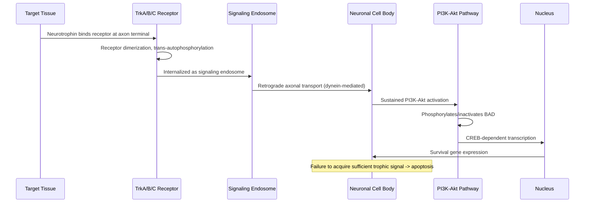
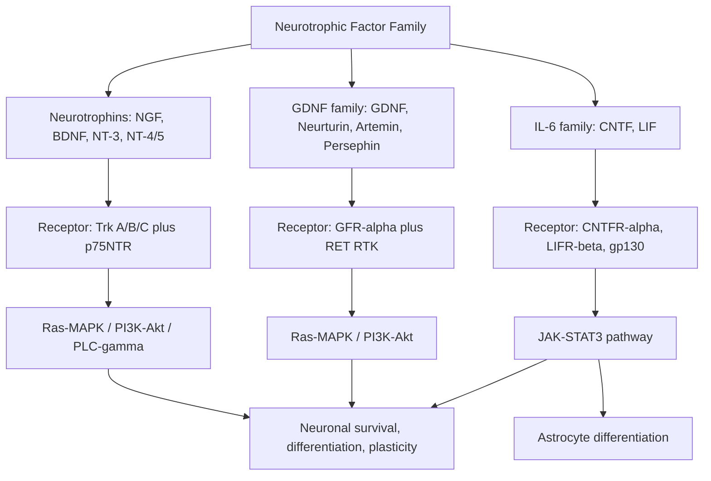

## Neurotrophic Factors and Neuronal Survival

### Overview

Neurotrophic factors are a class of secreted signaling proteins that regulate the survival, growth, differentiation, and synaptic function of neurons throughout development and adulthood. Their discovery arose from the **neurotrophic hypothesis**: developing neurons are produced in excess and compete for limited, target-derived survival signals, such that neurons failing to acquire sufficient trophic support undergo programmed cell death. This principle, first established for the neurotrophin family, has since been extended to several structurally distinct families of growth factors with overlapping and complementary roles in neuronal survival and connectivity.

---

### The Neurotrophic Hypothesis and Historical Foundations

**Key Points**

- Established through classic experiments by Rita Levi-Montalcini and Viktor Hamburger on nerve growth factor (NGF)
- Explains naturally occurring developmental neuronal death as a target-dependent, competitive process
- Provides the conceptual foundation for the broader neurotrophin family and related factors

Levi-Montalcini and Hamburger's studies of chick sympathetic and sensory neurons demonstrated that target tissue (e.g., peripheral effector organs) produces a limited, diffusible survival factor. Neurons that successfully innervate the target and retrogradely transport sufficient quantities of this factor survive; those that fail to do so undergo apoptosis. This target-derived, limited-supply, competitive model explains the substantial naturally occurring neuronal death (up to 50% or more in some populations) observed during normal vertebrate nervous system development.

$$\text{Neuron survival} \propto \text{[target-derived trophic factor]} \times \text{[innervation success]}$$

---

### The Neurotrophin Family

**Key Points**

- Four principal mammalian neurotrophins: NGF, BDNF, NT-3, NT-4/5
- Each preferentially activates a specific Trk (tropomyosin receptor kinase) receptor, with shared low-affinity binding to p75NTR
- Signal via receptor tyrosine kinase mechanisms (dimerization, trans-autophosphorylation)

#### Neurotrophin-Receptor Specificity

| Neurotrophin | High-affinity Trk receptor | Principal neuronal populations supported |
| --- | --- | --- |
| NGF | TrkA | Sympathetic neurons, small-diameter sensory (nociceptive) neurons, basal forebrain cholinergic neurons |
| BDNF | TrkB | Hippocampal and cortical neurons, motor neurons, dopaminergic neurons |
| NT-3 | TrkC (also binds TrkA/TrkB with lower affinity) | Proprioceptive sensory neurons, some CNS populations |
| NT-4/5 | TrkB | Overlapping with BDNF-responsive populations |

All four neurotrophins also bind **p75NTR** (p75 neurotrophin receptor, a member of the TNF receptor superfamily) with roughly similar low affinity. p75NTR signaling is functionally distinct from Trk signaling and can promote apoptosis (particularly in response to unprocessed pro-neurotrophins) or modulate Trk signaling specificity and axon growth cone dynamics.

#### Downstream Signaling from Trk Receptors

Ligand binding induces receptor dimerization and trans-autophosphorylation of intracellular tyrosine residues, creating phosphotyrosine docking sites for adaptor proteins that engage three principal cascades:

1. **Ras–Raf–MEK–ERK1/2 (MAPK) pathway**: via Shc/Grb2/SOS-mediated Ras activation; drives gene transcription supporting differentiation, neurite outgrowth, and some forms of synaptic plasticity
2. **PI3K–Akt pathway**: activated via Grb2/Gab1 or IRS-1/2 adaptors; principal pro-survival cascade — Akt phosphorylates and inactivates pro-apoptotic proteins (BAD, and inhibits caspase-9 activation, and increases CREB-dependent transcription of survival genes)
3. **PLC$\gamma$ pathway**: generates $IP_3$/DAG, contributing to $Ca^{2+}$-dependent synaptic plasticity (notably BDNF-TrkB-mediated modulation of hippocampal LTP)

**Example**

NGF binding to TrkA receptors on sympathetic neuron growth cones activates local PI3K-Akt signaling that inhibits the pro-apoptotic protein BAD, while also triggering retrograde transport of activated Trk-containing "signaling endosomes" from the axon terminal to the cell body, where sustained ERK and Akt signaling supports transcriptional survival programs — providing a mechanism by which a spatially distant, target-derived signal produces a nuclear transcriptional response.

---

### p75NTR and Pro-Neurotrophin Signaling

**Key Points**

- p75NTR can promote either survival or apoptosis depending on ligand, co-receptor, and cellular context
- Unprocessed pro-neurotrophins preferentially signal through p75NTR (often with sortilin as co-receptor) to promote apoptosis
- Mature, cleaved neurotrophins preferentially signal through Trk receptors to promote survival

This dual-signaling architecture (the "yin-yang" model of neurotrophin action) means that the same gene product can have opposing effects depending on proteolytic processing:

- **Pro-NGF/pro-BDNF** (uncleaved precursor forms) bind p75NTR/sortilin complexes → activate JNK signaling and pro-apoptotic transcriptional programs (via c-Jun)
- **Mature NGF/BDNF** (cleaved by furin, plasmin, or matrix metalloproteinases) preferentially bind Trk receptors → activate pro-survival PI3K-Akt and Ras-MAPK signaling

[Inference] This bidirectional signaling system is thought to contribute to activity-dependent competitive synapse elimination and axon pruning during development, in which some neuronal processes are actively eliminated via p75NTR-mediated signaling while others are stabilized via Trk-mediated signaling, though the relative contribution of this mechanism varies across the specific circuits studied.

---

### Glial Cell Line-Derived Neurotrophic Factor (GDNF) Family

**Key Points**

- Structurally distinct from neurotrophins (TGF-$\beta$ superfamily members)
- Signal through the RET receptor tyrosine kinase in conjunction with GFR$\alpha$ co-receptors
- Principal survival factors for midbrain dopaminergic neurons and spinal motor neurons

The GDNF family ligands (GDNF, neurturin, artemin, persephin) signal through a receptor complex consisting of a GPI-anchored GFR$\alpha$ co-receptor (GFR$\alpha$1–4, providing ligand specificity) and the shared RET receptor tyrosine kinase (providing the signal-transducing intracellular domain). Downstream signaling again engages Ras-MAPK and PI3K-Akt cascades.

- **GDNF** supports survival of midbrain dopaminergic neurons (substantia nigra pars compacta) and spinal motor neurons, motivating substantial research interest in GDNF-based therapeutic strategies for Parkinson's disease and amyotrophic lateral sclerosis (ALS)
- RET mutations are additionally implicated in Hirschsprung disease (enteric nervous system development) and certain endocrine neoplasias, reflecting RET's broader developmental roles beyond the CNS

---

### Ciliary Neurotrophic Factor (CNTF) and the IL-6 Cytokine Family

**Key Points**

- Structurally related to IL-6 family cytokines rather than neurotrophins or GDNF-family ligands
- Signals via a tripartite receptor complex and JAK-STAT pathway activation

CNTF signals through a receptor complex comprising CNTFR$\alpha$, LIFR$\beta$, and gp130, activating **JAK (Janus kinase)** associated with the receptor complex, which phosphorylates and activates **STAT3** transcription factors. Phosphorylated STAT3 dimerizes, translocates to the nucleus, and drives transcription of survival and gliogenic genes. CNTF supports survival of motor neurons and certain sensory and ciliary ganglion neuron populations, and also promotes astrocyte differentiation from neural progenitors via the same JAK-STAT3 pathway.

---

### Neurotrophic Signaling in Synaptic Function and Plasticity

**Key Points**

- Beyond survival, neurotrophins — especially BDNF — regulate synaptic transmission and plasticity in the mature CNS
- BDNF is activity-dependently released and acts both pre- and postsynaptically

BDNF expression and release are activity-dependent: neuronal depolarization and synaptic activity increase BDNF transcription (via CREB-dependent promoters) and promote activity-dependent secretion. Once released:

- Presynaptically, BDNF-TrkB signaling can enhance neurotransmitter release probability
- Postsynaptically, BDNF-TrkB signaling activates PLC$\gamma$, contributing to $Ca^{2+}$-dependent potentiation of synaptic transmission and interacting with the NMDA receptor-CaMKII cascade underlying LTP
- BDNF supports local dendritic protein synthesis via PI3K-Akt-mTOR signaling, relevant to synapse-specific "tagging and capture" models of late-phase LTP

**Example**

The common human BDNF Val66Met polymorphism alters activity-dependent BDNF secretion (though not constitutive secretion) and has been associated in some studies with altered hippocampal-dependent memory performance and altered hippocampal LTP-like plasticity measures, illustrating a proposed link between a specific neurotrophin signaling variant and cognitive phenotype [Inference — while the Val66Met literature is extensive, effect sizes are generally modest and some behavioral associations have shown inconsistent replication across studies].

---

### Neurotrophic Factors in Neurodegeneration and Therapeutics

**Key Points**

- Reduced neurotrophic support is implicated in several neurodegenerative conditions
- Neurotrophic factor-based therapeutics face substantial delivery and pharmacokinetic challenges due to poor blood-brain barrier penetration and off-target effects
- **Alzheimer's disease**: basal forebrain cholinergic neurons (NGF-dependent) show pronounced degeneration; NGF-based gene therapy approaches have been explored in clinical trials, though efficacy has not yet supported approval for routine clinical use
- **Parkinson's disease**: GDNF has been investigated as a disease-modifying therapy for nigrostriatal dopaminergic neuron protection; direct intraputaminal GDNF infusion trials have shown mixed clinical results despite promising preclinical data, illustrating the translational gap between animal models and human trials [Unverified — specific trial outcomes should be checked against current literature, as this remains an active area of clinical investigation]
- **ALS**: motor neuron loss has motivated trials of CNTF and GDNF-family ligands; clinical benefit has been limited to date, in part due to delivery challenges and dose-limiting systemic side effects
- **Major depressive disorder**: reduced hippocampal BDNF signaling has been proposed as a contributing mechanism, and some antidepressant treatments (including ketamine at subanesthetic doses) are hypothesized to act partly via enhanced BDNF-TrkB signaling and downstream synaptogenesis [Inference — this remains a prominent hypothesis in the field rather than a fully established mechanism]

---

### Comparative Summary

| Feature | Neurotrophins | GDNF Family | CNTF/IL-6 Family |
| --- | --- | --- | --- |
| Structural class | NGF/neurotrophin family | TGF-$\beta$ superfamily | IL-6 cytokine family |
| Receptor | Trk (A/B/C) + p75NTR | GFR$\alpha$ + RET | CNTFR$\alpha$/LIFR$\beta$/gp130 |
| Signaling type | Receptor tyrosine kinase | Receptor tyrosine kinase | JAK-STAT |
| Principal populations | Sympathetic, sensory, cholinergic, hippocampal/cortical neurons | Dopaminergic, motor neurons | Motor neurons, ciliary ganglion, astrocyte progenitors |
| Key survival pathway | PI3K-Akt | PI3K-Akt / Ras-MAPK | JAK-STAT3 |

---

### Neurotrophic Signaling Overview (svg_diagram)

<svg xmlns="http://www.w3.org/2000/svg" viewBox="0 0 900 400" font-family="Helvetica, Arial, sans-serif">
<text x="450" y="28" text-anchor="middle" font-size="18" font-weight="bold" fill="#1a1a2e">Neurotrophic Factor Action at the Axon Terminal (svg_diagram)</text>

<rect x="60" y="60" width="160" height="60" rx="8" fill="#e8d9c4" stroke="#1a1a2e" stroke-width="1.5" />
<text x="140" y="95" text-anchor="middle" font-size="12" fill="#1a1a2e">Target Tissue</text>
<text x="140" y="110" text-anchor="middle" font-size="11" fill="#1a1a2e">(secretes NGF/BDNF/GDNF)</text>
<line x1="220" y1="90" x2="290" y2="90" stroke="#1a1a2e" stroke-width="2" marker-end="url(#arrow4)" />

<polygon points="290,60 380,90 290,120" fill="#4a7fb5" stroke="#1a1a2e" stroke-width="1.5" />
<text x="320" y="140" text-anchor="middle" font-size="11" fill="#1a1a2e">Axon terminal / growth cone</text>
<text x="320" y="155" text-anchor="middle" font-size="11" fill="#1a1a2e">(Trk / RET receptor)</text>

<line x1="320" y1="160" x2="320" y2="200" stroke="#1a1a2e" stroke-width="2" marker-end="url(#arrow4)" />
<circle cx="320" cy="220" r="20" fill="#f2c14e" stroke="#1a1a2e" stroke-width="1.5" />
<text x="320" y="250" text-anchor="middle" font-size="11" fill="#1a1a2e">Signaling endosome</text>

<line x1="320" y1="260" x2="600" y2="280" stroke="#1a1a2e" stroke-width="2" stroke-dasharray="6,3" marker-end="url(#arrow4)" />
<text x="460" y="270" text-anchor="middle" font-size="11" fill="#333">Retrograde axonal transport (dynein)</text>

<ellipse cx="700" cy="290" rx="120" ry="70" fill="#c8d9c4" stroke="#1a1a2e" stroke-width="1.5" />
<text x="700" y="270" text-anchor="middle" font-size="12" fill="#1a1a2e">Neuronal cell body</text>
<ellipse cx="700" cy="310" rx="55" ry="30" fill="#a8c9a4" stroke="#1a1a2e" stroke-width="1" />
<text x="700" y="315" text-anchor="middle" font-size="11" fill="#1a1a2e">Nucleus: CREB/STAT3</text>
<text x="700" y="330" text-anchor="middle" font-size="11" fill="#1a1a2e">survival gene transcription</text>
</svg>

---

**Related Topics**

- Receptor types and intracellular signaling (RTK signaling detail, PI3K-Akt and Ras-MAPK cascades)
- Synaptic plasticity, LTP, and LTD (BDNF-TrkB contributions to hippocampal plasticity)
- Programmed cell death and developmental neuronal apoptosis
- Axon guidance and growth cone dynamics
- Neurodegenerative disease mechanisms (Parkinson's, Alzheimer's, ALS)
- Neural stem cell biology and adult neurogenesis
- Gene therapy approaches in neurology
- Cortical reorganization and experience-dependent plasticity