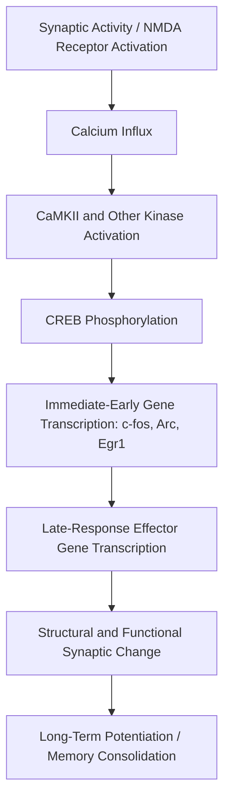

## Basics of Gene Expression in the Nervous System

### Central Dogma in the Neuronal Context

Gene expression is the process by which information encoded in DNA is converted into a functional product, typically a protein, through the sequential stages of transcription and translation. In neurons, this process is subject to distinctive regulatory constraints not found in most other cell types, owing to neurons' extreme morphological polarity (extensive dendritic and axonal compartments far from the cell body), post-mitotic status (most mature neurons do not divide), and requirement for rapid, localized responses to synaptic activity.

$$\text{DNA} \xrightarrow{\text{transcription}} \text{pre-mRNA} \xrightarrow{\text{processing}} \text{mRNA} \xrightarrow{\text{translation}} \text{Protein}$$

### Transcription

Transcription is carried out by RNA polymerase II for protein-coding genes, producing a pre-mRNA transcript complementary to the DNA template strand.

**Regulatory Elements**

- **Promoters**: DNA sequences immediately upstream of the transcription start site where RNA polymerase II and general transcription factors assemble.
- **Enhancers**: regulatory DNA elements that can be located far from the gene they regulate (sometimes hundreds of kilobases away) and act by looping into physical proximity with the promoter, recruiting transcription factors and coactivators to increase transcription rate.
- **Transcription factors**: sequence-specific DNA-binding proteins that activate or repress transcription. In the nervous system, key examples include CREB (cAMP response element-binding protein), which is activated downstream of neuronal activity and calcium influx, and is central to the transcriptional response underlying long-term synaptic plasticity and memory consolidation.

**Immediate-Early Genes (IEGs)**

A functionally important class of genes, including *c-fos*, *Arc* (activity-regulated cytoskeleton-associated protein), and *zif268* (*Egr1*), are transcribed rapidly (within minutes) and transiently following neuronal activity, without requiring new protein synthesis for their own induction. IEGs are widely used experimentally as molecular markers of recent neuronal activation, and several (notably *Arc*) play direct functional roles in synaptic plasticity.

### RNA Processing

Pre-mRNA undergoes several processing steps before export from the nucleus:

- **5' capping**: addition of a 7-methylguanosine cap, protecting the transcript from degradation and facilitating ribosome recruitment.
- **Splicing**: removal of non-coding introns and joining of coding exons by the spliceosome.
- **3' polyadenylation**: addition of a poly-A tail, contributing to mRNA stability and export.

**Alternative Splicing**

The nervous system exhibits an unusually high degree of alternative splicing relative to other tissues, allowing a single gene to produce multiple distinct protein isoforms. This is a major mechanism for generating molecular diversity in the brain from a comparatively limited number of genes. A well-characterized example is the *Neurexin* gene family, whose extensive alternative splicing generates thousands of possible isoforms that combine differentially with *Neuroligin* splice variants to specify synaptic connectivity and properties.

### Translation and Its Neuronal-Specific Regulation

Translation occurs on ribosomes in the cytoplasm, converting the mRNA sequence into a polypeptide chain via codon-anticodon pairing with charged tRNAs.

**Local Protein Synthesis**

A defining feature of neuronal gene expression is the capacity for **local translation** at dendrites and, to a more limited extent, axons, far from the cell body. This is enabled by:

- Transport of translationally repressed mRNAs along microtubules via motor proteins to distal dendritic sites.
- Localized translational activation triggered by synaptic activity, allowing individual synapses to modify their protein composition independently and rapidly, without requiring new transcription in the nucleus or bulk protein transport from the soma.

**[Inference]** Local dendritic translation is widely considered a key molecular substrate for input-specific, synapse-specific forms of long-term plasticity (the "synaptic tagging and capture" hypothesis), although the complete set of molecular mechanisms governing which synapses capture which locally translated proteins is not yet fully resolved.

### Post-Translational Modification and Protein Trafficking

Following translation, many neuronal proteins undergo modifications (phosphorylation, ubiquitination, palmitoylation) that regulate their activity, localization, and stability. For example, phosphorylation of AMPA receptor subunits by CaMKII (calcium/calmodulin-dependent protein kinase II) regulates receptor trafficking to the postsynaptic membrane, a key mechanistic step in long-term potentiation.

### Non-Coding RNA Regulation

Gene expression in neurons is extensively regulated by non-coding RNA species:

- **MicroRNAs (miRNAs)**: short (~22 nucleotide) RNAs that bind complementary sequences in the 3' untranslated region of target mRNAs, typically repressing translation or promoting mRNA degradation. Several miRNAs (e.g., miR-134) have documented roles in regulating dendritic spine morphology and synaptic plasticity.
- **Long non-coding RNAs (lncRNAs)**: longer transcripts with diverse regulatory roles, including chromatin remodeling and modulation of transcription factor activity; the brain expresses a notably large and diverse repertoire of lncRNAs relative to other tissues.

### Epigenetic Regulation of Neuronal Gene Expression

Epigenetic mechanisms modify gene expression without altering the underlying DNA sequence, and are particularly important for the experience-dependent and developmentally programmed regulation of neuronal gene expression:

- **DNA methylation**: addition of methyl groups to cytosine bases (typically at CpG dinucleotides), generally associated with transcriptional repression; DNA methyltransferases (DNMTs) and, in neurons, active demethylation pathways contribute to activity-dependent regulation of genes such as *Bdnf*.
- **Histone modification**: post-translational modification of histone tails (acetylation, methylation, phosphorylation) alters chromatin compaction and accessibility to transcriptional machinery. Histone acetylation, catalyzed by histone acetyltransferases (HATs), is generally associated with a more open chromatin state and increased transcription, and has been specifically implicated in memory formation.
- **Chromatin remodeling complexes**: ATP-dependent complexes that reposition nucleosomes to alter DNA accessibility.

This layer of regulation is a principal molecular mechanism by which environmental experience (stress, learning, enrichment) produces lasting changes in neuronal gene expression, and is the subject of extensive research relating early-life experience to long-term neurodevelopmental and psychiatric outcomes.

### Activity-Dependent Gene Expression Cascade

A canonical signaling pathway links synaptic activity to gene expression changes:

### Diagram: Compartmentalized Gene Expression in a Neuron (svg_diagram)

<svg xmlns="http://www.w3.org/2000/svg" viewBox="0 0 900 380">
<text x="450" y="25" text-anchor="middle" font-size="16" font-weight="bold" fill="#1a1a1a">Compartmentalized Gene Expression in a Neuron (svg_diagram)</text>
<circle cx="200" cy="200" r="70" fill="#eaf2fb" stroke="#2b6cb0" stroke-width="1.5" />
<text x="200" y="195" text-anchor="middle" font-size="11">Nucleus</text>
<text x="200" y="212" text-anchor="middle" font-size="10">Transcription</text>
<rect x="270" y="185" width="130" height="30" fill="#fdf2e3" stroke="#b9770e" />
<text x="335" y="205" text-anchor="middle" font-size="10">Soma: Translation</text>
<line x1="400" y1="180" x2="700" y2="90" stroke="#555" stroke-width="1.5" />
<line x1="400" y1="220" x2="700" y2="310" stroke="#555" stroke-width="1.5" />
<rect x="680" y="60" width="160" height="55" fill="#eafaf1" stroke="#1e8449" />
<text x="760" y="82" text-anchor="middle" font-size="10">Dendrite</text>
<text x="760" y="98" text-anchor="middle" font-size="9">mRNA transport +</text>
<text x="760" y="110" text-anchor="middle" font-size="9">local translation</text>
<rect x="680" y="285" width="160" height="55" fill="#fce8e6" stroke="#c0392b" />
<text x="760" y="307" text-anchor="middle" font-size="10">Axon Terminal</text>
<text x="760" y="323" text-anchor="middle" font-size="9">Limited local</text>
<text x="760" y="335" text-anchor="middle" font-size="9">translation</text>

<text x="450" y="365" text-anchor="middle" font-size="11" fill="#555">mRNAs are transcribed in the nucleus, translated in the soma, or transported for local dendritic/axonal translation.</text>

</svg>

### Example: From Synaptic Signal to Memory Trace

**Example**

1. Repeated synaptic stimulation triggers strong NMDA receptor activation and calcium influx into the postsynaptic spine.
2. Calcium activates CaMKII and adenylyl cyclase-cAMP-PKA signaling, converging on phosphorylation of CREB at Ser133.
3. Phosphorylated CREB binds CRE (cAMP response element) sites, driving transcription of IEGs such as *Arc* and *c-fos* within the nucleus.
4. *Arc* mRNA is transported to activated dendritic spines and locally translated, contributing to AMPA receptor trafficking and structural spine remodeling.
5. The resulting increase in synaptic strength constitutes a candidate cellular mechanism for long-term memory storage at that specific synapse.

**[Inference]** This CREB-centric model is one of the most extensively supported accounts of activity-dependent gene expression in memory, but it represents a simplified schematic; in practice, dozens of interacting transcription factors, kinases, and feedback loops are involved, and the relative contribution of each varies by brain region, cell type, and behavioral paradigm.

### Conclusion

Gene expression in the nervous system follows the canonical transcription-translation framework shared by all cells, but is distinguished by extensive alternative splicing that expands molecular diversity, extensive non-coding RNA regulation, a strong capacity for localized dendritic and axonal translation independent of the cell body, and tightly coupled activity-dependent transcriptional programs (exemplified by immediate-early genes and CREB signaling) that convert transient synaptic activity into lasting changes in neuronal structure and function. Epigenetic mechanisms overlay this system, allowing experience and environment to produce durable, and in some cases heritable, modifications to gene expression patterns.

**Related Topics**

- CREB and the molecular biology of memory consolidation
- Immediate-early genes as markers of neuronal activation (*c-fos*, *Arc*)
- Local dendritic protein synthesis and synaptic tagging
- Alternative splicing in synaptic adhesion molecules (Neurexins/Neuroligins)
- DNA methylation and histone modification in learning and memory
- MicroRNA regulation of synaptic plasticity
- Epigenetic inheritance and early-life experience effects on neurodevelopment