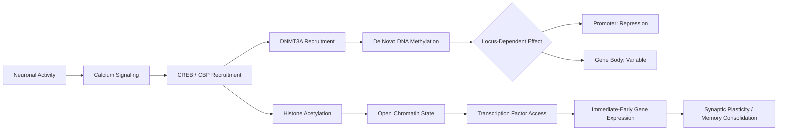

## Epigenetic Mechanisms in Neural Function

### Overview and Scope

Epigenetic mechanisms regulate gene expression without altering the underlying DNA sequence, providing the molecular substrate through which neurons translate experience, development, and environmental signals into lasting changes in cellular phenotype. In neuroscience, these mechanisms are central to explaining how postmitotic neurons — cells that largely do not divide after differentiation — achieve stable yet modifiable patterns of gene expression across a lifespan. This makes epigenetic regulation the leading candidate mechanism for phenomena requiring durable state changes at the molecular level: long-term memory consolidation, activity-dependent synaptic plasticity, critical period timing, and the biological embedding of early-life experience.

**Key Points**

- Epigenetic marks are chemical modifications to DNA, histone proteins, or chromatin-associated RNA that regulate gene accessibility and transcription
- Unlike genetic sequence, epigenetic marks are potentially reversible and dynamically regulated by neural activity
- Core mechanistic classes: DNA methylation/hydroxymethylation, histone post-translational modifications, chromatin remodeling, and non-coding RNA regulation
- Neurons present a unique case among cell types because epigenetic regulation must support both developmental stability and adult plasticity in largely non-dividing cells

### DNA Methylation

DNA methylation involves the covalent addition of a methyl group to the 5-carbon of cytosine, predominantly at CpG dinucleotides, forming 5-methylcytosine (5mC). This mark is deposited and maintained by DNA methyltransferases (DNMTs).

**DNMT Family and Function**

- DNMT1: maintenance methyltransferase; preferentially recognizes hemimethylated DNA generated during replication and restores full methylation on the daughter strand
- DNMT3A and DNMT3B: de novo methyltransferases; establish new methylation patterns independent of replication, which is critical in postmitotic neurons
- DNMT3A is particularly implicated in adult neuronal plasticity, since neurons continue to require de novo methylation for activity-dependent gene regulation despite not dividing

Canonically, promoter-region CpG methylation is associated with transcriptional repression, largely through two mechanisms: direct interference with transcription factor binding, and recruitment of methyl-CpG-binding domain (MBD) proteins such as MeCP2, which in turn recruit corepressor complexes including histone deacetylases (HDACs). Gene body methylation shows a more complex, sometimes positively correlated relationship with transcription, an area still under active investigation. [Inference: the functional logic of gene-body methylation in neurons remains less settled than promoter methylation and should be treated as an active research question rather than a fixed rule.]

**DNA Hydroxymethylation**

5-hydroxymethylcytosine (5hmC) is generated from 5mC by Ten-Eleven Translocation (TET) enzymes (TET1, TET2, TET3) and represents both an intermediate in active DNA demethylation and a stable, distinct epigenetic mark in its own right. 5hmC is notably enriched in neurons relative to other cell types and accumulates with neuronal maturation, suggesting a specialized role in the fine-tuning of the mature neuronal transcriptome.

**MeCP2 and Rett Syndrome**

MeCP2 (methyl-CpG-binding protein 2) is a paradigmatic case linking DNA methylation reading to neurological disease. MeCP2 binds methylated DNA genome-wide and modulates transcription in a context-dependent manner — it can act as both a repressor (via corepressor recruitment) and, at some loci, an activator. Loss-of-function mutations in the X-linked *MECP2* gene cause Rett syndrome, a postnatal neurodevelopmental disorder marked by regression after apparently normal early development, illustrating that epigenetic reader proteins are not simply developmental switches but are required continuously for normal neuronal function.

### Histone Post-Translational Modifications

Nucleosomes — DNA wrapped around histone octamers (two copies each of H2A, H2B, H3, H4) — are subject to a wide array of post-translational modifications (PTMs) on histone tails, collectively influencing chromatin compaction and transcription factor accessibility.

**Major Modification Types**

| Modification | Common Sites | General Association |
| --- | --- | --- |
| Acetylation | H3K9ac, H3K27ac | Transcriptional activation (neutralizes histone positive charge, loosens DNA-histone contact) |
| Methylation | H3K4me3, H3K36me3 | Activation (promoter, gene body) |
| Methylation | H3K9me3, H3K27me3 | Repression (heterochromatin, Polycomb silencing) |
| Phosphorylation | H3S10ph | Activation, often paired with acetylation in immediate-early gene induction |
| Ubiquitination | H2BK120ub | Context-dependent; linked to transcriptional elongation |

**Histone Acetyltransferases and Deacetylases**

The acetylation state of histones is governed by opposing enzyme classes: histone acetyltransferases (HATs, e.g., CBP/p300) add acetyl groups, while histone deacetylases (HDACs) remove them. CBP (CREB-binding protein) is especially significant in neuroscience because it links neuronal activity, via CREB phosphorylation, to chromatin opening at plasticity-related genes. Mutations in *CREBBP* (encoding CBP) cause Rubinstein-Taybi syndrome, which includes intellectual disability, again demonstrating that chromatin-modifying enzymes are essential for ongoing cognitive function, not solely for development.

HDAC inhibitors (e.g., trichostatin A, sodium butyrate, valproate) have been extensively used in rodent studies to probe memory formation, generally showing that increasing histone acetylation (via HDAC inhibition) enhances memory consolidation and can facilitate extinction learning. [Unverified: specific effect sizes and generalizability across memory paradigms vary considerably by study design, brain region, and inhibitor specificity, and should not be treated as uniform across the literature.]

**The Histone Code Hypothesis**

The "histone code" hypothesis proposes that combinations of histone marks are read by specific effector proteins to produce a combinatorial regulatory output greater than the sum of individual marks. While influential as an organizing framework, [Inference: whether modifications function as a true combinatorial "code" in the strict information-theoretic sense, versus a more probabilistic and context-dependent signaling system, remains a matter of ongoing theoretical debate rather than settled consensus.]

### Chromatin Remodeling Complexes

ATP-dependent chromatin remodeling complexes use energy from ATP hydrolysis to reposition, evict, or restructure nucleosomes, physically altering DNA accessibility independent of covalent histone marks.

**Major Complex Families**

- **SWI/SNF (BAF) complex**: the neuron-specific variant, nBAF, incorporates subunits such as BAF53B and is essential for activity-dependent dendritic growth; mutations in BAF complex genes are strongly associated with intellectual disability syndromes and autism spectrum conditions
- **ISWI family**: involved in nucleosome spacing and chromatin assembly
- **CHD family (including NuRD complex)**: combines ATPase remodeling activity with HDAC activity, linking remodeling and deacetylation functions
- **INO80/SWR1 family**: mediates histone variant exchange, including deposition of H2A.Z

**Neuronal Specificity**

A defining feature of chromatin remodeling in the nervous system is subunit switching during neuronal differentiation: progenitor cells express a BAF configuration (npBAF) that is replaced by neuron-specific nBAF subunits as cells exit the cell cycle and differentiate. This switch is required for proper dendritic arborization and is a clear example of epigenetic machinery being repurposed across developmental stages to support the distinct functional demands of postmitotic neurons.

### Non-Coding RNA Regulation

Non-coding RNAs contribute an additional, RNA-based layer of epigenetic regulation.

**microRNAs (miRNAs)**

Short (~22 nucleotide) RNAs that bind complementary sequences in target mRNA 3' UTRs, typically leading to translational repression or mRNA degradation via the RNA-induced silencing complex (RISC). Several miRNAs show brain-enriched or neuron-specific expression:

- miR-134: implicated in dendritic spine morphology, acting locally at synapses to restrain spine volume
- miR-132: induced downstream of CREB signaling, promotes dendritic growth and spine maturation
- miR-124: broadly important for neuronal differentiation, in part by repressing non-neuronal gene programs

**Long Non-Coding RNAs (lncRNAs)**

lncRNAs (>200 nucleotides, not translated into protein) regulate gene expression through diverse mechanisms including scaffolding chromatin-modifying complexes, acting as decoys for transcription factors or miRNAs, and guiding modifying enzymes to specific genomic loci. Examples relevant to neural function include *Gomafu/MIAT*, implicated in schizophrenia-associated gene networks, and *BDNF-AS*, a natural antisense transcript that represses BDNF expression, illustrating direct lncRNA control over a canonical plasticity-related gene.

**Local, Synaptic Regulation**

A notable feature of neuronal non-coding RNA biology is subcellular compartmentalization: miRNAs and their processing machinery are present in dendrites, enabling activity-dependent, synapse-local translational control that operates on a timescale distinct from nuclear transcriptional regulation. This links non-coding RNA mechanisms directly to the synapse-specificity requirements of models like synaptic tagging and capture.

### Epigenetics and Activity-Dependent Plasticity

**Immediate-Early Gene Induction**

Neuronal activity (e.g., via NMDA receptor-mediated calcium influx) triggers signaling cascades — notably through CaMKII, MAPK/ERK, and CREB — that recruit CBP/p300 to activate transcription of immediate-early genes such as *Fos*, *Arc*, and *Egr1*. This represents a well-characterized activity-to-chromatin signaling pathway.

$$\text{Ca}^{2+} \text{ influx} \rightarrow \text{CaMKII/ERK} \rightarrow \text{CREB phosphorylation} \rightarrow \text{CBP recruitment} \rightarrow \text{histone acetylation} \rightarrow \text{transcription}$$

**Memory Consolidation**

Behavioral studies in rodents (e.g., contextual fear conditioning, Morris water maze) have repeatedly linked hippocampal histone acetylation and DNA methylation dynamics to memory consolidation, with de novo DNA methylation (via DNMT3A) and demethylation (via TET-mediated hydroxymethylation) occurring in coordinated, temporally distinct waves following learning. [Inference: precise causal sequencing between methylation, demethylation, and downstream transcriptional output remains an area of active investigation, and the field has moved away from strictly linear models toward more dynamic, bidirectional models of methylation turnover.]

**Critical Periods**

Epigenetic mechanisms have been proposed as a molecular basis for critical period closure, particularly through Polycomb-mediated (H3K27me3) silencing of plasticity genes and maturation of inhibitory circuitry, though the full mechanistic account integrating epigenetic, circuit-level, and extracellular matrix (e.g., perineuronal net) contributions is still being elaborated.

### Diagram: Chromatin State and Transcriptional Accessibility

### Diagram: Nucleosome and Modification Sites (svg_diagram)

<svg xmlns="http://www.w3.org/2000/svg" viewBox="0 0 600 260">
<text x="300" y="24" text-anchor="middle" font-size="16" font-weight="bold" fill="#222">Nucleosome Core and Histone Tail Modifications (svg_diagram)</text>
<circle cx="300" cy="140" r="80" fill="#d9c9a3" stroke="#7a6a45" stroke-width="2" />
<text x="300" y="145" text-anchor="middle" font-size="13" fill="#3a2f1a">Histone Octamer</text>
<path d="M 300 60 Q 220 30 180 60" stroke="#444" stroke-width="6" fill="none" />
<path d="M 300 220 Q 380 250 420 220" stroke="#444" stroke-width="6" fill="none" />
<line x1="220" y1="45" x2="200" y2="20" stroke="#c0392b" stroke-width="3" />
<circle cx="197" cy="16" r="6" fill="#c0392b" />
<text x="150" y="14" font-size="11" fill="#c0392b">H3K9ac (activating)</text>
<line x1="400" y1="235" x2="425" y2="255" stroke="#2c3e50" stroke-width="3" />
<circle cx="428" cy="258" r="6" fill="#2c3e50" />
<text x="435" y="262" font-size="11" fill="#2c3e50">H3K27me3 (repressive)</text>
<path d="M 60 140 C 120 100, 220 100, 300 140" stroke="#1a1a1a" stroke-width="3" fill="none" />
<path d="M 300 140 C 380 180, 480 180, 540 140" stroke="#1a1a1a" stroke-width="3" fill="none" />
<text x="60" y="160" font-size="11" fill="#1a1a1a">DNA</text>
</svg>

### Practical Example: Interpreting an Epigenomic Study

**Example**

A hypothetical RNA-seq + ChIP-seq study reports that fear conditioning increases H3K9 acetylation and decreases H3K27me3 at the *Bdnf* promoter in hippocampal CA1 24 hours post-training, coinciding with elevated *Bdnf* mRNA. A methodologically sound interpretation:

- The co-occurrence of increased activating marks (H3K9ac) and decreased repressive marks (H3K27me3) at the same locus, alongside increased transcription, is consistent with — but does not on its own prove — a causal role for these chromatin changes in driving *Bdnf* transcription
- Establishing causality requires interventional evidence (e.g., locus-specific epigenome editing, HDAC/HAT pharmacological or genetic manipulation) rather than correlative ChIP-seq/RNA-seq timing alone
- Region and cell-type specificity matter: bulk tissue ChIP-seq averages across heterogeneous cell populations, so effects attributed to "CA1" may reflect changes concentrated in a subset of cells or cell types

### Common Misconceptions

- **"Epigenetic changes are always heritable across generations."** Most well-characterized neural epigenetic changes are somatic and confined to the individual's lifetime; transgenerational epigenetic inheritance in mammals is a much narrower and more contested phenomenon than cell-autonomous somatic epigenetic regulation. [Speculation/active debate: the extent and mechanisms of transgenerational inheritance in mammalian neural systems remains genuinely unresolved in the field.]
- **"DNA methylation is simply an on/off switch."** Effects are highly context-dependent on genomic location (promoter vs. gene body vs. enhancer), local chromatin environment, and reader protein availability.
- **"Epigenetic mechanisms are separate from 'normal' molecular neuroscience."** Epigenetic regulation is mechanistically continuous with canonical signal transduction cascades (e.g., CREB/CBP) rather than a distinct or parallel system.

### Related Topics

- Synaptic tagging and capture theory
- BDNF signaling and TrkB receptor pathways
- Polycomb and Trithorax group protein function in neurons
- Critical period plasticity and perineuronal nets
- Transgenerational epigenetic inheritance (contested mechanisms)
- CRISPR-based epigenome editing tools (dCas9-based HAT/HDAC fusions)
- Environmental enrichment and early-life stress as epigenetic modifiers
- Epigenetic dysregulation in neurodegenerative disease (Alzheimer's, Huntington's)