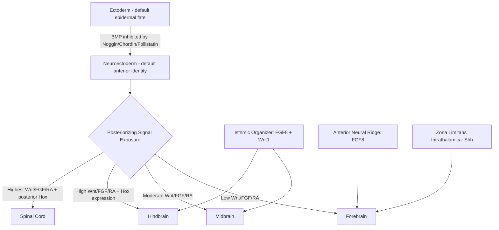

## Neural Induction and Patterning

### Overview and Scope

Neural induction is the developmental process by which a region of the embryonic ectoderm is directed to become neuroectoderm rather than epidermis, establishing the neural plate as the founding tissue of the entire central nervous system. Neural patterning refers to the subsequent set of signaling events that subdivide this initially uniform neural plate into regionally distinct domains along multiple embryonic axes, ultimately specifying the anteroposterior (forebrain to spinal cord) and dorsoventral (roof plate to floor plate) organization of the neural tube. Together, these processes convert a single germ layer into the spatial blueprint from which all subsequent neural cell-type diversity and circuit architecture is built.

**Key Points**

- Neural induction is fundamentally a process of inhibiting default epidermal fate rather than actively instructing neural fate — the "default model"
- Patterning operates through morphogen gradients that act in a concentration- and time-dependent manner to specify positional identity
- Anteroposterior and dorsoventral patterning are governed by largely distinct, though interacting, signaling systems
- Errors in these processes underlie a major class of congenital malformations, including neural tube defects and holoprosencephaly

### The Default Model of Neural Induction

The classical experimental foundation for neural induction comes from Spemann and Mangold's 1924 organizer transplantation experiments in amphibians, which demonstrated that a discrete region of the dorsal blastopore lip ("the organizer") could induce a complete secondary neural axis when transplanted into a host embryo. Decades later, molecular work resolved the mechanism: ectodermal cells are their default fate is epidermal, driven by constitutive BMP (Bone Morphogenetic Protein) signaling; neural fate is acquired specifically where this BMP signaling is inhibited.

**Core Logic**

$$\text{Ectoderm} \xrightarrow{\text{BMP signaling active}} \text{Epidermis (default)}$$

$$\text{Ectoderm} \xrightarrow{\text{BMP signaling blocked}} \text{Neuroectoderm}$$

**BMP Antagonists from the Organizer**

The Spemann organizer secretes a set of diffusible BMP antagonists that bind BMP ligands directly and prevent receptor engagement:

- **Noggin**: binds BMP4 with high affinity, sterically blocking receptor interaction
- **Chordin**: functionally analogous to *Drosophila* Short gastrulation (Sog), sequesters BMP ligands
- **Follistatin**: originally characterized as an activin antagonist, also inhibits BMP signaling

These molecules do not instruct neural fate directly; rather, they de-repress it by removing the BMP brake, which is the central evidence supporting the default model over earlier "instructive induction" models. [Inference: the default model is well-supported in amphibian and to a significant extent avian and mammalian systems, though the degree to which FGF and other instructive signals contribute independently of BMP inhibition varies across species and remains an area of ongoing comparative study.]

**FGF Signaling Contribution**

Fibroblast Growth Factor (FGF) signaling, acting through the MAPK/ERK pathway, contributes to neural induction partly by phosphorylating and inhibiting Smad1 (a downstream BMP effector), providing a second route of BMP pathway suppression that operates in parallel with direct ligand antagonism.

### Anteroposterior (A-P) Patterning

Once neural fate is established, the neural plate must be regionalized along the anteroposterior axis into forebrain, midbrain, hindbrain, and spinal cord domains. This is governed by a combination of posteriorizing signals and localized organizing centers.

**Posteriorizing Signals**

The prevailing model holds that neural tissue defaults to an anterior (forebrain-like) character, and posterior identity is progressively imposed by graded exposure to:

- **Wnt/β-catenin signaling**: high posterior, low anterior; anterior neural tissue requires active Wnt antagonism (e.g., via Dkk1, Cerberus) to maintain forebrain identity
- **FGF signaling**: gradient emanating from posterior mesoderm, promotes posterior neural character and represses anterior transcription factors
- **Retinoic acid (RA)**: synthesized by RALDH2 in paraxial mesoderm, forms a posterior-high gradient critical for hindbrain patterning, particularly rhombomere identity

**Local Organizing Centers**

Distinct signaling centers refine A-P identity at specific axial levels:

- **Anterior Neural Ridge (ANR)**: secretes FGF8, patterns the telencephalon
- **Zona Limitans Intrathalamica (ZLI)**: a Sonic hedgehog (Shh)-expressing boundary within the diencephalon, patterns thalamic versus prethalamic identity
- **Isthmic Organizer (midbrain-hindbrain boundary)**: co-expresses FGF8 and Wnt1, establishes the boundary and patterns adjacent midbrain and cerebellar territory

**Hox Gene Colinearity**

Hindbrain and spinal cord A-P identity is encoded combinatorially by Hox genes, arranged in four paralogous clusters (HoxA–D). A defining feature is spatial and temporal colinearity: genes positioned 3' within a cluster are expressed earlier and more anteriorly, while 5' genes are expressed later and more posteriorly, correlating directly with genomic organization.

### Dorsoventral (D-V) Patterning

D-V patterning of the neural tube is organized by two opposing morphogen sources located at the dorsal and ventral midlines, generating a coordinate system that specifies distinct progenitor domains along the dorsoventral axis.

**Ventral Patterning: Sonic Hedgehog**

The notochord, and subsequently the floor plate it induces, secretes Sonic hedgehog (Shh), forming a ventral-high to dorsal-low concentration gradient. Shh acts as a classic morphogen: distinct concentration thresholds activate distinct combinations of homeodomain and bHLH transcription factors in progenitor cells, which cross-repress one another to sharpen boundaries into discrete domains (e.g., p3, pMN, p2, p1, p0 progressing dorsally), each giving rise to a characteristic neuronal subtype (e.g., pMN generates motor neurons, marked by Olig2 expression).

**Dorsal Patterning: BMP and Wnt**

The roof plate secretes BMPs (including BMP4, BMP7) and Wnts, forming a dorsal-high gradient that specifies dorsal interneuron populations (dI1–dI6 classes) in a manner mechanistically analogous to, but molecularly distinct from, ventral Shh patterning.

**Gene Cross-Repression and Boundary Sharpening**

A key general principle in D-V patterning is that morphogen gradients alone produce graded transcription factor expression, but sharp, discrete boundaries emerge from mutual transcriptional repression between adjacently-induced factors (e.g., Pax6 and Nkx2.2 at the p0/p3-like boundary), converting continuous positional information into discrete cell fate domains.

### Diagram: Dorsoventral Morphogen Gradients (svg_diagram)

<svg xmlns="http://www.w3.org/2000/svg" viewBox="0 0 500 300">
<text x="250" y="24" text-anchor="middle" font-size="16" font-weight="bold" fill="#222">Neural Tube D-V Morphogen Gradients (svg_diagram)</text>
<ellipse cx="250" cy="160" rx="120" ry="110" fill="none" stroke="#333" stroke-width="2" />
<text x="250" y="60" text-anchor="middle" font-size="12" fill="#8e44ad">Roof Plate (BMP/Wnt source)</text>
<text x="250" y="270" text-anchor="middle" font-size="12" fill="#16a085">Floor Plate (Shh source)</text>
<ellipse cx="250" cy="160" rx="115" ry="105" fill="url(#dorsalGrad)" />
<ellipse cx="250" cy="160" rx="115" ry="105" fill="url(#ventralGrad)" />
<text x="150" y="100" font-size="11" fill="#333">dI1-dI6</text>
<text x="160" y="140" font-size="11" fill="#333">p0-p1</text>
<text x="250" y="165" font-size="11" fill="#333" text-anchor="middle">p2 / pMN</text>
<text x="330" y="200" font-size="11" fill="#333">p3</text>
<text x="250" y="245" font-size="11" fill="#333" text-anchor="middle">Floor Plate</text>
</svg>

### Neurulation: The Structural Context

Patterning occurs concurrently with neurulation, the morphogenetic process converting the flat neural plate into the closed neural tube.

**Primary Neurulation**

Applies to future brain and most of the spinal cord: the neural plate folds, with neural folds elevating and fusing dorsally at discrete initiation points, in a zippering process that proceeds both rostrally and caudally from these sites.

**Secondary Neurulation**

Applies to the most caudal spinal cord (lower sacral/coccygeal levels): a solid cord of cells condenses and subsequently cavitates to form the neural tube lumen, a mechanistically distinct process from primary neurulation's fold-and-fuse mechanism.

**Clinical Correlate: Neural Tube Defects**

Failure of neural tube closure produces a well-characterized spectrum of malformations depending on the site and extent of failure:

- **Anencephaly**: failure of closure at the anterior neuropore, resulting in absence of major forebrain structures
- **Spina bifida**: failure of closure at the posterior neuropore, with a range of severity from spina bifida occulta (mild, often asymptomatic) to myelomeningocele (severe, with exposed neural tissue)

Folic acid supplementation during the periconceptional period is well established to reduce neural tube defect incidence, though [Inference: the precise molecular mechanism linking folate metabolism to closure fidelity is still incompletely characterized, with one-carbon metabolism and methylation-dependent gene regulation being the leading but not fully resolved explanatory framework].

### Practical Example: Reasoning Through a Patterning Defect

**Example**

Consider an experimental (or clinical correlate) scenario: a mutation disrupts Shh production from the notochord. Predicted consequences, reasoned from the morphogen gradient model:

- Loss of ventral-most progenitor domains (e.g., floor plate, p3, pMN) due to absence of high-threshold Shh signaling
- Expansion of dorsal transcription factor domains (e.g., Pax7) ventrally, since the ventral repressive signal is absent
- Loss of ventral neuronal derivatives, notably motor neurons (pMN-derived), while dorsal interneuron populations may be relatively preserved or even expanded
- This reasoning mirrors the phenotype observed in *Shh* loss-of-function models and is consistent with the clinical human correlate of holoprosencephaly, in which SHH pathway mutations disrupt ventral forebrain patterning and midline structures

### Common Misconceptions

- **"Neural induction is a single instructive signal."** The default model frames induction primarily as disinhibition (removal of BMP signaling) rather than a single positive instructive cue, which is a frequently oversimplified point in introductory treatments.
- **"Morphogen gradients alone create discrete anatomical boundaries."** Gradients provide continuous positional information; discrete progenitor domain boundaries require additional cross-repressive gene regulatory network dynamics to sharpen graded input into binary-like fate decisions.
- **"A-P and D-V patterning are fully independent systems."** While mechanistically distinct, the two axes interact — for example, Shh signaling strength and timing along the A-P axis modulates its D-V patterning output at different axial levels.

### Related Topics

- Neural crest induction and cell migration
- Notch-Delta lateral inhibition in neurogenesis
- Radial glia and cortical neurogenesis
- Sonic hedgehog signal transduction pathway (Gli transcription factors)
- Hox gene cluster regulation and colinearity
- Holoprosencephaly and other SHH-pathway congenital disorders
- Folate metabolism and one-carbon cycle in neurodevelopment
- Cortical arealization and Emx2/Pax6 gradients