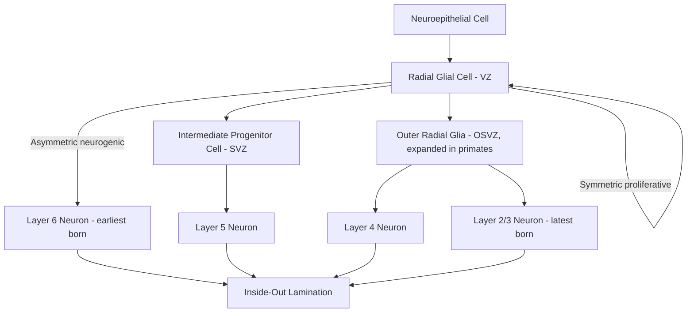

## Neurogenesis and Neuronal Migration

### Overview and Scope

Neurogenesis is the process by which neural progenitor cells proliferate and differentiate into post-mitotic neurons, while neuronal migration is the subsequent process by which these newborn neurons translocate from their site of origin to their final functional position within the developing nervous system. These two processes are tightly coupled in space and time: the proliferative zones of the developing brain generate neurons in a precise temporal sequence, and migration mechanisms determine how positional and temporal identity is translated into the layered, nucleated architecture of mature brain structures such as the neocortex.

**Key Points**

- Neurogenesis in the developing cortex proceeds through a series of proliferative divisions followed by a switch to neurogenic (differentiative) divisions
- Radial glial cells serve as both neural stem cells and the physical scaffold for migration
- Cortical neurogenesis follows an "inside-out" pattern of layer formation
- Migration modes differ by cell type and destination: radial glial-guided locomotion (excitatory neurons) versus tangential migration (many inhibitory interneurons)
- Postnatal/adult neurogenesis persists in restricted niches and follows distinct rules from embryonic neurogenesis

### Neural Progenitor Cell Types and Proliferation

**Neuroepithelial Cells and Radial Glia**

The earliest neural progenitors are neuroepithelial cells lining the neural tube ventricle, which initially undergo symmetric proliferative divisions to expand the progenitor pool. These transition into radial glial cells (RGCs), which retain apical-basal polarity — an apical process contacting the ventricular surface and a basal process extending to the pial surface — and serve a dual role as both the primary neurogenic stem cell population and the structural scaffold guiding neuronal migration.

**Division Modes**

Progenitor divisions in the ventricular zone (VZ) follow a characteristic progression:

- **Symmetric proliferative division**: RGC → two RGCs; expands the progenitor pool
- **Asymmetric neurogenic division**: RGC → one RGC + one neuron (or intermediate progenitor); self-renews while generating differentiated progeny
- **Symmetric differentiative division**: two neurons (or two intermediate progenitors); depletes the progenitor pool

The balance of these division modes over developmental time determines both the total number of neurons produced and the eventual depletion of the progenitor pool, with a general developmental trend toward increasing asymmetric and differentiative division frequency as neurogenesis proceeds. [Inference: the precise molecular determinants that tip the balance between division modes at any given time point are an active area of investigation, involving Notch signaling, spindle orientation, and cell-intrinsic timing mechanisms whose relative contributions are not fully resolved.]

**Intermediate Progenitor Cells**

Intermediate progenitor cells (IPCs), located in the subventricular zone (SVZ), represent a transit-amplifying population derived from RGC asymmetric divisions. Unlike RGCs, IPCs typically undergo symmetric terminal divisions producing two neurons, and their expansion is thought to be a major evolutionary contributor to increased neuron number and cortical surface area in gyrencephalic (folded) brains, including primates.

**Outer Radial Glia**

Outer (or basal) radial glia (oRG), located in an expanded outer subventricular zone (OSVZ), are particularly prominent in primates and other gyrencephalic species. They retain a basal process but lack the apical ventricular contact of classical RGCs, and their expanded proliferative capacity is a leading explanatory factor in comparative accounts of primate cortical expansion. [Inference: while oRG abundance correlates strongly with cortical folding and expansion across species, the causal sufficiency of this single factor relative to other contributing mechanisms remains a subject of ongoing comparative developmental research.]

### The Inside-Out Model of Cortical Lamination

A defining feature of neocortical development is the inside-out sequence of layer formation: neurons destined for deeper cortical layers (layer 6, then layer 5) are generated and migrate first, while neurons destined for progressively more superficial layers (layer 4, then layers 2/3) are generated later and must migrate past the already-positioned earlier-born neurons to reach their more superficial position.

**Birthdate-Fate Relationship**

This temporal sequence is tightly correlated with laminar fate, such that a neuron's birthdate (the time of its terminal mitosis) is a strong predictor of its eventual cortical layer. Classic heterochronic transplantation experiments (transplanting early-born progenitors into late-stage host environments and vice versa) demonstrated that progenitors become progressively fate-restricted over developmental time, with younger progenitors retaining greater competence to produce a range of layer fates while older progenitors become increasingly restricted to superficial-layer fates. [Inference: the degree to which this restriction is strictly cell-intrinsic (progenitor-autonomous) versus shaped by changing environmental/niche signals over time remains debated, with evidence supporting substantial contributions from both.]

### Modes of Neuronal Migration

**Radial Migration: Locomotion**

The predominant mode by which excitatory projection neurons reach the cortical plate is radial glial-guided locomotion. Newborn neurons extend a leading process along the basal fiber of a radial glial cell and translocate their soma along this scaffold via a saltatory, cytoskeleton-dependent process involving cycles of leading process extension, nucleokinesis (nuclear translocation into the leading process, dependent on the centrosome and microtubule motor proteins including dynein), and trailing process retraction.

**Radial Migration: Somal Translocation**

An alternative radial migration mode, more prominent early in corticogenesis when the cortical wall is thin, in which the neuron's basal process remains anchored at the pial surface throughout migration and the soma translocates directly along this fixed process without requiring a separate radial glial scaffold.

**Tangential Migration**

Many cortical inhibitory interneurons follow a fundamentally different trajectory: they are generated in subcortical proliferative zones — principally the medial and caudal ganglionic eminences (MGE and CGE) — and migrate tangentially (parallel to the pial surface, perpendicular to the radial glial scaffold) across substantial distances before turning radially to enter the cortical plate. This migration is guided by a distinct set of extracellular cues, including Neuregulin-ErbB4 signaling and Slit-Robo repulsive signaling from the ventricular zone.

**Multipolar Migration Phase**

Many migrating cortical neurons, particularly upon entering the SVZ/intermediate zone, transiently adopt a multipolar morphology, extending and retracting multiple processes in seemingly non-directed movements before repolarizing into a bipolar morphology to resume directed radial locomotion — a transitional step increasingly recognized as a regulated checkpoint in migration.

### Molecular Guidance Mechanisms

**Reelin Signaling**

Reelin, secreted by Cajal-Retzius cells in the marginal zone, is one of the best-characterized extracellular guidance cues in cortical development. Reelin binds the receptors VLDLR and ApoER2, triggering phosphorylation of the intracellular adaptor Dab1, which regulates cytoskeletal dynamics controlling the termination of migration and correct positioning of neurons at the top of the cortical plate.

**Clinical Correlate: Reeler Phenotype**

Loss-of-function mutations in *reelin* (as in the classic *reeler* mouse) produce a characteristic inverted cortical layering, with later-born neurons failing to migrate past earlier-born ones — directly reversing the normal inside-out pattern and providing strong causal evidence for Reelin's role in migration termination rather than migration initiation per se.

**Cytoskeletal and Motor Proteins**

- **LIS1 (PAFAH1B1)**: regulates dynein motor function during nucleokinesis; loss-of-function mutations cause lissencephaly ("smooth brain"), a severe migration disorder resulting in absent or reduced cortical folding
- **DCX (Doublecortin)**: a microtubule-associated protein essential for neuronal migration; X-linked mutations cause lissencephaly in males and subcortical band heterotopia ("double cortex") in heterozygous females, reflecting mosaic expression patterns from X-inactivation

### Postnatal and Adult Neurogenesis

Unlike the broadly proliferative embryonic period, postnatal and adult neurogenesis is restricted to specific neurogenic niches.

**Subgranular Zone (SGZ)**

Located in the dentate gyrus of the hippocampus, generates new granule cell neurons throughout life in many mammalian species, with functional implications for pattern separation and some forms of hippocampal-dependent learning.

**Subventricular Zone (SVZ) / Rostral Migratory Stream**

In rodents, SVZ-derived neuroblasts migrate tangentially via the rostral migratory stream (RMS) to the olfactory bulb, where they differentiate into interneurons. [Unverified: the extent to which a functionally analogous, robust RMS-mediated olfactory neurogenesis persists in the adult human brain remains genuinely contested in the literature, with some studies reporting minimal or negligible postnatal SVZ-to-olfactory-bulb neurogenesis in humans and others reporting evidence for its persistence; this should be treated as an unresolved empirical question rather than settled fact.]

**Adult Hippocampal Neurogenesis in Humans**

[Unverified: the existence and functional significance of adult hippocampal neurogenesis in humans has been a genuinely and prominently contested question in recent literature, with high-profile studies reaching conflicting conclusions depending on methodology (e.g., tissue preservation, marker selection, age range sampled); this remains an active area of scientific disagreement rather than a resolved fact, and any specific claim about its extent should be treated with corresponding caution.]

### Practical Example: Interpreting a Migration Phenotype

**Example**

A mouse model shows cortical neurons arrested in the intermediate zone with excessive multipolar morphology and failure to transition to bipolar locomotion. Reasoning through the likely disrupted mechanism:

- This phenotype is distinct from Reelin pathway disruption (which produces neurons that migrate but fail to terminate correctly at the marginal zone) and from LIS1/DCX disruption (which primarily impairs nucleokinesis during locomotion itself)
- An intermediate zone arrest with a multipolar-to-bipolar transition failure points toward disruption of the multipolar phase checkpoint, implicating candidate pathways such as Rac1/Cdc42 cytoskeletal regulators or the transcription factor cascade governing this transition
- This illustrates a general diagnostic principle in developmental neurobiology: the specific spatial location and morphological character of a migration arrest phenotype narrows the set of plausible disrupted mechanisms considerably before any molecular assay is performed

### Common Misconceptions

- **"Radial glia are purely structural support cells."** Radial glia are themselves the primary neurogenic stem cell population in the developing cortex, not merely passive scaffolding for migration.
- **"All cortical neurons migrate the same way."** Excitatory projection neurons and inhibitory interneurons follow fundamentally distinct migratory routes (radial versus tangential) and originate from distinct progenitor zones (dorsal pallium versus ganglionic eminences).
- **"Inside-out lamination means later neurons migrate a shorter distance."** Later-born neurons must migrate past all previously positioned neuronal layers to reach their more superficial destination, generally traveling a longer distance through progressively more crowded tissue, not a shorter one.

### Related Topics

- Cortical arealization and regional identity specification
- Interneuron subtype diversity and ganglionic eminence origins
- Lissencephaly and other neuronal migration disorders
- Notch-Delta signaling in progenitor maintenance
- Gyrification and comparative primate cortical expansion
- Cajal-Retzius cell development and function
- Axon guidance mechanisms (distinct from somal migration)
- Neurodevelopmental basis of periventricular heterotopia