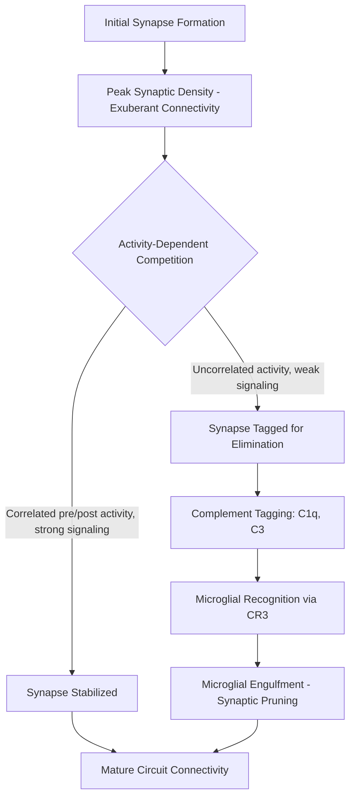

## Synaptogenesis and Synaptic Pruning

### Overview and Scope

Synaptogenesis is the process by which neurons form new synaptic connections, establishing the functional communication points of neural circuits. Synaptic pruning is the complementary process by which a subset of initially formed synapses is selectively eliminated, refining circuit connectivity from an initial state of exuberant, often imprecise connectivity toward a sparser, more computationally efficient adult configuration. Together, these processes exemplify a broader developmental principle: nervous system wiring is not specified with full precision at the outset but is substantially refined through an overproduction-then-elimination strategy shaped by both genetically programmed mechanisms and activity-dependent competition.

**Key Points**

- Synapse formation vastly exceeds the number of synapses retained in the mature brain, particularly in cortex
- Synaptic pruning is not degeneration but an active, molecularly regulated elimination process
- Activity-dependent competition (captured by Hebbian principles) is a central driver of which synapses are retained versus eliminated
- Glial cells, particularly microglia and astrocytes, are direct cellular effectors of synapse elimination, not passive bystanders
- The timing and trajectory of synaptic density differs substantially across brain regions and extends into adolescence in association cortex

### Molecular Mechanisms of Synaptogenesis

**Trans-Synaptic Adhesion Complexes**

Initial synapse formation depends on trans-synaptic adhesion molecule pairs that physically bridge presynaptic and postsynaptic membranes and recruit downstream scaffolding and signaling machinery:

- **Neurexins (presynaptic) and Neuroligins (postsynaptic)**: a well-characterized adhesion pair; neurexin-neuroligin binding can trigger bidirectional assembly of pre- and postsynaptic specializations in heterologous cell co-culture assays, a classic demonstration of synaptogenic sufficiency in a reduced system
- **SynCAMs**: homophilic adhesion molecules present on both membranes, contribute to synapse formation and stabilization
- **LRRTMs (Leucine-Rich Repeat Transmembrane proteins)**: postsynaptic, bind presynaptic neurexins as an alternative to neuroligin binding, illustrating combinatorial diversity in adhesion codes

**Astrocyte-Derived Synaptogenic Signals**

Astrocytes secrete factors that actively promote synapse formation, establishing them as instructive participants in synaptogenesis rather than passive structural support:

- **Thrombospondins (TSPs)**: promote structurally normal synapse formation but the resulting synapses are initially postsynaptically silent (lacking functional AMPA receptors) until further maturation signals arrive
- **Hevin (SPARCL1) and SPARC**: hevin promotes synapse formation by bridging neurexin and neuroligin isoforms, while SPARC (secreted by the same cells) antagonizes hevin's synaptogenic activity, illustrating that astrocyte-derived regulation includes both promoting and restraining signals from the same cellular source
- **Glypicans**: astrocyte-secreted glypican 4 and glypican 6 promote the recruitment of AMPA receptors to nascent synapses, driving the transition from structurally present but functionally silent synapses to active ones

**Presynaptic and Postsynaptic Maturation**

Following initial contact and adhesion, synapse maturation involves clustering of presynaptic active zone proteins (e.g., Bassoon, Piccolo, RIM) to organize neurotransmitter release machinery, and postsynaptic density assembly (scaffolded substantially by PSD-95 and related MAGUK family proteins) to organize neurotransmitter receptors and downstream signaling complexes.

### The Overproduction-Elimination Model

A central organizing principle of synaptic development is that synapse number does not increase monotonically to its adult value; rather, synaptic density rises to a peak substantially above the adult set point and is subsequently reduced through pruning.

**Regional and Temporal Variation**

Peak synaptic density and the subsequent pruning window differ markedly by cortical region:

- Primary sensory and motor cortices reach peak synaptic density and undergo the bulk of pruning relatively early, largely completing by early-to-mid childhood
- Prefrontal and other association cortices show a substantially protracted trajectory, with synaptic pruning continuing through adolescence and into early adulthood

[Inference: the precise quantitative timeline and peak-to-adult synaptic density ratios reported in the classical human postmortem literature (e.g., Huttenlocher's work) carry some methodological uncertainty given small postmortem sample sizes and measurement techniques, and more recent in vivo neuroimaging-based estimates of gray matter volume trajectories, while broadly consistent with a protracted association-cortex pruning window, are an indirect proxy for synaptic density rather than a direct synapse count.]

### Activity-Dependent Competition and Hebbian Principles

**Hebbian Framework**

Synaptic retention versus elimination is substantially governed by activity-dependent competition, often summarized by the Hebbian principle that synapses whose pre- and postsynaptic activity is temporally correlated ("fire together") tend to be strengthened and stabilized, while poorly correlated or asynchronous connections tend toward weakening and elimination.

**Classic Experimental Evidence: The Visual System**

The developing visual system provides some of the best-characterized experimental evidence for activity-dependent synaptic refinement:

- **Retinogeniculate segregation**: retinal ganglion cell axons from the two eyes initially project in an overlapping manner to the lateral geniculate nucleus (LGN) and subsequently segregate into eye-specific layers, a process dependent on spontaneous, uncorrelated retinal waves of activity present even before visual experience begins
- **Ocular dominance column formation**: in the visual cortex, monocular deprivation during a critical period (as in classic Hubel and Wiesel experiments) shifts cortical territory disproportionately toward the non-deprived eye, directly demonstrating that experience-driven activity competition shapes synaptic territory allocation

### Glial-Mediated Synaptic Pruning

A major conceptual advance in the field has been establishing that synaptic pruning is executed substantially through active engulfment by glial cells, drawing a direct mechanistic parallel to processes in the peripheral immune system.

**The Complement Cascade Model**

- Weak or "less desirable" synapses are tagged with complement proteins, notably **C1q** and its downstream product **C3**
- Microglia, expressing the complement receptor **CR3 (CD11b/CD18)**, recognize complement-tagged synapses
- Tagged synaptic material is engulfed and degraded by microglia through a phagocytic mechanism

This model, substantially developed through work on the retinogeniculate system, established microglia as direct, active executors of synapse elimination rather than merely clearing already-degenerating debris. [Inference: while the complement-microglia pathway is well-supported in the retinogeniculate system and increasingly in other circuits, the degree to which this specific molecular cascade generalizes as the dominant pruning mechanism across all brain regions and developmental windows, versus other complement-independent glial or neuron-intrinsic elimination mechanisms, remains an area of active investigation.]

**Astrocyte-Mediated Pruning**

Astrocytes also directly engulf synaptic material through phagocytic receptor pathways including **MEGF10** and **MERTK**, operating partly in parallel with and partly independently of the microglial complement pathway, indicating that synaptic elimination is mediated by multiple, only partially overlapping glial mechanisms rather than a single unified pathway.

### Clinical and Translational Relevance

**Schizophrenia and Excessive Pruning**

A prominent hypothesis in psychiatric neuroscience proposes that excessive or dysregulated synaptic pruning during adolescence contributes to schizophrenia pathophysiology, motivated substantially by genetic association findings implicating complement component 4 (*C4*) structural variants with schizophrenia risk, and by evidence that elevated C4 expression is associated with increased synaptic engulfment in model systems. [Speculation: while this represents an influential and mechanistically grounded hypothesis actively pursued in the field, it remains a hypothesis under ongoing investigation rather than an established causal account of schizophrenia etiology, and should not be presented as settled explanatory fact.]

**Autism Spectrum Conditions and Reduced Pruning**

Conversely, some postmortem studies have reported evidence of reduced synaptic pruning (relatively higher retained spine density) in cortical tissue from individuals with autism spectrum conditions, motivating a hypothesis of insufficient rather than excessive pruning in at least some presentations. [Unverified: findings across this literature are heterogeneous across studies, brain regions, and autism subgroups, and should be treated as one contributing line of evidence within a broader, unresolved picture rather than a uniform finding.]

### Practical Example: Reasoning Through a Pruning Experiment

**Example**

Consider a mouse model with genetic knockout of C1q, tested in the retinogeniculate system. Predicted and reasoned consequences based on the complement tagging model:

- Reduced microglial engulfment of retinogeniculate synaptic inputs, since the tagging signal for microglial recognition is absent
- Sustained excessive convergence of retinal ganglion cell inputs onto LGN relay neurons, reflecting a failure to eliminate the normally-pruned weaker inputs
- Persistence of eye-specific segregation defects, since the segregation process depends on eliminating inappropriately overlapping inputs from the two eyes
- This reasoning chain illustrates the broader principle that genetic disruption of a single tagging or recognition step in an active elimination cascade is expected to produce a specific, mechanistically traceable connectivity phenotype, rather than a generic or nonspecific developmental abnormality

### Common Misconceptions

- **"Synaptic pruning is passive decay of unused connections."** Pruning is an actively regulated, molecularly executed process involving specific tagging and glial engulfment machinery, not passive atrophy.
- **"More synapses always means better cognitive function."** The developmental trajectory suggests the opposite for a subset of connections: appropriate elimination of excess or imprecise synapses is necessary for efficient, well-tuned circuit function, and both insufficient and excessive pruning are associated with distinct dysfunction.
- **"Pruning is complete by early childhood."** This holds for primary sensory and motor regions but not for association cortices such as prefrontal cortex, where synaptic refinement continues substantially into adolescence.

### Related Topics

- Critical period plasticity and ocular dominance
- Microglial function beyond immune surveillance
- Complement system biology (C1q, C3, C4)
- Long-term potentiation and depression (activity-dependent synaptic strength)
- Adolescent brain development and association cortex maturation
- Dendritic spine dynamics and structural plasticity
- Genetic risk architecture of schizophrenia (complement pathway)
- Astrocyte-neuron signaling in circuit development