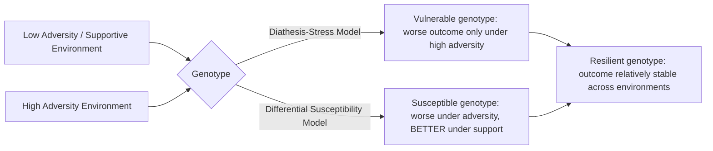

## Gene-Environment Interactions in Cognition

### Overview and Scope

Gene-environment interaction (GxE) refers to the phenomenon whereby the effect of a genetic variant on a phenotype — in this context, a cognitive trait, behavioral outcome, or risk for a neuropsychiatric condition — depends on the environmental context in which that genotype is expressed. This is conceptually and statistically distinct from gene-environment correlation (rGE), in which genotype influences the likelihood of exposure to particular environments, and from simple additive models in which genetic and environmental contributions sum independently without one modifying the effect of the other. GxE research sits at the intersection of behavioral genetics, developmental psychology, epigenetics, and cognitive neuroscience, and has become central to explaining why identical environmental exposures (e.g., early adversity) produce markedly different cognitive and psychiatric outcomes across individuals.

**Key Points**

- GxE means the genotype-phenotype relationship is conditional on environment, not merely that both genes and environment contribute independently to a trait
- Must be statistically and conceptually distinguished from gene-environment correlation (rGE)
- The diathesis-stress and differential susceptibility models offer competing (and partially reconcilable) frameworks for interpreting GxE findings
- Candidate-gene GxE studies (e.g., 5-HTTLPR × stress) have faced substantial replication difficulties, motivating a shift toward polygenic and genome-wide approaches
- Epigenetic mechanisms are increasingly framed as the plausible biological mediator connecting genotype-environment interaction to cognitive/behavioral outcome

### Distinguishing GxE from Gene-Environment Correlation

**Gene-Environment Interaction (GxE)**

The effect of an environmental exposure on a phenotype differs depending on genotype (or equivalently, the effect of genotype differs depending on environment). Statistically, this corresponds to a significant interaction term in a regression model predicting phenotype from genotype, environment, and their product.

$$\text{Phenotype} = \beta_0 + \beta_1(\text{Genotype}) + \beta_2(\text{Environment}) + \beta_3(\text{Genotype} \times \text{Environment}) + \varepsilon$$

Here, $\beta_3$ is the interaction coefficient of primary interest in GxE research; a significant $\beta_3$ indicates that the genotype's effect on phenotype is not constant across environmental levels.

**Gene-Environment Correlation (rGE)**

By contrast, rGE describes genotype's influence on the probability or nature of environmental exposure itself, typically categorized into three subtypes:

- **Passive rGE**: a child's rearing environment is correlated with their genotype because both are provided by biological parents (e.g., parents who carry genetic variants associated with high cognitive ability also tend to provide cognitively enriching home environments)
- **Evocative rGE**: an individual's genetically influenced traits evoke particular responses from others (e.g., a temperamentally difficult infant evokes different caregiving responses)
- **Active rGE**: individuals actively select or create environments correlated with their genetic predispositions (e.g., a child with strong genetically-influenced reading aptitude seeks out more reading material)

Failing to distinguish rGE from true GxE is a well-recognized methodological hazard: apparent interaction effects can sometimes be artifacts of unmodeled correlation between genotype and environmental exposure rather than genuine effect-modification.

### Theoretical Frameworks for Interpreting GxE

**Diathesis-Stress Model**

The classical framework, in which certain genetic variants are conceptualized as vulnerability factors ("diatheses") that confer risk for negative outcomes specifically under conditions of environmental adversity, while conferring no particular advantage (relative to other genotypes) under low-adversity conditions. This model predicts a specific interaction pattern: genotype groups diverge in outcome primarily at high adversity, converging toward similar (typically favorable) outcomes at low adversity.

**Differential Susceptibility Model**

An alternative framework proposing that certain genetic variants confer heightened sensitivity to environmental influence generally — "for better and for worse" — rather than specific vulnerability to adversity. Under this model, "susceptible" genotypes show worse outcomes than average under adverse conditions but better-than-average outcomes under supportive or enriching conditions, producing a crossover interaction pattern rather than the diathesis-stress model's divergence-only-under-adversity pattern.

$$\text{Diathesis-Stress: divergence at high adversity only} \quad \text{vs.} \quad \text{Differential Susceptibility: crossover across the full environmental range}$$

**Distinguishing the Models Empirically**

Statistically differentiating these models requires environmental range that spans meaningfully both below and above a normative midpoint, plus adequately powered samples to detect the specific crossover pattern the differential susceptibility model predicts; many earlier GxE studies, sampling primarily clinical or high-adversity populations, were not well positioned to distinguish between the two models, which has been identified as a contributing factor to interpretive disagreement across the literature. [Inference: which framework better characterizes any specific genetic variant's mode of action is generally an empirical question resolved (or left unresolved) on a variant-by-variant and outcome-by-outcome basis, rather than something resolvable by a single general theoretical argument.]

### Candidate GxE Findings in Cognitive and Behavioral Neuroscience

**5-HTTLPR × Stress and Depression**

Perhaps the most extensively studied candidate GxE finding involves the serotonin transporter gene-linked polymorphic region (5-HTTLPR), a variable-number tandem repeat polymorphism in the promoter of *SLC6A4* (serotonin transporter gene), in interaction with childhood maltreatment or stressful life events predicting depression risk. The original 2003 Caspi et al. finding reported that carriers of the short (S) allele showed increased depression risk specifically in the context of stressful life events, while long (L) allele homozygotes were relatively buffered.

**Replication Difficulties**

This finding became a central case study in the broader replication crisis affecting candidate-gene GxE research: subsequent large-scale meta-analyses and pooled reanalyses produced substantially mixed results, with some failing to replicate the original interaction effect. [Unverified: the current best-supported interpretation in the field leans toward viewing the original 5-HTTLPR × stress interaction as likely overstated or non-robust relative to initial reports, but this remains a matter of ongoing meta-analytic and methodological debate rather than fully settled consensus, and characterizations should reflect that uncertainty rather than asserting a definitive resolution.]

**COMT and Prefrontal Cognitive Function**

The catechol-O-methyltransferase (*COMT*) Val158Met polymorphism, affecting dopamine catabolism in prefrontal cortex, has been studied both for direct genotype-cognition associations (the Val allele associated with faster dopamine clearance, theorized to relate to prefrontal processing efficiency trade-offs) and for interaction with environmental stressors including cannabis use and early adversity in relation to psychosis risk and executive function outcomes. [Inference: as with 5-HTTLPR, COMT-based GxE findings have faced replication challenges characteristic of the broader candidate-gene GxE literature, and effect sizes reported in earlier studies are generally regarded as likely inflated relative to true population effects, a pattern consistent with winner's-curse and publication bias dynamics affecting underpowered candidate-gene designs.]

### Methodological Evolution: From Candidate Genes to Polygenic Approaches

**Why Candidate-Gene GxE Studies Struggled**

The broader replication difficulties affecting candidate-gene GxE research are generally attributed to a combination of factors: single-variant designs capturing only a small fraction of trait heritability (most complex cognitive and psychiatric traits are highly polygenic), small sample sizes relative to the true (typically modest) effect sizes involved, and publication bias favoring statistically significant interaction findings, which inflates apparent effect sizes in the published literature relative to true population values.

**Polygenic Score Approaches**

Contemporary GxE research increasingly employs polygenic scores (PGS) — aggregate measures summing the effects of many genome-wide significant variants identified through genome-wide association studies (GWAS) — as the genetic predictor in interaction models, rather than single candidate variants. This approach captures substantially more of a trait's genetic architecture and is generally regarded as statistically better powered and less susceptible to the false-positive-prone dynamics of single-variant candidate designs, though PGS-based GxE studies still require large sample sizes to detect interaction effects reliably, since interaction effects are inherently harder to detect than main effects at equivalent statistical power.

### Epigenetics as a Proposed Biological Mediator

A substantial body of work proposes that epigenetic modification — particularly DNA methylation — serves as a plausible molecular mechanism through which environmental exposure could modify the functional expression of genetic variation, providing a biologically grounded bridge between statistical GxE findings and mechanism.

**Illustrative Evidence: Glucocorticoid Receptor Methylation**

Rodent studies (notably work on maternal care variation) and subsequent human postmortem studies have reported that early-life adversity is associated with altered DNA methylation at the glucocorticoid receptor gene promoter (*NR3C1*), with implications for HPA axis regulation and stress reactivity. This body of work is frequently cited as a mechanistic proof-of-concept for how environmental exposure could durably alter gene expression in a manner relevant to cognitive and emotional regulation. [Inference: while mechanistically compelling as a proof-of-concept, the direct translational generalizability of specific rodent maternal-care findings to the full range of human early-adversity contexts involves substantial cross-species and correlational-to-causal inferential distance that is not fully bridged by current evidence.]

### Practical Example: Interpreting a GxE Study Design

**Example**

A hypothetical study reports: "Children with high polygenic score for educational attainment show larger cognitive test score gains from an enriched preschool intervention than children with low polygenic scores." Careful interpretation:

- This describes a genotype × intervention interaction on a cognitive outcome — consistent with a differential susceptibility-like pattern if low-PGS children also show relatively worse outcomes in a comparison (non-enriched) condition, or consistent with a more genotype-specific benefit pattern if they do not
- A critical check before accepting the interaction as genuine: verify that polygenic score is not itself correlated with unmeasured confounding environmental variables (a form of rGE) that could produce a spurious interaction-like pattern
- The finding, if robust, would carry a specific and non-obvious policy-relevant implication — that a uniform intervention may not produce uniform benefit across genetically diverse populations — which is precisely the kind of claim requiring especially strong replication evidence before being treated as actionable, given the field's documented history of GxE findings that did not replicate

### Common Misconceptions

- **"Gene-environment interaction and gene-environment correlation are the same phenomenon."** They are conceptually and statistically distinct processes that require different analytic approaches to detect and can co-occur in ways that complicate naive interpretation of either alone.
- **"A significant candidate-gene GxE finding from a single well-cited study establishes a robust biological mechanism."** The field's experience with 5-HTTLPR and similar findings demonstrates that single-study, single-variant GxE findings — even influential ones — require substantial replication before being treated as established.
- **"Differential susceptibility and diathesis-stress are mutually exclusive competing theories."** They can be understood as describing different possible patterns that specific genetic variants may follow; the appropriate model may differ across variants and traits rather than one framework being universally correct.

### Related Topics

- Behavioral genetics twin and adoption study designs
- Polygenic score construction and portability across populations
- HPA axis programming and early-life stress
- Epigenetic mechanisms in neural function (DNA methylation, histone modification)
- Heritability estimation and missing heritability problem
- Developmental origins of psychiatric disorder risk
- GWAS methodology for complex cognitive traits
- Resilience and protective factor research in developmental psychopathology