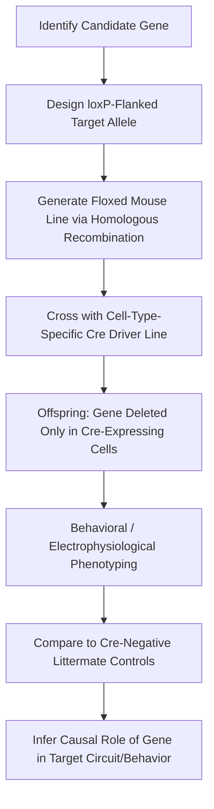

## Genetic Approaches in Cognitive Neuroscience Research

### Overview and Rationale

Genetic approaches in cognitive neuroscience aim to establish causal or correlational links between specific genes (or broader genetic variation) and cognitive phenotypes, neural circuit properties, and behavior. These approaches span methods that manipulate genes directly in model organisms to establish causal mechanism, and methods that measure naturally occurring genetic variation in humans to establish population-level association. The two strategies are complementary: animal models offer causal, mechanistic precision but limited generalizability to complex human cognition, while human genetic studies offer direct relevance to human traits but are generally correlational and confounded by environmental and population-structure factors.

### Forward vs. Reverse Genetics

- **Forward genetics**: begins with a phenotype (e.g., a behavioral abnormality) and works backward to identify the responsible gene(s), historically through mutagenesis screens and genetic mapping.
- **Reverse genetics**: begins with a specific gene of interest and manipulates it directly (knockout, knockdown, overexpression) to observe the resulting phenotype. This is the dominant strategy in contemporary molecular cognitive neuroscience, given the availability of precise gene-editing tools.

### Animal Model Genetic Manipulation Techniques

**Gene Knockout and Knock-in**

Traditional gene knockout uses homologous recombination in embryonic stem cells to delete or disrupt a target gene in mice, producing an organism lacking that gene's function throughout the body and across development. Knock-in approaches similarly use homologous recombination to insert or replace specific sequences (e.g., a disease-associated point mutation, or a fluorescent reporter).

**Limitations of Constitutive Knockouts**

**[Inference]** A well-recognized limitation of standard constitutive knockouts is that the absence of the gene throughout development can trigger compensatory changes in other genes or circuits, potentially confounding interpretation of the adult phenotype as a direct consequence of the missing gene; this concern is one of the primary motivations for conditional and inducible genetic systems.

**Conditional and Inducible Systems**

- **Cre-lox system**: a bacteriophage-derived recombinase (Cre) excises DNA sequences flanked by loxP sites. By expressing Cre under a cell-type-specific or tissue-specific promoter, researchers can restrict gene deletion to specific neuronal populations (e.g., only hippocampal pyramidal neurons) rather than the whole organism.
- **Tet-On/Tet-Off systems**: use tetracycline-responsive promoters to allow temporal control, enabling researchers to switch a transgene on or off at a chosen developmental stage via administration of doxycycline.
- Combining spatial (Cre-lox) and temporal (Tet) control allows highly specific manipulation of when and where a gene is altered.

**CRISPR-Cas9 Genome Editing**

CRISPR-Cas9 has substantially accelerated genetic manipulation by allowing direct, targeted editing of the genome using a guide RNA (gRNA) to direct the Cas9 nuclease to a specific DNA sequence, where it introduces a double-strand break subsequently repaired by the cell's own machinery (non-homologous end joining, producing indels/knockouts, or homology-directed repair, enabling precise sequence insertion).

- CRISPR has substantially reduced the cost and time required to generate transgenic animal lines compared to traditional homologous recombination.
- **CRISPR interference (CRISPRi)** and **CRISPR activation (CRISPRa)** use catalytically inactive ("dead") Cas9 (dCas9) fused to repressor or activator domains to modulate gene expression without cutting DNA, allowing reversible, tunable control.
- In vivo CRISPR delivery to specific brain regions is commonly achieved via viral vectors (adeno-associated virus, AAV), enabling somatic, region-restricted gene editing without generating a full transgenic line.

**Optogenetics and Chemogenetics (Genetically Targeted Circuit Manipulation)**

Although not gene-expression manipulations per se, these techniques rely on genetic targeting to achieve causal, cell-type-specific control of neural activity:

- **Optogenetics**: genetically expresses light-sensitive ion channels or pumps (e.g., channelrhodopsin-2 for excitation, halorhodopsin for inhibition) in genetically defined neuronal populations, allowing millisecond-precision activation or silencing via light delivered through implanted fiber optics.
- **Chemogenetics (DREADDs — Designer Receptors Exclusively Activated by Designer Drugs)**: genetically expresses modified G-protein-coupled receptors that are activated only by an otherwise inert synthetic ligand, allowing longer-timescale, systemically administered control of neuronal activity in targeted cell populations.

### Human Genetic Approaches

**Candidate Gene Studies**

An earlier approach tested association between cognitive or psychiatric phenotypes and variation in a small number of genes selected on the basis of prior biological hypotheses (e.g., the serotonin transporter gene *SLC6A4* and depression risk). **[Inference]** This approach has fallen out of favor in the field's mainstream, as many early candidate gene findings failed to replicate in larger, adequately powered samples, a pattern widely discussed in the context of the broader psychological and biomedical replication crisis.

**Genome-Wide Association Studies (GWAS)**

GWAS test for statistical association between a trait (e.g., educational attainment, general cognitive ability, a psychiatric diagnosis) and hundreds of thousands to millions of common single-nucleotide polymorphisms (SNPs) across the genome, in samples typically ranging from tens of thousands to over a million individuals.

- Individual common variants identified by GWAS typically explain only a very small fraction of trait variance each; complex cognitive and psychiatric traits are highly **polygenic**, influenced by thousands of variants of small individual effect.
- **Polygenic scores (PGS)**, computed as a weighted sum of an individual's risk alleles across all GWAS-associated loci, are increasingly used as a summary genetic liability measure in cognitive neuroscience research, for example to study whether genetic risk for a psychiatric condition correlates with structural or functional brain differences even in unaffected individuals.
- GWAS requires stringent correction for multiple comparisons and careful control for population stratification (systematic ancestry-related allele frequency differences that can produce spurious associations if uncorrected).

**Twin and Family-Based Designs**

Classical behavioral genetic designs compare trait similarity between monozygotic (identical) and dizygotic (fraternal) twins to partition phenotypic variance into additive genetic, shared environmental, and non-shared environmental components, yielding a **heritability** estimate.

- **[Inference]** Heritability estimates describe the proportion of variance in a trait attributable to genetic variance within a specific population and environmental context studied; they do not indicate the degree to which an individual's trait is genetically "fixed," nor do they generalize automatically across different populations or environments, a point of frequent misinterpretation in public discourse in this field.

**Imaging Genetics**

This approach directly combines the two traditions by examining how genetic variation (candidate polymorphisms or polygenic scores) relates to individual differences in brain structure or function measured via MRI, fMRI, or EEG, aiming to identify neural intermediate phenotypes that may lie causally between genotype and complex behavior.

### Model Organisms in Cognitive Neuroscience Genetics

| Organism | Key Advantages | Typical Application |
| --- | --- | --- |
| Mouse (*Mus musculus*) | Mammalian brain, extensive genetic toolkit, well-mapped genome | Learning/memory circuits, disease models |
| Zebrafish (*Danio rerio*) | Transparent embryos, rapid development, amenable to large-scale screening | Developmental neurogenetics, high-throughput screens |
| Fruit fly (*Drosophila melanogaster*) | Short generation time, powerful classical genetic tools (e.g., GAL4-UAS system) | Basic circuit and behavioral genetics |
| Roundworm (*C. elegans*) | Fully mapped connectome, simple nervous system | Fundamental circuit-behavior mapping |

### Genetic Manipulation Workflow (Conditional Knockout Example)

### Diagram: Human vs. Animal Genetic Approaches (svg_diagram)

<svg xmlns="http://www.w3.org/2000/svg" viewBox="0 0 900 340">
<text x="450" y="25" text-anchor="middle" font-size="16" font-weight="bold" fill="#1a1a1a">Human vs. Animal Genetic Approaches (svg_diagram)</text>
<rect x="60" y="60" width="330" height="230" rx="8" fill="#eaf2fb" stroke="#2b6cb0" stroke-width="1.5" />
<text x="225" y="85" text-anchor="middle" font-size="13" font-weight="bold">Human Genetics</text>
<text x="225" y="115" text-anchor="middle" font-size="10">GWAS</text>
<text x="225" y="140" text-anchor="middle" font-size="10">Twin/Family Heritability Studies</text>
<text x="225" y="165" text-anchor="middle" font-size="10">Polygenic Scores</text>
<text x="225" y="190" text-anchor="middle" font-size="10">Imaging Genetics</text>
<text x="225" y="225" text-anchor="middle" font-size="9" fill="#555">Correlational, high ecological validity</text>
<rect x="510" y="60" width="330" height="230" rx="8" fill="#eafaf1" stroke="#1e8449" stroke-width="1.5" />
<text x="675" y="85" text-anchor="middle" font-size="13" font-weight="bold">Animal Model Genetics</text>
<text x="675" y="115" text-anchor="middle" font-size="10">CRISPR-Cas9 Editing</text>
<text x="675" y="140" text-anchor="middle" font-size="10">Cre-lox Conditional Knockouts</text>
<text x="675" y="165" text-anchor="middle" font-size="10">Optogenetics / Chemogenetics</text>
<text x="675" y="190" text-anchor="middle" font-size="10">Tet-On/Off Inducible Systems</text>
<text x="675" y="225" text-anchor="middle" font-size="9" fill="#555">Causal, mechanistic precision</text>
<line x1="390" y1="175" x2="510" y2="175" stroke="#555" stroke-width="1.5" stroke-dasharray="4,3" />
<text x="450" y="165" text-anchor="middle" font-size="9" fill="#555">Convergence</text>

<text x="450" y="320" text-anchor="middle" font-size="11" fill="#555">Findings from each domain inform hypothesis generation and validation in the other.</text>

</svg>

### Example: Integrating Genetic Approaches Across a Single Question

**Example**

Investigating the *BDNF* Val66Met polymorphism and memory:

1. **Human genetics**: Population studies associate the Met allele of the *BDNF* Val66Met SNP with reduced activity-dependent BDNF secretion and, in some studies, subtly reduced hippocampal-dependent episodic memory performance.
2. **Imaging genetics**: MRI studies compare hippocampal volume or fMRI activation during memory tasks between Val/Val and Met carriers to identify a neural intermediate phenotype.
3. **Animal model validation**: A knock-in mouse line carrying the homologous Met substitution allows direct causal testing of the variant's effect on BDNF trafficking, synaptic plasticity (e.g., hippocampal LTP), and memory-related behavior, under controlled genetic background and environment.

**[Inference]** This multi-level triangulation strategy is generally considered good practice in the field precisely because no single approach (human association, imaging correlation, or animal causal manipulation) is sufficient alone; convergence across levels increases confidence in a genuine gene-cognition-brain relationship, though even convergent evidence does not eliminate the possibility of confounding or an incomplete mechanistic account.

### Conclusion

Genetic approaches in cognitive neuroscience operate along a complementary axis: animal-model techniques (conditional knockouts, CRISPR editing, optogenetics, chemogenetics) provide causal, cell-type- and circuit-specific mechanistic insight but with uncertain generalization to complex human cognition, while human genetic approaches (GWAS, twin studies, polygenic scores, imaging genetics) directly address human traits of interest but are constrained to correlational and population-level inference. The most robust conclusions in the field typically emerge from research programs that combine both strategies, using human genetic association to generate hypotheses and animal genetic manipulation to test causal mechanism.

**Related Topics**

- CRISPR-Cas9 mechanism and delivery methods for in vivo gene editing
- Optogenetics and chemogenetics for circuit-level causal manipulation
- Polygenic scores and their application in psychiatric and cognitive genetics
- Twin study design and heritability estimation methodology
- Imaging genetics and neural intermediate phenotypes
- Replication crisis in candidate gene association studies
- Gene-environment interaction models in neurodevelopment