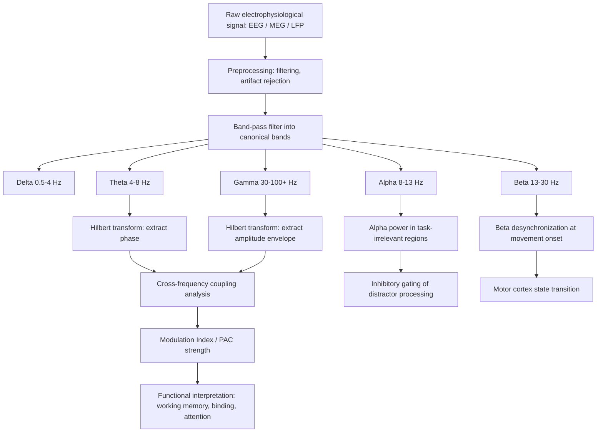

## Neural Oscillations and Brain Rhythms

### Overview

Neural oscillations are rhythmic or repetitive patterns of neural activity generated by synchronized electrical activity across populations of neurons in the central nervous system. These oscillations arise from the interplay of excitatory and inhibitory synaptic currents, intrinsic membrane properties of neurons, and network-level connectivity. They can be recorded non-invasively via electroencephalography (EEG) and magnetoencephalography (MEG), or invasively via local field potentials (LFPs) and electrocorticography (ECoG). Oscillations serve as a fundamental mechanism for temporal coordination of neural processing, enabling communication between spatially distributed brain regions, gating information flow, and supporting cognitive functions such as attention, memory, and perception.

### Biophysical Basis of Oscillatory Activity

**Cellular and Circuit Mechanisms**

Oscillations emerge primarily from two circuit motifs:

- **Pyramidal-Interneuron Network Gamma (PING)**: Reciprocal excitation-inhibition loops between excitatory pyramidal cells and inhibitory interneurons (particularly parvalbumin-positive basket cells) generate rhythmic activity, especially in the gamma range. Excitatory input triggers pyramidal firing, which activates interneurons that then inhibit the pyramidal population, creating a cyclical pattern.
- **Interneuron Network Gamma (ING)**: Networks of mutually connected inhibitory interneurons can generate rhythmic activity independent of excitatory drive, through synchronized inhibitory postsynaptic potentials (IPSPs) that create windows of disinhibition.

Thalamocortical circuits are critical for generating slower rhythms. The interaction between thalamic relay neurons, thalamic reticular nucleus (TRN) neurons, and cortical neurons produces rhythms such as spindles and slow oscillations, particularly during sleep. T-type calcium channels and hyperpolarization-activated cyclic nucleotide-gated (HCN) channels in thalamic neurons contribute to their intrinsic oscillatory (pacemaker) properties.

**Field Potential Generation**

The signals recorded as oscillations (EEG, LFP) primarily reflect summed postsynaptic potentials (excitatory and inhibitory) in cortical pyramidal neurons, whose parallel dendritic orientation creates open-field configurations that allow extracellular currents to summate into detectable dipoles. Action potentials contribute comparatively little to low-frequency field potentials due to their brief duration, though they contribute more to high-frequency components.

### Classification of Frequency Bands

| Band | Frequency Range | Common Associations |
| --- | --- | --- |
| Delta ($\delta$) | 0.5–4 Hz | Slow-wave sleep, cortical down-states, homeostatic processes |
| Theta ($\theta$) | 4–8 Hz | Memory encoding/retrieval, hippocampal navigation, working memory |
| Alpha ($\alpha$) | 8–13 Hz | Cortical idling, inhibitory gating, visual attention |
| Beta ($\beta$) | 13–30 Hz | Motor control, maintenance of current cognitive/motor state |
| Gamma ($\gamma$) | 30–100+ Hz | Local feature binding, attention, sensory processing |
| High-frequency oscillations (HFOs) | 100–500+ Hz | Ripples, epileptiform activity, memory consolidation |

[Inference] Exact frequency boundaries vary across studies and species; the ranges above reflect commonly cited conventions in human electrophysiology rather than fixed biological thresholds.

### Theta Oscillations and Memory

Theta rhythms (4–8 Hz) are prominently generated in the hippocampus, particularly in rodents during locomotion and REM sleep, driven by the medial septum-diagonal band of Broca (MS-DBB) as a pacemaker circuit. In humans, theta is more broadly distributed but is strongly implicated in:

- **Memory encoding and retrieval**: Increased theta power and phase-locking between hippocampus and prefrontal cortex during successful memory formation.
- **Spatial navigation**: Theta phase precession, where place cells fire at progressively earlier phases of the theta cycle as an animal traverses a place field, encoding spatial sequences within oscillatory cycles.
- **Theta-gamma coupling**: Nested gamma cycles within a theta cycle are proposed to represent discrete items in working memory, with the number of gamma cycles per theta cycle constraining memory capacity (related to "magic number" capacity limits).

### Alpha Oscillations and Inhibitory Gating

Alpha oscillations (8–13 Hz), most prominent over parieto-occipital cortex during relaxed wakefulness with eyes closed, were historically viewed as an "idling rhythm." Contemporary theories instead frame alpha as an active inhibitory mechanism:

- **Gating by inhibition hypothesis**: Increased alpha power in task-irrelevant cortical regions suppresses processing of distracting information, while decreased alpha (desynchronization) in task-relevant regions permits information flow.
- **Pulsed inhibition**: Alpha oscillations may parcel neural processing into discrete cycles, with the phase of alpha determining moments of high versus low cortical excitability, linking alpha to the perceptual cycle hypothesis of discrete rather than continuous perception.

### Beta Oscillations and Motor/Cognitive State

Beta oscillations (13–30 Hz) are prominent in sensorimotor cortex and basal ganglia-thalamocortical circuits.

- **Motor function**: Beta power increases during static muscle contraction and decreases (beta desynchronization) prior to and during voluntary movement.
- **Status quo maintenance hypothesis**: Beta is proposed to signal maintenance of the current sensorimotor or cognitive set, with beta bursts reflecting reactivation of existing representations rather than continuous rhythmic activity.
- **Pathological beta**: Excessive beta synchronization in the basal ganglia (particularly subthalamic nucleus) is a hallmark of Parkinson's disease and correlates with bradykinesia and rigidity; this observation underlies the rationale for closed-loop deep brain stimulation targeting beta bursts.

### Gamma Oscillations and Feature Binding

Gamma oscillations (30–100+ Hz) arise predominantly from PING-type circuits involving parvalbumin-positive interneurons.

- **Binding-by-synchrony hypothesis**: Proposes that gamma-band synchronization across distributed neural populations encodes the binding of distinct features (e.g., color, shape, motion) into a unified perceptual object, without requiring a dedicated "binding" neuron.
- **Communication through coherence (CTC)**: Fries' framework proposes that effective communication between two oscillating neural populations requires their excitability cycles to be phase-aligned, such that inputs arrive during optimal excitability windows; the degree of coherence, not just amplitude, determines the strength of functional connectivity.

### Cross-Frequency Coupling

Cross-frequency coupling (CFC) describes statistical dependencies between oscillations at different frequencies, thought to coordinate local and global processing:

- **Phase-amplitude coupling (PAC)**: The amplitude of a faster oscillation (e.g., gamma) is modulated by the phase of a slower oscillation (e.g., theta). This is the most studied form of CFC and is implicated in working memory and hippocampal-cortical communication.
- **Phase-phase coupling**: Two oscillations become phase-locked at integer frequency ratios (n:m coupling).
- **Amplitude-amplitude coupling**: Power envelopes of two frequency bands co-vary over time.

$$MI = \frac{H_{max} - H(p)}{H_{max}}$$

The above represents a modulation index (MI) formulation based on Kullback-Leibler divergence/Shannon entropy $H$, commonly used to quantify phase-amplitude coupling strength, where $p$ is the distribution of mean gamma amplitude across theta phase bins and $H_{max}$ is the entropy of a uniform distribution. [Unverified] Specific MI formulations vary by implementation (e.g., Tort et al.'s modulation index versus mean vector length approaches by Canolty et al.), and exact normalization constants differ across published methods.

### Sleep Oscillations

Sleep stages are characterized by distinct oscillatory signatures generated primarily by thalamocortical circuits:

- **Slow oscillations (<1 Hz)**: Alternating up-states (depolarized, active) and down-states (hyperpolarized, silent) across cortical networks during slow-wave sleep (SWS).
- **Sleep spindles (11–16 Hz)**: Waxing-and-waning bursts generated by thalamic reticular nucleus interactions with thalamocortical relay neurons, implicated in sleep-dependent memory consolidation and thought to gate sensory input to preserve sleep continuity.
- **Hippocampal sharp-wave ripples (SWRs, ~150–250 Hz)**: Brief high-frequency events during SWS and quiet wakefulness associated with reactivation ("replay") of hippocampal place cell sequences from prior waking experience, contributing to systems-level memory consolidation.
- **Slow oscillation-spindle-ripple coupling**: Temporal nesting of ripples within spindle troughs, and spindles within slow oscillation up-states, is proposed as a mechanism for coordinated hippocampal-cortical dialogue during memory consolidation.

### Measurement and Analysis Methods

**Recording Modalities**

- **EEG**: Scalp-recorded, high temporal resolution, limited spatial resolution and depth sensitivity due to volume conduction through skull and scalp.
- **MEG**: Detects magnetic fields from intracellular currents, less distorted by tissue conductivity than EEG, better spatial localization.
- **Intracranial recordings (ECoG, LFP, single-unit)**: Direct cortical or subcortical recording, higher signal-to-noise ratio and spatial specificity, typically limited to clinical populations (e.g., pre-surgical epilepsy monitoring).

**Analytical Techniques**

- **Fourier-based spectral analysis**: Decomposes signals into constituent frequencies via Fast Fourier Transform (FFT); assumes stationarity within analysis windows.
- **Wavelet transforms**: Provide joint time-frequency resolution, better suited to non-stationary signals and transient oscillatory bursts than fixed-window FFT.
- **Hilbert transform**: Extracts instantaneous phase and amplitude of a band-filtered signal, foundational for phase-based connectivity and CFC analyses.
- **Multitaper methods**: Reduce spectral estimate variance by averaging across multiple orthogonal tapers, improving reliability especially for shorter data segments.

### Diagram: Oscillatory Frequency Hierarchy and Cross-Frequency Coupling (svg_diagram)

<svg xmlns="http://www.w3.org/2000/svg" viewBox="0 0 780 420">
<rect x="0" y="0" width="780" height="420" fill="#ffffff" />
<text x="390" y="28" text-anchor="middle" font-size="18" font-weight="bold" fill="#1a1a2e">Oscillatory Frequency Hierarchy (svg_diagram)</text>

<text x="20" y="70" font-size="13" fill="#333">Theta (4-8 Hz)</text>

<path d="M 130 70 Q 165 30, 200 70 T 270 70 T 340 70 T 410 70 T 480 70 T 550 70 T 620 70 T 690 70" stroke="`#2b6cb0`" stroke-width="3" fill="none" />

<text x="20" y="140" font-size="13" fill="#333">Gamma (30-100 Hz)</text>

<path d="M 130 140 q 8 -18 16 0 q 8 18 16 0 q 8 -18 16 0 q 8 18 16 0 q 8 -18 16 0 q 8 18 16 0 q 8 -18 16 0 q 8 18 16 0 q 8 -18 16 0 q 8 18 16 0 q 8 -18 16 0 q 8 18 16 0 q 8 -18 16 0 q 8 18 16 0 q 8 -18 16 0 q 8 18 16 0 q 8 -18 16 0 q 8 18 16 0 q 8 -18 16 0 q 8 18 16 0 q 8 -18 16 0 q 8 18 16 0 q 8 -18 16 0 q 8 18 16 0 q 8 -18 16 0 q 8 18 16 0 q 8 -18 16 0 q 8 18 16 0 q 8 -18 16 0" stroke="`#c53030`" stroke-width="2.5" fill="none" />

<text x="20" y="210" font-size="13" fill="#333">Amplitude Envelope</text>

<path d="M 130 210 Q 165 190, 200 210 T 270 210 T 340 210 T 410 210 T 480 210 T 550 210 T 620 210 T 690 210" stroke="`#805ad5`" stroke-width="2" fill="none" stroke-dasharray="4,3" />

<text x="200" y="235" font-size="11" fill="`#805ad5`" text-anchor="middle">Gamma amplitude peaks at theta trough (PAC)</text>

<rect x="60" y="270" width="660" height="130" rx="8" fill="#f7fafc" stroke="#cbd5e0" />
<text x="390" y="295" text-anchor="middle" font-size="14" font-weight="bold" fill="#1a1a2e">Generative Circuits</text>
<circle cx="120" cy="330" r="6" fill="#2b6cb0" />
<text x="135" y="335" font-size="12" fill="#333">Theta: Medial septum - hippocampal CA3/CA1 pacemaker circuit</text>
<circle cx="120" cy="360" r="6" fill="#c53030" />
<text x="135" y="365" font-size="12" fill="#333">Gamma: PING circuit (pyramidal cells + PV+ interneurons)</text>
<circle cx="120" cy="390" r="6" fill="#805ad5" />
<text x="135" y="395" font-size="12" fill="#333">Coupling: Theta phase modulates gamma amplitude (working memory items)</text>
</svg>

### Diagram: Oscillation Analysis and Functional Pathway (svg_diagram)

### Clinical and Translational Relevance

- **Epilepsy**: Pathological high-frequency oscillations (ripples, fast ripples >250 Hz) in intracranial recordings help localize seizure onset zones for surgical planning.
- **Parkinson's disease**: Exaggerated beta-band synchronization in the subthalamic nucleus correlates with motor symptom severity; adaptive deep brain stimulation systems use real-time beta detection to trigger stimulation.
- **Schizophrenia**: Reduced gamma-band synchronization and impaired auditory steady-state response (ASSR) at 40 Hz are consistently reported findings, potentially reflecting NMDA receptor and parvalbumin interneuron dysfunction.
- **Alzheimer's disease**: Disrupted theta-gamma coupling and reduced gamma power are proposed biomarkers of network dysfunction, though [Unverified] their diagnostic specificity and sensitivity as standalone biomarkers remain under active investigation.

### Key Points

- Oscillations arise from excitatory-inhibitory circuit interactions (PING/ING motifs) and intrinsic pacemaker properties of thalamic and hippocampal circuits.
- Frequency bands (delta through gamma and HFOs) are each associated with distinct but overlapping cognitive and physiological functions.
- Cross-frequency coupling, particularly theta-gamma phase-amplitude coupling, is a proposed mechanism for multiplexing information across temporal scales.
- Oscillatory dysfunction is implicated across multiple neurological and psychiatric disorders, motivating oscillation-based biomarkers and closed-loop neuromodulation therapies.

### Related Topics

- Communication through coherence (CTC) framework
- Thalamocortical circuit dynamics and sleep spindle generation
- Hippocampal sharp-wave ripples and systems memory consolidation
- Parvalbumin interneuron dysfunction in psychiatric disorders
- Closed-loop and adaptive deep brain stimulation
- Phase precession and theta sequences in spatial navigation
- Event-related desynchronization/synchronization (ERD/ERS) paradigms
- Steady-state auditory/visual evoked responses as oscillatory probes