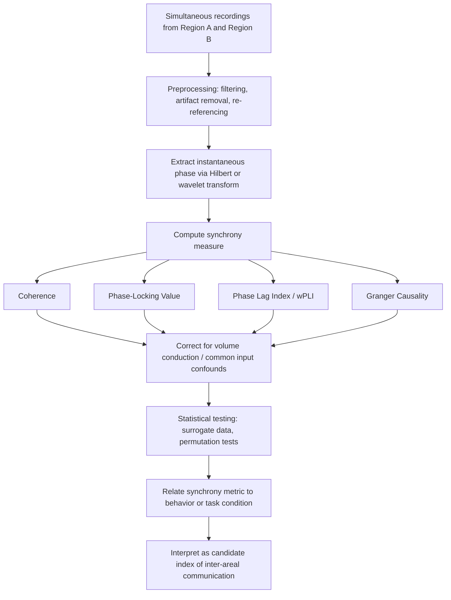

## Neural Synchrony and Communication Through Coherence

### Overview

Neural synchrony refers to the temporal alignment of oscillatory or spiking activity across distinct neural populations, such that their phases, or the timing of their discharges, become statistically correlated. Communication through coherence (CTC) is a theoretical framework, most extensively developed by Pascal Fries, proposing that synchronized oscillations are not merely an epiphenomenon of neural processing but an active mechanism that gates and routes information flow between brain regions. Under this framework, effective neuronal communication depends not simply on anatomical connectivity or firing rate, but on the temporal alignment of rhythmic excitability fluctuations between sender and receiver populations.

### Theoretical Foundations of Communication Through Coherence

**Core Postulate**

Neurons integrate synaptic inputs most effectively when those inputs arrive during a window of high excitability, corresponding to the depolarized phase of an ongoing membrane potential oscillation driven by rhythmic inhibition (largely from PING-type circuits). The CTC hypothesis states that:

- A sending neural population's output is rhythmically modulated, producing pulses of spikes concentrated in specific phases of its local oscillation.
- A receiving population's excitability also fluctuates rhythmically.
- Communication is maximized when the sender's output pulses arrive at the receiver during its high-excitability phase, and minimized (effectively gated out) when arrival coincides with the receiver's low-excitability phase.
- The **phase relationship** between two oscillating populations, not merely the presence of oscillations in each, therefore determines the efficacy of the functional connection.

**Formal Framing**

Coherence between two signals $x(t)$ and $y(t)$ at frequency $f$ is typically quantified via the magnitude-squared coherence:

$$C_{xy}(f) = \frac{|S_{xy}(f)|^2}{S_{xx}(f) \, S_{yy}(f)}$$

where $S_{xy}(f)$ is the cross-spectral density between $x$ and $y$, and $S_{xx}(f)$, $S_{yy}(f)$ are their respective auto-spectral densities. Coherence values range from 0 (no consistent phase relationship) to 1 (perfectly consistent phase relationship across trials/time), though the interpretation of high coherence as reflecting "communication" rather than shared input or volume conduction requires careful methodological control.

### Mechanistic Basis: Rhythmic Excitability and Gain Modulation

**Oscillatory Phase as an Excitability Clock**

In PING-type gamma-generating circuits, pyramidal cell firing triggers feedback inhibition from parvalbumin-positive interneurons, producing a stereotyped cycle: a brief window of high excitability shortly after inhibition decays, followed by a longer refractory-like period of suppressed excitability as inhibition rebuilds. This creates a periodic "excitability landscape" through which inputs are filtered.

**Effective Connectivity as Phase-Dependent Gain**

The functional strength of a projection between two areas can be modeled as time-varying gain modulated by the phase alignment of their respective oscillations. This has been formalized in modeling work using coupled oscillator systems and can be summarized conceptually as:

$$\text{Effective Coupling}(t) \propto A_{send}(t) \cdot g(\phi_{receive}(t))$$

where $A_{send}(t)$ is the sender's instantaneous output amplitude and $g(\phi_{receive}(t))$ is a gain function of the receiver's oscillatory phase, typically modeled as peaking near the depolarized/high-excitability phase. [Inference] This formalization is a simplified conceptual model derived from empirical and computational CTC literature rather than a single universally agreed-upon equation; specific implementations vary considerably across theoretical papers.

### Empirical Evidence

**Visual Attention Studies**

Landmark work using macaque V1-V4 recordings demonstrated that attending to a stimulus increases gamma-band synchronization between V1 and V4, and that this synchronization predicts the speed and accuracy of behavioral responses, supporting the view that gamma coherence gates which sensory information is prioritized for downstream processing.

**Fronto-Parietal and Fronto-Temporal Networks**

Beta and gamma coherence between prefrontal and parietal or temporal areas has been linked to working memory maintenance and top-down attentional control, with coherence patterns shifting dynamically according to task demands, consistent with flexible, rhythm-based routing of information across a fixed anatomical scaffold.

**Frequency-Specific Directionality**

Studies combining recordings across visual cortical hierarchy have reported that gamma-band synchronization is associated preferentially with feedforward signaling (lower to higher visual areas), while beta/alpha-band synchronization is associated preferentially with feedback signaling (higher to lower areas), suggesting frequency-channel multiplexing of hierarchical communication direction. [Unverified] The generality of this feedforward-gamma/feedback-beta dissociation across all cortical systems and species remains an active area of investigation, and some subsequent studies have reported more nuanced or context-dependent patterns.

### Measures of Neural Synchrony

| Measure | What It Captures | Key Property |
| --- | --- | --- |
| Coherence | Consistency of phase and amplitude relationship at a given frequency across trials/time | Sensitive to both phase and amplitude co-variation |
| Phase-Locking Value (PLV) | Consistency of phase difference alone, independent of amplitude | Isolates phase synchronization |
| Phase Lag Index (PLI) | Consistency of the sign of phase lag, ignoring zero-lag relationships | Reduces sensitivity to volume conduction artifacts |
| Weighted Phase Lag Index (wPLI) | Weighted version of PLI accounting for magnitude of phase lag | Further reduces spurious zero/near-zero lag effects |
| Granger Causality | Directional predictive influence of one signal's past on another's future | Captures directionality, sensitive to signal-to-noise asymmetries |
| Spike-Field Coherence | Relationship between spike timing and LFP oscillatory phase | Bridges single-unit and population-level rhythms |

The phase-locking value is computed as:

$$PLV = \left| \frac{1}{N} \sum_{n=1}^{N} e^{i(\phi_x(n) - \phi_y(n))} \right|$$

where $\phi_x(n)$ and $\phi_y(n)$ are the instantaneous phases of two signals at trial or time sample $n$, and $N$ is the total number of samples/trials.

### Methodological Considerations

- **Volume conduction and spurious synchrony**: In EEG/MEG, a single underlying source can project to multiple sensors, producing artifactual zero-lag coherence that does not reflect true inter-regional communication. Measures such as PLI and wPLI were developed specifically to mitigate this confound by discounting zero-phase-lag contributions.
- **Common input confound**: Two regions may appear synchronized because both receive shared rhythmic input from a third region, rather than because they communicate directly with one another; this is difficult to fully rule out with correlational measures alone.
- **Signal-to-noise dependence**: Coherence and Granger causality estimates can be biased by differences in signal-to-noise ratio between recording sites, requiring careful normalization or control analyses (e.g., using matched SNR conditions or non-parametric statistics).
- **Non-stationarity**: Neural signals are rarely stationary; synchrony measures computed over long windows can average over meaningfully different underlying dynamics unless time-resolved (e.g., sliding-window) approaches are used.

### Diagram: Communication Through Coherence Mechanism (svg_diagram)

<svg xmlns="http://www.w3.org/2000/svg" viewBox="0 0 780 380">
<rect x="0" y="0" width="780" height="380" fill="#ffffff" />
<text x="390" y="26" text-anchor="middle" font-size="17" font-weight="bold" fill="#1a1a2e">Communication Through Coherence (svg_diagram)</text>

<text x="20" y="70" font-size="12" fill="#333">Sender excitability</text>

<path d="M 150 70 Q 185 40, 220 70 T 290 70 T 360 70 T 430 70 T 500 70 T 570 70 T 640 70 T 710 70" stroke="`#2b6cb0`" stroke-width="2.5" fill="none" />

<g fill="#c53030">
<rect x="182" y="45" width="4" height="20" />
<rect x="252" y="45" width="4" height="20" />
<rect x="322" y="45" width="4" height="20" />
<rect x="392" y="45" width="4" height="20" />
<rect x="462" y="45" width="4" height="20" />
<rect x="532" y="45" width="4" height="20" />
<rect x="602" y="45" width="4" height="20" />
<rect x="672" y="45" width="4" height="20" />
</g>
<text x="20" y="50" font-size="11" fill="#c53030">Spikes</text>

<text x="20" y="150" font-size="12" fill="#333">Receiver excitability (aligned)</text>

<path d="M 150 150 Q 185 120, 220 150 T 290 150 T 360 150 T 430 150 T 500 150 T 570 150 T 640 150 T 710 150" stroke="`#38a169`" stroke-width="2.5" fill="none" />

<text x="390" y="185" text-anchor="middle" font-size="12" fill="`#38a169`" font-weight="bold">Spikes arrive at high-excitability phase -&gt; Effective transmission</text>

<text x="20" y="250" font-size="12" fill="#333">Receiver excitability (misaligned)</text>

<path d="M 150 260 Q 185 290, 220 260 T 290 260 T 360 260 T 430 260 T 500 260 T 570 260 T 640 260 T 710 260" stroke="`#dd6b20`" stroke-width="2.5" fill="none" />

<g fill="`#c53030`" opacity="0.5">

<rect x="182" y="235" width="4" height="20" />

<rect x="252" y="235" width="4" height="20" />

<rect x="322" y="235" width="4" height="20" />

<rect x="392" y="235" width="4" height="20" />

<rect x="462" y="235" width="4" height="20" />

<rect x="532" y="235" width="4" height="20" />

<rect x="602" y="235" width="4" height="20" />

<rect x="672" y="235" width="4" height="20" />

</g>

<text x="390" y="300" text-anchor="middle" font-size="12" fill="`#dd6b20`" font-weight="bold">Spikes arrive at low-excitability phase -&gt; Gated out / ineffective</text>

<rect x="60" y="330" width="660" height="35" rx="6" fill="#f7fafc" stroke="#cbd5e0" />
<text x="390" y="352" text-anchor="middle" font-size="12" fill="#333">Phase alignment (not just oscillation amplitude) determines effective inter-areal communication</text>
</svg>

### Diagram: Analytical Workflow for Assessing Neural Synchrony

### Clinical and Translational Relevance

- **Schizophrenia**: Reduced long-range gamma-band synchrony and impaired fronto-temporal coherence are associated with disorganized cognition and auditory hallucinations, consistent with a "dysconnection" hypothesis of the disorder.
- **Autism spectrum disorder**: Altered patterns of long-range versus local synchrony (often described as reduced long-range and/or increased local connectivity) have been reported, though [Unverified] findings are heterogeneous across studies and recording modalities.
- **Epilepsy surgery planning**: Pathologically excessive synchrony across a seizure network is used to help delineate the epileptogenic zone using intracranial coherence and phase-based connectivity mapping.
- **Brain-computer interfaces**: Coherence and phase-based features are increasingly incorporated into decoding algorithms, since phase relationships can carry information not captured by power spectral features alone.

### Key Points

- Communication through coherence proposes that phase alignment between oscillating neural populations, not merely oscillation presence, governs the efficacy of inter-areal signaling.
- PING-type gamma circuits create rhythmic excitability windows that act as gates for effective synaptic integration.
- Empirical support comes largely from visual attention paradigms showing that gamma synchronization between visual areas predicts behavioral performance.
- Synchrony measures (coherence, PLV, PLI/wPLI, Granger causality) each carry distinct sensitivities and susceptibilities to artifacts such as volume conduction and common input.
- Frequency-specific directionality (gamma-feedforward, beta-feedback) is a prominent but still-debated extension of the framework.

### Related Topics

- Pyramidal-interneuron network gamma (PING) circuit mechanisms
- Volume conduction and its confounds in EEG/MEG connectivity analysis
- Granger causality and directed information flow in neural systems
- Attention-related modulation of sensory gamma synchronization
- Predictive coding and hierarchical feedforward/feedback signaling
- Dysconnection hypothesis in schizophrenia
- Phase-amplitude coupling as a complementary multiplexing mechanism
- Brain-computer interface decoding using phase-based features