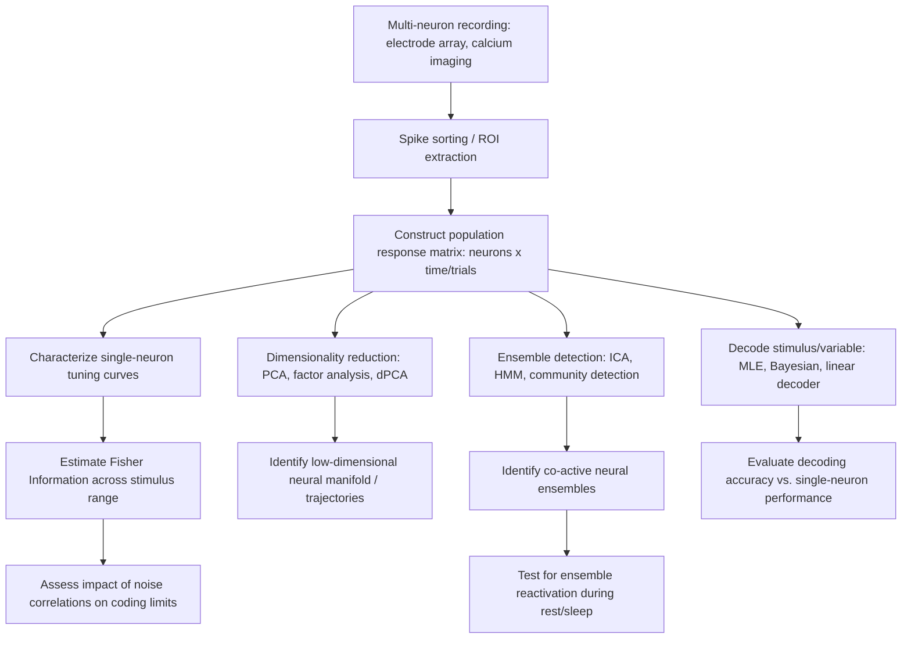

## Population Coding and Neural Ensembles

### Overview

Population coding refers to the principle that information in the nervous system is represented not by the activity of single neurons in isolation, but by the joint, coordinated activity of groups of neurons, termed neural ensembles or populations. Because individual neurons are typically broadly tuned, noisy, and ambiguous with respect to any single stimulus or variable, the nervous system achieves precision, robustness, and the capacity to represent high-dimensional variables by distributing information across many neurons whose combined activity pattern can be decoded with far greater fidelity than any single unit.

### Foundational Concepts

**Tuning Curves**

A tuning curve describes how a single neuron's firing rate varies as a function of a stimulus parameter (e.g., orientation, direction of movement, sound frequency). Most sensory and motor neurons exhibit graded, often bell-shaped tuning, responding maximally to a preferred stimulus value and progressively less to increasingly dissimilar values, rather than firing in an all-or-none manner for a single specific stimulus.

**Why Populations Rather Than Single Neurons**

- **Noise and trial-to-trial variability**: Individual neuron firing rates vary substantially across repeated presentations of an identical stimulus (Poisson-like variability), limiting the reliability of any single neuron as a code.
- **Ambiguity of broad tuning**: A neuron's firing rate alone cannot distinguish between two different stimuli that happen to evoke the same rate on the tuning curve.
- **Dimensionality**: Many behaviorally relevant variables (e.g., an arm's direction and speed in 3D space) are inherently multidimensional and cannot be represented by a single scalar firing rate without ambiguity.

Population coding resolves these limitations because the *pattern* of activity across many differently tuned neurons uniquely constrains the stimulus/variable, and averaging or combining across neurons reduces the impact of independent single-neuron noise.

### Classical Population Coding Models

**Population Vector Model**

Introduced by Georgopoulos and colleagues in the context of motor cortex and arm-reaching direction, the population vector model estimates an encoded variable as a weighted vector sum of each neuron's preferred direction, weighted by its firing rate:

$$\vec{P}(t) = \sum_{i=1}^{N} f_i(t) \, \hat{C}_i$$

where $f_i(t)$ is neuron $i$'s firing rate at time $t$, and $\hat{C}_i$ is neuron $i$'s preferred direction vector. This model demonstrated that the population vector closely tracked the actual direction of arm movement even though individual neurons were broadly and imprecisely tuned.

**Labeled-Line vs. Distributed (Coarse) Coding**

- **Labeled-line coding**: Information is carried by the identity of which specific neuron(s) are active, with minimal ambiguity per neuron (conceptually exemplified by highly specific feature detectors).
- **Coarse/distributed coding**: Information is carried by the overall pattern of activity across a population of broadly tuned neurons, which is the dominant scheme observed in sensory and motor systems; this achieves finer resolution than any individual neuron's tuning width would suggest, a phenomenon sometimes called hyperacuity.

### Information-Theoretic and Decoding Approaches

**Fisher Information**

Fisher information quantifies how much information a population's response distribution carries about a stimulus parameter $\theta$, formally defined as:

$$I_F(\theta) = E\left[ \left( \frac{\partial \ln p(r|\theta)}{\partial \theta} \right)^2 \right]$$

where $p(r|\theta)$ is the probability of observing population response $r$ given stimulus $\theta$. Higher Fisher information corresponds to greater theoretical discriminability of nearby stimulus values from the population response, and is often used to characterize how coding precision varies across a population's tuning curve arrangement.

**Decoding Methods**

- **Maximum likelihood estimation (MLE)**: Selects the stimulus value $\hat{\theta}$ that maximizes the likelihood of the observed population response given assumed tuning curves and noise statistics.
- **Bayesian decoding**: Incorporates prior knowledge about stimulus statistics along with the likelihood to compute a posterior distribution over the stimulus, commonly used in place cell decoding of spatial position.
- **Linear/optimal linear estimators**: Approximate the encoded variable as a weighted linear combination of population firing rates, computationally efficient and often surprisingly effective despite nonlinear underlying tuning.
- **Support vector machines and other machine learning classifiers**: Increasingly used to decode categorical or continuous variables from high-dimensional population recordings (e.g., calcium imaging, multi-electrode arrays) without requiring explicit generative models of tuning.

### Correlated Variability and Its Impact on Population Codes

Neurons in a population are rarely independent; their trial-to-trial fluctuations are often correlated ("noise correlations"). The impact of noise correlations on population coding is nuanced:

- **Detrimental correlations**: When correlated noise has the same structure as the signal (i.e., neurons with similar tuning share correlated noise), it can limit the benefit of pooling across neurons, since averaging fails to cancel shared noise.
- **Beneficial correlations**: Correlational structure orthogonal to the coding direction (differential correlations distinguished from signal-aligned correlations) can, in some circumstances, be filtered out by appropriate decoding without limiting asymptotic information.
- **Information-limiting correlations**: A specific structure of correlated variability, aligned with the derivative of the tuning curves, has been shown theoretically to fundamentally cap the information a population can carry regardless of population size, a concept formalized in influential theoretical work on the limits of population coding.

[Inference] The precise impact of noise correlations depends heavily on their specific structure relative to tuning curve geometry; blanket statements that correlations are simply "good" or "bad" for coding oversimplify a mathematically nuanced relationship.

### Neural Ensembles and Assemblies

**Definition and the Cell Assembly Hypothesis**

Donald Hebb's cell assembly hypothesis proposed that groups of neurons that are repeatedly co-activated become functionally linked through synaptic strengthening (encapsulated in "cells that fire together wire together"), such that partial activation of the assembly can lead to reactivation of the whole group, forming the basis of associative memory and pattern completion.

**Modern Ensemble Identification**

With the advent of large-scale recording techniques (two-photon calcium imaging, high-density electrode arrays such as Neuropixels), neural ensembles are now empirically identified as groups of neurons exhibiting statistically significant coactivation beyond what would be expected by chance, often using methods such as:

- **Principal component analysis (PCA) and factor analysis**: Identify low-dimensional latent structure underlying high-dimensional population activity.
- **Independent component analysis (ICA)**: Extracts statistically independent activity patterns, useful for identifying distinct co-active ensembles.
- **Graph-theoretic/community detection methods**: Treat pairwise correlations as a network and identify densely interconnected sub-groups (communities) as candidate ensembles.
- **Hidden Markov models (HMMs)**: Model population activity as transitioning between discrete latent states, each corresponding to a distinct ensemble activation pattern.

**Ensemble Reactivation and Memory**

Neural ensembles active during a waking experience (e.g., hippocampal place cell ensembles during spatial exploration) have been shown to reactivate in the same or reverse temporal order during subsequent sharp-wave ripple events in sleep and quiet rest, a phenomenon termed replay, thought to support systems-level memory consolidation and offline learning.

### Population Geometry and Manifolds

A more recent conceptual advance, particularly from motor cortex and prefrontal cortex research, treats population activity not merely as a code for a single variable but as trajectories through a high-dimensional "neural state space," where task-relevant computation is thought to unfold along a low-dimensional **neural manifold** embedded within that space.

- **Dynamical systems perspective**: Population activity during, for example, reaching movements is modeled as an evolving dynamical system, where the population state at one moment predicts subsequent states according to underlying dynamics rather than requiring instant-by-instant re-computation from external input.
- **Dimensionality reduction techniques**: PCA, factor analysis, and more specialized tools such as jPCA (which identifies rotational dynamics) or demixed PCA (dPCA, which separates variance attributable to distinct task variables) are commonly applied to reveal manifold structure.

### Diagram: Population Vector Decoding Schematic (svg_diagram)

<svg xmlns="http://www.w3.org/2000/svg" viewBox="0 0 760 420">
<rect x="0" y="0" width="760" height="420" fill="#ffffff" />
<text x="380" y="26" text-anchor="middle" font-size="17" font-weight="bold" fill="#1a1a2e">Population Vector Decoding (svg_diagram)</text>
<circle cx="380" cy="230" r="4" fill="#1a1a2e" />

<line x1="380" y1="230" x2="380" y2="110" stroke="#2b6cb0" stroke-width="3" />
<text x="380" y="100" text-anchor="middle" font-size="10" fill="#2b6cb0">N1</text>
<line x1="380" y1="230" x2="470" y2="150" stroke="#2b6cb0" stroke-width="3" />
<text x="480" y="145" text-anchor="middle" font-size="10" fill="#2b6cb0">N2</text>
<line x1="380" y1="230" x2="500" y2="230" stroke="#2b6cb0" stroke-width="2" />
<text x="515" y="235" text-anchor="middle" font-size="10" fill="#2b6cb0">N3</text>
<line x1="380" y1="230" x2="460" y2="310" stroke="#2b6cb0" stroke-width="1.5" />
<text x="470" y="325" text-anchor="middle" font-size="10" fill="#2b6cb0">N4</text>
<line x1="380" y1="230" x2="330" y2="150" stroke="#2b6cb0" stroke-width="2" />
<text x="315" y="140" text-anchor="middle" font-size="10" fill="#2b6cb0">N5</text>
<line x1="380" y1="230" x2="290" y2="230" stroke="#2b6cb0" stroke-width="1.5" />
<text x="270" y="235" text-anchor="middle" font-size="10" fill="#2b6cb0">N6</text>

<line x1="380" y1="230" x2="430" y2="130" stroke="#c53030" stroke-width="5" />
<polygon points="430,130 420,140 440,140" fill="#c53030" />
<text x="440" y="115" font-size="12" fill="#c53030" font-weight="bold">Population Vector (decoded direction)</text>
<rect x="60" y="350" width="640" height="55" rx="6" fill="#f7fafc" stroke="#cbd5e0" />
<text x="380" y="372" text-anchor="middle" font-size="12" fill="#333">Each neuron (N1-N6) contributes a vector along its preferred direction,</text>
<text x="380" y="392" text-anchor="middle" font-size="12" fill="#333">scaled by firing rate; the vector sum approximates the true movement direction.</text>
</svg>

### Diagram: Population Coding Analysis Pipeline

### Clinical and Translational Relevance

- **Brain-computer interfaces (BCIs)**: Population decoding algorithms (e.g., Kalman filters, population vector methods) are the core computational basis for translating motor cortex ensemble activity into control signals for prosthetic limbs and computer cursors in paralyzed patients.
- **Epilepsy**: Abnormal, hypersynchronous ensemble recruitment characterizes seizure propagation, and population-level analyses help characterize network-level dynamics of ictal onset and spread.
- **Neurodegenerative disease models**: Disruption of place cell ensemble coherence and replay has been reported in rodent models of Alzheimer's disease, suggesting population-level ensemble dysfunction as an early correlate of memory impairment. [Unverified] Direct translation of these rodent ensemble findings to human disease progression and diagnostic use remains an active research question.

### Key Points

- Individual neurons are typically broadly tuned and noisy; reliable, high-resolution representation of stimuli and behavior emerges from the joint activity pattern across populations.
- The population vector model demonstrates how weighted combination of broadly tuned neurons can accurately estimate continuous variables such as movement direction.
- Correlated variability (noise correlations) has a structure-dependent impact on coding capacity, and specific "information-limiting" correlation structures can cap achievable information regardless of population size.
- Neural ensembles, as empirically defined by statistically significant coactivation, extend Hebb's cell assembly concept and are central to modern theories of memory encoding, consolidation, and replay.
- Population geometry and neural manifold approaches reframe population activity as trajectories through low-dimensional latent dynamics rather than isolated per-neuron codes.

### Related Topics

- Hebbian plasticity and synaptic basis of cell assembly formation
- Neural manifolds and dynamical systems models of motor cortex
- Hippocampal replay and sharp-wave ripple-associated reactivation
- Noise correlations and information-limiting correlation structure
- Dimensionality reduction techniques in systems neuroscience (PCA, dPCA, jPCA)
- Brain-computer interface decoding algorithms
- Bayesian decoding of hippocampal place cell ensembles
- Calcium imaging and large-scale electrophysiology recording technologies