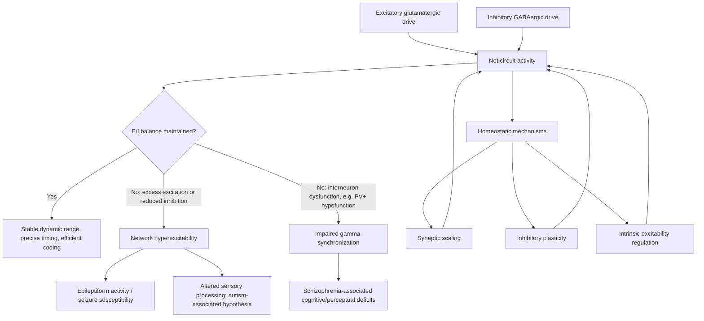

## Excitation Inhibition Balance

### Overview

Excitation-inhibition (E/I) balance refers to the dynamic equilibrium between excitatory (predominantly glutamatergic) and inhibitory (predominantly GABAergic) synaptic drive onto neurons and neural circuits. This balance is not a static ratio but a continuously regulated, activity-dependent relationship that shapes neuronal input-output transformations, constrains network stability, enables efficient coding, and supports the temporal precision required for higher-order computation. Disruption of E/I balance is a convergent mechanism implicated in a wide range of neurological and psychiatric disorders, including epilepsy, autism spectrum disorder, and schizophrenia.

### Cellular Basis of Excitation and Inhibition

**Excitatory Neurotransmission**

Glutamate is the principal excitatory neurotransmitter in the mammalian central nervous system, acting through:

- **Ionotropic receptors**: AMPA receptors mediate fast excitatory postsynaptic currents (EPSCs); NMDA receptors mediate slower, voltage-dependent, calcium-permeable currents requiring both glutamate binding and postsynaptic depolarization to relieve magnesium block, making them coincidence detectors relevant to synaptic plasticity.
- **Metabotropic receptors (mGluRs)**: G-protein-coupled receptors that modulate excitability and plasticity over slower timescales.

**Inhibitory Neurotransmission**

GABA is the principal inhibitory neurotransmitter, acting through:

- **GABA-A receptors**: Ionotropic, chloride-permeable channels mediating fast inhibitory postsynaptic currents (IPSCs); the direction of current flow (hyperpolarizing versus shunting) depends on the neuron's chloride reversal potential, which is developmentally regulated by chloride transporters (NKCC1, KCC2).
- **GABA-B receptors**: Metabotropic receptors producing slower, longer-lasting inhibitory effects via G-protein-coupled potassium channel activation and presynaptic calcium channel inhibition.

**Interneuron Diversity**

Cortical inhibition is mediated by a heterogeneous population of GABAergic interneurons, broadly classified by molecular markers and functional properties:

- **Parvalbumin-positive (PV+) interneurons**: Fast-spiking basket and chandelier cells providing perisomatic and axo-axonic inhibition; central to generating gamma oscillations and controlling the precise timing of pyramidal cell output.
- **Somatostatin-positive (SST+) interneurons**: Target dendrites, providing inhibition that shapes dendritic integration and synaptic plasticity.
- **Vasoactive intestinal peptide-positive (VIP+) interneurons**: Often disinhibitory, preferentially inhibiting other interneurons (particularly SST+ cells), thereby facilitating excitatory transmission under specific behavioral states such as arousal or attention.

### Conceptual Framework of E/I Balance

**Detailed vs. Global Balance**

- **Global (mean) balance**: Total excitatory and inhibitory input to a neuron are matched on average over time, preventing runaway excitation or excessive suppression.
- **Detailed balance**: Excitation and inhibition are matched not just on average but co-tuned across stimulus features and on rapid timescales (often within milliseconds), such that inhibition tracks excitation dynamically, a pattern extensively documented in auditory and visual cortex.

**Functional Consequences of Balance**

- **Gain control**: The ratio and timing of excitation to inhibition set a neuron's input-output gain, determining sensitivity to incoming synaptic drive without necessarily changing its selectivity.
- **Temporal precision**: Feedforward inhibition arriving shortly after excitation creates a narrow temporal window for effective spike generation, sharpening the timing precision of neuronal responses (a mechanism sometimes described using the framework of a coincidence-detection window).
- **Network stability**: Cortical circuits generally operate in an inhibition-stabilized regime, where strong recurrent excitation is prevented from runaway amplification specifically by feedback inhibition; this configuration, formalized in the inhibition-stabilized network (ISN) model, predicts counterintuitive phenomena such as the "paradoxical effect," in which additional excitatory drive to inhibitory interneurons can lead to a net decrease in their own steady-state firing rate due to network-level feedback dynamics.

### Mathematical Framing

A simplified rate-based description of E/I dynamics in a recurrent network can be expressed with coupled differential equations (Wilson-Cowan-type formalism):

$$\tau_E \frac{dE}{dt} = -E + f_E(w_{EE}E - w_{EI}I + I_{ext,E})$$

$$\tau_I \frac{dI}{dt} = -I + f_I(w_{IE}E - w_{II}I + I_{ext,I})$$

where $E$ and $I$ represent excitatory and inhibitory population firing rates, $w_{XY}$ denotes the synaptic weight from population $Y$ to population $X$, $\tau_E$ and $\tau_I$ are time constants, and $f_E$, $f_I$ are nonlinear (typically sigmoidal) activation functions. This formalism, originally developed by Wilson and Cowan, underlies much of the theoretical work on E/I dynamics, oscillation generation, and network stability regimes. [Inference] Real cortical circuits involve substantially more cell-type and connectivity complexity than this simplified two-population model; it serves as a foundational approximation rather than a literal circuit description.

### Homeostatic Regulation of E/I Balance

Neural circuits actively maintain E/I balance across development and in response to perturbation through several homeostatic mechanisms:

- **Synaptic scaling**: Global, multiplicative up- or down-regulation of excitatory synaptic strengths in response to sustained changes in overall network activity, tending to restore activity toward a homeostatic set point.
- **Inhibitory plasticity**: Activity-dependent strengthening or weakening of inhibitory synapses, which can co-tune inhibition to match excitatory input patterns over developmental and experience-dependent timescales.
- **Intrinsic excitability regulation**: Homeostatic adjustment of voltage-gated ion channel expression, altering a neuron's intrinsic responsiveness to a given synaptic input independent of synaptic weight changes.
- **Critical period plasticity**: E/I balance, particularly the maturation of PV+ interneuron inhibition, is a key regulator of the opening and closing of developmental critical periods for experience-dependent plasticity (e.g., ocular dominance plasticity in visual cortex).

### E/I Balance and Oscillatory Dynamics

E/I balance is intimately linked to the generation of neural oscillations (see also gamma-generating PING circuits): the reciprocal timing between excitatory pyramidal cell firing and PV+ interneuron feedback inhibition establishes the periodicity of gamma-band rhythms, such that measured gamma power and frequency are frequently used as an indirect physiological readout of local E/I balance. [Unverified] The mapping from gamma oscillation properties to a precise quantitative E/I ratio is model-dependent and can be confounded by factors such as interneuron subtype composition and network state; gamma metrics should be interpreted as a proxy rather than a direct measurement of E/I ratio.

### E/I Imbalance in Disease

**Epilepsy**

Seizures are classically conceptualized as a pathological shift toward excessive net excitation or insufficient inhibition, arising from mechanisms such as loss of interneuron function, GABA-A receptor mutations, or aberrant excitatory synaptic reorganization (e.g., mossy fiber sprouting in temporal lobe epilepsy).

**Autism Spectrum Disorder**

The E/I imbalance hypothesis of autism proposes that a shift toward excessive excitation relative to inhibition, potentially arising from genetic mutations affecting synaptic proteins (e.g., neuroligins, neurexins) or interneuron development, contributes to altered sensory processing, cortical hyperexcitability, and social-cognitive symptoms. [Unverified] This hypothesis, while influential, does not account for the full clinical and etiological heterogeneity of autism spectrum disorder, and some studies report evidence for regionally or directionally variable E/I alterations rather than a uniform excitation excess.

**Schizophrenia**

Dysfunction of PV+ interneurons and consequent disruption of gamma-band synchronization is a prominent hypothesis in schizophrenia pathophysiology, often linked mechanistically to NMDA receptor hypofunction on interneurons, which is proposed to reduce inhibitory drive and secondarily produce cortical disinhibition and impaired temporal coding.

### Diagram: E/I Circuit Motif and Feedforward/Feedback Inhibition (svg_diagram)

<svg xmlns="http://www.w3.org/2000/svg" viewBox="0 0 760 400">
<rect x="0" y="0" width="760" height="400" fill="#ffffff" />
<text x="380" y="26" text-anchor="middle" font-size="17" font-weight="bold" fill="#1a1a2e">Excitation-Inhibition Circuit Motifs (svg_diagram)</text>

<circle cx="80" cy="150" r="28" fill="#e2e8f0" stroke="#4a5568" stroke-width="2" />
<text x="80" y="155" text-anchor="middle" font-size="12" fill="#1a1a2e">Input</text>

<circle cx="330" cy="150" r="32" fill="#bee3f8" stroke="#2b6cb0" stroke-width="2.5" />
<text x="330" y="148" text-anchor="middle" font-size="11" fill="#1a1a2e">Pyramidal</text>
<text x="330" y="163" text-anchor="middle" font-size="11" fill="#1a1a2e">(E)</text>

<circle cx="330" cy="290" r="28" fill="#fed7d7" stroke="#c53030" stroke-width="2.5" />
<text x="330" y="288" text-anchor="middle" font-size="11" fill="#1a1a2e">PV+</text>
<text x="330" y="301" text-anchor="middle" font-size="11" fill="#1a1a2e">Interneuron (I)</text>

<circle cx="620" cy="150" r="28" fill="#e2e8f0" stroke="#4a5568" stroke-width="2" />
<text x="620" y="155" text-anchor="middle" font-size="12" fill="#1a1a2e">Output</text>

<line x1="108" y1="150" x2="298" y2="150" stroke="#2b6cb0" stroke-width="2.5" marker-end="url(#arrowE1)" />
<text x="200" y="140" text-anchor="middle" font-size="10" fill="#2b6cb0">Excite</text>

<line x1="90" y1="176" x2="310" y2="270" stroke="#c53030" stroke-width="2" stroke-dasharray="5,3" marker-end="url(#arrowE1)" />
<text x="180" y="240" text-anchor="middle" font-size="10" fill="#c53030">Feedforward inhibition</text>

<path d="M 320 180 Q 300 235, 320 262" stroke="#2b6cb0" stroke-width="2" fill="none" marker-end="url(#arrowE1)" />
<text x="270" y="220" text-anchor="middle" font-size="10" fill="#2b6cb0">Drives</text>

<path d="M 350 262 Q 375 220, 350 182" stroke="#c53030" stroke-width="2.5" fill="none" marker-end="url(#arrowE2)" />
<text x="400" y="220" text-anchor="middle" font-size="10" fill="#c53030">Feedback inhibition</text>

<line x1="362" y1="150" x2="592" y2="150" stroke="#2b6cb0" stroke-width="2.5" marker-end="url(#arrowE1)" />
<rect x="60" y="340" width="640" height="50" rx="6" fill="#f7fafc" stroke="#cbd5e0" />
<text x="380" y="360" text-anchor="middle" font-size="11" fill="#333">Feedforward inhibition narrows the temporal window for spike generation;</text>
<text x="380" y="378" text-anchor="middle" font-size="11" fill="#333">feedback inhibition stabilizes recurrent excitation and shapes oscillatory rhythm.</text>
</svg>

### Diagram: E/I Balance Regulation and Dysregulation Pathway

### Clinical and Translational Relevance

- **Anti-epileptic drug design**: Many anticonvulsants act by enhancing GABA-A receptor function (e.g., benzodiazepines, barbiturates) or reducing glutamatergic excitability (e.g., NMDA/AMPA receptor modulators), directly targeting E/I balance restoration.
- **Autism spectrum disorder therapeutics**: Investigational approaches, including bumetanide (an NKCC1 inhibitor intended to shift GABA-A signaling toward a more hyperpolarizing, mature configuration), have been explored based on the E/I imbalance hypothesis, though [Unverified] clinical efficacy findings remain mixed across trials.
- **Biomarker development**: Resting-state gamma power, GABA/glutamate ratios measured via magnetic resonance spectroscopy (MRS), and TMS-EEG measures of cortical inhibition are being investigated as non-invasive proxies for E/I balance in psychiatric and neurological populations.

### Key Points

- E/I balance is a dynamically regulated equilibrium between glutamatergic excitation and GABAergic inhibition, operating both as a global average and, in many circuits, as a detailed, co-tuned relationship on rapid timescales.
- Distinct interneuron subtypes (PV+, SST+, VIP+) contribute differentially to feedforward inhibition, dendritic inhibition, and disinhibitory circuit motifs.
- The inhibition-stabilized network model explains how recurrent cortical excitation is kept stable by feedback inhibition, predicting counterintuitive network phenomena such as the paradoxical effect.
- Homeostatic mechanisms (synaptic scaling, inhibitory plasticity, intrinsic excitability regulation) actively maintain E/I balance across development and experience.
- E/I imbalance is a convergent mechanistic theme across epilepsy, autism spectrum disorder, and schizophrenia, though the specific direction and locus of imbalance differs by condition and remains an active area of research.

### Related Topics

- Inhibition-stabilized network (ISN) model and the paradoxical effect
- GABA-A receptor chloride dynamics and developmental switch (NKCC1/KCC2)
- Parvalbumin interneuron dysfunction in gamma oscillation generation
- Synaptic scaling and homeostatic plasticity mechanisms
- Critical period plasticity and interneuron maturation
- Wilson-Cowan model of neural population dynamics
- Magnetic resonance spectroscopy (MRS) measurement of cortical GABA/glutamate
- NMDA receptor hypofunction hypothesis of schizophrenia