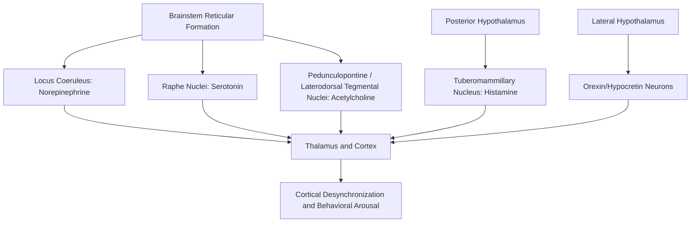

## Neuromodulatory Systems and Arousal

### Conceptual Framework

Neuromodulation refers to the process by which a small number of subcortical nuclei, each using a specific neurotransmitter, project diffusely throughout the brain to alter the excitability, gain, and signal-to-noise characteristics of widespread neural circuits, rather than transmitting discrete point-to-point information as classical fast synaptic transmission does. Arousal is a global brain and behavioral state variable, ranging from deep sleep or coma at one extreme to high alertness or hypervigilance at the other, that is substantially regulated by these ascending neuromodulatory systems.

The classical anatomical concept underlying this framework is the **ascending reticular activating system (ARAS)**, first described by Moruzzi and Magoun (1949), who demonstrated that electrical stimulation of the brainstem reticular formation produced cortical EEG desynchronization and behavioral arousal in anesthetized cats, establishing the brainstem's role in maintaining wakefulness.

### The Four Principal Ascending Neuromodulatory Systems

**Noradrenergic System (Locus Coeruleus)**

The locus coeruleus (LC), a small nucleus in the dorsal pons, is the primary source of norepinephrine throughout the forebrain, projecting extensively to cortex, thalamus, hippocampus, cerebellum, and spinal cord.

- LC firing rate correlates closely with the sleep-wake cycle: near-silent during REM sleep, moderate tonic firing during quiet wakefulness, and elevated during arousal or stress.
- The **adaptive gain theory** of LC function (Aston-Jones and Cohen) proposes that tonic LC activity modulates the tradeoff between exploratory and exploitative behavior, while phasic LC responses to salient or task-relevant stimuli optimize performance on focused tasks.

**Cholinergic System (Basal Forebrain and Brainstem)**

Acetylcholine is supplied to the cortex primarily by the basal forebrain (including the nucleus basalis of Meynert) and to the thalamus by the pedunculopontine and laterodorsal tegmental nuclei of the brainstem.

- Cortical acetylcholine release is elevated during both active wakefulness and REM sleep, and is comparatively low during slow-wave (non-REM) sleep, distinguishing it from the noradrenergic and serotonergic systems, which are essentially silent during REM.
- Cholinergic activity is strongly associated with cortical EEG desynchronization (a shift from high-amplitude, low-frequency to low-amplitude, high-frequency activity), selective attention, and encoding of new sensory information.

**Serotonergic System (Raphe Nuclei)**

Serotonin is supplied to the forebrain primarily by the raphe nuclei of the brainstem.

- Raphe serotonergic neurons show a firing pattern that, like the locus coeruleus, is highest during active waking, reduced during slow-wave sleep, and virtually silent during REM sleep.
- Serotonergic tone is broadly associated with behavioral state stability, mood regulation, and modulation of sensory processing gain.

**Histaminergic System (Tuberomammillary Nucleus)**

Histamine is supplied to the forebrain by the tuberomammillary nucleus (TMN) in the posterior hypothalamus.

- TMN neurons fire during wakefulness and are silent during both slow-wave and REM sleep.
- This system is the pharmacological target of first-generation antihistamine medications (e.g., diphenhydramine), whose sedating side effect arises directly from blockade of central histamine H1 receptors.

**Dopaminergic Contribution**

While classically associated with reward and motor function, ventral tegmental area dopaminergic neurons also show state-dependent firing that contributes to arousal and motivated engagement with the environment, and dopaminergic projections to cortex and striatum influence the behavioral relevance ("wanting") assigned to arousing stimuli.

### Summary Comparison Table

| System | Source Nucleus | Transmitter | Waking | NREM Sleep | REM Sleep |
| --- | --- | --- | --- | --- | --- |
| Noradrenergic | Locus coeruleus | Norepinephrine | High | Low | Near-silent |
| Serotonergic | Raphe nuclei | Serotonin | High | Low | Near-silent |
| Histaminergic | Tuberomammillary nucleus | Histamine | High | Silent | Silent |
| Cholinergic | Basal forebrain / brainstem tegmentum | Acetylcholine | High | Low | High |

### The Flip-Flop Switch Model of Sleep-Wake Regulation

A widely cited model (Saper and colleagues) describes sleep-wake transitions as a mutually inhibitory "flip-flop switch" between wake-promoting and sleep-promoting circuits:

- **Wake-promoting side**: the ascending arousal systems described above, along with orexin/hypocretin neurons of the lateral hypothalamus, which stabilize wakefulness and reinforce the wake state.
- **Sleep-promoting side**: GABAergic neurons of the ventrolateral preoptic nucleus (VLPO) of the hypothalamus, which inhibit the ascending arousal nuclei during sleep onset.
- Mutual inhibition between these two populations produces sharp, rather than gradual, transitions between behavioral states, analogous to a bistable electronic switch. **[Inference]** The orexin system is thought to stabilize this switch and prevent inappropriate state transitions, a hypothesis strongly supported by the observation that orexin neuron loss produces narcolepsy, characterized by unstable, intrusive transitions into REM-like states during wakefulness.

### Thalamocortical Gating and Arousal

Neuromodulatory input to the thalamus regulates the mode of thalamocortical information transmission:

- **Burst mode**: associated with low arousal/drowsy states, in which thalamic relay neurons fire in high-frequency bursts driven by T-type calcium channels, poorly suited for faithful relay of sensory information.
- **Tonic mode**: associated with high arousal/attentive wakefulness, in which cholinergic and noradrenergic input depolarizes thalamic relay neurons sufficiently to inactivate T-type channels, enabling more linear, faithful relay of sensory input to cortex.

This gating mechanism is a key link between diffuse neuromodulatory tone and the moment-to-moment fidelity of sensory processing available to cognition.

### Arousal and the Yerkes-Dodson Relationship

Behaviorally, arousal level relates to cognitive performance in a widely cited inverted-U function: performance improves with increasing arousal up to a moderate optimum, beyond which further arousal impairs performance, particularly on complex tasks. **[Inference]** While the general inverted-U shape is broadly supported and frequently taught, the original Yerkes-Dodson (1908) formulation was derived from animal learning experiments under specific conditions, and its precise quantitative form and universality across all task types and arousal measures in humans remains a matter of ongoing empirical refinement rather than a fixed, precisely characterized law.

### Ascending Arousal Pathway Diagram

### Diagram: Flip-Flop Switch for Sleep-Wake States (svg_diagram)

<svg xmlns="http://www.w3.org/2000/svg" viewBox="0 0 900 340">
<text x="450" y="25" text-anchor="middle" font-size="16" font-weight="bold" fill="#1a1a1a">Flip-Flop Switch for Sleep-Wake Regulation (svg_diagram)</text>
<circle cx="270" cy="180" r="90" fill="#fdf2e3" stroke="#b9770e" stroke-width="1.5" />
<text x="270" y="170" text-anchor="middle" font-size="12" font-weight="bold">Wake-Promoting</text>
<text x="270" y="190" text-anchor="middle" font-size="10">LC, Raphe, TMN,</text>
<text x="270" y="205" text-anchor="middle" font-size="10">Basal Forebrain, Orexin</text>
<circle cx="630" cy="180" r="90" fill="#eaf2fb" stroke="#2b6cb0" stroke-width="1.5" />
<text x="630" y="175" text-anchor="middle" font-size="12" font-weight="bold">Sleep-Promoting</text>
<text x="630" y="195" text-anchor="middle" font-size="10">VLPO (GABAergic)</text>
<line x1="360" y1="150" x2="540" y2="150" stroke="#c0392b" stroke-width="2" marker-end="url(#arrow2)" />
<line x1="540" y1="210" x2="360" y2="210" stroke="#c0392b" stroke-width="2" marker-end="url(#arrow2)" />
<text x="450" y="135" text-anchor="middle" font-size="9" fill="#c0392b">Mutual Inhibition</text>
<text x="450" y="310" text-anchor="middle" font-size="11" fill="#555">Mutual inhibition produces sharp, bistable transitions between wake and sleep states; orexin stabilizes the wake side.</text>

</svg>

### Example: Neuromodulatory State Across a Behavioral Scenario

**Example**

Consider transitioning from restful reading to responding to a sudden loud noise:

1. **Baseline reading**: moderate tonic locus coeruleus firing, moderate cortical acetylcholine, tonic-mode thalamic relay — supports sustained, focused, exploitative attention.
2. **Sudden noise onset**: a phasic burst of locus coeruleus norepinephrine release is triggered, broadly increasing cortical gain and interrupting the current attentional focus (an "orienting response").
3. **Post-orienting reassessment**: elevated arousal transiently shifts processing toward exploration of the environment (per adaptive gain theory), before returning to a task-appropriate tonic state.

**[Inference]** This staged account synthesizes well-supported components of neuromodulatory theory (LC phasic/tonic dynamics, orienting responses) into a single illustrative scenario; the precise millisecond-scale sequencing and relative contribution of each neuromodulatory system in any specific real-world event has not been exhaustively mapped and may vary across individuals and contexts.

### Conclusion

Arousal is governed by a small set of anatomically discrete but functionally interlocking ascending neuromodulatory systems — noradrenergic (locus coeruleus), serotonergic (raphe nuclei), histaminergic (tuberomammillary nucleus), and cholinergic (basal forebrain/brainstem tegmentum) — each with a distinct firing pattern across the sleep-wake cycle and a distinct, though overlapping, functional contribution to cortical state, attentional gain, and thalamocortical information transmission. These systems interact with hypothalamic sleep- and wake-promoting circuits in a mutually inhibitory flip-flop arrangement to produce stable, discrete behavioral states, and their combined tone determines the cognitive resources available for perception, attention, and higher-order processing at any given moment.

**Related Topics**

- Ascending reticular activating system and its historical discovery
- Locus coeruleus adaptive gain theory of attention
- Orexin/hypocretin system and narcolepsy
- Thalamocortical burst versus tonic firing modes
- EEG correlates of arousal and cortical desynchronization
- Yerkes-Dodson law and arousal-performance relationships
- Pharmacology of stimulant and sedative drugs acting on arousal systems