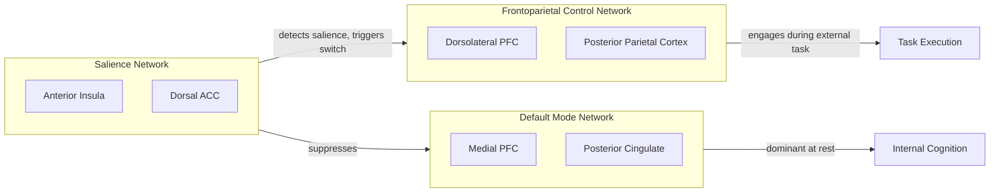

## Resting State Networks and the Default Mode Network

### Overview and Historical Context

Resting-state networks (RSNs) are spatially distinct, temporally correlated patterns of brain activity observed when a subject is not performing an explicit task — typically instructed to lie still, keep eyes open or closed, and "not think of anything in particular." The phenomenon was formally characterized by Biswal and colleagues (1995), who demonstrated that low-frequency ($<0.1$ Hz) fluctuations in the BOLD (blood-oxygen-level-dependent) signal within the sensorimotor cortex remained correlated across hemispheres even in the absence of a motor task.

The default mode network (DMN) is the most extensively studied RSN. It was named by Raichle and colleagues (2001) after they observed a consistent set of regions that showed **greater** activity during passive rest than during a wide range of attention-demanding tasks — i.e., regions that "deactivate" upon task onset. This inverted the earlier assumption that a quiescent, task-free brain is metabolically idle; instead, the resting brain maintains a highly organized, energy-intensive baseline state.

### Core Anatomy of the Default Mode Network

The DMN is not a single structure but a distributed network with two major subsystems converging on core hubs.

**Key Points**

- **Core hubs (midline):**
  - Medial prefrontal cortex (mPFC) — self-referential processing, valuation
  - Posterior cingulate cortex (PCC) / retrosplenial cortex — the network's primary hub, high metabolic rate and connectivity degree
- **Dorsal medial subsystem:**
  - Dorsomedial prefrontal cortex
  - Temporoparietal junction (TPJ)
  - Lateral temporal cortex
  - Temporal pole
  - Associated with mentalizing / theory of mind
- **Medial temporal subsystem:**
  - Hippocampal formation
  - Parahippocampal cortex
  - Retrosplenial cortex
  - Posterior inferior parietal lobule
  - Associated with autobiographical memory retrieval and scene construction
- **Additional nodes:** angular gyrus, precuneus

This tripartite organization (core + two subsystems) was described by Andrews-Hanna et al. (2010) and reflects the DMN's functional heterogeneity rather than a monolithic "one function" network.

### Functional Roles

The DMN activates preferentially during internally directed cognition:

- **Self-referential thought** — evaluating traits, preferences, and social status relative to oneself
- **Autobiographical memory retrieval** — recollecting personal past events
- **Prospection / mental simulation** — imagining future scenarios, planning
- **Mind-wandering** — task-unrelated thought during low cognitive-load periods
- **Theory of mind / mentalizing** — inferring others' mental states
- **Scene construction** — assembling coherent spatial contexts from memory elements

[Inference] The overlap between these functions has led to the "constructive episodic simulation" hypothesis, proposing that the DMN provides a shared substrate for using past experience to construct hypothetical scenarios (past, future, or social). This remains a theoretical synthesis rather than a fully settled mechanistic account.

### Task-Positive vs. Task-Negative Anticorrelation

A defining feature of the DMN is its anticorrelation with **task-positive networks** — primarily the dorsal attention network (DAN) and frontoparietal control network (FPCN) — during externally directed, attention-demanding tasks.

$$r_{DMN,TPN} < 0$$

When attention is directed outward (visual search, working memory tasks, arithmetic), DMN activity decreases while DAN/FPCN activity increases; the reverse occurs during introspection or rest. This reciprocal relationship is interpreted as reflecting a competition for limited processing resources between internally and externally oriented attention.

[Unverified] Whether this anticorrelation reflects a genuine neurophysiological competition or is partly an artifact of global signal regression during preprocessing has been debated in the methods literature, since global signal removal can mathematically induce negative correlations.

### Other Major Resting-State Networks

The DMN is one of several canonical RSNs identified via independent component analysis (ICA) or seed-based connectivity across large datasets (e.g., Yeo et al. 2011; Power et al. 2011).

| Network | Key Regions | Primary Association |
| --- | --- | --- |
| Default Mode Network (DMN) | mPFC, PCC, angular gyrus, hippocampus | Internal cognition, self-reference |
| Dorsal Attention Network (DAN) | Intraparietal sulcus, frontal eye fields | Top-down, goal-directed attention |
| Ventral Attention Network (VAN) / Salience Network | Anterior insula, dorsal anterior cingulate cortex | Detecting behaviorally relevant stimuli, switching |
| Frontoparietal Control Network (FPCN) | Dorsolateral PFC, posterior parietal cortex | Cognitive control, task-set adjustment |
| Sensorimotor Network | Precentral/postcentral gyrus, SMA | Motor and somatosensory coordination |
| Visual Network | Occipital/calcarine cortex | Visual processing |
| Auditory Network | Superior temporal gyrus, Heschl's gyrus | Auditory processing |
| Limbic Network | Orbitofrontal cortex, temporal poles | Emotion, reward valuation |

### The Salience Network and Triple Network Model

The **salience network (SN)**, anchored by the anterior insula and dorsal anterior cingulate cortex, is proposed to detect salient internal/external stimuli and mediate dynamic **switching** between the DMN and the FPCN/task-positive networks (Menon & Uddin, 2010). This "triple network model" frames psychopathology (e.g., in schizophrenia, depression, anxiety) partly in terms of dysregulated switching among these three systems.

[Inference] The triple network model is a widely cited theoretical framework, but the precise causal direction of switching (whether the SN initiates the switch or merely correlates with it) is still an active research question.

### Measurement Methodology

**fMRI-based approaches:**

- **Seed-based correlation:** select an a priori ROI (e.g., PCC), compute Pearson correlation of its BOLD time series with all other voxels
- **Independent Component Analysis (ICA):** decomposes whole-brain BOLD data into spatially independent components without requiring a seed; DMN reliably emerges as one component across studies
- **Graph-theoretical analysis:** models the brain as a graph of nodes (parcellated regions) and edges (functional connectivity strength), computing metrics like degree centrality, modularity, and hub identification (PCC consistently shows high degree centrality)

**Signal characteristics:**

- RSNs are defined by coherent low-frequency BOLD fluctuations, conventionally $0.01$–$0.1$ Hz
- Preprocessing typically includes motion correction, slice-timing correction, spatial normalization, temporal filtering, and nuisance regression (motion parameters, white matter/CSF signal, sometimes global signal)

**Complementary modalities:**

- **EEG/MEG:** resting-state networks have electrophysiological correlates, particularly in the alpha (8–13 Hz) and infra-slow (<0.1 Hz) bands; used for temporal resolution fMRI lacks
- **Electrocorticography (ECoG):** intracranial recordings in epilepsy patients have corroborated DMN anticorrelation patterns with high temporal fidelity [Unverified — sample sizes in invasive human studies are typically small and drawn from clinical populations, which may limit generalizability]

### Developmental and Lifespan Trajectory

- **Infancy/childhood:** DMN connectivity is present but immature; the network becomes progressively more integrated (stronger within-network connectivity) and segregated (clearer boundaries from other networks) through childhood and adolescence
- **Adulthood:** DMN reaches peak integration/segregation, typically cited as stabilizing in the mid-20s to 30s [Inference — exact developmental endpoints vary across studies and parcellation schemes]
- **Aging:** normal aging is associated with reduced DMN connectivity, particularly between anterior (mPFC) and posterior (PCC) hubs, correlating with reduced performance on some memory tasks

### Clinical Relevance

DMN alterations are among the most replicated findings in resting-state connectivity research across psychiatric and neurological conditions:

- **Alzheimer's disease:** DMN disruption, especially reduced PCC/hippocampal connectivity, correlates with amyloid-beta deposition topography; DMN regions overlap substantially with regions of early amyloid accumulation
- **Depression:** hyperconnectivity within DMN, particularly involving subgenual anterior cingulate cortex, associated with rumination
- **Schizophrenia:** reduced DMN-task-positive anticorrelation, interpreted as a failure of appropriate network segregation
- **Autism spectrum disorder:** atypical DMN connectivity patterns, though findings are heterogeneous across studies (both hyper- and hypo-connectivity reported)
- **Anesthesia/disorders of consciousness:** DMN connectivity, particularly PCC-mPFC coupling, decreases with reduced level of consciousness and has been proposed as a candidate biomarker for consciousness level

[Speculation] Using DMN integrity as a standalone diagnostic biomarker for any single psychiatric condition remains speculative; current evidence supports group-level statistical differences, not individual diagnostic thresholds.

### Diagram: DMN Core Hub Topology (Midsagittal Schematic)

<svg xmlns="http://www.w3.org/2000/svg" viewBox="0 0 600 400">
<title>Default Mode Network Core Hubs (svg_diagram)</title>
<rect x="0" y="0" width="600" height="400" fill="#f8f7f4" />
<path d="M 100 320 Q 80 200 150 100 Q 250 30 380 50 Q 500 70 520 180 Q 530 260 470 320 Q 400 370 280 365 Q 160 360 100 320 Z" fill="none" stroke="#333333" stroke-width="2" />
<circle cx="230" cy="90" r="18" fill="#4a7fb5" opacity="0.85" />
<text x="230" y="65" font-size="13" text-anchor="middle" fill="#222">mPFC</text>
<circle cx="400" cy="230" r="20" fill="#c65d5d" opacity="0.85" />
<text x="400" y="200" font-size="13" text-anchor="middle" fill="#222">PCC / Precuneus</text>
<circle cx="440" cy="150" r="14" fill="#7a9e5c" opacity="0.85" />
<text x="490" y="130" font-size="12" text-anchor="middle" fill="#222">Angular Gyrus</text>
<circle cx="330" cy="290" r="14" fill="#b58a4a" opacity="0.85" />
<text x="330" y="320" font-size="12" text-anchor="middle" fill="#222">Hippocampus</text>
<line x1="230" y1="90" x2="400" y2="230" stroke="#666666" stroke-width="1.5" stroke-dasharray="4,3" />
<line x1="400" y1="230" x2="440" y2="150" stroke="#666666" stroke-width="1.5" stroke-dasharray="4,3" />
<line x1="400" y1="230" x2="330" y2="290" stroke="#666666" stroke-width="1.5" stroke-dasharray="4,3" />
<text x="300" y="30" font-size="16" text-anchor="middle" font-weight="bold" fill="#111">DMN Core Hub Topology — Midsagittal View (svg_diagram)</text>
</svg>

### Worked Example: Interpreting a Seed-Based Connectivity Map

**Example**

A researcher places a seed ROI in the PCC and correlates its time series against every other voxel in a resting-state scan. The resulting statistical map shows:

- Strong positive correlation ($r \approx 0.6$–$0.8$) with mPFC, angular gyrus, and hippocampus → confirms recruitment of canonical DMN
- Strong negative correlation ($r \approx -0.3$ to $-0.5$) with intraparietal sulcus and frontal eye fields (DAN regions) → demonstrates the expected task-positive anticorrelation
- Weak/near-zero correlation with primary visual cortex → indicates specificity rather than global signal contamination

**Output**

A thresholded z-map (e.g., $z > 2.3$, cluster-corrected $p < 0.05$) overlaid on an anatomical template, visually confirming canonical DMN topology consistent with published templates (e.g., Yeo 7/17-network parcellation).

### Conclusion

The default mode network exemplifies a paradigm shift in cognitive neuroscience: away from a purely stimulus-driven view of brain function toward recognition of the brain's intrinsic, organized baseline activity. Its consistent anticorrelation with task-positive networks, conserved topology across species and imaging modalities, and disruption across numerous clinical conditions have made it one of the most productive constructs in modern systems neuroscience, while also remaining a topic of active methodological debate (particularly around preprocessing choices and cross-species homology).

**Related Topics**

- Independent Component Analysis (ICA) methodology in fMRI
- Salience network and network-switching models
- Functional connectivity graph theory (hubs, modularity, small-world architecture)
- Global signal regression controversy in resting-state fMRI
- Mind-wandering and the psychology of task-unrelated thought
- DMN in disorders of consciousness and anesthesia research
- Cross-species homology of the DMN (rodent, non-human primate default networks)
- Dynamic functional connectivity and time-varying network states