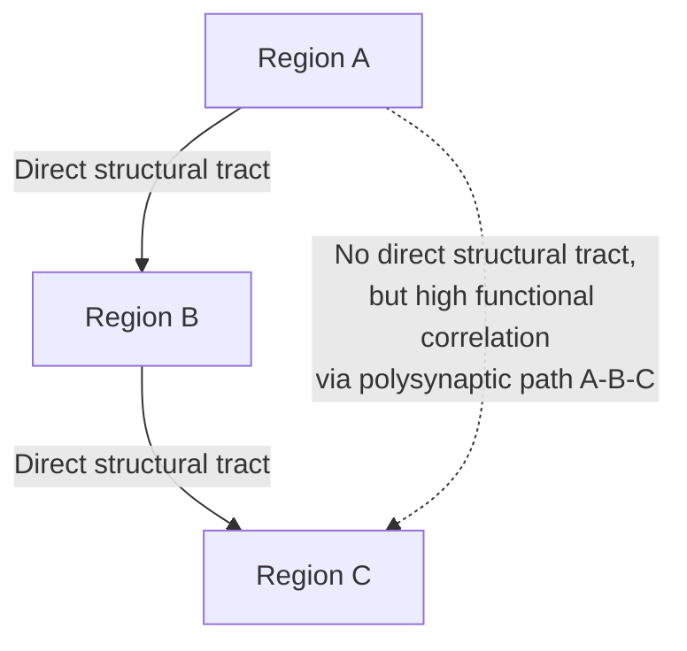

## Structural and Functional Connectivity Concepts

### Overview

Brain connectivity refers to the patterns of anatomical linkage, statistical dependency, or causal influence between distinct neural elements — from neurons to macroscale brain regions. In systems-level neurophysiology, three principal connectivity constructs are distinguished: **structural connectivity** (SC), **functional connectivity** (FC), and **effective connectivity** (EC). These are complementary but non-identical descriptions of brain organization, and conflating them is a common source of interpretive error in the literature.

### Structural Connectivity

**Definition:** Structural connectivity describes the physical, anatomical wiring of the brain — white matter tracts, axonal projections, and synaptic pathways that constitute the substrate through which signals can propagate.

**Key Points**

- Measured primarily via **diffusion-weighted imaging (DWI)**, most commonly diffusion tensor imaging (DTI) or higher-order models (e.g., diffusion spectrum imaging, HARDI)
- Quantifies **fiber tract integrity and trajectory** by modeling water diffusion anisotropy — water diffuses preferentially along axon bundles rather than across them
- Reconstructed computationally via **tractography** (deterministic or probabilistic streamline algorithms) to estimate white matter pathways between regions
- Common scalar metrics: **fractional anisotropy (FA)**, **mean diffusivity (MD)**, streamline count/density
- Represents a relatively stable property over short timescales (structural connectivity changes occur over developmental or plasticity-related timescales of days to years, not seconds)

**Limitations**

- Tractography cannot distinguish afferent from efferent direction (DWI is agnostic to signal directionality)
- Prone to false positives/negatives at fiber crossings, particularly with single-tensor DTI models
- Cannot directly measure synaptic strength or polarity (excitatory vs. inhibitory)

[Unverified] The degree to which probabilistic tractography algorithms overestimate long-range connections relative to ground-truth anatomical tracing (established via tract-tracing in animal models) varies considerably across algorithms and has been a persistent validation challenge.

### Functional Connectivity

**Definition:** Functional connectivity is a statistical construct describing temporal correlation or statistical dependency between the activity time series of spatially distinct neural regions, without requiring or implying a direct anatomical connection.

$$FC_{ij} = \text{corr}(x_i(t), x_j(t))$$

where $x_i(t)$ and $x_j(t)$ are the activity time series (e.g., BOLD signal, local field potential) of regions $i$ and $j$.

**Key Points**

- Most commonly derived from **resting-state fMRI (rs-fMRI)** BOLD time series, but also computed from EEG, MEG, or invasive electrophysiology
- Purely **correlational** — high FC between two regions does **not** imply a direct structural connection; correlation may arise via a shared third-party input or polysynaptic pathway
- Computed via:
  - Pearson correlation (most common, assumes linear stationary relationship)
  - Coherence (frequency-domain synchrony, common in EEG/MEG)
  - Mutual information (captures nonlinear dependencies)
  - Phase-locking value (captures phase synchronization independent of amplitude)
- Typically represented as a connectivity matrix, then analyzed using graph theory

**Methodological Caveats**

- Sensitive to preprocessing choices: motion correction, temporal filtering band (commonly $0.01$–$0.1$ Hz for rs-fMRI), and nuisance regression strategy
- **Global signal regression (GSR)** controversy: GSR can introduce spurious negative correlations, complicating anticorrelation interpretation
- FC is not fixed — it fluctuates over time (see Dynamic Functional Connectivity below)

### Effective Connectivity

**Definition:** Effective connectivity refers to the directed, causal influence one neural region exerts over another, typically estimated within an explicit generative or statistical model.

**Key Points**

- Requires a **model of causal architecture**, unlike FC's purely descriptive correlation
- Common methods:
  - **Dynamic Causal Modeling (DCM)** — Bayesian model comparison of hypothesized causal architectures fit to neuroimaging data (fMRI, EEG/MEG)
  - **Granger causality** — statistical framework testing whether past values of one time series improve prediction of another's future values
  - **Structural Equation Modeling (SEM)** — path-analysis approach using a priori anatomical constraints
- EC estimates are **model-dependent**: results can shift substantially depending on which regions and connections are included in the specified model space

[Inference] Because EC inference rests on assumptions about the underlying generative model, results should be interpreted as "most consistent with the tested hypothesis space" rather than as ground-truth causal proof — a limitation frequently underemphasized in applied studies.

### Comparative Summary

| Property | Structural | Functional | Effective |
| --- | --- | --- | --- |
| What it measures | Physical wiring (white matter) | Statistical correlation of activity | Directed causal influence |
| Directionality | Undirected (typically) | Undirected | Directed |
| Primary modality | DWI/DTI, tractography | rs-fMRI, EEG, MEG | fMRI/EEG/MEG + generative model |
| Timescale of change | Days–years (plasticity) | Seconds–minutes (state-dependent) | Model-fit dependent |
| Requires anatomical connection? | By definition, yes | No | No (inferred, not required) |
| Key metric | FA, streamline count | Correlation coefficient, coherence | Coupling parameters (e.g., DCM matrices) |

### The Structure-Function Relationship

A central research question in systems neuroscience is how well structural connectivity predicts functional connectivity.

**Key Points**

- Direct structural connections generally correlate with **stronger** functional connectivity between the same region pairs, but the relationship is far from one-to-one
- Strong functional connectivity frequently occurs between regions with **no direct structural connection** — mediated via polysynaptic (multi-step) pathways or shared upstream inputs
- Computational modeling approaches (e.g., using structural connectomes as input to neural mass models) attempt to simulate emergent functional connectivity patterns from structural constraints, achieving moderate but incomplete correspondence
- [Inference] Reported structure-function correlation coefficients in the literature commonly fall in a moderate range (often cited around $r \approx 0.3$–$0.5$ at the whole-brain level), though exact values are highly dependent on parcellation scheme, tractography method, and FC preprocessing choices, so specific figures should be treated as method-dependent rather than universal constants

### Dynamic Functional Connectivity

Traditional FC analysis assumes stationarity — that correlation structure is constant across the full scan duration. **Dynamic functional connectivity (dFC)** relaxes this assumption:

- Uses **sliding-window correlation**: computes FC within short overlapping time windows (commonly 30–60 seconds for fMRI) across the scan, producing a time series of connectivity matrices
- Reveals recurring **connectivity states** — discrete, reoccurring FC patterns identified via clustering (e.g., k-means) across window-wise matrices
- [Inference] Some short-window dFC estimates may partly reflect sampling variability rather than genuine neural state transitions, particularly at very short window lengths; window-length selection remains a debated methodological parameter without a universally agreed optimum

### Graph-Theoretical Framework for Connectivity Analysis

Both SC and FC matrices are commonly analyzed using graph theory, treating brain regions as **nodes** and connections (structural or functional) as **edges**.

**Key metrics:**

- **Degree centrality** — number of connections a node has; identifies hub regions
- **Betweenness centrality** — how often a node lies on the shortest path between other node pairs; identifies bridging/integrative hubs
- **Clustering coefficient** — degree to which a node's neighbors are interconnected; reflects local segregation
- **Path length** — average number of steps between node pairs; reflects global integration efficiency
- **Modularity** — degree to which the network decomposes into densely intraconnected, sparsely interconnected communities
- **Small-world architecture** — networks combining high local clustering with short global path lengths, considered efficient for both local processing and global integration; the human connectome is widely characterized as exhibiting small-world properties

$$C_i = \frac{2 E_i}{k_i (k_i - 1)}$$

where $C_i$ is the clustering coefficient of node $i$, $E_i$ is the number of edges among node $i$'s neighbors, and $k_i$ is node $i$'s degree.

### Worked Example: Structural-Functional Discordance

**Example**

Consider two cortical regions, A and C, connected only indirectly through an intermediate region B (A→B→C), with no direct white matter tract between A and C.

- **Structural connectivity matrix:** $SC_{AC} = 0$ (no direct tract), $SC_{AB} > 0$, $SC_{BC} > 0$
- **Functional connectivity matrix:** $FC_{AC}$ may nonetheless be substantial (e.g., $r = 0.5$) because activity propagates reliably through B, producing correlated fluctuations in A and C over time
- **Interpretation:** This pattern illustrates why FC cannot be used alone to infer direct anatomical connectivity, and why multimodal SC-FC integration is often necessary for accurate network characterization

**Output**

A connectivity discordance matrix ($FC - SC_{normalized}$) highlighting node pairs with high functional but low structural connectivity — often used to identify polysynaptic or indirectly mediated network relationships.

### Whole-Brain Computational Modeling

- **Neural mass models** and **mean-field models** (e.g., Wilson-Cowan-based frameworks) use empirical structural connectomes as a fixed anatomical scaffold, simulate regional neural dynamics, and generate synthetic BOLD-like signals
- Simulated FC is then compared to empirically measured FC to validate model parameters (e.g., global coupling strength, conduction delays)
- Used to study mechanisms underlying network reorganization in disease states, aging, and pharmacological perturbation

### Clinical and Translational Relevance

- **Traumatic brain injury:** structural connectivity disruption (diffuse axonal injury) measurable via DTI, often preceding overt functional connectivity changes
- **Multiple sclerosis:** demyelinating lesions reduce structural connectivity (lower FA along affected tracts), with downstream functional network reorganization
- **Schizophrenia:** reported disruptions in both structural (reduced white matter integrity) and functional (aberrant network integration/segregation) connectivity, though findings across studies show substantial heterogeneity
- **Stroke:** structural disconnection from focal lesions can produce distributed functional connectivity changes in regions remote from the lesion itself ("diaschisis")

### Conclusion

Structural and functional connectivity provide complementary but distinct windows into brain organization: one describes the physical scaffold, the other describes the emergent statistical dynamics that scaffold supports (with effective connectivity attempting to formalize directed causal influence within a specified model). Robust systems-level neuroscience typically requires triangulating across all three constructs rather than treating any single connectivity measure as a complete account of network function.

**Related Topics**

- Diffusion tensor imaging and tractography algorithms
- Dynamic Causal Modeling (DCM) methodology
- Graph theory metrics in connectomics
- The human connectome project and large-scale connectome mapping
- Global signal regression debate in resting-state fMRI
- Neural mass and mean-field whole-brain modeling
- Structural-functional decoupling in neurological disease