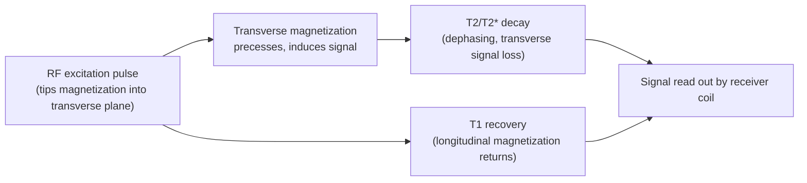

## Principles of Magnetic Resonance Imaging

### Overview

Magnetic resonance imaging (MRI) generates anatomical and functional images of tissue by exploiting the magnetic properties of atomic nuclei — predominantly hydrogen protons (¹H) given their high natural abundance in water and fat. Unlike CT or X-ray, MRI uses no ionizing radiation; instead it manipulates nuclear spin states with strong static magnetic fields, radiofrequency (RF) pulses, and spatially varying gradient fields, then reconstructs images from the resulting emitted signal.

### Nuclear Spin and the Static Magnetic Field ($B_0$)

**Key Points**

- Hydrogen nuclei (single protons) possess an intrinsic quantum property called **spin**, which generates a small magnetic moment
- In the absence of an external field, these magnetic moments are randomly oriented, producing no net magnetization
- When placed in a strong static external field $B_0$ (clinical scanners typically 1.5T or 3T; research scanners up to 7T or higher), proton magnetic moments preferentially align either **parallel** (low energy) or **antiparallel** (high energy) to $B_0$
- A slight population excess in the parallel (lower-energy) state produces a net longitudinal magnetization vector $M_0$ aligned with $B_0$
- Protons also **precess** around the axis of $B_0$ at a frequency proportional to field strength, given by the **Larmor equation**:

$$\omega_0 = \gamma B_0$$

where $\omega_0$ is the Larmor (precession) frequency, $\gamma$ is the gyromagnetic ratio (a constant specific to the nucleus; for ¹H, $\gamma/2\pi \approx 42.58$ MHz/T), and $B_0$ is the static field strength.

[Inference] Higher field strengths increase net magnetization and thus signal-to-noise ratio, but also increase susceptibility artifacts and specific absorption rate (SAR) — practical scanner selection reflects a trade-off rather than a strictly "higher is better" relationship.

### RF Excitation and Resonance

- A radiofrequency pulse applied at exactly the Larmor frequency (i.e., "on resonance") transfers energy to the proton population, tipping the net magnetization vector away from alignment with $B_0$ into the transverse plane
- The **flip angle** describes the degree of this tip (commonly 90° for maximal transverse signal in basic sequences, smaller flip angles used in gradient-echo sequences for speed and reduced tissue heating)
- Immediately after excitation, the transverse magnetization component precesses in phase, inducing a detectable oscillating voltage in a receiver coil — this is the raw MR signal

### Relaxation Processes: T1 and T2

Once the RF pulse ends, the perturbed magnetization returns toward equilibrium through two independent relaxation processes.

**T1 Relaxation (Longitudinal / Spin-Lattice)**

- Describes recovery of the longitudinal magnetization ($M_z$) back toward $M_0$
- Governed by energy exchange between excited protons and the surrounding molecular lattice
- Time constant $T1$: time for longitudinal magnetization to recover to approximately 63% of its equilibrium value

$$M_z(t) = M_0 \left(1 - e^{-t/T1}\right)$$

- Tissue-dependent: fat has short T1 (recovers quickly, appears bright on T1-weighted images), cerebrospinal fluid (CSF) has long T1 (appears dark)

**T2 Relaxation (Transverse / Spin-Spin)**

- Describes decay of transverse magnetization ($M_{xy}$) due to loss of phase coherence among precessing protons from spin-spin interactions
- Time constant $T2$: time for transverse magnetization to decay to approximately 37% of its initial value

$$M_{xy}(t) = M_{xy}(0)\, e^{-t/T2}$$

- CSF has long T2 (appears bright on T2-weighted images), gray/white matter have intermediate/shorter T2

**T2* (T2-star)**

- Reflects transverse decay from **both** spin-spin interactions **and** local magnetic field inhomogeneities (including those from paramagnetic substances like deoxyhemoglobin)
- $T2^* \leq T2$ always, since additional dephasing sources only accelerate decay
- T2* is the physical basis of the BOLD (blood-oxygen-level-dependent) signal exploited in functional MRI

### Spatial Encoding: Gradients

A uniform $B_0$ field alone provides no spatial information — all protons precess at the same frequency. Spatial encoding is achieved by superimposing three orthogonal, spatially varying **gradient fields** on top of $B_0$.

**Key Points**

- **Slice-select gradient ($G_z$):** applied during RF excitation, makes the Larmor frequency vary along one axis so that only a defined slice satisfies the resonance condition and gets excited
- **Frequency-encoding gradient ($G_x$, "readout gradient"):** applied during signal readout, causes precession frequency to vary spatially along one in-plane axis
- **Phase-encoding gradient ($G_y$):** applied briefly before readout, imparts a spatially dependent phase shift along the perpendicular in-plane axis; repeated with incrementally varied strength across multiple excitations to encode the second spatial dimension
- Together, these three gradients allow every voxel to be uniquely identified by a combination of frequency and phase

### k-Space and Image Reconstruction

- Raw MR signal data are stored in **k-space**, a spatial-frequency domain representation of the image, not the image itself
- Each line of k-space is filled by one phase-encoding step combined with frequency-encoded readout
- **Center of k-space** encodes low spatial frequencies (overall contrast and signal-to-noise); **periphery of k-space** encodes high spatial frequencies (fine spatial detail, edges)
- The final image is reconstructed by applying an **inverse two-dimensional (or three-dimensional) Fourier transform** to the fully sampled k-space data:

$$I(x,y) = \iint S(k_x, k_y)\, e^{i2\pi(k_x x + k_y y)}\, dk_x\, dk_y$$

where $S(k_x, k_y)$ is the k-space signal and $I(x,y)$ is the reconstructed spatial-domain image.

[Inference] Undersampling k-space (as in parallel imaging or compressed sensing acceleration techniques) trades acquisition speed against reconstruction artifact risk; the practical acceleration ceiling depends on coil geometry and reconstruction algorithm, so it is not a fixed universal limit.

### Common Pulse Sequences

| Sequence Type | Contrast Basis | Typical Use |
| --- | --- | --- |
| Spin Echo (SE) | T1 or T2 weighted, refocuses static field inhomogeneities via 180° pulse | High anatomical detail, less susceptibility artifact |
| Gradient Echo (GRE) | T2*-weighted, no refocusing pulse | Fast acquisition; basis for BOLD fMRI |
| Echo Planar Imaging (EPI) | Rapid multi-line k-space acquisition per excitation | Standard for fMRI and diffusion MRI due to speed |
| Inversion Recovery (e.g., FLAIR) | T1-based nulling of specific tissue signal | Suppressing CSF signal to highlight periventricular lesions |
| Diffusion-Weighted Imaging (DWI) | Sensitized to water molecule Brownian motion | Stroke detection, white matter tractography |

**Key Points on EPI**

- Acquires an entire 2D slice (or most of it) after a single RF excitation by rapidly switching the readout gradient back and forth
- Enables whole-brain acquisition on the order of 1–2 seconds per volume, making it the practical backbone of functional MRI
- Trade-off: high sensitivity to susceptibility artifacts and geometric distortion, particularly near air-tissue interfaces (e.g., sinuses, ear canals)

### Functional MRI and the BOLD Signal

- BOLD contrast arises from the differential magnetic susceptibility of **oxyhemoglobin** (diamagnetic, minimal field distortion) versus **deoxyhemoglobin** (paramagnetic, creates local field inhomogeneity and accelerates T2*/T2 decay)
- Neural activity triggers a local hemodynamic response: increased blood flow **overcompensates** for oxygen consumption, transiently reducing local deoxyhemoglobin concentration and **increasing** the T2*-weighted signal
- This produces the canonical **hemodynamic response function (HRF)**: signal increase peaking approximately 4–6 seconds post-stimulus, followed by return to baseline (sometimes with a small post-stimulus undershoot)

[Inference] The BOLD signal is an indirect, vascularly mediated proxy for neural activity rather than a direct electrophysiological measurement; its temporal resolution is fundamentally limited by hemodynamic response kinetics rather than by scanner sampling rate alone.

### Safety Considerations

- **Ferromagnetic objects:** the static $B_0$ field poses serious projectile risk; strict screening required for implants, metal fragments
- **Specific Absorption Rate (SAR):** RF pulses deposit energy as heat in tissue; scanners enforce SAR limits, particularly relevant at higher field strengths and with rapid pulse sequences
- **Acoustic noise:** rapid gradient switching (as in EPI) induces loud acoustic noise via Lorentz forces on the gradient coils; hearing protection is standard practice
- **Contraindications:** certain implanted devices (some pacemakers, cochlear implants, aneurysm clips) may be absolute or conditional contraindications depending on device MRI-compatibility rating

### Worked Example: Generating T1 vs. T2 Contrast

**Example**

Consider gray matter, white matter, and CSF, which differ in water content and macromolecular environment:

- **T1-weighted sequence** (short TR, short TE): white matter (shorter T1, higher fat/myelin content) appears **bright**; CSF (long T1) appears **dark**; gray matter intermediate
- **T2-weighted sequence** (long TR, long TE): CSF (long T2) appears **bright**; white matter appears comparatively **darker**; gray matter intermediate

Where TR (repetition time) is the interval between successive excitation pulses and TE (echo time) is the delay between excitation and signal readout — both are operator-controlled sequence parameters that determine the degree of T1 or T2 weighting in the final image.

**Output**

Two structurally identical anatomical volumes with inverted CSF/white-matter contrast, illustrating how the same anatomy is differentially emphasized purely through sequence parameter choice rather than any change in the underlying tissue.

### Conclusion

MRI's core principle — manipulating nuclear spin alignment and relaxation behavior via magnetic fields and RF pulses, then spatially encoding the resulting signal through gradients and Fourier reconstruction — provides a flexible, radiation-free imaging platform capable of both fine-grained structural imaging (via T1/T2 contrast) and indirect functional imaging (via BOLD contrast). Nearly all neuroimaging methods covered elsewhere in this chapter (structural MRI, fMRI, DWI/DTI) are direct applications or extensions of these same underlying physical principles.

**Related Topics**

- Diffusion-weighted imaging and diffusion tensor imaging physics
- Echo-planar imaging artifacts and distortion correction
- The hemodynamic response function and its neurovascular coupling basis
- Parallel imaging and acceleration techniques (SENSE, GRAPPA, compressed sensing)
- MRI safety screening protocols
- Quantitative MRI (T1 mapping, T2 mapping, myelin water fraction)